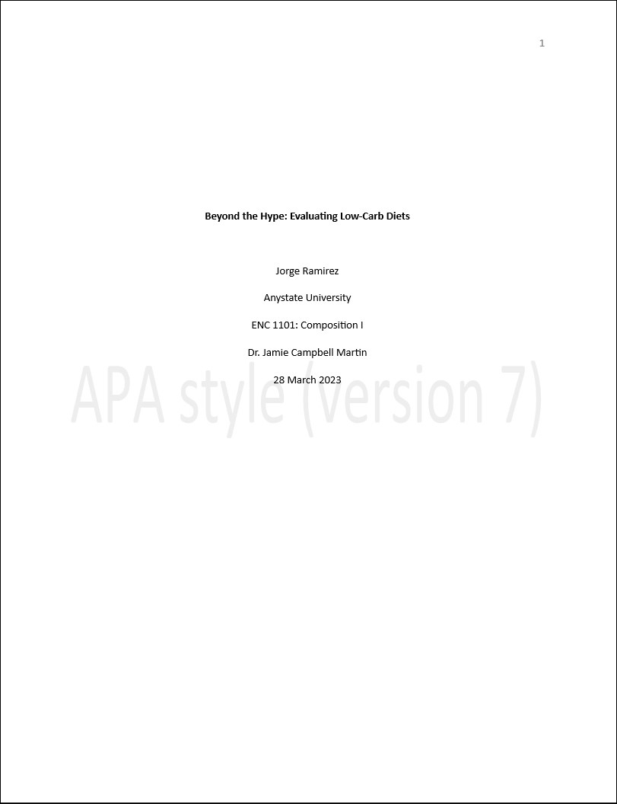
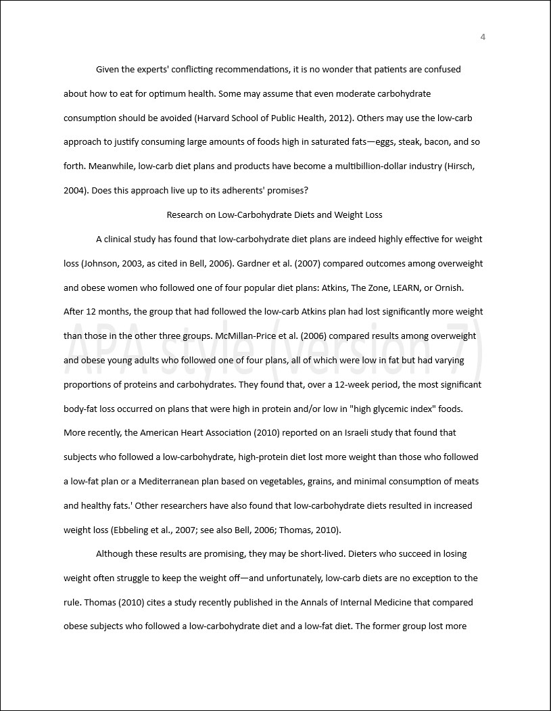
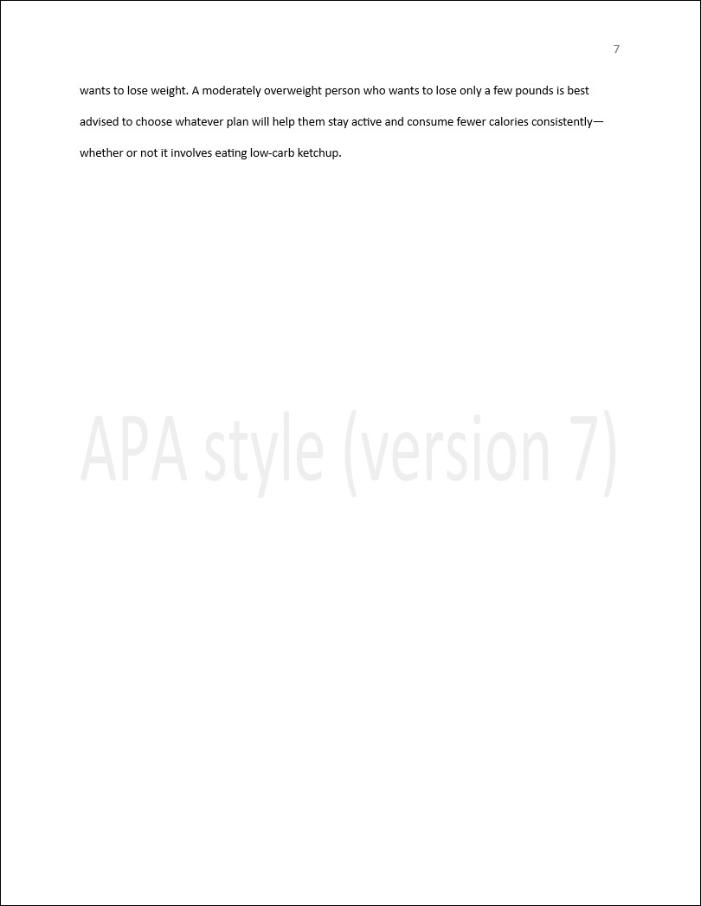
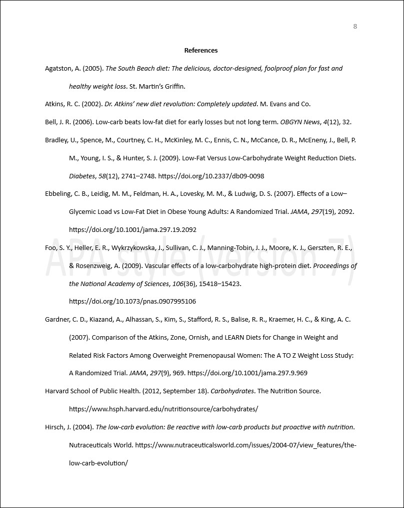
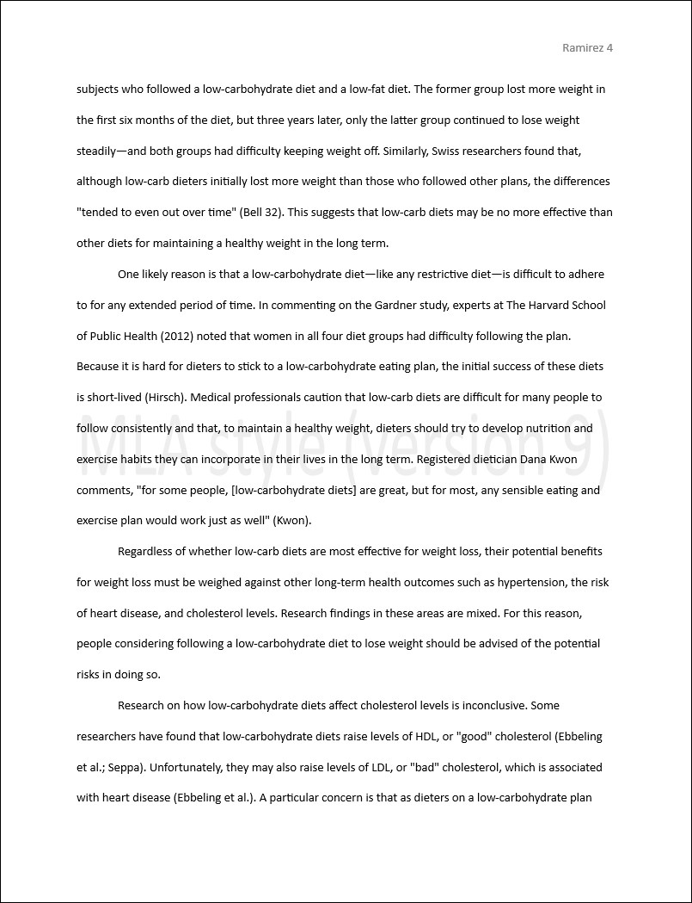
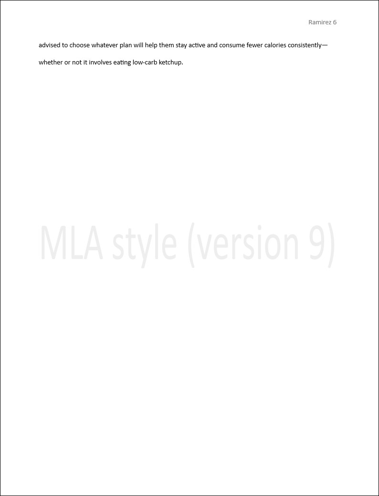
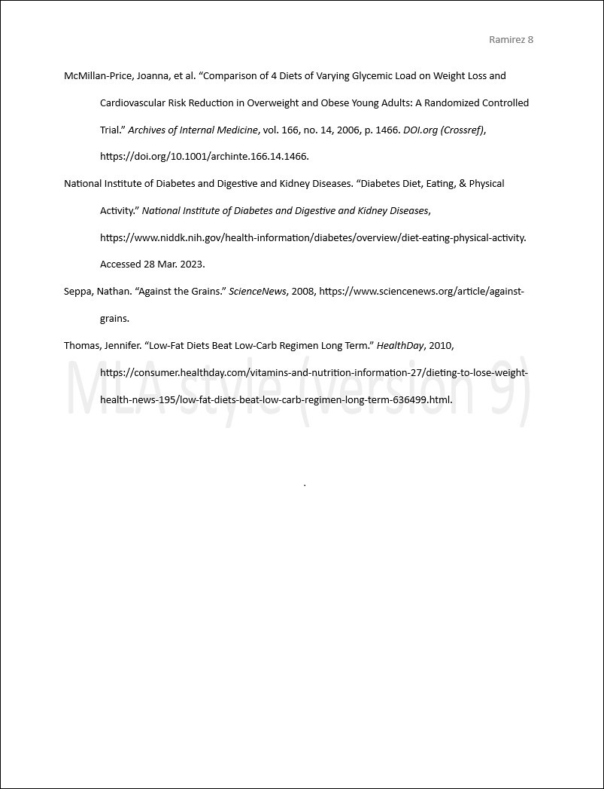

*Writing for Success 2023* (adapted in 2023 by Jamie Campbell Martin) is
licensed under a 
[Creative Commons Attribution-NonCommercial-ShareAlike 4.0 International License](https://creativecommons.org/licenses/by-nc-sa/4.0/).

Original author removed in 2015 by the University of Minnesota at the request of original publisher.

# Contents

[Publisher Information](#publisher-information)

1. [Introduction To Writing](#chapter-1)
    1. Reading And Writing In College
    2. Developing Study Skills
    3. Becoming A Successful College Writer
    4. Introduction To Writing: End-of-chapter Exercises
2. [Writing Basics: What Makes A Good Sentence?](#chapter-2)
    1. Sentence Writing
    2. Subject-verb Agreement
    3. Verb Tense
    4. Capitalization
    5. Pronouns
    6. Adjectives And Adverbs
    7. Misplaced And Dangling Modifiers
    8. Writing Basics: End-of-chapter Exercises
3. [Punctuation](#chapter-3)
    1. Commas
    2. Colons
    3. Semicolons
    4. Quotes
    5. Apostrophes
    6. Parentheses
    7. Dashes
    8. Hyphens
    9. Punctuation: End-of-chapter Exercises
4. [Working With Words: Which Word Is Right?](#chapter-4)
    1. Commonly Confused Words
    2. Spelling
    3. Word Choice
    4. Prefixes And Suffixes
    5. Synonyms And Antonyms
    6. Using Context Clues
    7. Working With Words: End-of-chapter Exercises
5. [Help For English Language Learners](#chapter-5)
    1. Word Order
    2. Negative Statements
    3. Count And Noncount Nouns And Articles
    4. Pronouns
    5. Verb Tenses
    6. Modal Auxiliaries
    7. Prepositions
    8. Slang And Idioms
    9. Help For English Language Learners: End-of-chapter Exercises
6. [Writing Paragraphs: Separating Ideas And Shaping Content](#chapter-6)
    1. Purpose, Audience, Tone, And Content
    2. Effective Means For Writing A Paragraph
    3. Writing Paragraphs: End-of-chapter Exercises
7. [Refining Your Writing: How Do I Improve My Writing Technique?](#chapter-7)
    1. Sentence Variety
    2. Coordination And Subordination
    3. Parallelism
    4. Refining Your Writing: End-of-chapter Exercises
8. [The Writing Process: How Do I Begin?](#chapter-8)
    1. Apply Prewriting Models
    2. Outlining
    3. Drafting
    4. Revising And Editing
    5. The Writing Process: End-of-chapter Exercises
9. [Writing Essays: From Start To Finish](#chapter-9)
    1. Developing A Strong, Clear Thesis
    2. Writing Body Paragraphs
    3. Organizing Your Writing
    4. Writing Introductory And Concluding Paragraphs
    5. Writing Essays: End-of-chapter Exercises
10. [Rhetorical Modes](#chapter-10)
    1. Narration
    2. Illustration
    3. Description
    4. Classification
    5. Process Analysis
    6. Definition
    7. Compare-and-contrast
    8. Cause-and-effect
    9. Persuasion
    10. Rhetorical Modes: End-of-chapter Exercises
11. [Writing From Research: What Will I Learn?](#chapter-11)
    1. The Purpose Of Research Writing
    2. Steps In Developing A Research Proposal
    3. Managing Your Research Project
    4. Strategies For Gathering Reliable Information
    5. Critical Thinking And Research Applications
    6. Writing From Research: End-of-chapter Exercises
12. [Writing A Research Paper](#chapter-12)
    1. Creating A Rough Draft For A Research Paper
    2. Developing A Final Draft Of A Research Paper
    3. Writing A Research Paper: End-of-chapter Exercises
13. [APA And MLA Styles](#chapter-13)
    1. Formatting A Research Paper
    2. Citing And Referencing Techniques
    3. Creating A References Section
    4. Using Modern Language Association (mla) Style
    5. APA And MLA Documentation And Formatting: End-of-chapter Exercises
14. [Creating Presentations: Sharing Your Ideas](#chapter-14)
    1. Organizing A Visual Presentation
    2. Incorporating Effective Visuals Into A Presentation
    3. Giving A Presentation
    4. Creating Presentations: End-of-chapter Exercises
15. [Readings: Examples Of Essays](#chapter-15)
    1. Introduction To Sample Essays
    2. Narrative Essay
    3. Illustration Essay
    4. Descriptive Essay
    5. Classification Essay
    6. Process Analysis Essay
    7. Definition Essay
    8. Compare-and-contrast Essay
    9. Cause-and-effect Essay
    10. Persuasive Essay

[Works Cited](#works-cited)

# Publisher Information

[Table of Contents](#contents)

### 2023 Adaptation

This book, *Writing for Success 2023*, has been adapted by Jamie Campbell
Martin in spring of 2023 from 2015's *Writing for Success*. It is made available under the terms of 
a [Creative Commons Attribution-NonCommercial-ShareAlike license](https://creativecommons.org/licenses/by-nc-sa/4.0/).

#### Specific Changes
- Chapter 1: 
    - Removed discussion of learning styles as recent research is skeptical about them. For example, see "Learning Styles: Concepts and Evidence" at https://doi.org/10.1111/j.1539-6053.2009.01038.x
	- Added discussion of LMS-provided reminder apps
- Chapter 5: Updated discussion of the definition of a noun to explain that linguists prefer syntactic definitions to semantic definitions 
- Chapter 11: Added discussion of citation managers such as Zotero
- Chapter 13: 
    - Updated APA coverage to APA 7. 
    - Updated MLA coverage to MLA 9 from MLA 7. 
    - Added MLA-formatted version of sample research paper for comparison to APA-formatted version
- Chapter 15: Added my own sample persuasive essay on legalizing medical marijuana
- Added Works Cited section

#### General Changes
- Simplified language for developmental readers
- Made style updates to agree with APA 7: "internet" for "Internet", "email" for "e-mail", etc. (see the APA *Publication Manual* p. 162).
- Updated broken links
- Reformatted text in GitHub Flavored Markdown. See https://github.github.com/gfm/

### 2015 Adaptation

Information from the 2015 University of Minnesota adaptation is below:

*Writing for Success* is adapted from a work produced and distributed
under a Creative Commons license (CC BY-NC-SA) in 2011 by a publisher
who has requested that they and the original author not receive
attribution. This adapted edition is produced by the University of
Minnesota Libraries Publishing through the eLearning Support Initiative.

This adaptation has reformatted the original text and replaced some
images and figures to make the resulting whole more shareable. The 2015
adaptation did not significantly alter or update the original 2011
text. The work was made available under the terms of 
a Creative Commons Attribution-NonCommercial-ShareAlike license.

# Chapter 1

[Table of Contents](#contents)

## Introduction To Writing

## 1.1 Reading And Writing In College

**Learning Objectives**

1. Understand the expectations for reading and writing in college.
2. Apply strategies to complete college reading efficiently and
effectively.
3. Recognize kinds of writing assignments you are likely to see in
college.
4. Apply strategies for managing college writing.
5. Determine which reading and writing strategies work best for you.

Why do you need an introduction? You have probably
been writing and reading since elementary school. You may write on the
job, too. Why is a college writing course necessary?

Getting excited about an introductory college writing course can be
difficult. But whatever you study, honing your reading, writing, and
critical thinking will give you a solid foundation.

In college, teachers expect more than at most high
schools. The amount of work increases. When instructors expect you to
study hours and hours for one course, managing your workload can be
challenging. This chapter includes strategies for studying efficiently
and managing your time.

The quality of the work you do also changes. It is not enough to
summarize what you have learned on an exam. You will have to think hard
about complex new ideas. You are moving into deeper
waters. A good introductory writing course will help you swim.

#### High School Versus College Expectations

| High School | College |
|:---|:--- |
| Readings are short. | Readings are long. |
| Teachers review in class. | You review on your own. |
| Teachers give study guides. | Teachers don't give study guides. |
| You get many small grades. | You get a few large grades. |
| You do mostly personal writing. | You do mostly expository writing. |
| Most writing is the same (five-paragraph essays). | Each writing assignment may be different. |
| Teachers seek you out to help. | You have more responsibility to help yourself. |
| There are lots of second chances. | There are fewer second chances. |

This chapter covers the types of reading and writing assignments you
will encounter as a college student. You will also learn strategies for
mastering these new challenges---and becoming a more confident student
and writer.

Throughout this chapter, you will follow a first-year student named
Crystal. After several years of working as a saleswoman in a department
store, Crystal has decided to pursue a degree in elementary education
and become a teacher. She is still working part-time, and she finds it challenging 
to balance of work,
school, and caring for her four-year-old son. As you read about Crystal,
think about how you can use her experience to get the most out of your
own.

#### Exercise 1

Review Table 1.1 and think
about how you have found college to be different from
high school so far. Answer these questions:

1. In what ways do you think college will be more rewarding for you as
a learner?
2. What aspects of college do you expect to find most challenging?
3. What changes do you think you might have to make in your life to
ensure your success in college?

### Reading Strategies

Your college courses will sharpen both your reading and your writing
skills. Most of your writing assignments will depend on understanding
something you have read. And it is difficult to write effectively about
a text that you have not understood. Even when you do understand, it can
be hard to write about it if you do not feel personally engaged with the
ideas discussed.

This section discusses strategies to get the most out of your college
readings. These strategies fall into three categories:

1. Planning strategies. To help you manage your readings.
2. Comprehension strategies. To help you understand the material.
3. Active reading strategies. To take your understanding to a
higher and deeper level.

### Planning Your Reading

Have you ever stayed up all night cramming just before an exam? Or found
yourself skimming a detailed memo from your boss five minutes before a
crucial meeting? The first step in handling college reading is planning.
This involves both managing your time and setting a clear purpose for
your reading.

### Managing Your Reading Time

You will learn more detailed strategies for time management in 
**Section 1.2**, but for now,
focus on setting aside enough time for working in manageable chunks. 
If you are assigned a seventy-page
chapter to read for next week's class, don't wait until the night
before to start. Give yourself at least a few days.

Your method for breaking up the assignment will depend on the type of
reading. Suppose the text is very dense and packed with unfamiliar terms
and concepts. In that case, you may need to read no more than five pages
in a sitting so that you can truly process it. With more user-friendly
texts, you will be able to handle longer sections at once---forty pages
or even more.

As the semester progresses, you will better understand how much time you
need to allow for the readings in different subjects. It also makes
sense to preview each assignment well in advance to assess its
difficulty level and to determine how much reading time to set aside.

**Tip**

College instructors often set aside reserve readings for a particular
course. These consist of articles, book chapters, or other texts that
are not part of the primary course textbook. Copies of reserve readings
are available through the college library; in print; or, more often,
online. When you are assigned a reserve reading, download it early.
Skim through it to understand how much time you will need to read it.

### Setting A Purpose

The other key component of planning is setting a purpose. Knowing what
you want to get out of a reading assignment helps you determine how to
approach it and how much time to spend on it. It also helps you stay
focused during those occasional moments when it is late, you are tired,
and relaxing in front of the television sounds far more appealing than
curling up with a stack of journal articles.

Sometimes your purpose is simple. You might just need to understand the
reading material well enough to discuss it intelligently in class the
next day. However, your purpose will often go beyond that. For instance,
you might also read to compare two texts, to formulate a personal
response to a text, or to gather ideas for future research. Here are
some questions to ask to help determine your purpose:

**How did my instructor frame the assignment?** Often your instructors
will tell you what they expect you to get out of the reading:

> Read Chapter 2 and come to class prepared to discuss current teaching
practices in elementary math.
>
> Read these two articles and compare Smith's and Jones's perspectives
> on the 2010 health care reform bill.
>
> Read Chapter 5 and think about how you could apply these guidelines to
running your own business.

**How deeply do I need to understand the reading?** If you are majoring
in computer science and you are assigned to read Chapter 1,
"Introduction to Computer Science," it is safe to assume you will need
to master it.

However, for other readings you may only need a general understanding.
Again, pay attention to how your instructor presents the assignment.

**How does this assignment relate to other course readings or to
concepts discussed in class?** Your instructor may make some of these
connections explicitly, but if not, try to draw connections on your own.
It helps to take detailed notes both when in class and when you read.

**How might I use this text again in the future?** If you are assigned
to read about a topic that has always interested you, your reading
assignment might help you develop ideas for a future research paper.
Some readings provide valuable tips or summaries worth bookmarking for
future reference. Think about what you can take from the reading that
will stay with you.

### Improving Your Comprehension

You have blocked out time for your readings and set a purpose for
reading. Now comes the challenge: making sure you understand all the
information you are expected to process. Some of your readings will be
straightforward. Others will be longer or more complex, so you will need
a plan for them.

Most reading in college is *expository*. That means it is nonfictional
(not made up) and informative (meant to present ideas that are
important). For any expository writing, your first goal is to identify
the main points. Because college texts can be challenging, you
will also need to monitor your comprehension. That is, you will need to
stop periodically and assess how well you understand what you are
reading. Finally, you can improve comprehension by taking time to
determine which strategies work best for you and putting those
strategies into practice.

### Kinds Of Reading

In college, you will likely read all of the following:

#### Textbooks

Often include study aids: summaries, glossaries, review questions, etc.

#### Trade Books

Less likely to include study aids. A *trade book* is a book written for the trade, 
meaning a book written to sell a lot. Merriam-Webster says the term first appeared around 1870.

https://www.merriam-webster.com/dictionary/trade%20book

#### Popular Articles

Written for everyone. These are typically magazine or newspaper articles. These days they are typically read online.

#### Scholarly Articles

Written for specialists, who we also call "scholars." 
There are also scholarly books, though you will rarely be asked to read an entire scholarly book.

### Identifying The Main Point

With an expository text,
the key goal is to identify the main point: the most important idea
that the writer wants to communicate. The main point is often stated
early on. Finding the main point allows you to organize the
details and relate the reading to lectures or other readings. After finding the main
point, you will find the supporting points: details that develop and clarify the main point.

Below I listed the kinds of texts in order by how easy I think it usually is
to find the main point. We start with the easiest and end with the most difficult.

**Textbooks** are built to help you. They include headings and subheadings 
to help students to identify important ideas. Graphics such as
sidebars, diagrams, or charts help students grasp complex
information.
When you are assigned a textbook chapter, always use the
headings and the graphics to help you.

**Popular articles** are not designed to help you find the main point. 
But they are short and meant for a reader who is not an expert.
It's important to pay close attention to the headings 
and first paragraphs when reading popular articles. In magazines, these parts (along with the ending) 
usually give you the main ideas. 
In newspapers, the first paragraph of a news article 
tells you the most important information, and the following paragraphs give more specific details.

Although **trade books** aren't made to help you find the main point, 
they sometimes have an introduction that tells you what the author 
is writing about. You can get a general idea of what a chapter 
is about by reading its title and subtitles. 
Also, reading the first and last paragraphs of a chapter can help you understand the main point.

**Scholarly articles** are the most challenging. 
Both textbooks and scholarly articles are written for students,
but scholarly articles are written for extremely advanced students:
people who already know a lot about the area. 

When you read scholarly articles, 
use the same strategies as before. The beginning of a scholarly 
article usually tells you what the writer is trying to prove. 
Headings and subheadings can show you how the writer supports their argument. 
Also, academic articles often have a summary at the beginning, called an *abstract*. 
Databases provide summaries too.

For more information about reading different types of texts, see
**Chapter 12**.

### Monitoring Your Comprehension

Finding the main idea and paying attention to text features as you read
helps you figure out what you should know. Just as important, however,
is figuring out what you do not know and developing a strategy to deal
with it.

Textbooks often include comprehension questions in the margins or at the
end of a section or chapter. As you read, stop occasionally to answer
these questions on paper or in your head. Use them to identify sections
you may need to reread, read more carefully, or ask your instructor
about later.

Even when a text does not have built-in comprehension features, you can
actively monitor your own comprehension. Try these strategies, adapting
them as needed to suit different kinds of texts:

1. **Summarize.** At the end of each section, pause to summarize the
main points in a few sentences. If you have trouble doing so,
revisit that section.

2. **Ask and answer questions.** When you begin reading a section, try
to identify two to three questions you should be able to answer
after you finish it. Write down your questions and use them to test
yourself on the reading. If you cannot answer a question, try to
determine why. Is the answer buried in that section of reading but
just not coming across to you? Or do you expect to find the answer
in another part of the reading?

3. **Do not read in a vacuum.** Look for opportunities to discuss the
reading with your classmates. Many instructors set up online
discussion forums or blogs specifically for that purpose.
Participating in these discussions can help you determine whether
your understanding of the main points is the same as your peers'.

These discussions can also serve as a reality check. If everyone in the
class struggled with the reading, it may be exceptionally challenging.
If it was a breeze for everyone but you, you may need to see your
instructor for help.

As a working mother, Crystal found that the best time to get her reading
done was in the evening, after she had put her four-year-old to bed.
However, she occasionally had trouble concentrating at the end of a long
day. She found that by actively working to summarize the reading and
asking and answering questions, she focused better and retained more of
what she read. She also found that evenings were a good time to check
the class discussion forums that a few of her instructors had created.

#### Exercise 2

Choose something you need to read for one of your college courses. In
your notes:

1. Summarize the main points of the text in two to three sentences.
2. Write down two to three questions about the text that you can bring
up during class discussion.

**Tip**

Students are often reluctant to seek help. They feel like doing so marks
them as slow, weak, or demanding. The truth is every learner
occasionally struggles. If you are sincerely trying to keep up with the
course reading but feel like you are in over your head, seek out help.
Speak up in class, schedule a meeting with your instructor, or visit
your college learning center for assistance.

Deal with the problem as early in the semester as you can. Instructors
respect students who are proactive about their own learning. Most
instructors will work hard to help students who make the effort to help
themselves.

### Taking It To The Next Level: Active Reading

Now that you have reviewed planning and comprehension strategies,
college readings may feel more manageable. You know what you need to do
to get your reading done and grasp the main points. However, the most
successful students in college are not only competent readers but active
readers.

### Using The SQ3R Strategy

One strategy you can use to become a more active reader is the SQ3R
strategy, a step-by-step process to follow before, during, and after
reading. The process works like this:

1. **Survey** the text in advance.
2. Form **questions** before you start reading.
3. **Read** the text.
4. **Recite** and/or **record** important points during and after
reading.
5. **Review** and **reflect** on the text after you read.

Before you read, you survey the text. Look at headings to identify what
important topics will be covered. Look over sidebars, photographs, and
graphics. Skim a few paragraphs. Preview any **boldfaced** or
*italicized* vocabulary.

Next, start brainstorming questions about the text. What do you expect
to learn from the reading? You may find that some questions come to mind
immediately. If not, try using headings and subheadings in the text to
formulate questions. For instance, if one heading in your textbook reads
"Medicare and Medicaid," you might ask yourself these questions:

- When was Medicare and Medicaid legislation enacted? Why?
- What are the major differences between these two programs?

When you're reading, try to ask questions that make you think more deeply about the text. 
As you read, pay attention to whether the text confirms or challenges your initial thoughts. 
Also, look for answers to your questions and ask new ones. It's a good idea to summarize important 
points and ideas in your own words as you read. 
After you finish reading, review the material more carefully, and take notes in a more detailed format. 
Think about what you learned, what surprised you, 
and what you agreed or disagreed with. 
You can write these down in a reading journal or in response papers that your instructor may ask for.

#### Exercise 3

Choose another text you have been assigned to read. Use SQ3R to complete
the reading.

Do all the steps. Then, reflect on how helpful you found
SQ3R. On a scale of one to ten, how useful did you find it? How does it
compare with other study techniques you have used?

### Using Other Active Reading Strategies

SQ3R encompasses several active reading strategies: previewing a text,
making predictions, asking questions, and summarizing.

The following strategies can further deepen your understanding.

**Connect what you read to what you already know.** Look for ways the
reading supports, extends, or challenges concepts you have learned
elsewhere.

**Relate the reading to your own life.** What statements, people, or
situations relate to your personal experiences?

**Visualize.** Try to picture what is described. Visualizing is
especially helpful when you are reading a narrative text, such as a
novel, or when you read expository text that describes a process, such
as how to perform cardiopulmonary resuscitation (CPR).

**Pay attention to graphics.** Photographs, diagrams, flow charts,
tables, and other graphics can help make ideas concrete and
understandable.

**Understand the text in context.** Understanding context means thinking
about who wrote the text, when and where it was written, the author's
purpose for writing it, and what assumptions or agendas influenced the
author's ideas. For instance, two writers might both address the subject
of health care reform, but if one article is an opinion piece and one is
a news story, the context is different.

**Plan to talk or write about what you read.** Jot down a few questions
or comments in your notebook so you can bring them up in class. (This
also gives you a source of topic ideas for papers and presentations
later in the semester.) Discuss the reading on a class discussion board
or blog about it.

As Crystal began her first semester of elementary education courses, she
occasionally felt lost in a sea of new terms and theories about teaching
and child development. She found that it helped to relate the reading to
her personal observations of her son and other kids she knew.

#### Writing At Work

Many college courses require students to participate in interactive
online components, such as a discussion forum, a page on a social
networking site, or a class blog. These tools are a great way to
reinforce learning. Do not be afraid to be the student who starts the
discussion.

Remember that when you interact with other students and teachers online,
you need to project a mature, professional image. You may be able to use
an informal, conversational tone, but complaining about the workload,
using off-color language, or "flaming" other participants is
inappropriate.

Active reading can benefit you in ways that go beyond just earning good
grades. By practicing these strategies, you will find yourself more
interested in your courses and better able to relate your academic work
to the rest of your life. Being an interested, engaged student also
helps you form lasting connections with your instructors and with other
students that can be personally and professionally valuable. In short,
it helps you get the most out of your education.

### Common Writing Assignments

College writing assignments serve a different purpose than the typical
writing assignments you completed in high school. In high school,
teachers generally focus on teaching you to write in various modes and
formats, including personal writing, expository writing, research
papers, creative writing, and writing short answers and essays for
exams. Over time, these assignments help you build a foundation of
writing skills.

In college, many instructors will expect you to already have that
foundation.

Your college composition courses will focus on writing for its own sake,
helping you make the transition to college writing. However, in
most other college courses, writing serves a different purpose. In those
courses, writing is one tool for learning how to think about a
particular discipline.

Other assignments teach you how to write professionally for a field. You
might be asked to write a lab report, a case study, a literary analysis,
a business plan, or an account of a personal interview. You will need to
learn and follow the standard conventions for those types of written
products.

Finally, personal writing is less common in college than in high school.
College emphasizes expository writing---writing that explains or informs.
Often expository writing assignments will include outside research,
too. Some classes will also require persuasive writing assignments in
which you state and support your position on an issue. College
instructors will hold you to a higher standard when it comes to
supporting your ideas with reasons and evidence.

Below are some common college writing assignments. Which
assignments you encounter will depend on your courses your
instructors.

#### Common College Writing Assignments

| Assignment | Description | Example |
|:--- |:--- |:--- |
|Personal Response|Expresses your response to a reading, quote, or issue. May be very brief.|For an environmental science course, students write about President Obama's 2010 speech about the BP oil spill.|
|Summary|Restates the main ideas of a text briefly and in your own words.|For a psychology course, students write a one-page summary of an article about a man with short-term memory loss.|
|Position Paper|Defends your position on an issue.|For a medical ethics course, students state and support their position on using stem cell research in medicine.|
|Problem-Solution Paper|Explains a problem and suggests a solution.|For a business administration course, a student presents a plan for starting an office recycling program |
|Literary Analysis|Argues a thesis about a work of literature (a made-up story such as a novel, play, or poem).|For an American literature course, a student compares two novels by the African American writer Richard Wright.|
|Research Review|Sums up the research that exists on a topic.|For a media studies course, a student reviews the past 20 years of research on the impact of violent video games.|
|Case Study|Investigates a particular person or situation.|For an education course, a student studies a developmentally disabled child whose schoolwork improved through behavior modification.|
|Lab Report|Presents a lab experiment, including hypothesis, methods, results, and conclusions.|For a psychology course, a group presents an experiment that explored whether sleep deprivation damages memory in rats.|
|Research Paper|Presents a thesis and supports it with original argument and cited research. |See Chapter 12.|

As an English professor, I have seen many students unsure of what we mean by "literature," so let me explain that briefly. Literature "has been commonly used since the eighteenth century . . . to designate fictional and imaginative writings--poetry, prose fiction, and drama" (Abrams and Harpham 152). In other words, "literature" means made-up stories--stories that didn't really happen.

One kind of literature is the "novel." A novel is a book-length work of prose fiction--usually 200 pages or longer, published as its own separate book. Elsewhere in this book, I explain how language is already changing. In South Florida where the 2023 revision of this book was written, more and more students use the word "novel" to mean any stand-alone book. But this is not what it currently means according to the dictionary.

#### Writing At Work

Part of managing your education is communicating well with others at
your college. For instance, you might need to email your instructor
to request an office appointment or explain why you will need to miss a
class. You might need to contact administrators with questions about
your tuition or financial aid. Later, you might ask instructors to write
recommendations on your behalf.

Treat these documents as professional communications. Address the
recipient politely; state your question, problem, or request clearly;
and use a formal, respectful tone. Doing so helps you make a positive
impression and get a quicker response.

#### Takeaways

- College reading and writing differs from high school
assignments not only in quantity but also in quality.
- Managing college readings requires you to plan and manage your time, set
a purpose for reading, practice comprehension strategies, and use active
reading to deepen your understanding of the text.
- College writing assignments emphasize learning to think critically about
a discipline. They rarely ask for personal and creative writing.

## 1.2 Developing Study Skills

**Learning Objectives**

1. Use strategies for managing time effectively as a college student.
2. Understand and apply strategies for taking notes efficiently.
3. Determine the specific time-management, study, and note-taking
strategies that work best for you individually.

By now, you have a general idea of what to expect from your college
courses. You have probably received course syllabi, started on your
first few assignments, and begun applying the strategies you learned
about in **Section 1.1**.

At the beginning of the semester, your workload is lighter. This is the
perfect time to establish good habits.
When the demands on your time become more intense, you will
have a system in place.

This section covers specific strategies for managing your time
effectively. You will also learn about different note-taking systems
that you can use to organize and record information efficiently.

Remember that every student is
different. These strategies work well for many people. However, you may need to adapt them 
to work for you. I keep everything on my smartphone, but I have a friend who
can only keep her schedule in a physical notebook that she can
carry with her.

Read with an open mind and consider what has worked for you
(or not) in the past. Which habits from high school or work
could help you succeed in college? Which habits
might get in your way? What changes might you need to make?

### Understanding Yourself As A Learner

To succeed in college, it helps to know what makes you tick. For decades,
psychologists have examined
how people learn best. Here are just a few questions to think about:

**When are you most productive?** If are at your best
early in the day, try blocking out morning time for
studying or writing. If you work best at night, set aside time in
the evening.

**How much clutter can you handle?** Some people know just where
to find everything on their messy desks. But others feel
better if they keep their workspace clear.

**How well do you resist distractions at home?**
If you can study at home without turning on the
television or fixing yourself a snack, you may
make home your workspace. But if you need less distraction, 
try your college library or a quiet place
somewhere else in your community.

**Does some background noise help or hurt you?**
Some people work better when listening to quiet music or the
hum of conversation in a coffee shop. Others need silence.

**When you work with others, do you stay on task?** A study
buddy or study group can be a big help. But if you find that the group 
study sessions turn into social occasions, you may study better on your own.

**How do you manage stress?** At some point in the
semester, you will probably feel stressed. In your day-to-day, keep
some time to exercise, see your friends, or just relax.

### Time Management

In college you have increased freedom to structure your time as you
please. With that freedom comes increased responsibility. High school
teachers often take it upon themselves to track down students who miss
class or forget assignments. College instructors, however, expect you to
take full responsibility for managing yourself and getting your work
done on time.

#### Making A Plan For The Week And A Plan For The Semester

At the beginning of the semester, establish a routine for when
you will study and write. A general rule is that
**one hour of class = three hours of studying**. 

If you are
taking a biology course that meets on Monday, Wednesday, and Friday 
for an hour each time, you should plan for **nine hours per week** of 
work for it outside of class. 
You will need to schedule time for the class just like an
employer schedules shifts at work.

That may sound like a lot, but you can do it. 
If you are taking **15 credits (a typical full-time load)**,
you will need to spend about **45 hours per week** on homework. A full-time student
should spend about as much time on school as a full-time employee spends
on work. It is hard to go to school and work at the same time, but it is possible.

In addition to setting aside time to work each week, you will need to plan
for the busy times of the semester. Most classes have a final exam or
a final paper which requires more time than typical homework. Many
classes have a midterm in the middle of the semester which also requires
more time. (The words "semester" and "term" mean the same thing at most
colleges, and I use them that way in this book.) At the beginning of the semester, 
go through your course syllabi and mark all the important essays or tests on a
calendar. Keep the calendar somewhere you will see it, such as on your phone.

Another choice to to download an app to remind you. Most colleges now use a
Learning Management System (LMS) to organize their classes. Some LMSes are
Blackboard, Canvas, and D2L. Many of these LMSes have apps to go along with them.
For example, if your college uses D2L, you can download the Brightspace Pulse app
from an app store to get automatic reminders about your classes.

**Tip**

The three-hour rule may sound intimidating, but remember it is only
an average. Some courses will
be harder than others, and you will get more or less busy throughout
the semester. You may have trouble-free weeks and stressful
weeks. When you schedule your classes, try to balance introductory
classes with more advanced classes so that your workload stays
manageable. (By the way, this is another synonym: in this book,
I use the words "course" and "class" to mean the same thing.)

Crystal knew that to balance a job, classes, and a family, she had 
to get organized. For September, she
drew up a weekly calendar that listed her classes, her
work shifts, the days her son had preschool, and the days
her husband was off from work. She and her husband discussed how to
share their responsibilities so she could
get her schoolwork done. Crystal also made a note to talk to her
supervisor about reducing her hours during finals week in
December.

#### Exercise 1

Now that you have heard about time management, let's
apply those skills. For this exercise, you will develop a weekly
schedule and a semester schedule.

1. Working with your class schedule, map out a one-week-long schedule of
study time. Apply the three-hour rule.
Include other responsibilities, such as work or childcare.
2. Look through all your course syllabi and record your major tests
and papers in a single location--on your phone or in a notebook,
for example. Use a star,
highlighting, or something else to set off times
that look like they will be extra busy.

### Time Management Do's And Don'ts

Setting up a schedule is easy. Sticking with it is harder. 
A schedule that looked great on paper may prove to be
unrealistic. Sometimes even the most prepared student may end up 
pulling an all-nighter to finish a paper or study for
an exam.

But remember that a schedule is a tool. Like any tool, its effectiveness 
depends on how well you use it. If you buy an expensive level to
hang your artwork straight on your walls but then never pull it out,
your artwork will stay just as crooked. 

If it turns out your schedule or any tool really isn't working
even when you pull it out regularly, 
you need to figure out why and try using something else.

Below is a list of dos and  don'ts for managing your time. Look
back at it throughout your class to help yourself stay on track.

### **do**s

1. Make sure to regularly check and update your schedule or calendar.
2. When planning your study time, be realistic about what you can  do and don't plan to study when you want to be socializing with friends.
3. Be honest with yourself about how you spend your time and avoid getting distracted by things like email and social media when you should be studying.
4. It's okay to sometimes get off track with your work because nobody is perfect.
5. You may not always have time to do all the fun things you want to do.
6. If you're feeling overworked and exhausted all the time, you might need to cut back on some of your commitments.
7. Have a plan for how you'll handle high-stress periods, like finals week, by reducing your other commitments and scheduling time for relaxing activities.

### **don't**s

1. If you have a hard assignment, don't wait until the last minute. Break it into smaller tasks that you can do one at a time.
2. Don't think you have to do everything at once. If you have some free time, even if it's just half an hour, use it to work on something productive.
3. Don't put things off and tell yourself you'll do them later. It will be even harder to get them done later on.
4. Don't rely on caffeine and sugar to make up for not sleeping enough. Your brain works better when you're rested, not just hyped up on stimulants.

#### Exercise 2

The key to managing your time effectively is consistency. Completing the
following tasks will help you stay on track throughout the semester.

1. Set aside some time each day or week to make a plan for what you need to do. Decide which tasks are the most important and figure out how to do them.
2. Use your time-management system for the next two weeks. Check in with yourself every day and week, follow your plan, and make note of anything that gets in the way. After two weeks, look at your plan again and decide if you need to change it.
3. Review the list of dos and don'ts above.

#### Writing At Work

If you have a job, you probably have ways to get things done quickly. You can use those same ways to do well in school. For example, you can use an electronic calendar to keep track of your school and work schedules. Instead of talking to your boss about work deadlines, you can talk to a friend about school projects. Take school as seriously as work.

### Note-taking Methods

One final valuable tool is a good
note-taking system. Just the act of converting a spoken lecture to notes
helps you organize and retain information, and of course, good notes
also help you review important concepts later. Although taking good
notes is an essential study skill, many students enter college without
having received much guidance about note taking.

These sections discuss strategies you can use to take notes
efficiently. No matter which system you choose, keep the note-taking
guidelines in mind.

### Note-taking Guidelines

1. Before class, quickly review your notes from last time and the reading. This will help you focus during the lecture.
2. Make sure you have everything you need for class, like paper, pens, textbooks, and handouts.
3. Come to class ready to learn and pay attention. Ask questions and participate.
4. Write down important ideas in short phrases or abbreviations instead of full sentences.
5. Organize your notes visually with important points, smaller ideas, and details, and leave space to add more details if you need to.

Review your notes throughout the semester, not just before
exams.

### Layers Of Ideas

One of the biggest ideas we want to teach our students, whether they are reading or 
writing, is that **ideas come in layers**. Instead of just one thing after another,
nearly every reading you do in college will have layers. A reading may have two major points,
and each major point may have several smaller ideas inside of it. Each smaller idea will be full
of details to expand and clarify it.

Your writing should have these layers too.

Most **note-taking systems** ask you to turn a lecture or a reading into a layered set of
notes that shows you the structure at a glance. 

When you write, we ask you to move in the opposite direction: we ask you to make an
**outline** that organizes your ideas in layers before you turn the outline into one long
stream of writing.

So one question is, **how many layers are there**? The real answer is that it depends.

But in discussion of note-taking below, we ask you to use three layers:

- major points
    - smaller ideas
        - supporting details

These layers can go by all different names. Sometimes you will see them called "topics, subtopics,
and supporting points." But the idea is the same: you need to use layers in reading and layers
in writing. There is no real God-given rule about how many layers to use, but we will
suggest that you use three layers in your notes.

### Organizing Ideas In Your Notes

To take good notes, you need a system that helps you tell the difference between important points, smaller ideas, and details. It should also show how these ideas are connected. And you need to be able to write your notes down quickly. Some people make detailed outlines or maps, but that might not be best for taking notes in class, where the teacher often talks too fast for that.

Below are note-taking techniques that are popular with many students. Try one of them.
My own favorite is the Cornell note-taking system; it offers a built-in way to review
your notes.

#### Modified Outline

A modified outline uses **indenting** to show layers of
ideas. 

We call it a "modified" outline because it is simpler than the formal outline that we will discuss in **Chapter 11**.

The example shows Crystal's notes from a developmental psychology
lecture about Jean Piaget, a very famous figure. 

Notice how the line for
the major point is all the way to the left. Smaller ideas are indented, and
supporting details are indented further. 

Crystal also used
abbreviations for terms like *development* and *example*.

, preoperational (2-7), concrete operations (7-12) and formal operations (12-adulthood)")

#### Idea Mapping

Some people prefer to use a more visual format for notes. 
The next example shows how Crystal's lecture notes
could be set up as an "idea map," a more visual way to
show the same information as the modified outline did.

#### Charting

If a lecture is highly structured, you might choose to use a chart to record your notes.
This system works best when you already know which categories you should include. The next
figure shows how a chart for Crystal's notes might look.

| Theorist | Country of Origin | Years Active | Stages of Child Development |
|:---|:---|:---|:---|
| Jean Piaget | Switzerland |||
| Erik Erikson | Denmark (emigrated to US in 1930s) |||

#### The Cornell Note-taking System

Another choice is the Cornell
note-taking system. This popular format makes it easy to
organize information, note key terms, and summarize.

To use the Cornell system, set up your page with these
components:

- The course **name and lecture date** at the top of the page
- A **narrow column** (about two inches) at the left side of the page
- A **wide column** (about five to six inches) on the right side of the
page
- A marked-off **space at the bottom of the page**

**During the lecture**, write your notes in the wide column.

As soon as possible **after the lecture**, review your notes and
find key terms. 

Write the key terms in the narrow left-hand column. 

You
can **use the left-hand column as a study aid** by covering the notes on the
right side with your hand, looking at the key terms, and using them
to restate the main points of the lecture. Uncover the notes on the right to check your
understanding. 

Finally, **use the space at the bottom of the page to
summarize** each page of notes in a few sentences.

Using the Cornell system, Crystal's notes would look like the following:

#### Writing At Work

Especially in jobs where PowerPoint or other "slide deck"
programs are used a lot, a presenter may give you
pre-made notes summarizing their slides. This may
tempt you not to take your own notes. But writing at least a
few of your own notes will keep you focused, let
you capture details you might otherwise forget, and let you add your
own questions or responses.

#### Exercise 3

Establish a note-taking system that works for
you.

1. Try one of the techniques above.
2. It can take some trial and error to find what
works for you. If you you are struggling to keep up with
lectures, consider a different format
or just focus on separating what really matters from less-important details.
3. If you are still struggling,
set up an appointment with your school's academic resource center.

#### Takeaways

- To manage your time well, you need to consider both the 
 **short term** (daily and weekly schedules) and the **long term** (major semester
deadlines).
- Be consistent about keeping your
schedule. If your schedule is not working for you, adjust.
- A good note-taking system must separate major points, smaller ideas, and supporting details. It must also allow you to work quickly. Choose the format that works best for you.

## 1.3 Becoming A Successful College Writer

**Learning Objectives**

1. Identify strategies for successful writing.
2. Demonstrate comprehensive writing skills.
3. Identify writing strategies for use in future classes.

In the preceding sections, you learned what you can expect from college
and identified strategies you can use to manage your work. These
strategies will help you succeed in any college course. This section
covers more about how to handle the demands college places upon you as a
writer. The general techniques you will learn will help ensure your
success on any writing task, whether you complete a bluebook exam in an
hour or an in-depth research project over several weeks.

### Putting It All Together: Strategies For Success

Writing well is difficult. Even people who write for a living sometimes
struggle. Even people who enjoy
writing have days when they would rather do anything else. For people
who do not like writing, it can be stressful or intimidating. And of
course, you cannot get through college without having to write.

No magic formula will make writing quick and easy. However, you can learn 
to manage writing assignments more easily. This
section presents an overview of these strategies and resources. The
remaining chapters of this book provide more detailed, comprehensive
instruction to help you succeed at various assignments. College will
challenge you as a writer, but it is also a chance to grow.

To complete a writing project successfully, good writers use some
variation of the following process.

### The Writing Process

**Prewriting.** In this step, the writer generates ideas to write about
and begins developing these ideas.

**Outlining a structure of ideas.** In this step, the writer determines
the overall organizational structure of the writing and creates an
outline to organize ideas. Usually this step involves some additional
fleshing out of the ideas generated in the first step.

**Writing a rough draft.** In this step, the writer uses the work
completed in prewriting to develop a first draft. The draft covers the
ideas the writer brainstormed and follows the organizational plan that
was laid out in the first step.

**Revising.** In this step, the writer revisits the draft to review and,
if necessary, reshape its content. This stage involves moderate and
sometimes major changes: adding or deleting a paragraph, phrasing the
main point differently, expanding on an important idea, reorganizing
content, and so forth.

**Editing.** In this step, the writer reviews the draft to make
additional changes. Editing involves making changes to improve style and
adherence to standard writing conventions---for instance, replacing a
vague word with a more precise one or fixing errors in grammar and
spelling. Once this stage is complete, the work is a finished piece and
ready to share with others.

Chances are, you have already used this process as a writer. You may
also have used it for other types of creative projects, such as
developing a sketch into a finished painting or composing a song. The
steps listed above apply broadly to any project that involves creative
thinking. You come up with ideas (often vague at first), you work to
give them some structure, you make a first attempt, you figure out what
needs improving, and then you refine it until you are satisfied.

Most people have used this creative process in one way or another, but
many people have misconceptions about how to use it to write. Here are a
few common **misconceptions** students have about the writing
process:

> ~"I do not have to waste time on prewriting if I understand the assignment."~

Even if the task is straightforward and you feel ready to
start writing, take some time to develop ideas before you plunge into
your draft. Freewriting---writing about the topic without stopping for a
set period of time---is one prewriting technique you might try in that
situation.

> ~"I should complete a formal, numbered outline for every writing assignment."~

For some assignments, such as lengthy research
papers, proceeding without a formal outline can be very difficult.
However, for other assignments, a structured set of notes or a detailed
graphic organizer may suffice. The important thing is that you have a
solid plan for organizing ideas and details.

> ~"My draft will be better if I write it when I am feeling inspired."~

By all means, take advantage of those moments of inspiration. However,
understand that sometimes you will have to write when you are not in the
mood. Sit down and start your draft even if you do not feel like it. If
necessary, force yourself to write for just one hour. By the end of the
hour, you may be far more engaged and motivated to continue. If not, at
least you will have accomplished part of the task.

> ~"My instructor will tell me everything I need to revise."~

If your
instructor chooses to review drafts, the feedback can help you improve.
However, it is still your job, not your instructor's, to transform the
draft to a final, polished piece. That task will be much easier if you
give your best effort to the draft before submitting it. During
revision, do not just go through and implement your instructor's
corrections. Take time to determine what you can change to make the work
the best it can be.

> ~"I am a good writer, so I do not need to revise or edit."~ 

Even
talented writers still need to revise and edit their work. At the very
least, doing so will help you catch an embarrassing typo or two.
Revising and editing are the steps that make good writers into great
writers.

For a more thorough explanation of the steps of the writing process as
well as for specific techniques you can use for each step, see **Chapter
8**.

**Tip**

The writing process also applies to timed writing, such as essay
exams. Before you begin writing, read the question thoroughly and think
about the main points to include in your response. Use scrap paper to
sketch out a very brief outline. Keep an eye on the clock as you write
your response so you will have time to review it and make any needed
changes before turning in your exam.

### Managing Your Time

In **Section 1.2**, you
learned time-management skills. By combining those skills with
what you have learned about the writing process, you can make any
writing assignment easier to manage.

When your instructor gives you a writing assignment, write the due date
on your calendar. Then work backward from the due date to set aside
blocks of time when you will work on the assignment. Always plan at
least two sessions of writing time per assignment, so that you are not
trying to move from step 1 to step 5 in one evening. Trying to work that
fast is stressful, and it does not yield great results. You will plan
better, think better, and write better if you space out the steps.

You should set aside at least three separate blocks of time to
work on a writing assignment: one for prewriting and outlining, one for
drafting, and one for revising and editing. Sometimes those steps may be
compressed into just a few days. If you have a couple of weeks to work
on a paper, space out the five steps over multiple sessions. Long-term
projects, such as research papers, require more time for each step.

**Tip**

Sometimes you might not have enough time to do all the steps of the writing process, 
like when you have to write in class or finish a short paper quickly. 
In these situations, you can still try to do your best by 
following a shorter version of the writing process. 
Even though these assignments might not be as formal as longer papers, 
you should still try to do a good job. 
If you're not sure what your teacher expects, 
it's okay to ask them for help and advice on how to display 
your writing skills in the assignment.

Each Monday in Crystal's *Foundations of Education* class, the instructor
distributed copies of a current news article on education and assigned
students to write a one-and-one-half- to two-page response that was due
the following Monday. Together, these weekly assignments counted for 20
percent of the course grade. Although each response took just a few
hours to complete, Crystal found that she learned more from the reading
and got better grades on her writing if she spread the work out in the
following way:

|MON|TUES|WED|THU|FRI|SAT|SUN|
|:---|:---|:---|:---|:---|:---|:---|
|Article response assigned.||Read article, prewrite.||Draft response.||Revise and edit response.|

For more detailed guidelines on how to plan for a long-term writing
project, see **Chapter 11**

### Setting Goals

One key to succeeding as a student and as a writer is setting both
short- and long-term goals for yourself. You have already glimpsed the
kind of short-term goals a student might set. Crystal wanted to do well
in her Foundations of Education course, and she realized that she could
control how she handled her weekly writing assignments. At 20 percent of
her course grade, she reasoned, those assignments might mean the
difference between a B and an A.

By planning carefully and following through on her daily and weekly
goals, Crystal was able to fulfill one of her goals for the semester.
Although her exam scores were not as high as she had hoped, her
consistently strong performance on writing assignments tipped her grade
from a B+ to an A. She was pleased to have earned a high grade in one
of the required courses for her major. She was also glad to have gotten
the most out of an introductory course that would help her become an
effective teacher.

How does Crystal's experience relate to your own college experience?

To do well in college, it is important to stay focused on how your
day-to-day actions determine your long-term success. You may not have
defined your career goals or chosen a major yet. Even so, you surely
have some overarching goals for what you want out of college: to expand
your career options, to increase your earning power, or just to learn
something new. In time, you will define your long-term goals more
explicitly. Doing solid, steady work, day by day and week by week, will
help you meet those goals.

#### Exercise 1

In this exercise, you will connect a long-term goal to some short-term goals.

1. For this step, identify one long-term goal you would like to have
achieved by the time you complete your degree. For instance, you
might want a particular job in your field or hope to graduate with
honors.
2. Next, identify one semester goal that will help you fulfill the goal
you set in step one. For instance, you may want to do well in a
particular course or establish a connection with a professional in
your field.
3. Review the goal you determined in step two. Brainstorm a list of
stepping stones that will help you meet that goal, such as "doing
well on my midterm and final exams" or "talking to Professor Gibson
about doing an internship." Write down everything you can think of
that would help you meet that semester goal.
4. Review your list. Choose two to three items, and for each item
identify at least one concrete action you can take to accomplish it.
These actions may be recurring (meeting with a study group each
week) or one time only (calling the professor in charge of
internships).
5. Identify one action from step four that you can do today. Then do
it.

### Using College Resources

One reason students sometimes find college overwhelming is that they do
not know about, or are reluctant to use, the resources available to
them. Some aspects of college will be challenging. However, if you try
to handle every challenge alone, you may become frustrated and
overwhelmed.

Universities have resources in place to help students cope with
challenges. Your student fees help pay for resources such as a health
center or tutoring, so use these resources if you need them. The
following are some of the resources you might use if you find you need
help:

**Your instructor.** If you are making an honest effort but still
struggling with a particular course, set up a time to meet with your
instructor and discuss what you can do to improve. He or she may be able
to shed light on a confusing concept or give you strategies to catch up.

**Your academic counselor.** Many universities assign students an
academic counselor who can help you choose courses and ensure that you
fulfill degree and major requirements.

**The academic resource center.** These centers offer various services,
which may range from general coaching in study skills to tutoring for
specific courses. Find out what is offered at your school and use the
services that you need.

**The writing center.** These centers employ tutors to help you manage
college writing assignments. They will not write or edit your
paper for you, but they can help you through the stages of the writing
process. (In some schools, the writing center is part of the academic
resource center.)

**The career resource center.** Visit the career resource center for
guidance in choosing a career path, developing a rsum, and finding and
applying for jobs.

**Counseling services.** Many universities offer psychological
counseling for free or for a low fee. Use these services if you need
help coping with a difficult personal situation or managing depression,
anxiety, or other problems.

Students sometimes don't use their resources because they are too busy 
or are embarrassed about needing help. But this usually makes
it harder to cope with later on. Waiting until the end of the semester
may also mean fewer resources are available, since many other students
are also seeking last-minute help.

#### Exercise 2

Identify at least one college resource that you think could be helpful
to you and you would like to investigate further. Schedule a time to
visit this resource within the next week or two so you can use it
throughout the semester.

### Overview: College Writing Skills

You now have some strategies to
succeed in college. The rest of this book will guide you on writing, 
ranging from grammar to style
to writing a research paper.

For any college writing, use these strategies:

- Plan ahead. Divide the work into smaller, manageable tasks, and set aside time to accomplish each task in turn.
- Make sure you understand the assignment requirements, and if necessary, clarify them with your instructor. 
- Think carefully about the purpose of the writing, the intended audience, the topics you will need to address, and any specific requirements of the writing form.
- Complete each step of the writing process. With practice, using this process will come automatically to you.
- Use the resources available to you. Remember that most colleges have specific services to help students with their writing.

Here is an overview of the rest of the book:

**Chapter 2** through **Chapter 7** will ground you in writing basics: 
the grammar and paragraph-writing skills you will need to produce
strong college writing. 
- **Chapter 2** reviews the parts of speech and the parts of a sentence. 
- **Chapter 3** explains how to use punctuation correctly. 
- **Chapter 4** will help you use words correctly. It explains everything from
commonly confused words to using context clues.
- **Chapter 5** provides
guidance for students who have learned English as a second language.
- **Chapter 6**
guides you through the process of developing a paragraph 
- **Chapter 7** has tips to help
you refine and improve your sentences.

**Chapter 8** through **Chapter 10** help you apply those basics to college writing
assignments. 
- **Chapter 8** shows the writing
process in action with explanations and examples of techniques you can
use during each step of the process. 
- **Chapter 9** provides further
discussion of the components of college essays---how to create and
support a thesis and how to organize an essay effectively. 
- **Chapter 10** discusses
specific modes of writing you will encounter as a college student and
explains how to approach these different assignments.

**Chapter 11** through **Chapter 14** focus on how to write a research paper. 
- **Chapter 11** guides students
through the process of conducting research, while 
- **Chapter 12** explains how to
transform that research into a finished paper. 
- **Chapter 13** explains how to
format your paper and use a standard system for documenting sources.
Finally, 
- **Chapter 14**
discusses how to transform your paper into an effective presentation.
- Many of the chapters in this book include sample student writing---not
just the finished essays but also the preliminary steps that went into
developing those essays. **Chapter 15** of this book
provides additional examples of different essay types.

#### Takeaways

- Following the steps of the writing process helps students complete any
writing assignment more successfully.

- To manage writing assignments, it is best to work backward from the due
date, allotting appropriate time to complete each step of the writing
process.

- Setting concrete long- and short-term goals helps students stay focused
and motivated.

- Various resources are available to help students with writing and with
other aspects of college life.

## 1.4 Introduction To Writing: End-of-chapter Exercises

### Exercises

1\. Apply the following comprehension and active reading strategies to
an assigned reading:
- Locate the writer's main idea and major supporting points. (Use text
features to gather clues.)
- Apply the SQ3R strategy: Survey, Question, Read, Recite and Record,
and Review and Reflect.
- Apply at least one other active reading strategy appropriate for the
text, such as visualizing or connecting the text to personal
experiences.

2\. After reviewing your syllabus, map out a timeline of major
assignments in the course. Describe the steps you anticipate needing to
follow in order to complete these assignments.

3\. Take a few minutes to skim through the remaining chapters of this
book, whose contents are described in **Section 1.3**. Use self-stick
notes or flags to mark any sections that you expect to consult
frequently when you write, such as a grammar guide or guidelines for a
particular essay format. You may wish to similarly make notes in other
writing handbooks you own and any other reference books you will need to
use frequently.

# Chapter 2

[Table of Contents](#contents)

## Writing Basics: What Makes A Good Sentence?

## Language Change

Not everyone realizes it, but all human languages are always changing.

And in language, the only measure of what is "correct" is what people do.

Throughout this book, we will see some examples of ways language is changing.
It used to be incorrect to use "singular *they*" in a sentence like,
"The student said **they** loved math but hated English." Now, most
authorities think it is fine.

The writing expert Bryan A. Garner splits language changes into five stages;
at stage 1, a usage is rejected by nearly everyone. By stage 5, it is
accepted by nearly everyone.

https://lawprose.org/language-change-index/

We don't need to discuss the details of his system except to recognize that
language is always changing. What was wrong yesterday can be right today.
What was right yesterday can be wrong today. (Imagine opening a cover letter
with, "Thou wilt find I have excellent skills with Microsoft Office." This
was correct grammar in the English of the 1600s, but sounds very strange today.)

For students, this can be tricky. Some instructors prefer old-fashioned usage,
others prefer new-fashioned usage, and still others don't care either way.

So you must listen to what your instructor wants you to do.

If you would like to know the state of the art, you can't find a better book than
Garner's *Modern American Usage*.

## 2.1 Sentence Writing

**Learning Objectives**

1. Identify the components of a basic sentence.
2. Identify the four most serious writing errors.

Imagine you are reading a book for school. You need to find important
details that you can use for an assignment. However, when you begin to
read, you notice that the book has very little punctuation. Sentences
fail to form complete paragraphs and instead form one block of text
without clear organization. Most likely, this book would frustrate and
confuse you. Without clear and concise sentences, it is difficult to
find the information you need.

For both students and professionals, clear communication is important.
Whether you are typing an email or writing a report, it is your
responsibility to present your thoughts and ideas clearly and precisely.
Writing in complete sentences is one way to ensure that you communicate
well. This section covers how to recognize and write basic sentence
structures and how to avoid some common writing errors.

### What Makes A Sentence?

Many students have heard the saying that "a complete sentence must have a complete idea." In my opinion, this is a bad way to define a sentence, because it leaves students asking the wrong question: they ask "Do I *feel* like somthing is missing from this sentence?" That is a *semantic* question---a question about meaning.

But whether something is a senetence is a *syntactic* question: a question about parts. A sentence needs two parts: a subject and a particular kind of verb.

If it has those two parts, it is a complete sentence. This is a complete sentence:

> It is.

If it *doesn't* have them, it is *not* a complete sentence. This is not a complete sentence:

> Waiting by the train tracks, the snow falling softly.

If you ask yourself what's missing from the first example, you'll probably say, "everything!" All you have is questions.

If you ask yourself what's missing from the second sentence, you might say, "nothing." This sentence paints a clear picture in your mind. But "is something missing?" is the wrong question.

Peter Adams, a Professor Emeritus at Community College Baltimore County (CCBC), has the best test I know of for whether a group of words can be a complete sentence:

> Does the group of words make sense if you put it after "It is the case that"?

For example, does it make sense to say, "It is the case that *it is*"? Yes. It's a weird thing to say, but it does not give a native speaker the sense that it is broken. So *it is* can be a complete sentence.

But does it make sense to say, "It is the case that *waiting by the train tracks, the snow falling softly*"? No. This feels wrong to nearly all native speakers. So *waiting by the train tracks, the snow falling softly* is not a complete sentence.

A group of words capable of being its own sentence can also be called an *independent clause*. A sentence must have at least one independent clause.

This sentence has three independent clauses. Each one is in **bold**.

> **We went to the store** where **we bought the ingredients on our list** and then **we went home**.

### Subjects

As we just learned, every sentence must have at least one independent clause, and every independent clause must have at least one subject. So it is useful to know how to find the subject.

You will often hear people say "the subject is what does the action of the sentence" or "the subject is what the sentence is about."
But those things are only true some of the time. Linguists (scientists who study language) define the subject differently. (The discussion below follows *The Oxford Dictionary of English Grammar* by Bas Aarts et al.; see the Works Cited at the end of the book for a reference.)

In English, the subject typically comes first. It is the "grmmatical boss" of the sentence: it controls what ending goes on the verb. 

In the sentence below, the subject is *John*.

> John visits the store.

*John* comes first, and is the "grammatical boss" of the sentence because it makes the *-s* go on the end of the verb *visits*.

What makes something the subject of a sentence is *where is goes* and *how it affects the other words in the sentence*.

In this case, *John* is also the thing that does the action. If I ask, "Who visits the store?" the answer is, "John does."

Doing the action is called being the *agent* in the sentence. (This is part of the layer of linguistics called *semantics*, the study of meaning. It is a different layer from *syntax*, the study of grammar.)

The subject and the agent are often the same thing, but **not always**. The subject does not always do the action. Look at this sentence:

> The store was visited by John.

In this sentence, the subject is *the store*, because it comes first and controls the verb. But the agent is still *John*, because John does the action of visiting.

The question of "who or what the sentence is about" is even trickier. It is close to what linguists call a *topic*, "the part of a sentence about which something is said" (Aarts et al. 419). 

What is the topic of this sentence?

> I fled from deadly wildfires that swept through California last spring.

Because the wildfires are the reason for making the statement and are described in detail, you might say that the topic is wildfires.

But the word *I* is the subject here. (The word *I* is also the agent in this sentence. Do you see why?)

The takeaway is that finding the subject is tricky unless you already know what it is. Sometimes teachers don't realize this because they are so used to finding the subject quickly. Psychologists have a name for this: the *curse of knowledge* (Brown et al. 115). When you are an expert at something, it is hard for you to understand how a beginner will see it and what might confuse them. Because most teachers know how to find the subject without thinking about it, they don't realize how hard it can be to find. 

In the following sentences, the subject is in **bold**.

> **Malik** is the project manager for this project. **He** will give us our assignments.

In these sentences, the subject is a person: *Malik*. The pronoun *He*
replaces and refers back to *Malik*. (See below for discussion of nouns and pronouns.)

> The **computer lab** is where we will work. **It** will be open twenty-four hours a day.

In the first sentence, the subject is a place: *computer lab*. In the
second sentence, the pronoun *It* substitutes for *computer lab* as the
subject.

> The **project** will run for three weeks. **It** will have a quick turnaround.

In the first sentence, the subject is a thing: *project*. In the second
sentence, the pronoun *It* stands in for the *project*.

### Grammar Key

In the examples below, subjects will in **bold**. Verbs will be in ***bold italics***.

**LV** will indicate a *linking verb*, **HV** will indicate a *helping verb*, and **V** will indicate an *action verb*. 

(Most verbs are action verbs, so we will label them with only *V* instead of *AV*.)

### Compound Subjects

Some sentences combine two or more nouns into a single subject. We call this a *compound subject*.

> **Desmond** and **Maria** have been working on that design for almost a year.
**Books**, **magazines**, and **online articles** are all good resources.

### Prepositional Phrases

Many sentences have more than one noun or pronoun. 
You may encounter a group of words that includes a preposition with
a noun or a pronoun. Prepositions connect a noun, pronoun, or verb to
another word that describes or modifies that noun, pronoun, or verb.
Common prepositions include *in*, *on*, *under*, *near*, *by*, *with*,
and *about*. A group of words that begin with a preposition is called a
prepositional phrase. A prepositional phrase begins with a preposition
and modifies or describes a word. It cannot act as the subject of a
sentence. The following circled phrases are examples of prepositional
phrases.

#### Exercise 1

Read these sentences. Underline the subjects and circle the
prepositional phrases.

1. The gym is open until nine o'clock tonight.
2. We went to the store to get some ice.
3. The student with the most extra credit will win a homework pass.
4. Maya and Tia found an abandoned cat by the side of the road.
5. The driver of that pickup truck skidded on the ice.
6. Anita won the race with time to spare.
7. The people who work for that company were surprised about the
merger.
8. Working in haste means that you are more likely to make mistakes.
9. The soundtrack has over sixty songs in languages from around the
world.
10. His latest invention does not work, but it has inspired the rest of
us.

### Verbs

The other part that every complete sentence needs is a verb. 

A verb is often an action word that shows what the subject is doing. The verb in the sentence below is *visits*.

> John ***visits*** the store.

A verb can also link the subject to a describing word. The verb in the sentence below is *is*.

> John ***is*** energetic.

We can't really say there is an action in the sentence above; John is not doing anything in this sentence, he is just existing in the world as an energetic person. So *is* is not an action verb here; it is a linking verb.

Finally, a verb can help another verb, often by putting it in the past or future or making it a possibility instead of an actual thing. In the sentence below, the helping verb is *can*:

> John ***can visit*** the store.

Here we are not describing what John *is* doing; we are describing what he is *capable* of doing. (Linguists call these *modals*.) The helping verb *can* changes the sentence so it describes a possibility.

So, there are three types of verbs: action verbs, linking verbs, and helping verbs.

### Action Verbs

A verb that connects the subject to an action is called an action verb.
An action verb answers the question *what is the subject doing?* In the
following sentences, the action verbs are in ***bold italics***.

> The dog ***barked*** at the jogger.

> He ***gave*** a short speech before we ate.

### Linking Verbs

A verb can often connect the subject of the sentence to a describing
word. This type of verb is called a linking verb because it links the
subject to a describing word. In these sentences, the linking
verbs are in ***bold italics***.

> The coat ***was*** old and dirty.

> The clock ***is*** broken.

A few verbs can be
used as either action verbs or linking verbs.

> The boy ***looked*** for his glove.

> The boy ***looked*** tired.

In the first sentence, *looked* is an action verb. It describes
the boy's action. 

In the second sentence, *looked* is a linking verb. It describes the boy's
appearance.

### Helping Verbs

A third type of verb you may use is a helping verb. Helping
verbs are verbs that are used with the main verb to describe a mood or
tense. Helping verbs are usually a form of *be*, *do*, or *have*. The
word *can* is also used as a helping verb.

> Mexico ***is known for*** its variety of dishes.

> Jim ***does speak up*** when prompted in class.

> Frank ***has seen*** that movie three times.

> Sherry ***can tell*** when someone walks on her lawn.

**Tip**

Whenever you write, keep the subject and verb in mind.
As you write, ask yourself these questions to keep yourself on track:

**Subject:** Look first at the start of the sentence. Ask which word, if you changed it, could change the verb. 

- **Sometimes** it will work to also ask what is doing the action (the agent) or what the sentence is about (the topic). A subject is often also the agent and the topic, but not always.

**Verb:** Which word(s) show(s) an action or links the subject to a
description?

### Exercise 2

- Copy each sentence onto your own sheet of paper. 
- In each sentence, underline the verb(s). 
- Name each verb as an action verb, linking verb, or helping verb.

1. The cat sounds ready to come back inside. 
2. We have not eaten dinner yet. 
3. It took four people to move the broken-down car. 
4. The book was filled with notes from class. 
5. We walked from room to room, inspecting for damages. 
6. Harold was expecting a package in the mail. 
7. The clothes still felt damp even though they had been through the dryer twice.
8. The teacher who runs the studio is often praised for his restoration work on old masterpieces. 

### Sentence Structure, Including Fragments And Run-ons

Now that you know what makes a complete sentence---a subject and a
verb---you can use other parts of speech to build on this basic
structure. Good writers use various sentence structures to make their
work more interesting. This section covers different sentence structures
that you can use to make longer, more complex sentences.

#### Sentence Patterns

Six basic subject-verb patterns can enhance your writing. A sample
sentence is provided for each pattern. As you read each sentence, take
note of where each part of the sentence falls. Notice that some sentence
patterns use action verbs and others use linking verbs.

##### Subject - Verb

|S|V|
|:---|:---| 
|Computers| hum.|

##### Subject - Linking Verb - Noun

|S|LV|N|
|:---|:---|:---| 
|Computers| are| tools.|

##### Subject - Linking Verb - Adjective

|S|LV|Adj|
|:---|:---|:---| 
|Computers| are| expensive.|

##### Subject - Verb - Adverb

|S|V|Adv|
|:---|:---|:---| 
|Computers| calculate| quickly.|

##### Subject - Verb - Direct Object

When you write a sentence with a direct object (DO), make sure that the
DO receives the action of the verb.

|S|V|DO|
|:---|:---|:---| 
|Sally| rides| a motorcycle.|

##### Subject - Verb - Indirect Object - Direct Object

In this sentence structure, an indirect object explains *to whom* or *to
what* the action is being done. The indirect object is a noun or
pronoun, and it comes before the direct object in a sentence.

|S|V|IO|DO|
|:---|:---|:---|:---|
|My coworker| gave| me| the reports.|

#### Exercise 3

Use what you have learned so far to bring variety in your writing. Use your own sheet of 
paper to write six sentences
that practice each basic sentence pattern. When you have finished, label
each part of the sentence (S, V, LV, N, Adj, Adv, DO, IO).

Find an article in a newspaper, a magazine, or online that interests
you. Bring it to class or post it online. Then, looking at a classmate's
article, identify one example of each part of a sentence (S, V, LV, N,
Adj, Adv, DO, IO). Please share or post your results.

### Fragments

The sentences you have encountered so far have been independent clauses.
As you look more closely at your past writing assignments, you may
notice that some of your sentences are not complete. A sentence that is
missing a subject or a verb is called a fragment. A fragment may include
a description or may express part of an idea, but it does not express a
complete thought.

> **Fragment:** Children helping in the kitchen.

> **Complete sentence:** Children helping in the kitchen **often make a
mess**.

You can fix a fragment by adding the missing subject or verb. In
the example, the sentence was missing a verb. Adding *often make a mess*
creates an S-V-N sentence structure.

See whether you can identify what is missing in the following fragments.

> Fragment: Told her about the broken vase.
>
> Complete sentence: **I** told her about the broken vase.

> Fragment: The store down on Main Street.
>
> Complete sentence: The store down on Main Street **sells music**.

### Common Sentence Errors

Fragments often occur because of some common error, such as starting a
sentence with a preposition, a dependent word, an infinitive, or a
gerund. If you use the six basic sentence patterns when you write, you
should be able to avoid these errors.

When you see a preposition, check to see that it is part of a sentence
containing a subject and a verb. If it is not connected to a complete
sentence, it is a fragment, and you will need to fix this type of
fragment by combining it with another sentence. You can add the
prepositional phrase to the end of the sentence. If you add it to the
beginning of the other sentence, insert a comma after the prepositional
phrase.

##### Fragment Example 1

> **Fragment**: After walking over two miles. John remembered his wallet.

> **Fixed**: After walking over two miles, John remembered his wallet.

> **Fixed**: John remembered his wallet ~After~ after walking over two miles.

##### Fragment Example 2

> **Fragment**: The dog growled at the vacuum cleaner. When it was switched on.

> **Fragment**: When the vacuum cleaner was switched on, the dog growled.

> **Fragment**: The dog growled at the vacuum cleaner ~When~ when it was switched on.

Clauses that start with a dependent word---such as *since*, *because*,
*without*, or *unless*---are similar to prepositional phrases. Like
prepositional phrases, these clauses can be fragments if they are not
connected to an independent clause containing a subject and a verb. To
fix the problem, you can add such a fragment to the beginning or end of
a sentence. If the fragment is added at the beginning of a sentence, add
a comma.

> **Fragment**: Because we lost power. The entire family overslept.

> **Fixed**: Because we lost power, the entire family overslept.

> **Fixed**: The entire family overslept ~Because~ because we lost power.

> **Fragment**: He has been seeing a physical therapist. Since his accident.

> **Fixed**: Since his accident, he has been seeing a physical therapist.

> **Fixed**: He has been seeing a physical therapist ~Since~ since his accident.

When you encounter a word ending in *-ing* in a sentence, identify
whether or not this word is used as a verb in the sentence. You may also
look for a helping verb. If the word is not used as a verb or if no
helping verb is used with the *-ing* verb form, the verb is being used
as a noun. An *-ing* verb form used as a noun is called a gerund.

> Verb: I was working on homework until midnight.

> Noun: Working until midnight makes me tired the next morning.

Once you know whether the *-ing* word is acting as a noun or a verb,
look at the rest of the sentence. Does the entire sentence make sense on
its own? If not, what you are looking at is a fragment. You will need to
either add the parts of speech that are missing or combine the fragment
with a nearby sentence.

#### Editing Fragments That Begin With Gerunds

**Incorrect:** Taking deep breaths. Saul prepared for his presentation.

**Correct: T**aking deep breaths**,** Saul prepared for his presentation.

**Correct:** Saul prepared for his presentation. He **was taking** deep
breaths.

**Incorrect:** Congratulating the entire team. Sarah raised her glass to
toast their success.

**Correct: She was c**ongratulating the entire team. Sarah raised her
glass to toast their success.

**Correct:** Congratulating the entire team, Sarah raised her glass
to toast their success.

Another error in sentence construction is a fragment that begins with an
infinitive. An infinitive is a verb paired with the word *to*; for
example, *to run*, *to write*, or *to reach*. Although infinitives are
verbs, they can be used as nouns, adjectives, or adverbs. You can
correct a fragment that begins with an infinitive by either combining it
with another sentence or adding the parts of speech that are missing.

**Incorrect:** We needed to make three hundred more paper cranes. To
reach the one thousand mark.

**Correct:** We needed to make three hundred more paper cranes **to**
reach the one thousand mark.

**Correct:** We needed to make three hundred more paper cranes. **We
wanted to** reach the one thousand mark.

#### Exercise 4

Copy these sentences onto your own sheet of paper and circle the
fragments. Then combine the fragment with the independent clause to
create a complete sentence.

1. Working without taking a break. We try to get as much work done as
we can in an hour.
2. I needed to bring work home. In order to meet the deadline.
3. Unless the ground thaws before spring break. We won't be planting
any tulips this year.
4. Turning the lights off after he was done in the kitchen. Robert
tries to conserve energy whenever possible.
5. You'll find what you need if you look. On the shelf next to the
potted plant.
6. To find the perfect apartment. Deidre scoured the classifieds each
day.

### Run-on Sentences

Just as short, incomplete sentences can be problematic, lengthy
sentences can be problematic too. Sentences with two or more independent
clauses that have been incorrectly combined are known as run-on
sentences. A run-on sentence may be either a fused sentence or a comma
splice.

**Fused sentence:** A family of foxes lived under our shed young foxes
played all over the yard.

**Comma splice:** We looked outside, the kids were hopping on the
trampoline.

When two sentences are combined into one without any
punctuation, the result is a fused sentence. When two complete sentences
are joined by a comma, the result is a comma splice. Both errors can
easily be fixed.

### Punctuation

One way to run-on sentences is to correct the punctuation. For
example, adding a period will correct the run-on by creating two
separate sentences.

> There were no seats left, we had to stand in the back.
> There were no seats left. **W**e had to stand in the back.

Using a semicolon between the two complete sentences will also correct
the error. A semicolon allows you to keep the two closely related ideas
together in one sentence. When you punctuate with a semicolon, make sure
that both parts of the sentence are independent clauses. For more
information on semicolons, see **Section 2.4**.

**Run-on:** The accident closed both lanes of traffic we waited an hour
for the wreckage to be cleared.

**Complete sentence:** The accident closed both lanes of traffic**;** we
waited an hour for the wreckage to be cleared.

When you use a *semicolon* to separate two independent clauses, you may
wish to add a transition word to show the connection between the two
thoughts. After the semicolon, add the transition word and follow it
with a comma. For more information on transition words, see **Chapter 8**.

**Run-on:** The project was put on hold we didn't have time to slow
down, so we kept working.

**Complete sentence:** The project was put on hold**; however,** we
didn't have time to slow down, so we kept working.

### Coordinating Conjunctions

You can also fix run-on sentences by adding a comma and a coordinating
conjunction. A coordinating conjunction acts as a link between two
independent clauses.

**Tip**

These are the seven coordinating conjunctions: *for*, *and*, *nor*,
*but*, *or*, *yet*, and *so*. Use these words to link two independent
clauses.

The acronym **FANBOYS** will help you remember this group of
coordinating conjunctions.

**Run-on:** The new printer was installed, no one knew how to use it.

**Complete sentence:** The new printer was installed**, but** no one
knew how to use it.

### Dependent Words

Adding dependent words is another way to link independent clauses. Like
the coordinating conjunctions, dependent words show a relationship
between two independent clauses.

**Run-on:** We took the elevator, the others still got there before us.

**Complete sentence: Although** we took the elevator, the others got
there before us.

**Run-on:** Cobwebs covered the furniture, the room hadn't been used in
years.

**Complete sentence:** Cobwebs covered the furniture **because** the
room hadn't been used in years.

#### Exercise 5

A reader can get lost in material that is too
rambling. Use what you have learned about run-on sentences to correct
these passages:

1. The report is due on Wednesday but we're flying back from Miami that
morning. I told the project manager that we would be able to get the
report to her later that day she suggested that we come back a day
early to get the report done and I told her we had meetings until
our flight took off. We emailed our contact who said that they would
check with his boss, she said that the project could afford a delay
as long as they wouldn't have to make any edits or changes to the
file our new deadline is next Friday.

2. Anna tried getting a reservation at the restaurant, but when she
called they said that there was a waiting list so she put our names
down on the list when the day of our reservation arrived we only had
to wait thirty minutes because a table opened up unexpectedly which
was good because we were able to catch a movie after dinner in the
time we'd expected to wait to be seated.

3. Without a doubt, my favorite artist is Leonardo da Vinci, not
because of his paintings but because of his fascinating designs,
models, and sketches, including plans for scuba gear, a flying
machine, and a life-size mechanical lion that actually walked and
moved its head. His paintings are beautiful too, especially when you
see the computer enhanced versions researchers use a variety of
methods to discover and enhance the paintings' original colors, the
result of which are stunningly vibrant and yet delicate displays of
the man's genius.

#### Takeaways

- A sentence is complete when it contains both a subject and verb. A
complete sentence makes sense on its own.
- Every sentence must have a subject, which usually appears at the
beginning of the sentence. A subject may be a noun (a person, place, or
thing) or a pronoun.
- A compound subject contains more than one noun.
- A prepositional phrase describes, or modifies, another word in the
sentence but cannot be the subject of a sentence.
- A verb is often an action word that indicates what the subject is doing.
Verbs may be action verbs, linking verbs, or helping verbs.
- Variety in sentence structure and length improves writing by making it
more interesting and more complex.
- Focusing on the six basic sentence patterns will enhance your writing.
- Fragments and run-on sentences are two common errors in sentence
construction.

Fragments can be corrected by adding a missing subject or verb.
Fragments that begin with a preposition or a dependent word can be
corrected by combining the fragment with another sentence.

Run-on sentences can be corrected by adding appropriate punctuation or
adding a coordinating conjunction.

#### Application

Using the six basic sentence structures, write one of the following:

1. A work email to a coworker about a presentation.
2. A business letter to a potential employer.
3. A status report about your current project.
4. A job description for your rsum.

## 2.2 Subject-verb Agreement

**Learning Objectives**

1. Define subject-verb agreement.
2. Identify common errors in subject-verb agreement.

When you're at work, it's important to look and sound professional. 
What you wear and how you write can affect what people think of you, 
even when you're not around. If you make grammar mistakes, 
like not matching your subjects and verbs, it can make people think poorly of you. 
It's important to understand subject-verb agreement 
so that you can make a good impression and communicate your ideas clearly.

### Agreement

*Agreement* in language refers to the grammatical
match between words and phrases. Parts of sentences must **agree** (match with the other parts)
in number, person, case, and gender.

**Number.** The parts must be all singular or all plural. Don't mix them.

**Person.** The parts must all use the same *person*.

Grammatical person

|First person|Second person|Third person|
|:---|:---|:---|
|I|You|He / she / it / they|

**Case.** All parts must match by being subjective, objective, or possessive.

|Case|Meaning|Instances|Example|
|:---|:---|:---|:---|
|Subjective|The actor|I / you / he / she / it / they | *I* run fast.|
|Objective|The acted-on|me / her / him / them / us | The air conditioner hit *us*|
|Possessive|Shows ownership|my / mine / your / yours / his / hers / their / theirs / our / ours|The money is *ours*.|

For more information on pronoun case agreement, see **Section 2.5**.

**Gender.** All parts must match in male or female forms.

Subject-verb agreement describes the proper match between subjects and
verbs.

Because subjects and verbs are either singular or plural, the subject of
a sentence and the verb of a sentence must agree with each other in
number. That is, a singular subject belongs with a singular verb form,
and a plural subject belongs with a plural verb form. For more
information on subjects and verbs, see **Section 2.1**.

> **Singular**: The **cat** ***jumps*** over the fence.

> **Plural**: The **cats** ***jump*** over the fence.

### Regular Verbs

Regular verbs follow a predictable pattern. For example, in the third
person singular, regular verbs always end in *-s*. Other forms of
regular verbs do not end in *-s.* Study these regular verb forms
in the present tense.

| Person | Singular Form | Plural Form |
| -------------- | --------------- | --------------- |
| **First Person** | I live. | We live. |
| **Second Person** | You live. | You live. |
| **Third Person** | He/she/it lives. | They live. |

**Tip**

Add an *-es* to the third person singular form of regular verbs that end
in *-sh*, *-x*, *-ch*, and *-s.* 

I wish/He wishes, 

I fix/She fixes 

I watch/It watches, 

I kiss/He kisses.

> **Singular**: **I** ***read*** every day.

> **Plural**: **We** ***read*** every day.

In the sentences above, the verb form stays the same for the first person
singular and the first person plural.

> **Singular**: **You** ***stretch*** before you go to bed.

> **Singular**: **You** all ***stretch*** before every game.

In the sentences above, the verb form stays the same for the second person
singular and the second person plural. 

In the singular form, the pronoun
*you* refers to one person. In the plural form, the pronoun *you* refers
to a group of people, such as a team.

> **Singular**: My **mother** ***walks*** to work every morning.

In the sentence above, the subject is *mother*. Because the sentence only
refers to one mother, the subject is singular. The verb in this sentence
must be in the third-person singular form.

> **Plural**: My **friends** ***like*** the same music as I do.

In the sentence above, the subject is *friends*. Because this subject refers
to more than one person, the subject is plural. The verb in this
sentence must be in the third-person plural form.

**Tip**

Many singular subjects can be made plural by adding an *-s*. Most
regular verbs in the present tense end with an *-s* in the third person
singular. This does not make the verbs plural.

> The **cat** ***races*** across the yard.

> The **cats** ***race*** across the yard.

#### Exercise 1

On your own sheet of paper, write the correct verb form for each of the
following sentences.

1. I (brush/brushes) my teeth twice a day.
2. You (wear/wears) the same shoes every time we go out.
3. He (kick/kicks) the soccer ball into the goal.
4. She (watch/watches) foreign films.
5. Catherine (hide/hides) behind the door.
6. We (want/wants) to have dinner with you.
7. You (work/works) together to finish the project.
8. They (need/needs) to score another point to win the game.
9. It (eat/eats) four times a day.
10. David (fix/fixes) his own motorcycle.

### Irregular Verbs

Not all verbs follow a predictable pattern. These verbs are called
irregular verbs. Some of the most common irregular verbs are *be*,
*have*, and *do*. Learn the forms of these verbs in the present tense to
avoid errors in subject-verb agreement.

#### Be

Study the different forms of the verb *to be* in the present tense.

| Person | Singular Form | Plural Form |
| ---------------- | -------------- | ------------- |
| **First Person** | I am. | We are. |
| **Second Person** | You are. | You are. |
| **Third Person** | He/She/It is. | They are. |

#### Have

Study the different forms of the verb *to have* in the present tense.

| Person | Singular Form | Plural Form |
| ---------------- | -------------- | ------------- |
| **First Person** | I have. | We have. |
| **Second Person** | You have. | You have. |
| **Third Person** | He/She/It has. | They have. |

#### Do

Study the different forms of the verb *to do* in the present tense.

| Person | Singular Form | Plural Form |
| ---------------- | ------------- | ----------- |
| **First Person** | I do. | We do. |
| **Second Person** | You do. | You do. |
| **Third person** | He/She/It does. | They do. |

#### Exercise 2

Complete these sentences by writing the correct present tense
form of *be*, *have*, or *do*. Use your own sheet of paper to complete
this exercise.

1. I \_\_\_\_\_\_\_\_ sure that you will succeed.
2. They \_\_\_\_\_\_\_\_ front-row tickets to the show.
3. He \_\_\_\_\_\_\_\_ a great Elvis impersonation.
4. We \_\_\_\_\_\_\_\_ so excited to meet you in person!
5. She \_\_\_\_\_\_\_\_ a fever and a sore throat.
6. You \_\_\_\_\_\_\_\_ not know what you are talking about.
7. You \_\_\_\_\_\_\_\_ all going to pass this class.
8. She \_\_\_\_\_\_\_\_ not going to like that.
9. It \_\_\_\_\_\_\_\_ appear to be the right size.
10. They \_\_\_\_\_\_\_\_ ready to take this job seriously.

### Errors In Subject-verb Agreement

Errors in subject-verb agreement may occur when

- a sentence contains a compound subject;
- the subject of the sentence is separate from the verb;
- the subject of the sentence is an indefinite pronoun, such as
*anyone* or *everyone*;
- the subject of the sentence is a collective noun, such as *team* or
*organization*;
- the subject appears after the verb.

Recognizing the sources of common ***errors*** in subject-verb One singular and one plural subject will
help you avoid these errors in your writing. This section covers the
subject-verb agreement errors in more detail.

### Compound Subjects

A compound subject is formed by two or more nouns and the coordinating
conjunctions *and*, *or*, or *nor*. A compound subject can be made of
singular subjects, plural subjects, or a combination of singular and
plural subjects.

Compound subjects combined with *and* take a plural verb form.

> **Two singular subjects**: **Alicia** and **Miguel** ***ride*** their bikes to the beach.
>
> **Two plural subjects**: **The girls** and **the boys** ***ride*** their bikes to the beach
>
> **One singular and one plural subject**: **Alicia** and **the boys** ***ride*** their bikes to the beach

Compound subjects combined with *or* and *nor* are treated separately.
The verb must agree with the subject that is nearest to the verb.

#### With *neither . . . nor*
> **Two singular subjects**: Neither **Alice** nor **Bob** ***wants*** to eat at that restaurant.
>
> **Two plural subjects**: Neither **the kids** nor **the adults** ***wants*** to eat at that restaurant.
>
> **Singular, then plural**: Neither **Alice** nor **the men** ***want*** to eat at the restaurant.
>
> **Plural, then singular**: Neither **the men** nor **Alice** ***wants*** to eat at the restaurant.

#### With *either . . . or*
> **Two singular subjects**: Either **you** or **Jason** ***takes*** the furniture out of the garage.
>
> **Two plural subjects**: Either **you** or **the twins** ***take*** the furniture out of the garage.
>
> **Singular, then plural**: Either **Jason** or **the twins** ***take*** the furniture out of the garage.
>
> **Plural, then singular**: Either **the twins** or **Jason** ***takes*** the furniture out of the garage.

**Tip**

If you can substitute the word *they* for the compound subject, then the
sentence takes the third person plural verb form.

### Separation Of Subjects And Verbs

As you read or write, you may come across a sentence that contains a
phrase or clause that separates the subject from the verb. Often,
prepositional phrases or dependent clauses add more information to the
sentence and appear between the subject and the verb. However, the
subject and the verb must still agree.

If you have trouble finding the subject and verb, cross out or ignore
the phrases and clauses that begin with prepositions or dependent words.
The subject of a sentence will never be in a prepositional phrase or
dependent clause.

The following is an example of a subject and verb separated by a
prepositional phrase:

> The **students** with the best grades ***win*** the academic awards.

> The **puppy** under the table ***is*** my favorite.

The following is an example of a subject and verb separated by a
dependent clause:

> The **car** that I bought ***has*** power steering and a sunroof.

> The **representatives** who are courteous ***sell*** the most tickets.

#### Indefinite Pronouns

Indefinite pronouns refer to an unspecified person, thing, or number.
When an indefinite pronoun serves as the subject of a sentence, you will
often use a singular verb form.

Exceptions do arise. Some indefinite pronouns
may require a plural verb form. To determine whether to use a singular
or plural verb with an indefinite pronoun, consider the noun that the
pronoun would refer to. If the noun is plural, then use a plural verb
with the indefinite pronoun. View the chart to see a list of common
indefinite pronouns and the verb forms they agree with.

|Always Take A Singular Verb|Can Take Singular or Plural Verb|
|:---|:---|
|anybody, anyone, anything|all|
|each|any|
|everybody, everyone, everything |none|
|much|some|
|many||
|nobody, no one, nothing|| 
|somebody, someone, something|| 

> **Singular**: **Everybody** in the kitchen ***sings*** along when that song comes on the radio.

The indefinite pronoun *everybody* takes a singular verb form because
*everybody* refers to a group performing the same action as a single
unit.

> **Plural**: **All** the people in the kitchen ***sing*** along when that song comes on the radio.

The indefinite pronoun *all* takes a plural verb form because *all*
refers to the plural noun *people*. Because *people* is plural, *all* is
plural.

> **Singular**: **All** the cake ***is*** on the floor.

In this sentence, the indefinite pronoun *all* takes a singular verb
form because *all* refers to the singular noun *cake*. Because *cake* is
singular, *all* is singular.

#### Collective Nouns

A **collective noun** is a noun that collects more than one person, place,
or thing and considers them as one unit. 

Some commonly used collective nouns are
*group*, *team*, *army*, *flock*, *family*, and *class*.

> **Singular**: The **class** ***is*** going on a field trip.

Collective nouns are treated as singular and
require a singular verb form. 

In the sentence above, *class* is a collective noun. Although the class
has many students, the class is being treated as one unit, so the verb form must be singular.

#### The Subject Follows The Verb

You may encounter sentences in which the subject comes after the verb
instead of before the verb. In other words, the subject of the sentence
may not appear where you expect it to appear. To ensure proper
subject-verb agreement, you must correctly identify the subject and the
verb.

In sentences that begin with *here* or *there*, the subject follows the
verb.

> Here ***is*** my **wallet**!

> There ***are*** thirty **dolphins** in the water.

If you have trouble identifying the subject and the verb in sentences
that start with *here* or *there*; it may help to reverse the order of
the sentence so the subject comes first.

> My **wallet** ***is*** here!

> Thirty **dolphins** ***are*** in the water.

#### Questions

When you ask questions, a question word (*who*, *what*, *where*, *when*,
*why*, or *how*) appears first. The verb and then the subject follow.

> Who ***are*** the **people** you are related to?

> When ***am*** **I** going to go to the grocery store?

**Tip**

If you have trouble finding the subject and the verb in questions, try
answering the question being asked.

> When ***am*** **I** going to the grocery store? **I** ***am*** going to the grocery store tonight!

#### Exercise 3

Correct the errors in subject-verb agreement in these sentences.
If there are no errors in subject-verb agreement, write *OK*. Copy the
corrected sentence or the word *OK* on your own sheet of notebook paper.

1. My dog and cats chases each other all the time.
2. The books that are in my library is the best I have ever read.
3. Everyone are going to the concert except me.
4. My family are moving to California.
5. Here is the lake I told you about.
6. There is the newspapers I was supposed to deliver.
7. Which room is bigger?
8. When are the movie going to start?
9. My sister and brother cleans up after themselves.
10. Some of the clothes is packed away in the attic.

#### Exercise 4

Correct the errors in subject-verb agreement in the following paragraph.
Copy the paragraph on a piece of notebook paper and make corrections.

> Dear Hiring Manager,
>
> I feels that I am the ideal candidate for the receptionist position at
your company. I has three years of experience as a receptionist in a
company that is similar to yours. My phone skills and written
communication is excellent. These skills, and others that I have
learned on the job, helps me understand that every person in a company
helps make the business a success. At my current job, the team always
say that I am very helpful. Everyone appreciate when I go the extra
mile to get the job done right. My current employer and coworkers
feels that I am an asset to the team. I is efficient and organized. Is
there any other details about me that you would like to know? If so,
please contact me. Here are my rsum. You can reach me by email or
phone. I looks forward to speaking with you in person.
>
> Thanks,
>
> Felicia Fellini

#### Takeaways

- Parts of sentences must agree in number, person, case, and gender.
- A verb must always agree with its subject in number. A singular subject requires a singular verb; a plural subject requires a plural verb.
- Irregular verbs do not follow a predictable pattern in their singular and plural forms. Common irregular verbs are *to be*, *to have*, and *to do*.
- A compound subject is formed when two or more nouns are joined by the words *and*, *or*, or *nor*.
- In some sentences, the subject and verb may be separated by a phrase or clause, but the verb must still agree with the subject.
- Indefinite pronouns, such as *anyone*, *each*, *everyone*, *many*, *no one*, and *something*, refer to unspecified people or objects. Most indefinite pronouns are singular.
- A collective noun is a noun that identifies more than one person, place, or thing and treats those people, places, or things one singular unit. Collective nouns require singular verbs.
- In sentences that begin with *here* and *there*, the subject follows the verb.
- In questions, the subject follows the verb.

#### Application

Use your knowledge of subject-verb agreement to write one of the
following:

1. An advertisement for a potential company
2. A memo to all employees of a particular company
3. A cover letter describing your qualifications to a potential
employer

Be sure to include at least these:

- One collective noun
- One irregular verb
- One question

## 2.3 Verb Tense

**Learning Objectives**

1. Use the correct regular verb tense in basic sentences.
2. Use the correct irregular verb tense in basic sentences.

Suppose you must give an oral presentation about what you did last
summer. How do you make it clear that you are talking about the past and
not about the present or the future? Using the correct verb tense can
help you do this.

It is important to use the proper verb tense. Otherwise, your listener
might judge you harshly. Mistakes in tense often leave a listener or
reader with a negative impression.

### Regular Verbs

Verbs indicate actions or states of being in the past, present, or
future using tenses. Regular verbs follow regular patterns when shifting
from the present to past tense. For example, to form a past-tense or
past-participle verb form, add *-ed* or *-d* to the end of a verb. You
can avoid mistakes by understanding this basic pattern.

Verb tense identifies the time of action described in a sentence. Verbs
take different forms to indicate different tenses. Verb tenses indicate

- an action or state of being in the present,
- an action or state of being in the past,
- an action or state of being in the future.

Helping verbs, such as *be* and *have,* also work to create verb tenses,
such as the future tense.

> **Present Tense**: **Tim** ***walks*** to the store. (Singular subject)
> **Present Tense**: **Sue** and **Kimmy** ***walk*** to the store. (Plural subject)
> **Past Tense**: Yesterday, **I** ***walked*** to the store to buy some bread. (Singular subject)

#### Exercise 1

Complete these sentences by selecting the correct form of the
verb in simple present, simple past, or simple future tenses. Write the
corrected sentence on your own sheet of paper.

1. The Dust Bowl (is, was, will be) a name given to a period of very
destructive dust storms that occurred in the United States during
the 1930s.
2. Historians today (consider, considered, will consider) The Dust
Bowl to be one of the worst weather of events in American history.
3. The Dust Bowl mostly (affects, affected, will affect) the states of
Kansas, Colorado, Oklahoma, Texas, and New Mexico.
4. Dust storms (continue, continued, will continue) to occur in these
dry regions, but not to the devastating degree of the 1930s.
5. The dust storms during The Dust Bowl (cause, caused, will cause)
irreparable damage to farms and the environment for a period of
several years.
6. When early settlers (move, moved, will move) into this area, they
(remove, removed, will remove) the natural prairie grasses in order
to plant crops and graze their cattle.
7. They did not (realize, realized, will realize) that the grasses
kept the soil in place.
8. There (is, was, will be) also a severe drought that (affects,
affected, will affect) the region.
9. The worst dust storm (happens, happened, will happen) on April 14,
1935, a day called Black Sunday.
10. The Dust Bowl era finally came to end in 1939 when the rains
(arrive, arrived, will arrive).
11. Dust storms (continue, continued, will continue) to affect the
region, but hopefully they will not be as destructive as the storms
of the 1930s.

### Irregular Verbs

The past tense of irregular verbs is not formed using the patterns that
regular verbs follow. Study the table below, which lists the most common
irregular verbs.

**Tip**

The best way to learn irregular verbs is to memorize them. With the help
of a classmate, create flashcards of irregular verbs and test yourselves
until you master them.

#### Irregular Verbs

| Simple Present | Past | Simple Present | Past |
|:--- |:--- |:--- |:--- |
| be| was, were| lose| lost|
| become| became| make| made|
| begin| began| mean| meant|
| blow| blew| meet| met|
| break| broke| pay| paid|
| bring| brought| put| put|
| build| built| quit| quit|
| burst| burst| read| read|
| buy| bought| ride| rode|
| catch| caught| ring| rang|
| choose| chose| rise| rose|
| come| came| run| ran|
| cut| cut| say| said|
| dive| dove (dived)| see| saw|
| do| did| seek| sought|
| draw| drew| sell| sold|
| drink| drank| send| sent|
| drive| drove| set| set|
| eat| ate| shake| shook|
| fall| fell| shine| shone (shined)|
| feed| fed| shrink| shrank (shrunk)|
| feel| felt| sing| sang|
| fight| fought| sit| sat|
| find| found| sleep| slept|
| fly| flew| speak| spoke|
| forget| forgot| spend| spent|
| forgive| forgave| spring| sprang|
| freeze| froze| stand| stood|
| get| got| steal| stole|
| give| gave| strike| struck|
| go| went| swim| swam|
| grow| grew| swing| swung|
| have| had| take| took|
| hear| heard| teach| taught|
| hide| hid| tear| tore|
| hold| held| tell| told|
| hurt| hurt| think| thought|
| keep| kept| throw| threw|
| know| knew| understand| understood|
| lay| laid| wake| woke|
| lead| led| wear| wore|
| leave| left| win| won|
| let| let| wind| wound|

Here we consider using irregular verbs.

> **Present Tense**: **Lauren** ***keeps*** all her letters.
> **Past Tense**: **Lauren** ***kept*** all her letters.
> **Future Tense**: **Lauren** ***will keep*** all her letters.

#### Exercise 2

Complete these sentences by selecting the correct form of the
irregular verb in simple present, simple past, or simple future tense.
Copy the corrected sentence onto your own sheet of paper.

1. Marina finally (forgived, forgave, will forgive) her sister for
snooping around her room.
2. The house (shook, shaked, shakes) as the airplane rumbled overhead.
3. I (buyed, bought, buy) several items of clothing at the thrift
store on Wednesday.
4. She (put, putted, puts) the lotion in her shopping basket and
proceeded to the checkout line.
5. The prized goose (layed, laid, lay) several golden eggs last night.
6. Mr. Batista (teached, taught, taughted) the class how to use
correct punctuation.
7. I (drink, drank, will drink) several glasses of sparkling cider
instead of champagne on New Year's Eve next year.
8. Although Hector (growed, grew, grows) three inches in one year, we
still called him "Little Hector."
9. Yesterday our tour guide (lead, led, will lead) us through the maze
of people in Times Square.
10. The rock band (burst, bursted, bursts) onto the music scene with
their catchy songs.

#### Exercise 3

On your own sheet of paper, write a sentence using the correct form of
the verb tense shown below.

1. Throw (past)
2. Paint (simple present)
3. Smile (future)
4. Tell (past)
5. Share (simple present)

### Maintaining Consistent Tense

**Consistent tense** means the same verb tense is used throughout a
passage. As you write and revise, it is important to avoid shifting from one tense to
another unless there is a good reason. In the
following box, see whether you notice the difference between a sentence
with consistent tense and one with inconsistent tense.

> **Inconsistent**: The crowd ***starts*** cheering as Melina ***approached*** the finish line.

> **Consistent**: The crowd ***is*** cheering as Melina ***crosses*** the finish line.

> **Consistent**: The crowd ***was*** cheering as Melina ***crossed*** the finish line.

**Tip**

Clear communication may call for different tenses. Look
at this example:

> When I was a teenager, I **wanted** to be a fire fighter, 
but now I **am** studying computer science.

If the time frame for each action or state is different, a tense shift
is appropriate.

#### Exercise 4

Correct the inconsistent tenses.
Copy the corrected paragraph onto your own sheet of paper.

> In the Middle Ages, most people lived in villages and work as
agricultural laborers, or peasants. Every village has a "lord," and
the peasants worked on his land. Much of what they produce go to the
lord and his family. What little food was leftover goes to support the
peasants' families. In return for their labor, the lord offers them
protection. A peasant's day usually began before sunrise and involves
long hours of backbreaking work, which includes plowing the land,
planting seeds, and cutting crops for harvesting. The working life of
a peasant in the Middle Ages is usually demanding and exhausting.

#### Writing At Work

Read this excerpt from a work email:

> I would like to highlight an important concern that comes up after our
meeting last week. During the meeting, we agree to conduct a series of
interviews over the next several months in which we hired new customer
service representatives. Before we do that, however, I would like to
review your experiences with the Customer Relationship Management
Program. Please suggest a convenient time next week for us to meet so
that we can discuss this important matter.

Using different tenses in the email can make it harder for the reader to understand what you mean. Your coworkers might not say anything about it, but it's important to avoid mistakes like this because they can have a small negative effect on how you're seen at work.

#### Takeaways

- Verb tense helps you express when an event takes place.
- Regular verbs follow regular patterns when shifting from present to past
tense.
- Irregular verbs do not follow regular, predictable patterns when
shifting from present to past tense.
- Using consistent verb tense is a key element to effective writing.

#### Application

Tell a family story. You likely have several family stories to choose
from but pick the one that you find most interesting to write about. Use
as many details as you can in the telling. As you write and proofread,
make sure your all your verbs are correct and the tenses are consistent.

## 2.4 Capitalization

**Learning Objectives**

1. Learn the basic rules of capitalization.
2. Identify common capitalization errors.

When we send messages quickly, like in text or email, we sometimes forget to use capital letters. But when we're writing something more important or serious, like a job application, it's important to use capital letters correctly. This shows the reader that we're careful about our writing and care about what we're saying.

#### The Letters Of English

|capital (also called "uppercase")| lowercase|
|:---|:---|
|A|a|
|B|b|
|C|c|
|D|d|
|E|e|
|F|f|
|G|g|
|H|h|
|I|i|
|J|j|
|K|k|
|L|l|
|M|m|
|N|n|
|O|o|
|P|p|
|Q|q|
|R|r|
|S|s|
|T|t|
|U|u|
|V|v|
|W|w|
|X|x|
|Y|y|
|Z|z|

The terms "uppercase" and "lowercase" come from the history of printing: text used to be printed with small metal letters arranged into words and sentences. The letters were kept in a special case; the capital letters were kept on the upper shelf (the "uppercase") and the small letters were kept on the lower shelf (the "lowercase").

The history of letter cases in English is fascinating; you can read more here: https://en.wikipedia.org/wiki/Letter_case

#### Capitalize The First Word Of A Sentence

> **T**he museum has a new butterfly exhibit.

> **C**ooking can be therapeutic.

#### Capitalize Proper Nouns

Proper nouns---the names of specific people, places, objects, streets,
buildings, events, or titles of individuals---are always capitalized.

> He grew up in **H**arlem, **N**ew **Y**ork.

Common nouns---the names people, places, things, streets, buildings,
events, or titles when they are being used *in general*--are not capitalized.

> He grew up in the largest city in his state.

Examples of common nouns and proper nouns:

|Common noun (don't capitalize)| Proper noun (capitalize)|
|:---|:---|
|museum|The Art Institute of Chicago|
|theater|Apollo Theater|
|country|Malaysia|
|uncle|Uncle Javier|
|doctor|Dr. Jackson|
|book|*Pride and Prejudice*|
|college|Smith College|
|war|the Spanish-American War|
|historical event|The Renaissance|

**Tip**

Always capitalize nationalities, races, languages, and religions. For
example: American, African American, Hispanic, Catholic, Protestant,
Jewish, Muslim, Hindu, Buddhist, and so on.

#### Exercise 1

On your own sheet of paper, write five proper nouns for each common noun
that is listed. The first one has been done for you.

Common noun: river

1. Nile River
2. 
3. 
4. 
5. 

Common noun: musician

1. Bob Dylan
2. 
3. 
4. 
5. 

Common noun: magazine

1. *The New Yorker*
2. 
3. 
4. 
5. 

#### Capitalize Days Of The Week, Months Of The Year, And Holidays

> On **W**ednesday, I will be traveling to Austin for a music festival.

> The **F**ourth of **J**uly is my favorite holiday.

#### Capitalize Titles

> **F***ences* by August Wilson is one of my favorite plays.

> The **P**resident of the **U**nited **S**tates will be speaking at my college

#### Exercise 2

Fix the capitalization of titles or names.

1. The prince of england enjoys playing polo.
2. "Ode to a nightingale" is a sad poem.
3. My sister loves to read magazines such as the new yorker.
4. *The house on mango street* is an excellent novel written by Sandra
Cisneros.
5. My physician, dr. alvarez, always makes me feel comfortable in her
office.

#### Exercise 3

Correct the capitalization in these paragraphs.

> david grann's the lost city of z
mimics the snake-like winding of the amazon River. The three distinct
Stories that are introduced are like twists in the River. First, the
Author describes his own journey to the amazon in the present day,
which is contrasted by an account of percy fawcett's voyage in 1925
and a depiction of James Lynch's expedition in 1996. Where does the
river lead these explorers? the answer is one that both the Author and
the reader are hungry to discover.

> The first lines of the preface pull the reader in immediately because
we know the author, david grann, is lost in the amazon. It is a
compelling beginning not only because it's thrilling but also because
this is a true account of grann's experience. grann has dropped the
reader smack in the middle of his conflict by admitting the
recklessness of his decision to come to this place. the suspense is
further perpetuated by his unnerving observation that he always
considered himself A Neutral Witness, never getting personally
involved in his stories, a notion that is swiftly contradicted in the
opening pages, as the reader can clearly perceive that he is in a dire
predicament---and frighteningly involved.

#### Takeaways

- Learning and applying the basic rules of capitalization is a fundamental
aspect of good writing.
- Identifying and correcting errors in capitalization is an important writing skill.

#### Application

Write a one-page biography. Include people, places, and
dates and make sure to capitalize them correctly.

## 2.5 Pronouns

**Learning Objectives**

1. Identify pronouns and their antecedents.
2. Use pronouns and their antecedents correctly.

If there were no pronouns, writing would be tedious
to read. We would soon be frustrated by reading sentences like *Bob said
that Bob was tired* or *Christina told the class that Christina received
an A.* Pronouns help a writer avoid constant repetition. Knowing
how pronouns work is an important aspect of clear and concise writing.

### Pronoun Agreement

A pronoun is a word that takes the place of (or refers back to) a noun
or another pronoun. The word or words a pronoun refers to is called the
antecedent of the pronoun.

> *Lani* complained that *she* was exhausted.

*She* is the pronoun. It refers back to *Lani*.

*Lani* is the antecedent of *she*.

> *Jeremy* left the party early, so I did not see *him* until Monday
at work.

*Him* is the pronoun. It refers back to *Jeremy*.

*Jeremy* is the antecedent of *him*.

> *Crina and Rosalie* have been best friends ever since *they* were
freshman in high school.

*They* refers to *Crina and Rosalie*.

*Crina and Rosalie* is the antecedent of *they*.

Pronoun agreement errors occur when the pronoun and the antecedent do
not match or agree with each other. There are several types of pronoun
agreement.

### Agreement In Number

If the pronoun takes the place of or refers to a singular noun, the
pronoun must also be singular.

There is a significant change happening in English since the year 2010 or so:
the pronoun *they* is becoming singular as well as plural.

An excellent discussion of this comes from the linguist Anne Curzan:
https://www.washingtonpost.com/opinions/2021/10/21/they-has-been-singular-pronoun-forever-dont-let-anyone-tell-you-its-wrong/

This is exactly like what happened with the pronoun *you* several hundred years ago.
In English, we used to use *thou* as the second-person singular and *you* as the second-person plural.
Languages like French and Spanish still have both, but in English we only have *you* for the second person now.

The same is happening to *they*. It used to be an error to write "A student must study if they want a good grade."
Instead, you had to write "A student must study if he or she wants a good grade."

But according to many linguists, **singular they** is now part of Standard English. The American Psychological Association has endorsed singular they in the latest (2019) version of its *Publication Manual*. (See **Chapter 13** for more on the APA and its style rules.)

> **Correct** (as of about ten years ago): If **a student** (sing.) wants to return a book to the 
bookstore, **they** (both sing. and plur.) must have a receipt.

> **Incorrect**: If **students** (plur.) want to return a book to the bookstore, **he or she** (sing.) must have a receipt.

### Agreement In Person

||Singular subjective|singular objective|singular possessive|Plural subjective|plural objective|plural possessive|
|:---|:---|:---|:---|:---|:---|:---|
|First person|I|me|my / mine|we|us|our / ours|
|Second person|you|you|your / yours|you|you|your / your|
|Third person|he / she / it / they|him / her / it / them|his / her / its / their / theirs|they|them|their / theirs|

If you use a consistent person, your reader is less likely to be
confused.

> **Confusing**: When **a person** (3rd) goes to a restaurant, **you** (2nd) should leave a tip.

> **Clear**: When **a person** (3rd) goes to a restaurant, **they** (3rd) should leave a tip.

> **Clear**: When **you** (2nd) go to a restaurant, **you** (2nd) should leave a tip.

#### Exercise 1

Correct pronoun agreement errors in this paragraph.

> Over spring break I visited my older cousin, Diana, and they took me
to a butterfly exhibit at a museum. Diana and I have been close ever
since she was young. Our mothers are twin sisters, and she is
inseparable! Diana knows how much I love butterflies, so it was their
special present to me. I have a soft spot for caterpillars too. I love
them because something about the way it transforms is so interesting
to me. One summer my grandmother gave me a butterfly growing kit, and
you got to see the entire life cycle of five Painted Lady butterflies.
I even got to set it free. So when my cousin said they wanted to take
me to the butterfly exhibit, I was really excited!

### Indefinite Pronouns And Agreement

Indefinite pronouns do not refer to a specific person or thing and are
usually singular. Note that a pronoun that refers to an indefinite
singular pronoun should also be singular. These are some common
indefinite pronouns.

|Common Indefinite Pronouns||||| 
|:---|:---|:---|:---|:---|
|all|each one|few|nothing|several|
|any|each other|many|one|some|
|anybody|either|neither|one another|somebody|
|anything|everybody|nobody|oneself|someone|
|both|everyone|none|other|something|
|each|everything|no one|others|anyone|

#### Collective Nouns

Collective nouns suggest more than one person but are usually considered
singular. Look over the following examples of collective nouns.

|Common Collective Nouns|||
|:---|:---|:---| 
|audience|faculty|public|
|band|family|school|
|class|government|society|
|committee|group|team|
|company|jury|tribe|

#### Exercise 2

Complete these sentences by selecting the correct pronoun. Copy
the completed sentence onto your own sheet of paper. Then circle the
noun the pronoun replaces.

1. In the current economy, nobody wants to waste \_\_\_\_\_\_\_\_ money
on frivolous things.
2. If anybody chooses to go to medical school, \_\_\_\_\_\_\_\_ must
be prepared to work long hours.
3. The plumbing crew did \_\_\_\_\_\_\_\_ best to repair the broken
pipes before the next ice storm.
4. If someone is rude to you, try giving \_\_\_\_\_\_\_\_ a smile in
return.
5. My family has \_\_\_\_\_\_\_\_ faults, but I still love them no
matter what.
6. The school of education plans to train \_\_\_\_\_\_\_\_ students to
be literacy tutors.
7. The commencement speaker said that each student has a
responsibility toward \_\_\_\_\_\_\_\_.
8. My mother's singing group has \_\_\_\_\_\_\_\_ rehearsals on
Thursday evenings.
9. No one should suffer \_\_\_\_\_\_\_\_ pains alone.
10. I thought the flock of birds lost \_\_\_\_\_\_\_\_ way in the
storm.

### Subject And Object Pronouns

Subject pronouns function as subjects in a sentence. Object pronouns
function as the object of a verb or of a preposition.

|Singular Pronouns||Plural Pronouns||
|:---|:---|:---|:---| 
|Subject|Object|Subject |Object|
|I|me|we| us|
|you|you|you| you|
|he, she, it, they|him, her, it, them|they |them|

These sentences show pronouns as subjects:

1. *She* loves the Blue Ridge Mountains in the fall.
2. Every summer, *they* picked up litter from national parks.

These sentences show pronouns as objects:

1. Marie leaned over and kissed *him*.
2. Jane moved *it* to the corner.

**Tip**

A pronoun can also be the object of a preposition.

> Near *them*, the children played.

> My mother stood between *us*.

The pronouns *us* and *them* are objects of the prepositions *near* and
*between*. They answer the questions *near* whom? And *between* whom?

Compound subject pronouns are two or more pronouns joined by a
conjunction or a preposition that function as the subject of the
sentence.

These sentences show pronouns with compound subjects:

**Incorrect:** *Me and Harriet* visited the Grand Canyon last summer.

**Correct:** *Harriet and I* visited the Grand Canyon last summer.

**Correct:** Jenna accompanied *Harriet and me* on our trip.

**Tip**

Object pronouns are never used in the subject position. One
way to remember this rule is to remove the other subject in a compound
subject, leave only the pronoun, and see whether the sentence makes
sense. For example, *Me visited the Grand Canyon last summer* sounds
immediately incorrect.

Compound object pronouns are two or more pronouns joined by a
conjunction or a preposition that function as the object of the
sentence.

**Incorrect:** I have a good feeling about *Janice and I*.

**Correct:** I have a good feeling about *Janice and me*.

**Tip**

It is correct to write *Janice and me*, as opposed to *me and Janice*.
Just remember it is more polite to refer to yourself last.

#### Writing At Work

In conversation, people sometimes mix up subject and object
pronouns. For instance, you might say, "Me and Donnie went to a movie
last night." However, when you are in a
formal situation, you should remember the distinction between
subject and object pronouns. Following the traditional rule
will make you look polished and build your reputation.

#### Exercise 3

In some of these sentences, the subject and object pronouns
are used incorrectly. 

If there is a mistake, fix it and copy the new sentence onto your own sheet of
paper. Write a **C** for each sentence that is already correct.

1. Meera and me enjoy doing yoga together on Sundays.
2. She and him have decided to sell their house.
3. Between you and I, I do not think Jeffrey will win the election.
4. Us and our friends have game night the first Thursday of every
month.
5. They and I met while on vacation in Mexico.
6. Napping on the beach never gets boring for Alice and I.
7. New Year's Eve is not a good time for she and I to have a serious
talk.
8. You exercise much more often than me.
9. I am going to the comedy club with Yolanda and she.
10. The cooking instructor taught her and me a lot.

### *who* Versus *whom*

In traditional English usage, *who* (or *whoever*) is for a subject,
while *whom* (or *whomever*) is for an object.

*Who* is taking over both roles. But if you want to be very correct
and traditional, use *whom* in the object position.

#### *who* For A Subject

- *Who* won the marathon last Tuesday?
- I wonder *who* came up with that terrible idea!

#### *whom* For An Object

- *Whom* did Frank marry the third time? (direct object of verb)
- From *whom* did you buy that old record player? (object of
preposition)

**Tip**

To decide when to use *who* and *whom*, try
this trick. Take the following sentence:

*Who/Whom* do I consider my best friend?

Reorder the sentence in your head, using either *he* or *him* in place
of *who* or *whom*.

> I consider *him* my best friend.

> I consider *he* my best friend.

Which sentence sounds better? The first one. 
The trick is, if you can use *him*, you should use *whom*.

#### Exercise 4

Complete these sentences by adding *who* or *whom*. Copy the
completed sentence onto your own sheet of paper.

1. \_\_\_\_\_\_\_\_ hit the home run?
2. I remember \_\_\_\_\_\_\_\_ won the Academy Award for Best Actor
last year.
3. To \_\_\_\_\_\_\_\_ is the letter addressed?
4. I have no idea \_\_\_\_\_\_\_\_ left the iron on, but I am going to
find out.
5. \_\_\_\_\_\_\_\_ are you going to recommend for the internship?
6. With \_\_\_\_\_\_\_\_ are you going to Hawaii?
7. No one knew \_\_\_\_\_\_\_\_ the famous actor was.
8. \_\_\_\_\_\_\_\_ in the office knows how to fix the copy machine?
9. From \_\_\_\_\_\_\_\_ did you get the concert tickets?
10. No one knew \_\_\_\_\_\_\_\_ ate the cake mom was saving.

#### Takeaways

- Pronouns and their antecedents need to agree in number and person.
- Most indefinite pronouns are singular.
- Collective nouns are usually singular.
- Pronouns can function as subjects or objects.
- Subject pronouns are never used as objects, and object pronouns are
never used as subjects.
- *Who* serves as a subject of a verb.
- *Whom* serves as an object of a sentence or the object of a preposition.

#### Application

Write about what makes an ideal marriage or long-term relationship.
Provide specific details to back up your assertions. After you have
written a few paragraphs, go back and proofread your paper for correct
pronoun usage.

## 2.6 Adjectives And Adverbs

**Learning Objectives**

1. Identify adjectives and adverbs.
2. Use adjectives and adverbs correctly.

Adjectives and adverbs are descriptive words that bring your writing to
life.

### Adjectives And Adverbs

An adjective is a word that describes a noun or a pronoun. It often
answers questions such as *which one*, *what kind*, or *how many?*

> The *green* sweater belongs to Iris.

> She looks *beautiful*.

In sentence 1, the adjective *green* describes the noun *sweater*.

In sentence 2, the adjective *beautiful* describes the pronoun *she*.

An adverb is a word that describes a verb, an adjective, or another
adverb. Adverbs frequently end in *-ly*. They answer questions such as
*how*, *to what extent*, *why*, *when*, and *where*.

> Bertrand sings *horribly*.

> My sociology instructor is *extremely* wise.

> He threw the ball *very* accurately.

In sentence 3, *horribly* describes the verb *sings*. How does Bertrand
sing? He sings *horribly*.

In sentence 4, *extremely* describes the adjective *wise*. How *wise* is
the instructor? *Extremely* wise.

In sentence 5, *very* describes the adverb *accurately*. How
*accurately* did he throw the ball? *Very* accurately.

#### Exercise 1

Complete these sentences by adding the correct adjective or
adverb from the list in the previous section. Identify the word as an
adjective or an adverb (Adj, Adv).

1. Frederick \_\_\_\_\_\_\_\_ choked on the piece of chicken when he
saw Margaret walk through the door.
2. His \_\_\_\_\_\_\_\_ eyes looked at everyone and everything as if
they were specimens in a biology lab.
3. Despite her pessimistic views on life, Lauren believes that most
people have \_\_\_\_\_\_\_\_ hearts.
4. Although Stefan took the criticism \_\_\_\_\_\_\_\_, he remained
calm.
5. The child developed a \_\_\_\_\_\_\_\_ imagination because he read
a lot of books.
6. Madeleine spoke \_\_\_\_\_\_\_\_ while she was visiting her
grandmother in the hospital.
7. Hector's most \_\_\_\_\_\_\_\_ possession was his father's bass
guitar from the 1970s.
8. My definition of a \_\_\_\_\_\_\_\_ afternoon is walking to the
park on a beautiful day, spreading out my blanket, and losing
myself in a good book.
9. She \_\_\_\_\_\_\_\_ eyed her new coworker and wondered if he was
single.
10. At the party, Denise \_\_\_\_\_\_\_\_ devoured two pieces of
pepperoni pizza and a several slices of ripe watermelon.

### Comparative Versus Superlative

Comparative adjectives and adverbs are used to compare two people or
things.

> Jorge is *thin*.

> Steven is *thinner* than Jorge.

Sentence 1 describes Jorge with the adjective *thin*.

Sentence 2 compares Jorge to Steven, stating that Steven is *thinner*.
So *thinner* is the comparative form of *thin*.

Form comparatives in one of these two ways:

1. If the adjective or adverb is a one syllable word, add *-er* to it
to form the comparative. For example, *big*, *fast*, and *short*
would become *bigger*, *faster*, and *shorter* in the comparative
form.

2. If the adjective or adverb is a word of two or more syllables,
place the word *more* in front of it to form the comparative. For
example, *happily*, *comfortable*, and *jealous* would become *more
happily*, *more comfortable*, and *more jealous* in the
comparative.

Superlative adjectives and adverbs are used to compare more than two
people or two things.

> Jackie is the *loudest* cheerleader on the squad.

> Kenyatta was voted the *most confident* student by her graduating
class.

Sentence 1 shows that Jackie is not just *louder* than one other person,
but she is the *loudest* of all the cheerleaders on the squad.

Sentence 2 shows that Kenyatta was voted the *most confident* student of
all the students in her class.

Form superlatives in one of these two ways:

1. If the adjective or adverb is a one-syllable word, add *-est* to
form the superlative. For example, *big*, *fast*, and *short* would
become *biggest*, *fastest*, and *shortest* in the superlative form.

2. If the adjective or adverb is a word of two or more syllables, place the
word *most* in front of it. For example, *happily*, *comfortable*, and
*jealous* would become *most happily*, *most comfortable*, and *most
jealous* in the superlative form.

**Tip**

Remember the following exception: If the word has two syllables and ends
in *-y*, change the *-y* to an *-i* and add *-est*. For example, *happy*
would change to *happiest* in the superlative form; *healthy* would
change to *healthiest*.

#### Exercise 2

Edit the following paragraph by correcting the errors in comparative and
superlative adjectives.

> Our argument started on the most sunny afternoon that I have ever
experienced. Max and I were sitting on my front stoop when I started
it. I told him that my dog, Jacko, was more smart than his dog,
Merlin. I could not help myself. Merlin never came when he was called,
and he chased his tail and barked at rocks. I told Max that Merlin was
the most dumbest dog on the block. I guess I was angrier about a bad
grade that I received, so I decided to pick on poor little Merlin.
Even though Max insulted Jacko too, I felt I had been more mean. The
next day I apologized to Max and brought Merlin some of Jacko's
treats. When Merlin placed his paw on my knee and licked my hand, I
was the most sorry person on the block.

Share and compare your answers with a classmate.

### Irregular Words: *good*, *well*, *bad*, And *badly*

*Good*, *well*, *bad*, and *badly* are often used incorrectly. Study the
following chart to learn the correct usage of these words and their
comparative and superlative forms.

|||Comparative|Superlative|
|:---|:---|:---|:---|
|**Adjective**|good|better|best|
| **Adverb**| well| better| best|
| **Adjective**| bad| worse| worst|
| **Adverb**| badly| worse| worst|

### *good* Versus *well*

*Good* is always an adjective---that is, a word that describes a noun or
a pronoun. The second sentence is correct because *well* is an adverb
that tells how something is done.

**Incorrect:** Cecilia felt that she had never done so *good* on a test.

**Correct:** Cecilia felt that she had never done so *well* on a test.

*Well* is always an adverb that describes a verb, adverb, or adjective.
The second sentence is correct because *good* is an adjective that
describes the noun *score*.

**Incorrect:** Cecilia's team received a *well* score.

**Correct:** Cecilia's team received a *good* score.

*Bad* versus *Badly*

*Bad* is always an adjective. The second sentence is correct because
*badly* is an adverb that tells how the speaker did on the test.

**Incorrect:** I did *bad* on my accounting test because I didn't study.

**Correct:** I did *badly* on my accounting test because I didn't study.

*Badly* is always an adverb. The second sentence is correct because
*bad* is an adjective that describes the noun *thunderstorm*.

**Incorrect:** The coming thunderstorm looked *badly*.

**Correct:** The coming thunderstorm looked *bad*.

*Better* and *Worse*

These are examples of the use of *better* and *worse*:

> Tyra likes sprinting *better* than long distance running.

> The traffic is *worse* in Chicago than in Atlanta.

*Best* and *Worst*

These are examples of the use of *best* and *worst*:

> Tyra sprints *best* of all the other competitors.

> Peter finished *worst* of all the runners in the race.

**Tip**

Remember *better* and *worse* compare two persons or things. *Best* and
*worst* compare three or more persons or things.

#### Exercise 3

Write *good*, *well*, *bad*, or *badly* to complete each sentence. Copy
the completed sentence onto your own sheet of paper.

1. Donna always felt \_\_\_\_\_\_\_\_ if she did not see the sun in the
morning.
2. The school board president gave a \_\_\_\_\_\_\_\_ speech for once.
3. Although my dog, Comet, is mischievous, he always behaves
\_\_\_\_\_\_\_\_ at the dog park.
4. I thought my back injury was \_\_\_\_\_\_\_\_ at first, but it
turned out to be minor.
5. Steve was shaking \_\_\_\_\_\_\_\_ from the extreme cold.
6. Apple crisp is a very \_\_\_\_\_\_\_\_ dessert that can be made
using whole grains instead of white flour.
7. The meeting with my son's math teacher went very \_\_\_\_\_\_\_\_.
8. Juan has a \_\_\_\_\_\_\_\_ appetite, especially when it comes to
dessert.
9. Magritte thought the guests had a \_\_\_\_\_\_\_\_ time at the
party because most people left early.
10. She \_\_\_\_\_\_\_\_ wanted to win the writing contest prize, which
included a trip to New York.

#### Exercise 4

Write the correct comparative or superlative form of the word in
parentheses. Copy the completed sentence onto your own sheet of paper.

1. This research paper is \_\_\_\_\_\_\_\_ (good) than my last one.
2. Tanaya likes country music \_\_\_\_\_\_\_\_ (well) of all.
3. My motorcycle rides \_\_\_\_\_\_\_\_ (bad) than it did last summer.
4. That is the \_\_\_\_\_\_\_\_ (bad) joke my father ever told.
5. The hockey team played \_\_\_\_\_\_\_\_ (badly) than it did last
season.
6. Tracey plays guitar \_\_\_\_\_\_\_\_ (well) than she plays the
piano.
7. It will go down as one of the \_\_\_\_\_\_\_\_ (bad) movies I have
ever seen.
8. The deforestation in the Amazon is \_\_\_\_\_\_\_\_ (bad) than it
was last year.
9. Movie ticket sales are \_\_\_\_\_\_\_\_ (good) this year than last.
10. My husband says mystery novels are the \_\_\_\_\_\_\_\_ (good)
types of books.

#### Writing At Work

The irregular words *good*, *well*, *bad*, and *badly* are often misused. So
are their comparative and superlative forms *better*, *best*,
*worse*, and *worst*. 

It is hard to hear the difference between *worse*
and *worst*, so people sometimes mix them up. 

In a formal tone, use each of these words to write eight separate
sentences. Assume these sentences will be judged by an employer.

#### Takeaways

- Adjectives describe a noun or a pronoun.
- Adverbs describe a verb, adjective, or another adverb.
- Most adverbs are formed by adding *-ly* to an adjective.
- Comparative adjectives and adverbs compare two persons or things.
- Superlative adjectives or adverbs compare more than two persons or
things.
- The adjectives *good* and *bad* and the adverbs *well* and *badly* are
unique in their comparative and superlative forms and require special
attention.

#### Application

Using the exercises as a guide, write your own ten-sentence quiz for
your classmate(s) using the concepts covered in this section. Try to
include two questions from each subsection in your quiz. Exchange papers
and see whether you can get a perfect score.

## 2.7 Misplaced And Dangling Modifiers

**Learning Objectives**

1. Identify modifiers.
2. Learn how to correct misplaced and dangling modifiers.

A modifier is a word, phrase, or clause that clarifies or describes
another word, phrase, or clause. Sometimes writers use modifiers
incorrectly, leading to strange and unintentionally humorous sentences.
The two common types of modifier errors are called misplaced modifiers
and dangling modifiers. If either of these errors occurs, readers can no
longer read smoothly. Instead, they become stumped trying to figure out
*what* the writer meant to say. A writer's goal must always be to
communicate clearly and to avoid distracting the reader with strange
sentences or awkward sentence constructions. The good news is that these
errors can be easily overcome.

### Misplaced Modifiers

A misplaced modifier is a modifier that is placed too far from the word
or words it modifies. Misplaced modifiers make the sentence awkward and
sometimes funny.

**Incorrect:** She wore a bicycle helmet on her head *that was too
large*.

**Correct:** She wore a bicycle helmet *that was too large* on her head.

Notice in the incorrect sentence it sounds as if her head was too large!
Of course, the writer is referring to the helmet, not to the person's
head. The corrected sentence clarifies the writer's
meaning.

Look at these two examples:

**Incorrect:** They bought a kitten for my brother *they call Shadow*.

**Correct:** They bought a kitten *they call Shadow* for my brother.

In the incorrect sentence, it seems that the brother's name is *Shadow*.
That's because the modifier is too far from the word it modifies, which
is *kitten*.

**Incorrect:** The patient was referred to the physician *with stomach
pains*.

**Correct:** The patient *with stomach pains* was referred to the
physician.

The incorrect sentence reads as if it is the physician who has stomach
pains! What the writer means is that the patient has stomach pains.

**Tip**

Modifiers like *only*, *almost*, *just*, *nearly*, and *barely*
often get used incorrectly because writers put them in the wrong
place.

**Confusing:** Tyler *almost* found fifty cents under the sofa cushions.

**Repaired:** Tyler found *almost* fifty cents under the sofa cushions.

How do you *almost* find something? Either you find it or you do not.
The repaired sentence is much clearer.

#### Exercise 1

On a separate sheet of paper, rewrite these sentences to correct
the misplaced modifiers.

1. The young lady was walking the dog on the telephone.
2. I heard that there was a robbery on the evening news.
3. Uncle Louie bought a running stroller for the baby that he called
"Speed Racer."
4. Rolling down the mountain, the explorer stopped the boulder with
his powerful foot.
5. We are looking for a babysitter for our precious six-year-old who
doesn't drink or smoke and owns a car.
6. The teacher served cookies to the children wrapped in aluminum
foil.
7. The mysterious woman walked toward the car holding an umbrella.
8. We returned the wine to the waiter that was sour.
9. Charlie spotted a stray puppy driving home from work.
10. I ate nothing but a cold bowl of noodles for dinner.

### Dangling Modifiers

A dangling modifier is a word, phrase, or clause that describes
something that has been left out of the sentence. 

When there is nothing
that the word, phrase, or clause can modify, the modifier is said to
**dangle** as if it were hanging from nothing.

Note however that treating dangling modifiers as an error is changing.
If you listen to news on the radio or read a newspaper, you will find that
in 2023, more and more professional journalists are using dangling modifiers.

I believe this is a low-priority error. Fewer and fewer polished writers notice it.
Still, below is some traditional coverage of dangling modifiers, to help you recognize them.

**Incorrect:** *Riding in the sports car*, the world whizzed by rapidly.

**Correct:** As Jane was *riding in the sports car*, the world whizzed
by rapidly.

In the incorrect sentence, *riding in the sports car* is dangling. The
reader is left wondering who is riding in the sports car. The writer
must tell the reader!

**Incorrect:** *Walking home at night*, the trees looked like spooky
aliens.

**Correct:** As Jonas was *walking home at night*, the trees looked like
spooky aliens.

**Correct:** The trees looked like spooky aliens as Jonas was *walking
home at night*.

In the incorrect sentence *walking home at night* is dangling. Who is
walking home at night? Jonas. Note that there are two different ways the
dangling modifier can be corrected.

**Incorrect:** To win the spelling bee, Luis and Gerard should join our
team.

**Correct:** If we want to win the spelling bee this year, Luis and
Gerard should join our team.

In the incorrect sentence, *to win the spelling bee* is dangling. Who
wants to win the spelling bee? We do!

**Tip**

These three steps will help you quickly spot a dangling
modifier:

1. Look for an *-ing* modifier at the beginning of your sentence or
another modifying phrase:
*Painting for three hours at night,* the kitchen was finally finished by
Maggie. (*Painting* is the *-ing* modifier.)
2. Underline the first noun that follows it:
*Painting for three hours at night,* the kitchen was finally finished by
Maggie.
3. Make sure the modifier and noun go together logically. If they do
not, it is very likely you have a dangling modifier.

After identifying the dangling modifier, rewrite the sentence.

*Painting for three hours at night, Maggie* finally finished the
kitchen.

#### Exercise 2

Correct the dangling modifiers in these sentences. Rewrite the sentences on your own sheet of paper.

1. Bent over backward, the posture was very challenging.
2. Making discoveries about new creatures, this is an interesting time
to be a biologist.
3. Walking in the dark, the picture fell off the wall.
4. Playing a guitar in the bedroom, the cat was seen under the bed.
5. Packing for a trip, a cockroach scurried down the hallway.
6. While looking in the mirror, the towel swayed in the breeze.
7. While driving to the veterinarian's office, the dog nervously
whined.
8. The priceless painting drew large crowds when walking into the
museum.
9. Piled up next to the bookshelf, I chose a romance novel.
10. Chewing furiously, the gum fell out of my mouth.

#### Exercise 3

Correct all the misplaced and dangling modifiers in this paragraph.
Rewrite it on your own sheet.

> I bought a fresh loaf of bread for my sandwich shopping in the grocery
store. Wanting to make a delicious sandwich, the mayonnaise was
thickly spread. Placing the cold cuts on the bread, the lettuce was
placed on top. I cut the sandwich in half with a knife turning on the
radio. Biting into the sandwich, my favorite song blared loudly in my
ears. Humming and chewing, my sandwich went down smoothly. Smiling, my
sandwich will be made again, but next time I will add cheese.

#### Takeaways

- Misplaced and dangling modifiers make sentences difficult to understand.
- Misplaced and dangling modifiers distract the reader.
- There are several effective ways to identify and correct misplaced and
dangling modifiers.

#### Application

See how creative and humorous you can get by writing ten sentences with
misplaced and dangling modifiers. This is a deceptively simple task but
rise to the challenge. Your writing will be stronger for it. Exchange
papers with a classmate and rewrite your classmate's sentences to
correct any misplaced modifiers.

## 2.8 Writing Basics: End-of-chapter Exercises

**Learning Objectives**

1. Use the skills you have learned in the chapter.
2. Work collaboratively with other students.

### Exercises

1. Each sentence contains an error in subject-verb agreement,
irregular verb form, or consistent verb tense. Identify the
type of error. Then, on your own sheet of paper, rewrite the sentence
correctly.

    - Maria and Ty meets me at the community center for cooking classes on Tuesdays.
    - John's ability to laugh at almost anything amaze me.
    - Samantha and I were walking near the lake when the large, colorful bird appears.
    - I builded my own telescope using materials I bought at the hardware store.
    - My mother freezed the remaining tomatoes from her garden so that she could use them during the winter.
    - Bernard asked the stranger sitting next to him for the time, and she says it was past midnight.
    - My mother and brother wears glasses, but my father and sister do not.
    - We held our noses as the skunk runs away.
    - Neither Soren nor Andrew are excited about the early morning swim meet.
    - My hands hurted at the thought of transcribing all those notes.
    - The police questioned the suspect for hours but she gives them no useful information.
    - Terry takes short weekend trips because her job as a therapist was very emotionally draining.
    - She criticize delicately, making sure not to hurt anyone's feelings.
    - Davis winded the old clock and set it atop his nightstand.
    - Cherie losed four poker hands in a row before realizing that she was playing against professionals.
    - Janis and Joan describes their trip to the Amazon in vivid detail.
    - You should decides for yourself whether or not to reduce the amount of processed foods in your diet.
    - The oil rig exploded and spills millions of gallons of oil into the ocean.
    - The handsome vampire appeared out of nowhere and smiles at the smitten woman.
    - The batter swinged at the ball several times but never hit it.

2. Choose the correct comparative or superlative adjective or adverb. Then copy the completed sentence onto your own sheet of paper.

    - Denise has a (cheerful) \_\_\_\_\_\_\_\_ outlook on life than her husband.
    - I don't mean to brag, but I think I am the (good) \_\_\_\_\_\_  cook in my family.
    - Lydia is the (thoughtful) \_\_\_\_\_\_ person I know.
    - Italy experienced the (bad) \_\_\_\_\_\_ heat wave in its history last year.
    - My teacher, Ms. Beckett, is the (strange) \_\_\_\_\_\_ person I know, and I like that.
    - Dorian's drawing skills are (good) \_\_\_\_\_\_\_\_ this semester than last.
    - My handwriting is the (sloppy) \_\_\_\_\_\_\_\_ of all my classmates.
    - Melvin's soccer team played (badly) \_\_\_\_\_\_\_\_ than it did last season.
    - Josie's pen writes (smooth) \_\_\_\_\_\_\_\_ than mine.
    - I felt (lucky) \_\_\_\_\_\_\_\_ than my sister because I got in to the college of my choice.

# Chapter 3

[Table of Contents](#contents)

## Punctuation

|Name of punctuation mark|Mark|Example|
|:---|:---|:---|
|Comma|,|Slowly, I went home.|
|Semicolon|;|You go left; I will go right.|
|Colon|:|Two things make me happy: coffee and more coffee.|
|Quotation marks ("quotes")|" "|Bob said, "Give up and go home."|
|Apostrophe|'|I can't stand any more.|
|Parentheses|( )|I wonder why (given what happened) he left.|
|Dash|---|Without help---or at least a map---they were sure to get lost on the trail.|
|Hyphen|-|Give me the left-handed scissors.|
|Period|.|It is time to go. Tomorrow we can return.|
|Exclamation mark|!|Stop right where you are!|
|Question mark|?|Did he come home last night?|

Text can also be written in different styles. Although these styles are not technically punctuation, students don't always know what they look like, so here is a chart of the most common ones.

|Name of text style|Example|
|:---|:---|
|Italics|*Italics are slanted letters that look like this*|
|Bold|**Bold is strong letters that look like this**|
|Underline|Underlined text has a line drawn beneath it. You have probably seen it before, but the markdown language used to write this book can't display it.|
|Strikethrough|~Strikethrough text has a line through the middle of it like this~|

## 3.1 Commas

**Learning Objectives**

1. Identify the uses of commas.
2. Correctly use commas in sentences.

One of the most common punctuation marks is the comma.

A comma a pause in a sentence or
a separation between things in a list. Commas are used in many ways.
Here are some ways you might use a comma when writing a sentence.

**Introductory word:** Personally, I think the practice is helpful.

**Lists:** The barn, the tool shed, and the back porch were destroyed by
the wind.

**Coordinating adjectives:** He was tired, hungry, and late.

**Conjunctions in compound sentences:** The bedroom door was closed, so
the children knew their mother was asleep.

**Interrupting words:** I knew where it was hidden, of course, but I
wanted them to find it themselves.

**Dates, addresses, greetings, and letters:** The letter was postmarked
December 8, 1945.

### Commas After An Introductory Word Or Phrase

You may notice a comma that appears near the beginning of the sentence,
usually after a word or phrase. This comma lets the reader know where
the introductory word or phrase ends and the main sentence begins.

> Without spoiling the surprise, we need to tell her to save the date.

In this sentence, *without spoiling the surprise* is an introductory
phrase, while *we need to tell her to save the date* is the main
sentence. Notice how they are separated by a comma. When only an
introductory word appears in the sentence, a comma also follows the
introductory word.

> Ironically, she already had plans for that day.

#### Exercise 1

Look for the introductory word or phrase. On your own sheet of paper,
copy the sentence and add a comma to correct the sentence.

1. Suddenly the dog ran into the house.
2. In the blink of an eye the kids were ready to go to the movies.
3. Confused he tried opening the box from the other end.
4. Every year we go camping in the woods.
5. Without a doubt green is my favorite color.
6. Hesitating she looked back at the directions before proceeding.
7. Fortunately the sleeping baby did not stir when the doorbell rang.
8. Believe it or not the criminal was able to rob the same bank three
times.

### Commas In A List Of Nouns

When listing several nouns in a sentence, separate each
noun with a comma. This allows the reader to mentally pause after each item. 

When you list items
in a sentence, put a comma after each noun, then add the word *and*
before the last item. However, you do not need to include a comma after
the last item.

> We'll need to get flour, tomatoes, and cheese at the store.

> The pizza will be topped with olives, peppers, and pineapple.

**Tip**

Writers actually disagree about the final comma in a series like this.

The final comma is known as the "serial comma" or the "Oxford comma."
Most authorities, including Bryan A. Garner in his 
*Garner's Modern American Usage* as well as
*The Chicago Manual of Style*, say that you should include it.

It is mostly newspapers that used to argue against it, through the
*Associated Press Stylebook*. In physical newspapers, every character
mattered, so it was a good idea to leave out the final comma if
the meaning was clear without it.

These days, most writing is done online. The benefit to clarity
is worth the extra character.

### Commas In A List Of Adjectives

You can use commas to list adjectives too. 

Unlike with a list of nouns, you do not always need the word *and* before the last
item in the list.

> It was a bright, windy, clear day.

> Our kite glowed red, yellow, and blue in the morning sunlight.

#### Exercise 2

On your own sheet of paper, use what you have learned so far about comma
use to add commas to the following sentences.

1. Monday Tuesday and Wednesday are all booked with meetings.
2. It was a quiet uneventful unproductive day.
3. We'll need to prepare statements for the Franks Todds and Smiths
before their portfolio reviews next week.
4. Michael Nita and Desmond finished their report last Tuesday.
5. With cold wet aching fingers he was able to secure the sails before
the storm.
6. He wrote his name on the board in clear precise delicate letters.

#### Commas Before Conjunctions In Compound Sentences

Commas are sometimes used to separate two independent clauses. The comma
comes after the first independent clause and is followed by a
conjunction, such as *for*, *and*, or *but*. For a full list of
conjunctions, see **Chapter 2**.

> He missed class today, and he thinks he will be out tomorrow, too.

> He says his fever is gone, but he is still very tired.

#### Exercise 3

On your own sheet of paper, create a compound sentence by combining the
two independent clauses with a comma and a coordinating conjunction.

1. The presentation was scheduled for Monday. The weather delayed the
presentation for four days.
2. He wanted a snack before bedtime. He ate some fruit.
3. The patient is in the next room. I can hardly hear anything.
4. We could go camping for vacation. We could go to the beach for
vacation.
5. I want to get a better job. I am taking courses at night.
6. I cannot move forward on this project. I cannot afford to stop on
this project.
7. Patrice wants to stop for lunch. We will take the next exit to look
for a restaurant.
8. I've got to get this paper done. I have class in ten minutes.
9. The weather was clear yesterday. We decided to go on a picnic.
10. I have never dealt with this client before. I know Leonardo has
worked with them. Let's ask Leonardo for his help.

### Commas Before And After Interrupting Words

In a conversation, you might interrupt yourself to give
more details about something you just said. In a sentence, you might do
the same with *interrupting words*. Interrupting words can come at the beginning or
middle of a sentence. When the interrupting words appear at the
beginning of the sentence, a comma appears after the word or phrase.

> If you can believe it, people once thought the sun and planets
orbited around Earth.

> Luckily, some people questioned that theory.

When interrupting words come in the middle of a sentence, they are
separated from the rest of the sentence by commas. You can determine
where the commas should go by looking for the part of the sentence that
is not essential for the sentence to make sense.

> An Italian astronomer, Galileo, proved that Earth orbited the
sun.

#### Exercise 4

On your own sheet of paper, copy the sentence and insert commas to
separate the interrupting words from the rest of the sentence.

1. I asked my neighbors the retired couple from Florida to bring in my
mail.
2. Without a doubt his work has improved over the last few weeks.
3. Our professor Mr. Alamut drilled the lessons into our heads.
4. The meeting is at noon unfortunately which means I will be late for
lunch.
5. We came in time for the last part of dinner but most importantly we
came in time for dessert.
6. All of a sudden our network crashed and we lost our files.
7. Alex hand the wrench to me before the pipe comes loose again.

### Commas In Dates, Addresses, And The Greetings And Closings Of Letters

You also use commas when you write the date, such as in cover letters
and emails. Commas are used when you write the date, when you include an
address, and when you greet someone.

If you are writing out the full date, add a comma after the day and
before the year. You do not need to add a comma when you write the month
and day or when you write the month and the year. If you need to
continue the sentence after you add a date that includes the day and
year, add a comma after the end of the date.

> The letter is postmarked May 4, 2001.

> Her birthday is May 5.

> He visited the country in July 2009.

> I registered for the conference on March 7, 2010, so we should
get our tickets soon.

You also use commas when you include addresses and locations. When you
include an address in a sentence, be sure to place a comma after the
street and after the city. Do not place a comma between the state and
the zip code. Like a date, if you need to continue the sentence after
adding the address, simply add a comma after the address.

> We moved to 4542 Boxcutter Lane, Hope, Missouri 70832.

> After moving to Boston, Massachusetts, Eric used public
transportation to get to work.

Greetings are also separated by commas. When you write an email or a
letter, you add a comma after the greeting word or the person's name.
You also need to include a comma after the closing, which is the word or
phrase you put before your signature.

> Hello,
>
> I would like more information about your job posting.
>
> Thank you,
>
> Anita Al-Sayf

#### Exercise 5

On your own sheet of paper, use what you have learned about using commas
to edit the following letter.

> March 27 2010
>
> Alexa March
>
> 14 Taylor Drive Apt. 6
>
> New Castle Maine 90342
>
> Dear Mr. Timmons
>
> Thank you for agreeing to meet with me. I am available on Monday the
fifth. I can stop by your office at any time. Is your address still
7309 Marcourt Circle #501? Please get back to me at your earliest
convenience.
>
> Thank you
>
> Alexa

#### Exercise 6

On your own sheet of paper, use what you have learned about comma usage
to edit these paragraphs.

1. My brother Nathaniel is a collector of many rare unusual things. He
has collected lunch boxes limited edition books and hatpins at
various points of his life. His current collection of unusual
bottles has over fifty pieces. Usually he sells one collection
before starting another.

2. Our meeting is scheduled for Thursday March 20. In that time we
need to gather all our documents together. Alice is in charge of
the timetables and schedules. Tom is in charge of updating the
guidelines. I am in charge of the presentation. To prepare for this
meeting please print out any emails faxes or documents you have
referred to when writing your sample.

3. It was a cool crisp autumn day when the group set out. They needed
to cover several miles before they made camp so they walked at a
brisk pace. The leader of the group Garth kept checking his watch
and their GPS location. Isabelle Raoul and Maggie took turns
carrying the equipment while Carrie took notes about the wildlife
they saw. As a result no one noticed the darkening sky until the
first drops of rain splattered on their faces.

4. Please have your report complete and filed by April 15 2010. In
your submission letter please include your contact information the
position you are applying for and two people we can contact as
references. We will not be available for consultation after April
10 but you may contact the office if you have any questions. Thank
you HR Department.

#### Takeaways

- Punctuation marks provide visual cues to readers to tell them how to
read a sentence. Punctuation marks convey meaning.
- Commas indicate a pause or a list in a sentence.
- A comma should be used after an introductory word to separate this word
from the main sentence.
- A comma comes after each noun in a list. The word *and* is added before
the last noun, which is not followed by a comma.
- A comma comes after every coordinating adjective except for the last
adjective.
- Commas can be used to separate the two independent clauses in compound
sentences as long as a conjunction follows the comma.
- Commas are used to separate interrupting words from the rest of the
sentence.
- When you write the date, you add a comma between the day and the year.
You also add a comma after the year if the sentence continues after the
date.
- When they are used in a sentence, addresses have commas after the street
address, and the city. If a sentence continues after the address, a
comma comes after the zip code.
- When you write a letter, you use commas in your greeting at the
beginning and in your closing at the end of your letter.

## 3.2 Colons

**Learning Objectives**

1. Identify the uses of colons.
2. Properly use colons in sentences.

Another punctuation mark used to indicate a full stop is the colon:
**:**

Use a colon to introduce lists, quotes, examples, and explanations. 

### Introducing A List

Use a colon to introduce a list of items. Introduce the list with an
independent clause.

> The team will tour three states: New York, Pennsylvania, and
Maryland.
>
> I have to take four classes this semester: Composition,
Statistics, Ethics, and Italian.

### Introducing A Quote

You can use a colon to introduce a quote.

> Mark Twain said it best: "When in doubt, tell the truth."

Especially long quotations are called *block quotations*. They get
special formatting.

In APA style, a block quotation is any quote 40 words or longer
(*Publication Manual* p. 270). In
MLA style, a block quotation is any quote that "runs more than four lines
in your prose" (*MLA Handbook* p. 306).

For details of formatting a block quote, check the MLA or APA style websites.
For more information about block quotations, see **Chapter 11**

### Introducing A Definition Or Examples

Use a colon to introduce an example or to further explain an idea
presented in the first part of a sentence. The first part of the
sentence must always be an independent clause; that is, it must stand
alone as a complete thought with a subject and verb. Do not use a colon
after phrases like *such as* or *for example*.

> **Correct:** Our company offers many publishing services: writing,
editing, and reviewing.

> **Incorrect:** Our company offers many publishing services, such as:
writing, editing, and reviewing.

**Tip**

Capitalize the first letter following a colon for a proper noun, the
beginning of a quote, or the first letter of another independent clause.
Do NOT capitalize if the information following the colon is not a
complete sentence.

> **Proper noun:** We visited three countries: Belize, Honduras, and
El Salvador.

> **Beginning of a quote:** My mother loved this line from *Hamlet*:
"To thine own self be true."

> **Two independent clauses:** There are drawbacks to modern
technology: My brother's cell phone died and he lost a lot of phone
numbers.

> **Incorrect:** The recipe is simple: Tomato, basil, and avocado.

### In A Formal Greeting

We use a colon after a greeting in a formal business letter. 

> Dear Hiring Manager:
>
> To Whom It May Concern:

However, we use a comma after the greeting in a less-formal letter.

> Dear Mom,
> 
> To my beloved Janie,

#### Exercise 1

On your own sheet of paper, correct each sentence by adding
semicolons or colons as needed. 

If the sentence does not need semicolons or colons added, write *OK*.

1. Don't give up you never know what tomorrow brings.
2. Our records show that the patient was admitted on March 9, 2010
January 13, 2010 and November 16, 2009.
3. Allow me to introduce myself I am the greatest ice-carver in the
world.
4. Where I come from there are three ways to get to the grocery store
by car, by bus, and by foot.
5. Listen closely you will want to remember this speech.
6. I have lived in Sedona, Arizona Baltimore, Maryland and Knoxville,
Tennessee.
7. The boss's message was clear Lateness would not be tolerated.
8. Next semester, we will read some more contemporary authors, such as
Vonnegut, Miller, and Orwell.
9. My little sister said what we were all thinking "We should have
stayed home."
10. Trust me I have done this before.

#### Takeaways

- Use a colon to introduce a list, quote, or example.
- Use a colon after a greeting in formal letters.

## 3.3 Semicolons

**Learning Objectives**

1. Identify the uses of semicolons.
2. Properly use semicolons in sentences.

Another punctuation mark that you will encounter is the semicolon.

The prefix *semi-* means "partial" or "half". So a *semicolon* is a half-colon.
At the top it looks like a colon; at the bottom it looks like a comma.

Like most punctuation marks, the semicolon can be used in various ways.
The semicolon indicates a break in the flow of a sentence, but functions
differently than a period or a comma. When you encounter a semicolon
while reading aloud, this represents a good place to pause and take a
breath.

### Semicolons To Join Two Independent Clauses

Use a semicolon to combine two closely related independent clauses.
> **Correct**: Be sure to wear clean, well-pressed clothes to the
interview; appearances are important. 

Using a period to separate closely related clauses is not
a grammar error, but it sounds choppy. 
> **Correct but choppy-sounding**: Be sure to wear clean, well-pressed clothes to the interview. Appearances are important. 

Using a comma does create an error: a run-on sentence.
> **Incorrect**: Be sure to wear clean, well-pressed clothes to the interview, appearances are important.

### Semicolons To Join Items In A List

You can also use a semicolon to join items in a list when the items in
the list already require commas. Semicolons help the reader distinguish
between items in the list.

> **Correct:** The color combinations we can choose from are black, white,
and grey; green, brown, and black; or red, green, and brown.

> **Incorrect:** The color combinations we can choose from are black,
white, and grey, green, brown, and black, or red, green, and brown.

By using semicolons in this sentence, the reader can easily distinguish
between the three sets of colors.

**Tip**

Use semicolons to join two main clauses. 

Do not use semicolons with
coordinating conjunctions such as *and*, *or*, and *but*.

#### Exercise 1

On your own sheet of paper, correct the following sentences by adding
semicolons. If the sentence is correct as it is, write *OK*.

1. I did not notice that you were in the office I was behind the front
desk all day.
2. Do you want turkey, spinach, and cheese roast beef, lettuce, and
cheese or ham, tomato, and cheese?
3. Please close the blinds there is a glare on the screen.
4. Unbelievably, no one was hurt in the accident.
5. I cannot decide if I want my room to be green, brown, and purple
green, black, and brown or green, brown, and dark red.
6. Let's go for a walk the air is so refreshing.

#### Takeaways

- Use a semicolon to join two independent clauses.
- Use a semicolon to separate items in a list when those items already
require a comma.

## 3.4 Quotes

**Learning Objectives**

1. Identify the uses of quotes.
2. Correctly use quotes in sentences.

To set off a group of words from the rest of the text, use *quotation marks*, more 
informally known as *quotes*. 

Quotation marks always appear in pairs.

The main use of quotation marks is to show that you are giving someone else's exact words.
We also use them for formatting; we typically put the title of a short, non-stand-alone 
work like a poem, an article, or a single episode of a TV show in quotation marks. 

### Direct Quotations

A direct quotation is an exact account of what someone said or wrote. To
include a direct quotation in your writing, enclose the words in
quotation marks. An indirect quotation is a restatement of what someone
said or wrote. An indirect quotation does not use the person's exact
words. You do not need to use quotation marks for indirect quotations.

> **Direct quotation:** Carly said, "I'm not ever going back there again."

> **Indirect quotation:** Carly said that she would never go back there.

#### Writing At Work

Most word processing software is designed to catch errors in grammar,
spelling, and punctuation. While this can be a useful tool, it is better
to be well acquainted with the rules of punctuation than to leave the
thinking to the computer. Properly punctuated writing will convey your
meaning clearly. Consider the subtle shifts in meaning in the following
sentences:

>The client said he thought our manuscript was garbage.

>The client said, "He thought our manuscript was garbage."

The first sentence reads as an indirect quote in which the client does
not like the manuscript. But did he actually use the word "garbage"?
Or has the speaker paraphrased (and exaggerated) the client's words?

The second sentence reads as a direct quote from the client. But who is
"he" in this sentence? Is it a third party?

Word processing software would not catch this because the sentences are
not grammatically incorrect. However, the meanings of the sentences are
not the same. Understanding punctuation will help you write what you
mean, and in this case, could save a lot of confusion around the office!

### Punctuating Direct Quotations

Quotation marks show readers another person's exact words. Often, you
will want to identify who is speaking. You can do this at the beginning,
middle, or end of the quote. Notice the use of commas and capitalized
words.

> **Beginning:** Madison said, "Let's stop at the farmers market to
buy some fresh vegetables for dinner."

> **Middle:** "Let's stop at the farmers market," Madison said,
"to buy some fresh vegetables for dinner."

> **End:** "Let's stop at the farmers market to buy some fresh vegetables
for dinner," Madison said.

> **Speaker not identified:** "Let's stop at the farmers market to buy
some fresh vegetables for dinner."

Always capitalize the first letter of a quote even if it is not the
beginning of the sentence. When using identifying words in the middle of
the quote, the beginning of the second part of the quote does not need
to be capitalized.

Use commas between identifying words and quotes. Quotation marks must be
placed *after* commas and periods. Place quotation marks after question
marks and exclamation points only if the question or exclamation is part
of the quoted text.

> **Question is part of quoted text:** The new employee asked, "When
is lunch?"

> **Question is not part of quoted text:** Did you hear her say you were
"the next Picasso"?

> **Exclamation is part of quoted text:** My supervisor beamed,
"Thanks for all of your hard work!"

> **Exclamation is not part of quoted text:** He said I
"single-handedly saved the company thousands of dollars"!

### Quotations Within Quotations

Use single quotation marks **' '** to show a quotation inside of another
quotation.

> Theresa said, "I wanted to take my dog to the festival, but the man
at the gate said, 'No dogs allowed.'"

> "When you say, 'I can't help it,' what exactly does that
mean?"

> "The instructions say, 'Tighten the screws one at a time.'"

### Titles

Use quotation marks around titles of short works of writing, such as
essays, songs, poems, short stories, and chapters in books. 

(Titles of longer works, such as books, magazines, albums, newspapers,
and novels, are *italicized*.)

"Annabelle Lee" is one of my favorite romantic poems.

The *New York Times* has been in publication since 1851.

#### Writing At Work

In many businesses, the difference a quote and a
paraphrase is extremely important. It can be essential to know exactly
what the client, customer, or supervisor said. 

Sometimes, important
details can be lost when you paraphrase. Use quotes to
indicate exact words where needed, and let your coworkers know the
source of the quotation (client, customer, peer, etc.).

#### Exercise 1

Copy the following sentences onto your own sheet of paper and correct
them by adding quotation marks where necessary. If the sentence does not
need any quotation marks, write *OK*.

1. Yasmin said, I don't feel like cooking. Let's go out to eat.
2. Where should we go? said Russell.
3. Yasmin said it didn't matter to her.
4. I know, said Russell, let's go to the Two Roads Juice Bar.
5. Perfect! said Yasmin.
6. Did you know that the name of the Juice Bar is a reference to a
poem? asked Russell.
7. I didn't! exclaimed Yasmin. Which poem?
8. The Road Not Taken, by Robert Frost Russell explained.
9. Oh! said Yasmin, Is that the one that starts with the line, Two
roads diverged in a yellow wood?
10. That's the one said Russell.
#### Takeaways

- Use quotation marks to enclose direct quotes and titles of short works.
- Use single quotation marks to enclose a quote within a quote.
- Do not use any quotation marks for indirect quotations.

## 3.5 Apostrophes

**Learning Objectives**

1. Identify the uses of apostrophes.
2. Correctly use apostrophes in sentences.

The apostrophe is used with a noun to show possession or to indicate
where a letter has been left out to form a contraction.

### Possession

An apostrophe and the letter *s* indicate who or what owns something. To
show possession with a singular noun, add **'s** .

> Jen's dance routine mesmerized everyone in the room.
>
> The dog's leash is hanging on the hook beside the door.
>
> Jess's sister is also coming to the party.

Notice that singular nouns that end in *s* still take the apostrophe *s*
(*'s*) ending to show possession.

To show possession with a plural noun that ends in *s*, just add **'** .
If the plural noun does not end in *s*, add **'s** .

Plural noun that ends in *s*: The drummers' sticks all moved
in the same rhythm, like a machine.

Plural noun that does not end in*s*: The people's votes
clearly showed that no one supported the management decision.

### Contractions

A contraction is a word that is formed by combining two words. In a
contraction, an apostrophe shows where one or more letters have been
left out. Contractions are commonly used in informal writing but not in
formal writing.

> I do not like ice cream.
>
> I **don't** like ice cream.

Notice how the words *do* and *not* have been combined to form the
contraction *don't*. The apostrophe shows where the *o* in *not* has
been left out.

> We will see you later.
>
> **We'll** see you later.

Look at the chart for some examples of commonly used contractions.

|Contracted version |Spelled-out version|
|:---|:---|
|aren't|are not|
|can't|cannot|
|doesn't|does not|
|don't|do not|
|isn't|is not|
|he'll|he will|
|I'll|I will|
|she'll|she will|
|they'll|they will|
|you'll|you will|
|it's|it is, it has|
|let's|let us|
|she's|she is, she has|
|there's|there is, there has|
|who's|who is, who has|

**Tip**

Be careful not to confuse *it's* with *its*. *It's* is a contraction of
the words *it* and *is*. *Its* is a possessive pronoun.

> *It's cold and rainy outside.* (It is cold and rainy outside.)

> *The cat was chasing its tail.* (Shows that the tail belongs to the
cat.)

When in doubt, substitute the words *it is* in a sentence. If sentence
still makes sense, use the contraction *it's*.

#### Exercise 1

On your own sheet of paper, correct the following sentences by adding
apostrophes. If the sentence is correct as it is, write *OK*.

1. "What a beautiful child! She has her mothers eyes."
2. My brothers wife is one of my best friends.
3. I couldnt believe it when I found out that I got the job!
4. My supervisors informed me that I wouldnt be able to take the days
off.
5. Each of the students responses were unique.
6. Wont you please join me for dinner tonight?

#### Takeaways

- Use apostrophes to show possession. Add ***'s*** to singular nouns and
plural nouns that do not end in *s*. Add ***'*** to plural nouns that
end in *s*.
- Use apostrophes in contractions to show where a letter or letters have
been left out.

## 3.6 Parentheses

**Learning Objectives**

1. Identify the uses of parentheses.
2. Properly use parentheses in sentences.

Parentheses are always used in pairs. They contain material that is secondary to
the meaning of a sentence. A sentence should still make sense if you delete the portion in parentheses.

> *Attack of the Killer Potatoes* has to be the worst movie I have seen
(so far).
>
> Your spinach and garlic salad is one of the most delicious (and
nutritious) foods I have ever tasted!

#### Exercise 1

On your own sheet of paper, clarify the following sentences by adding
parentheses. If the sentence is clear as it is, write *OK*.

1. Are you going to the seminar this weekend I am?
2. I recommend that you try the sushi bar unless you don't like sushi.
3. I was able to solve the puzzle after taking a few moments to think
about it.
4. Please complete the questionnaire at the end of this letter.
5. Has anyone besides me read the assignment?
6. Please be sure to circle not underline the correct answers.

#### Takeaways

- Parentheses enclose information that is secondary to the meaning of a
sentence.
- Parentheses are always used in pairs.

## 3.7 Dashes

**Learning Objectives**

1. Identify the uses of dashes.
2. Correctly use dashes in sentences.

Dashes are used to set off information in a sentence for emphasis.

To create a dash in Microsoft Word, type two hyphens together. Do not
put a space between dashes and text.

> Arrive to the interview early---but not too early.

> Any of the suits---except for the purple one---should be fine to
wear.

#### Exercise 1

On your own sheet of paper, clarify the following sentences by adding
dashes. If the sentence is clear as it is, write *OK*.

1. Which hairstyle do you prefer short or long?
2. I don't know I hadn't even thought about that.
3. Guess what I got the job!
4. I will be happy to work over the weekend if I can have Monday off.
5. You have all the qualities that we are looking for in a candidate
intelligence, dedication, and a strong work ethic.

#### Takeaways

- Dashes indicate a pause in text.
- Dashes set off information in a sentence to show emphasis.

## 3.8 Hyphens

**Learning Objectives**

1. Identify the uses of hyphens.
2. Properly use hyphens in sentences.

A hyphen looks like a dash but it is shorter.

### Hyphens Between Two Adjectives That Work As One

Use a hyphen to combine words that work together to form a single
description.

> The fifty-five-year-old athlete was just as qualified
> for the marathon as his younger opponents.
>
> My doctor recommended against taking the medication, since it can be
> habit-forming.
>
> My study group focused on preparing for the mid-year review.

### Hyphens When A Word Breaks At The End Of A Line

Use a hyphen to divide a word across two lines of text. You may notice
that most word-processing programs will do this for you. If you have to
manually insert a hyphen, place the hyphen between two syllables. If you
are unsure of where to place the hyphen, consult a dictionary or move
the entire word to the next line.

> My supervisor was concerned that the team meet-
>
> ing would conflict with the client meeting.

#### Takeaways
- Hyphens join words that work as one adjective.
- Hyphens break words across two lines of text.

## 3.9 Punctuation: End-of-chapter Exercises

**Learning Objectives**

1. Use the skills you have learned in this chapter.
2. Work collaboratively with other students.

Exercises

1. Most of the sentences below contain a punctuation error. On your own sheet of
paper, correct the punctuation. If a sentence does not have a punctuation error, write *OK*.

The headings will let you know which error to look for in each sentence. 

**Comma(s)**

- The wedding will be July 13 2012.
- The date by the way is the anniversary of the day that they met.
- The groom the bride and their parents are all planning the event.
- Actually all of their friends and relatives are involved in the
planning.
- The bride is a baker so she will be making the wedding cake herself.
- The photography the catering and the music will all be friends.

**Semicolon(s)**

- Some people spend a lot of money hiring people for wedding services
they are lucky to have such talented friends.
- The flowers will be either roses, daisies, and snapdragons orchids,
tulips, and irises or peonies and lilies.

**Colon(s)**

- There will be three colors for the wedding: white, black, and gold.
- They've finally narrowed down the dinner choices salmon, steak, and
a vegan stew.
- Their wedding invitations contained the following quote from the
Roman poet Ovid If you want to be loved, be lovable.

**Quotes**

- The invitations said that the wedding would be "outdoor casual."
- "What exactly does 'outdoor casual' mean?" I asked the bride.
- She told me to dress comfortably and wear shoes that do not sink
into the ground.

**Apostrophe(s)**

- On the day of the wedding, were going to rent a limo.
- My brothers wife will make the arrangements.
- Shes a great party organizer.

**Parentheses**

- On the day of the wedding, the bride looked more beautiful than ever
and I've known her for fifteen years.
- All the details were perfect in my opinion.

**Dash(es)**

- Everyone danced at the wedding except my mother.
- It was to be expected she just had hip surgery.

**Hyphen(s)**

- The groom danced with his new mother in law.
- It was a spectacular, fun filled day for everyone.

2. Each sentence contains a punctuation error. On your own sheet of
paper, correct each sentence by adding commas, semicolons, colons,
apostrophes, parentheses, hyphens, and dashes as needed.

- My mothers garden is full of beautiful flowers.
- She has carefully planted several species of roses peonies and
irises.
- She is especially proud of her thirty year old Japanese maple tree.
- I am especially proud of the sunflowers I planted them!
- You should see the birds that are attracted to the garden
hummingbirds, finches, robins, and sparrows.
- I like to watch the hummingbirds they are my favorite.
- We spend a lot of time in the garden planting weeding and just
enjoying the view.
- Each flower has its own personality some seem shy and others seem
bold.
- Arent gardens wonderful?
- You should come visit sometime Do you like to garden?

3. The following paragraph contains errors in punctuation. On your own
sheet of paper, correct the paragraph by adding commas, semicolons,
colons, apostrophes, parentheses, hyphens, and dashes as needed.
There may be more than one way to correct the paragraph.

> May 18 2011
>
> Dear Hiring Manager
>
> Allow me to introduce myself in my previous position I was known as
the King of Sales. I hope to earn the same title within your company.
My name is Frances Fortune. I have thirteen years experience in
corporate sales and account management. I have been the top rated
seller for two years in a row in my previous position. Clients
recognize me as dependable honest and resourceful. I have a strong
work ethic and great interpersonal skills. I excel at goal setting and
time management. However you don't have to take my word for it I will
be happy to provide personal and professional references upon request.
Youre welcome to contact my previous employer to inquire about my work
performance. I look forward to speaking with you in person in the near
future.
>
> Sincerely
>
> Frances Fortune

4. Read the following paragraph. Edit by adding apostrophes,
parentheses, dashes, and hyphens where needed. There may be more
than one correct way to edit some sentences. Consider how the
punctuation you choose affects the meaning of the sentence.

> I was a little nervous about the interview it was my first in years. I
had to borrow my roommates suit, but it fit me well. A few days ago, I
started to research the companys history and mission. I felt like I
was well qualified for the job. When I arrived, I shook hands with the
interviewer she had a strong grip! It nearly caught me off guard, but
I did my best to smile and relax. I was a little distracted by all the
books in the womans office she must have had a hundred books in that
tiny room. However, I think my responses to her questions were good.
Ill send her an email to thank her for her time. Hopefully shell call
me soon about the position.

#### Application

Review some of the recent or current assignments you have completed for
school or work. Look through recent business and personal emails. Does
your work contain any errors in punctuation? Correct the errors and
compile a list of the types of errors you are correcting (commas,
semicolons, colons, apostrophes, quotation marks, parentheses, dashes,
hyphens, etc.). Use this list as a reference for the types of
punctuation marks that you should review and practice.

If you do not find many errors---great! You can still look for ways to
add interest to your writing by using dashes, semicolons, colons, and
parentheses to create a variety of sentence lengths and structures.

# Chapter 4

[Table of Contents](#contents)

## Working With Words: Which Word Is Right?

## 4.1 Commonly Confused Words

**Learning Objectives**

1. Identify commonly confused words.
2. Use strategies to avoid commonly confused words.

Just as a mason uses bricks to build sturdy homes, writers use words to
build successful documents. Consider the construction of a building.
Builders need to use tough, reliable materials to build a solid and
structurally sound skyscraper. From the foundation to the roof and every
floor in between, every part is necessary. Writers need to use strong,
meaningful words from the first sentence to the last and in every
sentence in between.

You already know many words that you use every day. You probably also know that certain
words fit better in certain situations. Letters, emails, and even 
grocery lists require the proper vocabulary.
Imagine you are writing a grocery list for a
recipe but accidentally write down cilantro when the recipe calls for
parsley. Even though cilantro and parsley look alike, they
taste very different. This small error
could ruin your dish!

Having a solid everyday vocabulary will help you while writing but
learning new words and avoiding common word errors will make a real
impression on your readers. Experienced writers know that deliberate,
careful word selection and usage can lead to more polished, more
meaningful work. This chapter covers word choice and vocabulary-building
strategies that will improve your writing.

### Commonly Confused Words

Some words in English cause trouble because they sound or look the same as other words. 
These words are called
commonly confused words. For example, read aloud the following sentences
containing the commonly confused words *new* and *knew*:

> I liked her *new* sweater.

> I *knew* she would wear that sweater today.

These words may sound alike when spoken, but they carry entirely
different usages and meanings. *New* is an adjective that describes the
sweater and *knew* is the past tense of the verb *to know*. To read more
about adjectives, verbs, and other parts of speech see **Chapter 2**.

### Recognizing Commonly Confused Words

*New* and *knew* are just two of the words that can be confusing because
of their similarities. Familiarize yourself with the following list of
commonly confused words. Recognizing these words in your own writing and
in other pieces of writing can help you choose the correct word.

### Commonly Confused Words

#### A, An, And

*A* (article). Used before a word that begins with a consonant.

> **a** key, **a** mouse, **a** screen

*An* (article). Used before a word that begins with a vowel.

> **an** airplane, **an** ocean, **an** igloo

*And* (conjunction). Connects two or more words together.

> peanut butter **and** jelly, pen **and** pencil, jump **and** shout

#### Accept, Except

*Accept* (verb). Means to take or agree to something offered.

> They **accepted** our proposal for the conference.

*Except* (conjunction). Means only or but.

> We could fly there **except** the tickets cost too much.

#### Affect, Effect

*Affect* (verb). Means to create a change.

> Hurricane winds **affect** the amount of rainfall.

*Effect* (noun). Means an outcome or result.

> The heavy rains will have an **effect** on the crop growth.

#### Are, Our

*Are* (verb). A conjugated form of the verb *to be*.

> My cousins **are** all tall and blonde.

*Our* (pronoun). Indicates possession, usually follows the pronoun *we*.

> We will bring **our** cameras to take pictures.

#### By, Buy

*By* (preposition). Means next to.

> My glasses are **by** the bed.

*Buy* (verb). Means to purchase.

> I will **buy** new glasses after the doctor's appointment.

#### Its, It's

*Its* (pronoun). A form of *it* that shows possession.

> The butterfly flapped **its** wings.

*It's* (contraction). Joins the words *it* and *is*.

> **It's** the most beautiful butterfly I have ever seen.

#### Know, No

*Know* (verb). Means to understand or possess knowledge.

> I **know** the male peacock sports the brilliant feathers.

*No*. Used to make a negative.

> I have **no** time to visit the zoo this weekend.

#### Loose, Lose

*Loose* (adjective). Describes something that is not tight or is
detached.

> Without a belt, her pants are **loose** on her waist.

*Lose* (verb). Means to forget, to give up, or to fail to earn
something.

> She will **lose** even more weight after finishing the marathon
training.

#### Of, Have

*Of* (preposition). Means *from* or *about*.

> I studied maps **of** the city to know where to rent a new apartment.

*Have* (verb). Means to possess something.

> I **have** many friends to help me move.

*Have* (linking verb). Used to connect verbs.

> I should **have** helped her with that heavy box.

#### Quite, Quiet, Quit

*Quite* (adverb). Means *really* or *truly*.

> My work will require **quite** a lot of concentration.

*Quiet* (adjective). Means not loud.

> I need a **quiet** room to complete the assignments.

*Quit* (verb). Means to stop or to end.

> I will **quit** when I am hungry for dinner.

#### Right, Write

*Right* (adjective). Means proper or correct.

> When bowling, she practices the **right** form.

*Right* (adjective). Also means the opposite of left.

> The ball curved to the **right** and hit the last pin.

*Write* (verb). Means to communicate on paper.

> After the team members bowl, I will **write** down their scores.

#### Set, Sit

*Set* (verb). Means to put an item down.

> She **set** the mug on the saucer.

*Set* (noun). Means a group of similar objects.

> All the mugs and saucers belonged in a **set**.

*Sit* (verb). Means to lower oneself down on a chair or another place

> I'll **sit** on the sofa while she brews the tea.

#### Suppose, Supposed

*Suppose* (verb). Means to think or to consider

> I **suppose** I will bake the bread, because no one else has the recipe.

*Suppose* (verb). Means to suggest.

> **Suppose** we all split the cost of the dinner.

*Supposed* (verb). The past tense form of the verb suppose, meaning
required or allowed.

> She was **supposed** to create the menu.

#### Than, Then

*Than* (conjunction). Used to connect two or more items when comparing

> Registered nurses require less schooling **than** doctors.

*Then* (adverb). Means next or at a specific time.

> Doctors first complete medical school and **then** obtain a residency.

#### Their, They're, There

*Their* (pronoun). A form of *they* that shows possession.

> The dog walker feeds **their** dogs everyday at two o'clock.

*They're* (contraction). Joins the words *they* and *are.*

> **They're** the sweetest dogs in the neighborhood.

*There* (adverb). Indicates a particular place.

> The dogs' bowls are over **there**, next to the pantry.

*There* (pronoun). Indicates the presence of something

> **There** are more treats if the dogs behave.

#### To, Two, Too

*To* (preposition). Indicates movement.

> Let's go **to** the circus.

*To*. A word that completes an infinitive verb.

> **to** play, **to** ride, **to** watch.

*Two*. The number after one. It describes how many.

> **Two** clowns squirted the elephants with water.

*Too* (adverb). Means *also* or *very*.

> The tents were **too** loud, and we left.

#### Use, Used

*Use* (verb). Means to apply for some purpose.

> We **use** a weed whacker to trim the hedges.

*Used*. The past tense form of the verb *to use*

> He **used** the lawnmower last night before it rained.

*Used to*. Indicates something done in the past but not in the present

> He **used to** hire a team to landscape, but now he landscapes alone.

#### Who's, Whose

*Who's* (contraction). Joins the words *who* and either *is* or *has.*

> **Who's** the new student? **Who's** met him?

*Whose* (pronoun). A form of *who* that shows possession.

> **Whose** schedule allows them to take the new student on a campus tour?

#### Your, You're

*Your* (pronoun). A form of *you* that shows possession.

> **Your** book bag is unzipped.

*You're* (contraction). Joins the words *you* and *are.*

> **You're** the girl with the unzipped book bag.

The English language contains a huge number of words; no one can say
exactly how many. Many words in English are borrowed from
other languages. 

Even the words in the list above words may
have more meanings than shown here---for example,
there is more to *affect* and *effect* than we discussed here. 
When in doubt, consult an expert: the dictionary!

#### Exercise 1

Choose the correct word to complete each sentence.

1. My little cousin turns \_\_\_\_\_\_\_\_ (to, too, two) years old
tomorrow.
2. The next-door neighbor's dog is \_\_\_\_\_\_\_\_ (quite, quiet,
quit) loud. He barks constantly throughout the night.
3. \_\_\_\_\_\_\_\_ (Your, You're) mother called this morning to talk
about the party.
4. I would rather eat a slice of chocolate cake \_\_\_\_\_\_\_\_ (than,
then) eat a chocolate muffin.
5. Before the meeting, he drank a cup of coffee and
\_\_\_\_\_\_\_\_ (than, then) brushed his teeth.
6. Do you have any \_\_\_\_\_\_\_\_ (loose, lose) change to pay the
parking meter?
7. Father must \_\_\_\_\_\_\_\_ (have, of) left his briefcase at the
office.
8. Before playing ice hockey, I was \_\_\_\_\_\_\_\_ (suppose,
supposed) to read the contract, but I only skimmed it and signed my
name quickly, which may \_\_\_\_\_\_\_\_ (affect, effect) my
understanding of the rules.
9. Tonight she will \_\_\_\_\_\_\_\_ (set, sit) down and
\_\_\_\_\_\_\_\_ (right, write) a cover letter to accompany her
rsum and job application.
10. It must be fall, because the leaves \_\_\_\_\_\_\_\_ (are, our)
changing, and \_\_\_\_\_\_\_\_ (it's, its) getting darker earlier.

### Strategies To Avoid Commonly Confused Words

These strategies can help you avoid mixing up commonly confused
words.

1. **Use a dictionary.** Keep a dictionary at your desk while you
write. Look up words when you are uncertain of their meanings or
spellings. Many dictionaries are also available online, and the
internet's easy access will not slow you down. Check out your cell
phone or smartphone to see if a dictionary app is available.

2. **Keep a list of words you confuse.** Be aware of the
words that often confuse you. When you notice a pattern of
confusing words, keep a list nearby, and consult the list as you
write. Check the list again before you submit an assignment to your
instructor.

3. **Study the list of commonly confused words.** You may not yet know
which words confuse you, but before you sit down to write, study
the words on the list. Prepare your mind for working with words by
reviewing the commonly confused words identified in this chapter.

#### Writing At Work

Employers value communication. From an application to an
interview to the first month on the job, employers pay attention to your
vocabulary. You do not need a large vocabulary to succeed, but you do
need to be able to express yourself clearly and avoid commonly misused
words.

When giving an important presentation on the effect of inflation on
profit margins, you must know the difference between *effect* and
*affect* and choose the correct word. When writing an email to confirm
deliveries, you must know if the shipment will arrive in *to* days,
*too* days, or *two* days. Confusion may arise if you choose the wrong
word.

Using the proper words will improve your communication and
make a positive impression on your boss and colleagues.

#### Exercise 2

The following paragraph contains eleven errors. Find each misused word
and correct it by adding the proper word.

> The original United States Declaration of Independence sets in a case
at the Rotunda for the Charters of Freedom as part of the National
Archives in Washington, DC. Since 1952, over one million visitors each
year of passed through the Rotunda too snap a photograph to capture
they're experience. Although signs state, "No Flash Photography,"
forgetful tourists leave the flash on, an a bright light flickers for
just a millisecond. This millisecond of light may not seem like enough
to effect the precious document, but supposed how much light could be
generated when all those milliseconds are added up. According to the
National Archives administrators, its enough to significantly damage
the historic document. So, now, the signs display quit a different
message: "No Photography." Visitors continue to travel to see the
Declaration that began are country, but know longer can personal
pictures serve as mementos. The administrators' compromise, they say,
is a visit to the gift shop for a preprinted photograph.

#### Takeaways

- In order to write accurately, it is important for writers to be aware of
commonly confused words.
- Although commonly confused words may look alike or sound alike, their
meanings are very different.
- Consulting the dictionary is one way to make sure you are using the
correct word in your writing. You may also keep a list of commonly
confused words nearby when you write or study the chart in this book.
- Choosing the proper words leaves a positive impression on your readers.

#### Application

Review the latest assignment you completed for school or for work. Does
it contain any commonly confused words? Circle each example and use the
circled words to begin your own checklist of commonly confused words.
Continue to add to your checklist each time you complete an assignment
and find a misused word.

## 4.2 Spelling

**Learning Objectives**

1. Identify common spelling rules.
2. Identify commonly misused homonyms.
3. Identify commonly misspelled words.

One essential aspect of good writing is accurate spelling. With computer
spell checkers, spelling may seem simple, but these programs fail to
catch every error. Spell checkers identify some errors, but writers
still have to consider the flagged words and suggested replacements.
Writers are still responsible for the errors that remain.

For example, if the spell checker highlights a word that is misspelled
and gives you a list of alternative words, you may choose a word that
you never intended even though it is spelled correctly. This can change
the meaning of your sentence. It can also confuse readers, making them
lose interest. Computer spell checkers are useful editing tools, but
they can never replace human knowledge of spelling rules, homonyms, and
commonly misspelled words.

### Common Spelling Rules

The best way to master new words is to understand the key spelling
rules. Keep in mind, however, that some spelling rules carry exceptions.
A spell checker may catch these exceptions but knowing them yourself
will prepare you to spell accurately on the first try. You may want to
try memorizing each rule and its exception like you would memorize a
rhyme or lyrics to a song.

Write *i* before *e* except after *c*, or when pronounced *ay* like
"neighbor" or "weigh."

> achieve, niece, alien

> receive, deceive

When words end in a consonant plus *y*, drop the *y* and add an *i*
before adding another ending.

> happy + er = happier

> cry + ed = cried

When words end in a vowel plus *y*, keep the *y* and add the ending.

> delay + ed = delayed

Memorize the following exceptions to this rule: *day*, *lay*, *say*,
*pay* = *daily*, *laid*, *said*, *paid*

When adding an ending that begins with a vowel, such as --*able*,
--*ence*, --*ing*, or --*ity*, drop the last *e* in a word.

> write + ing = writing

> pure + ity = purity

When adding an ending that begins with a consonant, such as --*less*,
--*ment*, or --*ly*, keep the last *e* in a word.

> hope + less = hopeless

> advertise + ment = advertisement

For many words ending in a consonant and an *o*, add --*s* when using
the plural form.

> photo + s = photos

> soprano + s = sopranos

Add --*es* to words that end in *s*, *ch*, *sh*, and *x*.

> church + es = churches

> fax + es = faxes

#### Exercise 1

Identify and correct the nine misspelled words in the following
paragraphs.

> Sherman J. Alexie Jr. was born in October 1966. He is a Spokane/Coeur
d'Alene Indian and an American writer, poet, and filmmaker. Alexie was
born with hydrocephalus, or water on the brain. This condition led
doctors to predict that he would likly suffer long-term brain damage
and possibly mental retardation. Although Alexie survived with no
mental disabilitys, he did suffer other serious side effects from his
condition that plagud him throughout his childhood. Amazingly, Alexie
learned to read by the age of three, and by age five he had read
novels such as John Steinbeck's *Tortilla Flats*
>
> Raised on an Indian reservation, Alexie often felt aleinated from
his peers due to his avid love for reading and also from the long-term
effects of his illness, which often kept him from socializeing with
his peers on the reservation. The reading skills he displaid at such a
young age foreshadowed what he would later become. 
>
> Today Alexie is a
prolific and successful writer with several story anthologeis to his
credit. Most of his fiction is about contemporary Native Americans who are
influenced by pop culture and pow wows and everything in between. His
work is sometimes funny but always thoughtful and full of richness and
depth. Alexie also writes poetry, novels, and screenplays. His latest
collection of storys came out in 2009.

#### Eight Tips To Improve Spelling

1. **Read carefully and avoid skimming.** Focusing on your written
assignment word by word will help you pay close attention to each
word's spelling. Skimming quickly, you may overlook misspelled
words.

2. **Use mnemonic devices (memory tricks) to remember spellings.**
Mnemonic devices, or memory techniques and learning aids, include
inventive sayings or practices that help you remember. For example,
the saying "It is important to be a beautiful person inside and
out" may help you remember that *beautiful* begins with "be a." The
practice of pronouncing the word *Wednesday* Wed-nes-day may help
you remember how to spell the word correctly.

3. **Use a dictionary.** Many professional writers rely on the
dictionary---either in print or online. If you find it difficult to
use a regular dictionary, ask your instructor to help you find a
"poor speller's dictionary."

4. **Use your computer's spell checker.** The spell checker will not
solve all your spelling problems, but it is a useful tool. See the
introduction to this section for cautions about spell checkers.

5. **Keep a list of misspelled words.** You will often misspell the
same words, but do not let this discourage you. All writers
struggle with the spellings of certain words; they become aware of
their spelling weaknesses and work to improve. Be aware of which
words you commonly misspell, and you can add them to a list to
learn to spell them correctly.

6. **Look over corrected papers for misspelled words.** Add these
words to your list and practice writing each word four to five
times each. Writing teachers will especially notice which words you
frequently misspell, and it will help you excel in your classes if
they see your spelling improve.

7. **Test yourself with flashcards.** Sometimes the old-fashioned
methods are best, and for spelling, this tried-and-true technique
has worked for many students. You can work with a peer or alone.

8. **Review the common spelling rules explained in this chapter.**
Take the necessary time to master the material; you may return to
the rules in this chapter again and again, as needed.

**Tip**

Remember to focus on spelling during the editing and revising step of
the writing process. Start with the big ideas such as organizing your
piece of writing and developing effective paragraphs, and then work your
way down toward the smaller---but equally important---details like
spelling and punctuation. To read more about the writing process and
editing and revising, see **Chapter 8**.

### Homonyms

Homonyms are words that sound like one another but have different
meanings.

Commonly Confused Homonyms

#### Principle, Principal

**Principle (noun).** A fundamental concept that is accepted as true.

> The **principle** of human equality is an important foundation for all
nations.

**Principal (noun).** The original amount of debt on which interest is
calculated.

> The payment plan allows me to pay back only the **principal** amount,
not any compounded interest.

**Principal (noun).** A person who is the main authority of a school.

> The **principal** held a conference for both parents and teachers.

#### Where, Wear, Ware

**Where (adverb).** The place in which something happens.

> **Where** is the restaurant?

**Wear (verb).** To carry or have on the body.

> I will **wear** my hiking shoes when go on a climb tomorrow morning.

**Ware (noun).** Articles of merchandise or manufacture (usually,
*wares*).

> When I return from shopping, I will show you my **wares**.

#### Lead, Led

**Lead (noun).** A type of metal used in pipes and batteries.

> The **lead** pipes in my homes are old and need to be replaced.

**Led (verb).** The past tense of the verb *lead*.

> After the garden, she **led** the patrons through the museum.

#### Which, Witch

**Which (pronoun).** Replaces one out of a group.

> **Which** apartment is yours?

**Witch (noun).** A person who practices sorcery or who has supernatural
powers.

> She thinks she is a **witch**, but she does not seem to have any powers.

#### Peace, Piece

**Peace (noun).** A state of tranquility or quiet.

> For once, there was **peace** between the argumentative brothers.

**Piece (noun).** A part of a whole.

> I would like a large **piece** of cake, thank you.

#### Passed, Past

**Passed (verb).** To go away or move.

> He **passed** the slower cars on the road using the left lane.

**Past (noun).** Having existed or taken place in a period before the
present.

> The argument happened in the **past**, so there is no use in dwelling on
it.

#### Lessen, Lesson

**Lessen (verb).** To reduce in number, size, or degree.

> My dentist gave me medicine to **lessen** the pain of my aching tooth.

**Lesson (noun).** A reading or exercise to be studied by a student.

> Today's **lesson** was about mortgage interest rates.

#### Patience, Patients

**Patience (noun).** The capacity of being patient (waiting for a period
of time or enduring pains and trials calmly).

> The novice teacher's **patience** with the unruly class was astounding.

**Patients (plural noun).** Individuals under medical care.

> The **patients** were tired of eating the hospital food, and they could
not wait for a home-cooked meal.

#### Sees, Seas, Seize

**Sees (verb).** To perceive with the eye.

> He **sees** a whale through his binoculars.

**Seas (plural noun).** The plural of sea, a great body of salt water.

> The tidal fluctuation of the oceans and **seas** are influenced by the
moon.

**Seize (verb).** To possess or take by force.

> The king plans to **seize** all the peasants' land.

#### Threw, Through

**Threw (verb).** The past tense of *throw*.

> She **threw** the football with perfect form.

**Through (preposition).** A word that indicates movement.

> She walked **through** the door and out of his life.

#### Exercise 2

Complete the following sentences by selecting the correct homonym.

1. Do you agree with the underlying \_\_\_\_\_\_\_\_ (principle,
principal) that ensures copyrights are protected in the digital age?
2. I like to \_\_\_\_\_\_\_\_ (where, wear, ware) unique clothing from
thrift stores that do not have company logos on them.
3. Marjorie felt like she was being \_\_\_\_\_\_\_\_ (led, lead) on a
wild goose chase, and she did not like it one bit.
4. Serina described \_\_\_\_\_\_\_\_ (witch, which) house was hers, but
now that I am here, they all look the same.
5. Seeing his friend without a lunch, Miguel gave her a
\_\_\_\_\_\_\_\_ (peace, piece) of his apple.
6. Do you think that it is healthy for mother to talk about the
\_\_\_\_\_\_\_\_ (passed, past) all the time?
7. Eating healthier foods will \_\_\_\_\_\_\_\_ (lessen, lesson) the
risk of heart disease.
8. I know it sounds clich, but my father had the
\_\_\_\_\_\_\_\_ (patients, patience) of a saint.
9. Daniela \_\_\_\_\_\_\_\_ (sees, seas, seize) possibilities in the
bleakest situations, and that it is why she is successful.
10. Everyone goes \_\_\_\_\_\_\_\_ (through, threw) hardships in life
regardless of who they are.

### Commonly Misspelled Words

Below is a list of commonly misspelled words. You probably use these
words every day in either speaking or writing. Each word has a segment
in bold type, which indicates the problem area of the word that is often
spelled incorrectly. If you can, use this list as a guide before,
during, and after you write.

**Tip**

Use the following two tricks to help you master these troublesome words:

1. Copy each word a few times and underline the problem area.
2. Copy the words onto flash cards and have a friend test you.

#### Table 4.1 Commonly Misspelled Words

| Commonly Misspelled Words |||||
| --- | --- | --- | --- | --- |
| a**c**ross| dis**app**oint| in**teg**ration| partic**u**lar| sep**ara**te |
| a**ddr**ess| disa**pp**rove| in**tell**igent| **per**form| similar |
| ans**w**er| do**es**n't| int**ere**st| **per**haps| since |
| arg**u**ment| eig**hth**| int**er**fere| perso**nn**el| sp**ee**ch |
| a**thl**ete| emba**rr**ass| jew**el**ry| possess| stren**gth** |
| begi**nn**ing| envir**on**ment| jud**gm**ent| po**ss**ible| su**cc**ess |
| beha**vi**or| exa**gg**erate| knowle**d**ge| **pre**fer| **sur**prise |
| cal**e**nd**a**r| fam**ili**ar| maint**ain**| pre**jud**ice| **tau**ght |
| ca**r**ee**r**| fina**lly**| math**e**matics| privil**ege**| temper**a**ture |
| cons**cie**nce| gove**rn**ment| me**a**nt| pro**bab**ly| th**orou**gh |
| crow**ded**| gramm**a**r| ne**ce**ssary| **psy**cholo**gy**| though**t** |
| def**ini**te| hei**gh**t| nerv**ous**| p**ur**sue| tire**d** |
| d**es**cribe| **ill**egal| o**cc**asion| ref**er**ence| unt**il** |
| desp**er**ate| immed**iate**ly| opin**ion**| rhythm| weig**ht** |
| di**ffe**rent| import**ant**| opt**i**mist| ridic**ul**ous| wri**tt**en |

#### Exercise 3

Find and fix the commonly misspelled words in the following
passage. There 4 in the first paragraph, 1 in the second paragraph,
and 4 in the third paragraph.

> Brooklyn is one of the five boroughs that make up New York City. It is
located on the eastern shore of Long Island directly accross the East
River from the island of Manhattan. Its beginings stretch back to the
sixteenth century when it was founded by the Dutch who originally
called it "Breuckelen." Immedietely after the Dutch settled Brooklyn,
it came under British rule. However, neither the Dutch nor the British
were Brooklyn's first inhabitants. When European settlers first
arrived, Brooklyn was largely inhabited by the Lenape, a collective
name for several organized bands of Native American people who settled
a large area of land that extended from upstate New York through the
entire state of New Jersey. They are sometimes referred to as the
Delaware Indians. Over time, the Lenape succumbed to European diseases
or conflicts between European settlers or other Native American
enemies. Finalley they were pushed out of Brooklyn completely by the
British.
>
> In 1776, Brooklyn was the site of the first importent battle of the
American Revolution known as the Battle of Brooklyn. The colonists
lost this battle, which was led by George Washington, but over the
next two years they would win the war, kicking the British out of the
colonies once and for all.
>
> By the end of the nineteenth century, Brooklyn grew to be a city in
its own right. The completion of the Brooklyn Bridge was an ocasion
for celebration; transportation and commerce between Brooklyn and
Manhattan now became much easier. Eventually, in 1898, Brooklyn lost
its seperate identity as an independent city and became one of five
boroughs of New York City. However, in some people's opinien, the
intagration into New York City should have never happened; they though
Brooklyn should have remained an independent city.

#### Writing At Work

In today's job market, writing a good email can help you get a job.
Emails to prospective employers require thoughtful word choice, accurate
spelling, and perfect punctuation. Employers' inboxes are inundated with
countless emails daily. If even the subject line of an email contains a
spelling error, it will likely be overlooked and someone else's email
will take priority.

The best thing to do after you proofread an email to an employer and run
the spell checker is to have an additional set of eyes go over it with
you; one of your teachers may be able to read the email and give you
suggestions for improvement. Most colleges and universities have writing
centers, which may also be able to assist you.

#### Takeaways

- Accurate, error-free spelling enhances your credibility with the reader.
- Mastering the rules of spelling may help you become a better speller.
- Knowing the commonly misused homonyms may prevent spelling errors.
- Studying the list of commonly misspelled words in this chapter, or
studying a list of your own, is one way to improve your spelling skills.

#### Application

What is your definition of a successful person? Is it based on a
person's profession or is it based on his or her character? Perhaps
success means a combination of both. In one paragraph, describe in
detail what you think makes a person successful. When you are finished,
proofread your work for spelling errors. Exchange papers with a partner
and read each other's work. See if you catch any spelling errors that
your partner missed.

## 4.3 Word Choice

**Learning Objectives**

1. Identify why using a dictionary and thesaurus is
important when writing.
2. Identify how to use proper connotations.
3. Identify how to avoid using slang, clichs, and overly general
words in your writing.

Effective writing involves making conscious choices with words. When you
prepare to sit down to write your first draft, you likely have already
completed some freewriting exercises, chosen your topic, developed your
thesis written an outline, and even selected your sources.
When it is time to write your first draft, start to consider which words
to use to best convey your ideas to the reader.

Some writers are picky about word choice as they start drafting. They
may practice some specific strategies, such as using a dictionary and
thesaurus, using words and phrases with proper connotations, and
avoiding slang, clichs, and overly general words.

Once you understand these tricks of the trade, you can move ahead
confidently in writing your assignment. Remember, the skill and accuracy
of your word choice is a major factor in developing your writing style.
Precise selection of your words will help you be more clearly
understood---in both writing and speaking.

### Using A Dictionary And Thesaurus

Even professional writers need help with the meanings, spellings,
pronunciations, and uses of particular words. In fact, they rely on
dictionaries to help them write better. No one knows every word in the
English language and their multiple uses and meanings, so all writers,
from novices to professionals, can benefit from the use of dictionaries.

Most dictionaries provide the following information:

**Spelling.** How the word and its different forms are spelled.

**Pronunciation.** How to say the word.

**Part of speech.** The function of the word.

**Definition.** The meaning of the word.

**Synonyms.** Words that have similar meanings.

**Etymology.** The history of the word.

Look at the following sample dictionary entry and see which of the
preceding information you can identify:

> **myth**, mith, *n.* \[Gr. *mythos*, a word, a fable, a legend.\] A
fable or legend embodying the convictions of a people as to their gods
or other divine beings, their own beginnings and early history and the
heroes connected with it, or the origin of the world; any invented
story; something or someone having no existence in fact.---**myth 
ic**, **myth  i  cal**

Like a dictionary, a thesaurus is indispensable to any writer. 

A thesaurus gives you a list of *synonyms*: words that have the same (or
very close to the same) meaning as another word. 

It also lists *antonyms*:
words with the opposite meaning of the word. 

A thesaurus will help you
when you are looking for the perfect word with just the right meaning to
convey your ideas. It will also help you learn more words and use the
ones you already know more correctly.

> **Precocious** *adj*, *She's such a precocious little girl!*:
uncommonly smart, mature, advanced, smart, bright, brilliant, gifted,
quick, clever, apt.
>
> *Ant.* slow, backward, stupid.

### Using Proper Connotations

A denotation is the dictionary definition of a word. A connotation, on
the other hand, is the emotional or cultural meaning attached to a word.
The connotation of a word can be positive, negative, or neutral. Keep in
mind the connotative meaning when choosing a word.

Scrawny

**Denotation:** Exceptionally thin and slight or meager in body or size.

**Word used in a sentence:** Although he was a premature baby and a
**scrawny** child, Martin has developed into a strong man.

**Connotation:** (Negative) In this sentence the word *scrawny* may have
a negative connotation in the readers' minds. They might find it to mean
a weakness or a personal flaw; however, the word fits into the sentence
appropriately.

Skinny

**Denotation:** Lacking sufficient flesh, very thin.

**Word used in a sentence: Skinny** jeans have become very fashionable
in the past couple of years.

**Connotation:** (Positive) Based on cultural and personal impressions
of what it means to be skinny, the reader may have positive connotations
of the word *skinny*.

Lean

**Denotation:** Lacking or deficient in flesh; containing little or no
fat.

**Word used in a sentence:** My brother has a **lean** figure, whereas I
have a more muscular build.

**Connotation:** (Neutral) In this sentence, *lean* has a neutral
connotation. It does not call to mind an overly skinny person like the
word *scrawny*, nor does imply the positive cultural impressions of the
word *skinny*. It is merely a neutral descriptive word.

Notice that all the words have a very similar denotation; however, the
connotations of each word differ.

#### Exercise 1

In each of the following items, you will find words with similar
denotations. Identify the words' connotations as positive, negative, or
neutral by writing the word in the appropriate box. Copy the chart onto
your own piece of paper.

1. curious, nosy, interested
2. lazy, relaxed, slow
3. courageous, foolhardy, assured
4. new, newfangled, modern
5. mansion, shack, residence
6. spinster, unmarried woman, career woman
7. giggle, laugh, cackle
8. boring, routine, prosaic
9. noted, notorious, famous
10. assertive, confident, pushy

||Positive | Negative | Neutral|
|:---|:---|:---|:---|
|1.||||
|2.||||
|3.||||
|4.||||
|5.||||
|6.||||
|7.||||
|8.||||
|9.||||
|10.||||

### Avoiding Slang

Slang describes informal words that are considered nonstandard English.
Slang often changes with passing fads and may be used by or familiar to
only a specific group of people. Most people use slang when they speak
and in personal correspondences, such as emails, text messages, and
instant messages. Slang is appropriate between friends in an informal
context but should be avoided in formal academic writing.

#### Writing At Work

Frequent exposure to media and popular culture has desensitized many of
us to slang. In certain situations, using slang at work may not be
problematic, but keep in mind that words can have a powerful effect.
Slang in professional emails or during meetings may convey the wrong
message or even mistakenly offend someone.

#### Exercise 2

Edit the following paragraph by replacing the slang words and phrases
with more formal language. Rewrite the paragraph on your own sheet of
paper.

> I felt like such an airhead when I got up to give my speech. As I
walked toward the podium, I banged my knee on a chair. Man, I felt
like such a klutz. On top of that, I kept saying "like" and "um," and
I could not stop fidgeting. I was so stressed out about being up
there. I feel like I've been practicing this speech 24/7, and I still
bombed. It was ten minutes of me going off about how we sometimes have
to do things we don't enjoy doing. Wow, did I ever prove my point. My
speech was so bad I'm surprised that people didn't boo. My teacher
said not to sweat it, though. Everyone gets nervous his or her first
time public speaking, and she said, with time, I would become a
whiz at this speech giving stuff. I wonder if I have the guts to do it
again.

### Avoiding Clichs

Clichs are descriptive expressions that have lost their effectiveness
because they are overused. Writing that uses clichs often suffers from
a lack of originality and insight. Avoiding clichs in formal writing
will help you write in original and fresh ways.

**Clichd:** Whenever my brother and I get into an argument, he always
says something that makes my **blood boil**.

**Plain:** Whenever my brother and I get into an argument, he always
says something that makes me really angry.

**Original:** Whenever my brother and I get into an argument, he always
says something that makes me want to go to the gym and punch the bag for
a few hours.

**Tip**

Think about all the clichs you hear in songs or in 
conversation. What would happen if these clichs were
transformed into something unique?

#### Exercise 3

On your own sheet of paper, revise the following sentences by replacing
the clichs with fresh, original descriptions.

1. She is writing a memoir in which she will air her family's dirty
laundry.
2. Fran had an ax to grind with Benny, and she planned to confront him
that night at the party.
3. Mr. Muller was at his wit's end with the rowdy class of seventh
graders.
4. The bottom line is that Greg was fired because he missed too many
days of work.
5. Sometimes it is hard to make ends meet with just one paycheck.
6. My brain is fried from pulling an all-nighter.
7. Maria left the dishes in the sink all week to give Jeff a taste of
his own medicine.
8. While they were at the carnival Janice exclaimed, "Time sure does
fly when you are having fun!"
9. Jeremy became tongue-tied after the interviewer asked him where he
saw himself in five years.
10. Jordan was dressed to the nines that night.

### Avoiding Overly General Words

Specific words and images make your writing more interesting to read.
Whenever possible, avoid overly general words in your writing; instead,
try to replace general language with particular nouns, verbs, and
modifiers that convey details and that bring your words to life. Add
words that provide color, texture, sound, and even smell to your
writing.

**General:** My new puppy is cute.

**Specific:** My new puppy is a ball of white fuzz with the biggest
black eyes I have ever seen.

**General:** My teacher told us that plagiarism is bad.

**Specific:** My teacher, Ms. Atwater, created a presentation detailing
exactly how plagiarism is illegal and unethical.

#### Exercise 4

Revise the following sentences by replacing the overly general words
with more precise and attractive language. Write the new sentences on
your own sheet of paper.

1. Reilly got into her car and drove off.
2. I would like to travel to outer space because it would be amazing.
3. Jane came home after a bad day at the office.
4. I thought Milo's essay was fascinating.
5. The dog walked up the street.
6. The coal miners were tired after a long day.
7. The tropical fish are pretty.
8. I sweat a lot after running.
9. The goalie blocked the shot.
10. I enjoyed my Mexican meal.

#### Takeaways
- Using a dictionary and thesaurus as you write will improve your writing
by improving your word choice.
- Connotations of words may be positive, neutral, or negative.
- Slang, clichs, and overly general words should be avoided in academic
writing.

#### Application

Review a piece of writing that you have completed for school. Circle any
sentences with slang, clichs, or overly general words and rewrite them
using stronger language.

## 4.4 Prefixes And Suffixes

**Learning Objectives**

1. Identify the meanings of common prefixes.
2. Become familiar with common suffix rules.

The English language contains an enormous number of
words. You might be interested to know "that there is no exact count
of the number of words in English", but rough estimates come in at about
1 million words---far more than in many other languages. See
[How many words are there in English?](https://www.merriam-webster.com/help/faq-how-many-english-words)
on the Merriam-Webster dictionary's website.

But even with all these words, if you know the common prefixes and suffixes of
English, you will understand many more words all at once.

Mastering common prefixes and suffixes is like learning a code. Once you
crack the code, you can not only spell words more correctly but also
recognize and perhaps even define unfamiliar words.

### Prefixes

A prefix is a word part added to the beginning of a word to create a new
meaning. Study the common prefixes in Table 4.2 "Common Prefixes".

**Tip**

The main rule to remember when adding a prefix to a word is **not** to
add letters or leave out any letters. See Table 4.2 "Common Prefixes"
for examples of this rule.

#### Table 4.2 Common Prefixes
| **Prefix**| **Meaning**| **Example**|
|:---|:---|:---|
| dis| not, opposite of| dis + satisfied = dissatisfied|
| mis| wrongly| mis + spell = misspell|
| un| not| un + acceptable = unacceptable|
| re| again| re + election = reelection|
| inter| between| inter + related = interrelated|
| pre| before| pre + pay = prepay|
| non| not| non + sense = nonsense|
| super| above| super + script = superscript|
| sub| under| sub + merge = submerge|
| anti| against, opposing| anti + bacterial = antibacterial|

#### Exercise 1

Identify the five words with prefixes in the following paragraph and
write their meanings on a separate sheet of paper.

> At first, I thought one of my fuzzy, orange socks disappeared in the
dryer, but I could not find it in there. Because it was my favorite
pair, nothing was going to prevent me from finding that sock. I looked
all around my bedroom, under the bed, on top of the bed, and in my
closet, but I still could not find it. I did not know that I would
discover the answer just as I gave up my search. As I sat down on the
couch in the family room, my Dad was reclining on his chair. I laughed
when I saw that one of his feet was orange and the other blue! I
forgot that he was color-blind. Next time he does laundry I will have
to supervise him while he folds the socks so that he does not
accidentally take one of mine!

#### Exercise 2

Add the correct prefix to the word to complete each sentence. Write the
word on your own sheet of paper.

1. I wanted to ease my stomach \_\_\_\_\_\_\_\_ comfort, so I drank
some ginger root tea.
2. Lenny looked funny in his \_\_\_\_\_\_\_\_ matched shirt and pants.
3. Penelope felt \_\_\_\_\_\_\_\_ glamorous at the party because she
was the only one not wearing a dress.
4. My mother said those \_\_\_\_\_\_\_\_ aging creams do not work, so
I should not waste my money on them.
5. The child's \_\_\_\_\_\_\_\_ standard performance on the test
alarmed his parents.
6. When my sister first saw the meteor, she thought it was a
\_\_\_\_\_\_\_\_ natural phenomenon.
7. Even though she got an excellent job offer, Cherie did not want to
\_\_\_\_\_\_\_\_ locate to a different country.
8. With a small class size, the students get to \_\_\_\_\_\_\_\_ act
with the teacher more frequently.
9. I slipped on the ice because I did not heed the \_\_\_\_\_\_\_\_
cautions about watching my step.
10. A \_\_\_\_\_\_\_\_ combatant is another word for civilian.

### Suffixes

A suffix is a word part added to the end of a word to create a new
meaning. Study the suffix rules in the following boxes.

#### Rule 1

When adding the suffixes --*ness* and --*ly* to a word, the spelling of
the word does not change.

> dark + ness = darkness

> scholar + ly = scholarly

Exceptions to Rule 1

When the word ends in *y*, change the *y* to *i* before adding --*ness*
and --*ly*.

> ready + ly = readily

> happy + ness = happiness

#### Rule 2

When the suffix begins with a vowel, drop the silent *e* in the root
word.

> care + ing = caring

> use + able = usable

Exceptions to Rule 2

When the word ends in *ce* or *ge*, keep the silent *e* if the suffix
begins with *a* or *o*.

> replace + able = replaceable

> courage + ous = courageous

#### Rule 3

When the suffix begins with a consonant, keep the silent *e* in the
original word.

> care + ful = careful

> care + less = careless

Exceptions to Rule 3

> true + ly = truly

> argue + ment = argument

#### Rule 4

When the word ends in a consonant plus *y*, change the *y* to *i* before
any suffix not beginning with *i*.

> sunny + er = sunnier

> hurry + ing = hurrying

#### Rule 5

When the suffix begins with a vowel, double the final consonant only if
(1) the word has only one syllable or is accented on the last syllable
and (2) the word ends in a single vowel followed by a single consonant.

> tan + ing = tanning (one syllable word)

> regret + ing = regretting (The accent is on the last syllable; the word
ends in a single vowel followed by a single consonant.)

> cancel + ed = canceled (The accent is not on the last syllable.)

> prefer + ed = preferred

#### Exercise 3

On your own sheet of paper, write the correct forms of the words with
their suffixes.

1. refer + ed
2. refer + ence
3. mope + ing
4. approve + al
5. green + ness
6. benefit + ed
7. resubmit + ing
8. use + age
9. greedy + ly
10. excite + ment

#### Takeaways
- A prefix is a word part added to the beginning of a word that changes
the word's meaning.
- A suffix is a word part added to the end of a word that changes the
word's meaning.
- Learning the meanings of prefixes and suffixes will help expand your
vocabulary, which will help improve your writing.

#### Application

Write a paragraph describing one of your life goals. Include five words
with prefixes and five words with suffixes. Exchange papers with a
classmate and circle the prefixes and suffixes in your classmate's
paper. Correct each prefix or suffix that is spelled incorrectly.

## 4.5 Synonyms And Antonyms

**Learning Objectives**

1. Recognize how synonyms improve writing.
2. Identify common antonyms to increase your vocabulary.

As you work with your draft, you will want to pay particular attention
to the words you have chosen. Do they express exactly what you are
trying to convey? Can you choose better, more effective words?
Familiarity with synonyms and antonyms can be helpful in answering these
questions.

### Synonyms

Synonyms are words that have the same, or almost the same, meaning as
another word. You can say an "easy task" or a "simple task" because
*easy* and *simple* are synonyms. You can say Hong Kong is a "large
city" or a "metropolis" because *large city* and *metropolis* are synonyms.

**Tip**
> Some English professors use the word *essay* and the word *paper* to
mean two different kinds of writing assignments. In this book, I use
*paper* and *essay* as synonyms. They mean the same thing to me. But
check with the instructor of your class to see whether they use them
to mean different things.

However, not all pairs of words in the English language can be easily
swapped. The slight but important differences in meaning between
synonyms can make a big difference in your writing. For example, the
words *boring* and *insipid* may have similar meanings, but the subtle
differences between the two will affect the message your writing
conveys. The word *insipid* evokes a scholarly and perhaps more
pretentious message than *boring*.

The English language is full of pairs of words that have subtle
distinctions between them. All writers face the challenge of choosing
the most appropriate synonym to best convey their ideas. When you pay
particular attention to synonyms in your writing, it comes across to
your reader. The sentences become clearer and more meaningful.

#### Writing At Work

Any writing you do at work involves a careful choice of words. For
example, if you are writing an email to your employer regarding your
earnings, you can use the word *pay*, *salary*, or hourly *wage*. There
are also other synonyms to choose from. Just keep in mind that the word
you choose will have an effect on the reader, so you want to choose
wisely to get the desired effect.

#### Exercise 1

Replace the **bold** words in the paragraph with appropriate synonyms.
Write the new paragraph on your own sheet of paper.

> When most people think of the Renaissance, they might think of artists
like Michelangelo, Raphael, or Leonardo da Vinci, but they often
overlook one of the **best** figures of the Renaissance: Filippo Brunelleschi. Brunelleschi was born
in Florence, Italy in 1377. He is considered the **best** architect and engineer of the Renaissance. His
big accomplishments are a testament to following one's dreams, persevering
in the face of obstacles, and realizing one's vision.
>
> The most difficult undertaking of Brunelleschi's career was the dome of
Florence Cathedral, which took sixteen years to construct. A major blow
to the progress of the construction happened in 1428. Brunelleschi had
designed a special ship to carry the one hundred tons of marble needed
for the dome. He felt this would be the **best**
way to transport the marble, but the unthinkable happened. The ship
**sank**, taking all the marble with it to the bottom of the river. Brunelleschi
was **sad**. Nevertheless, he did not give up. He held true to his vision of the
completed dome. Filippo Brunelleschi completed construction of the dome
of Florence Cathedral in 1446. His influence on artists and architects
alike was strong during his lifetime and can still be felt **now**.

#### Exercise 2

On your own sheet of paper, write a sentence with each of the following
words that illustrates the specific meaning of each synonym.

1. leave, abandon
2. mad, insane
3. outside, exterior
4. poor, destitute
5. quiet, peaceful
6. riot, revolt
7. rude, impolite
8. talk, conversation
9. hug, embrace
10. home, residence

### Antonyms

Antonyms are words that have the opposite meaning of a given word. The
study of antonyms will not only help you choose the most appropriate
word as you write; it will also sharpen your overall sense of language.

#### Table 4.3 Common Antonyms
|Word|Antonym|Word|Antonym|
|:---|:---|:---|:---|
| absence| presence| frequent| seldom|
| accept| refuse| harmful| harmless|
| accurate| inaccurate| horizontal| vertical|
| advantage| disadvantage| imitation| genuine|
| ancient| modern| inhabited| uninhabited|
| abundant| scarce| inferior| superior|
| artificial| natural| intentional| accidental|
| attractive| repulsive| justice| injustice|
| borrow| lend| knowledge| ignorance|
| bravery| cowardice| landlord| tenant|
| create| destroy, demolish| likely| unlikely|
| bold| timid, meek| minority| majority|
| capable| incapable| miser| spendthrift|
| combine| separate| obedient| disobedient|
| conceal| reveal| optimist| pessimist|
| common| rare| permanent| temporary|
| decrease| increase| plentiful| scarce|
| definite| indefinite| private| public|
| despair| hope| prudent| imprudent|
| discourage| encourage| qualified| unqualified|
| employer| employee| satisfactory| unsatisfactory|
| expand| contract| tame| wild|
| forget| remember| vacant| occupied|

**Tip**

Learning antonyms is an effective way to increase your vocabulary.
Memorizing words in combination with or in relation to other words often
helps us retain them.

#### Exercise 3

Correct the following sentences by replacing the underlined words with
an antonym. Write the antonym on your own sheet of paper.

1. The pilot who landed the plane was a coward because no one was
injured.
2. Even though the botany lecture was two hours long, Gerard found it
incredibly dull.
3. My mother says it is impolite to say thank you like you really mean
it.
4. Although I have learned a lot of information through textbooks, it
is life experience that has given me ignorance.
5. When our instructor said the final paper was compulsory, it was
music to my ears!
6. My only virtues are coffee, video games, and really loud music.
7. Elvin was so bold when he walked in the classroom that he sat in
the back row and did not participate.
8. Maria thinks elephants who live in freedom have a sad look in their
eyes.
9. The teacher filled her students' minds with gloomy thoughts about
their futures.
10. The guest attended to every one of our needs.

#### Takeaways
- Synonyms are words that have the same, or almost the same, meaning as
another word.
- Antonyms are words that have the opposite meaning of another word.
- Choosing the right synonym refines your writing.
- Learning common antonyms sharpens your sense of language and expands
your vocabulary.

#### Application

Write a paragraph that describes your favorite dish or food. Use as many
synonyms as you can in the description, even if it seems too many. Be
creative. Consult a thesaurus and take this opportunity to use words you
have never used before. Be prepared to share your paragraph.

## 4.6 Using Context Clues

**Learning Objectives**

1. Identify the different types of context clues.
2. Practice using context clues while reading.

Context clues are bits of information within a text that will assist you
in deciphering the meaning of unknown words. Since most of your
knowledge of vocabulary comes from reading, it is important that you
recognize context clues. By becoming more aware of particular words and
phrases surrounding a difficult word, you can make logical guesses about
its meaning. The following are the different types of context clues:

- Brief definition or restatement
- Synonyms and antonyms
- Examples

### Brief Definition Or Restatement

Sometimes a text directly states the definition or a restatement of the
unknown word. The brief definition or restatement is signaled by a word
or a punctuation mark. Consider the following example:

> If you visit Alaska, you will likely see many glaciers, or slow moving
masses of ice.

In this sentence, the word *glaciers* is defined by the phrase that
follows the signal word *or*, which is *slow moving masses of ice*.

In other instances, the text may restate the meaning of the word in a
different way, by using punctuation as a signal. Look at the following
example:

> Marina was indignant---fuming mad---when she discovered her brother had
left for the party without her.

Although *fuming mad* is not a formal definition of the word
*indignant*, it does serve to define it. These two examples use
signals---the word *or* and the punctuation dashes---to indicate the
meaning of the unfamiliar word. Other signals to look for are the words
*is*, *as*, *means*, *known as*, and *refers to*.

### Synonyms And Antonyms

Sometimes a text gives a synonym of the unknown word to signal the
meaning of the unfamiliar word:

> When you interpret an image, you actively question and examine what
the image connotes and suggests.

In this sentence the word *suggests* is a synonym of the word
*connotes*. The word *and* sometimes signals synonyms.

Likewise, the word *but* may signal a contrast, which can help you
define a word by its antonym.

> I abhor clothes shopping, but I adore grocery shopping.

The word *abhor* is contrasted with its opposite: *adore*. From this
context, the reader can guess that *abhor* means to dislike greatly.

### Examples

Sometimes a text will give you an example of the word that sheds light
on its meaning:

> I knew Mark's ailurophobia was in full force because he began
trembling and stuttering when he saw my cat, Ludwig, slink out from
under the bed.

Although *ailurophobia* is an unknown word, the sentence gives an
example of its effects. Based on this example, a reader could
confidently surmise that the word means a fear of cats.

**Tip**

Look for signal words like *such as*, *for instance*, and *for example*.
These words signal that a word's meaning may be revealed through an
example.

#### Exercise 1

Identify the context clue that helps define the underlined words in each
of the following sentences. Write the context clue on your own sheet of
paper.

1. Lucinda is very adroit on the balance beam, but Constance is rather
clumsy.
2. I saw the entomologist, a scientist who studies insects, cradle the
giant dung beetle in her palm.
3. Lance's comments about politics were irrelevant and meaningless to
the botanist's lecture on plant reproduction.
4. Before I left for my trip to the Czech Republic, I listened to my
mother's sage advice and made a copy of my passport.
5. His rancor, or hatred, for socializing resulted in a life of
loneliness and boredom.
6. Martin was mortified, way beyond embarrassment, when his friends
teamed up to shove him into the pool.
7. The petulant four-year-old had a baby sister who was, on the
contrary, not grouchy at all.
8. The philosophy teacher presented the students with several
conundrums, or riddles, to solve.
9. Most Americans are omnivores, people that eat both plants and
animals.
10. Elena is effervescent, as excited as a cheerleader, for example,
when she meets someone for the first time.

#### Exercise 2

On your own sheet of paper, write the name of the context clue that
helps to define the **bolded** words.

> Maggie was a **precocious** child to say the least. She produced brilliant watercolor paintings by
the age of three. At first, her parents were **flabbergasted**
---utterly blown away---by their daughter's ability, but soon they got
used to their little painter. Her preschool teacher said that Maggie's
**dexterity**, or ease with which she used her hands, was something she had never
before seen in such a young child. 
>
> Little Maggie never **gloated**
or took pride in her paintings; she just smiled contentedly when she
finished one and requested her parents give it to someone as a gift.
Whenever people met Maggie for the first time they often watched her
paint with their mouths **agape**
but her parents always kept their mouths closed and simply smiled.

**Tip**

In addition to context clues to help you figure out the meaning of a
word, examine the following word parts: prefixes, roots, and suffixes.

#### Writing At Work

*Jargon* is the technical language of a special field. Imagine it is your first
time working as a server in a restaurant and your manager tells you he
is going to "eighty-six the roasted chicken." If you do not realize that
*eighty-six* means to remove an item from the menu, you will be
confused.

When you first start a job, you will likely
encounter jargon that is unfamiliar. It can be baffling and
make you feel like an outsider. If you cannot figure out the jargon
from the context, it is a good idea to ask.

#### Takeaways

- Context clues are words or phrases within a text that help clarify
vocabulary that is unknown to you.
- There are several types of context clues including brief definition and
restatement, synonyms and antonyms, and example.

#### Application

Write a paragraph describing your first job. In the paragraph, use five
words previously unknown to you. These words could be jargon words or
you may consult a dictionary or thesaurus to find a new word. Make sure
to provide a specific context clue for understanding each word. Exchange
papers with a classmate and try to decipher the meaning of the words in
each other's paragraphs based on the context clues.

## 4.7 Working With Words: End-of-chapter Exercises

**Learning Objectives**

1. Use the skills you have learned in the chapter.
2. Work collaboratively with other students.

### Exercises

1. Complete the following sentences by filling in the blank line with
the correct homonym or frequently misspelled word.

- Kevin asked me a serious question and \_\_\_\_\_\_\_\_ (then, than)
interrupted me when I attempted to answer.
- A hot compress will \_\_\_\_\_\_\_\_ (lessen, lesson) the pain of
muscle cramps.
- Jason was not a graceful \_\_\_\_\_\_\_\_ (looser, loser) because he
knocked his chair over and stormed off the basketball court.
- Please consider the \_\_\_\_\_\_\_\_ (effects, affects) of not
getting enough green vegetables in your diet.
- \_\_\_\_\_\_\_\_ (Except, Accept) for Ajay, we all had our tickets to
the play.
- I am \_\_\_\_\_\_\_\_ (threw, through) with this magazine, so you can
read it if you like.
- I don't care \_\_\_\_\_\_\_\_ (whose, who's) coming to the party and
\_\_\_\_\_\_\_\_ (whose, who's) not.
- Crystal could \_\_\_\_\_\_\_\_ (sea, see) the soaring hawk through
her binoculars.
- The \_\_\_\_\_\_\_\_ (principal, principle) gave the students a very
long lecture about peer pressure.
- Dr. Yalom nearly lost his \_\_\_\_\_\_\_\_ (patience, patients) with
one of his \_\_\_\_\_\_\_\_ (patience, patients).

2. Write the correct synonym for each word.

- lenient \_\_\_\_\_\_\_\_ (relaxed, callous)
- abandon \_\_\_\_\_\_\_\_ (vacate, deceive)
- berate \_\_\_\_\_\_\_\_ (criticize, encourage)
- experienced \_\_\_\_\_\_\_\_ (callow, matured)
- spiteful \_\_\_\_\_\_\_\_ (malevolent, mellow)
- tame \_\_\_\_\_\_\_\_ (subdued, wild)
- tasty \_\_\_\_\_\_\_\_ (savory, bland)
- banal \_\_\_\_\_\_\_\_ (common, interesting)
- contradict \_\_\_\_\_\_\_\_ (deny, revolt)
- vain \_\_\_\_\_\_\_\_ (boastful, simple)

# Chapter 5

[Table of Contents](#contents)

## Help For English Language Learners

## 5.1 Word Order

**Learning Objectives**

1. Identify the basic structures of sentences.
2. Determine ways to turn sentences into questions.
3. Define adjectives and how they are used.

If your first language is not English, you will most likely need 
help when writing in Standard English. New students of
Standard English often make similar errors. Even if you have
been speaking English for a long time, you may not feel as confident in
your written English skills. This chapter covers the most common errors
made by English language learners and helps you avoid similar mistakes
in your writing.

Both teachers and students should look at the book *Learner English*
, edited by Michael Swan and Bernard Smith. Published in a second edition
by Cambridge University Press in 2001, it has chapters on the typical errors made in English by native
speakers of various languages. For example, Russian "has no articles" (p. 155),
so Russian speakers often make errors with articles in English.

### Basic Sentence Structures

The simplest way to make a sentence in English is to have nothing but a subject and a verb. 

> subject + verb

> Samantha sleeps.

The subject does the action, and the verb tells you what the action is. In other languages like Spanish and Italian, sometimes the subject doesn't do the action, but in English every sentence needs a subject and verb to make sense.

Sentences can be more complicated than just having a subject and a verb. 
Writers can make sentences more complex by adding extra words, 
like a prepositional phrase. A *preposition* is a word 
that shows how one noun or pronoun relates 
to another word in the sentence. 
When you see a preposition, you can find the prepositional phrase that goes with it.

> subject + verb + prepositional phrase

> Samantha sleeps on the couch.

*On* is the preposition. *On the couch* is the prepositional phrase.

| Common Prepositions|||
|:---|:---|:---|
| about| beside| off|
| above| between| on|
| across| by| over|
| after| during| through|
| against| except| to|
| along| for| toward|
| among| from| under|
| around| in| until|
| at| into| up|
| before| like| with|
| behind| of| without|

#### Exercise 1

Copy the following sentences onto your own sheet of paper and underline
the prepositional phrases.

1. Linda and Javier danced under the stars.
2. Each person has an opinion about the topic.
3. The fans walked through the gates.
4. Jamyra ran around the track.
5. Maria celebrated her birthday in January.

Another sentence structure that is important to understand is *subject +
verb + object*. There are two types of objects: direct objects and
indirect objects.

A *direct object* receives the action of the verb.

> subject + verb + direct object

> Janice writes a letter.

The letter directly receives the action of the verb *writes*.

**Tip**

A quick way to find the direct object is to ask *what?* or *who?*

> Maurice kicked the ball.

*What* did Maurice kick? The direct object, *ball*.

> Maurice kicked Tom by accident.

*Who* did Maurice kick? The direct object, *Tom*.

An *indirect object* does **not** receive the action of the verb.

> subject + verb + indirect object

> Janice writes me a letter

The action (*writes)* is performed for or to the indirect object (*me)*.

**Tip**

Even though the indirect object is not found after a preposition in
English, it can be discovered by asking *to whom?* or *for whom?* after
the verb.

> Dad baked the children some cookies.

*For whom* did Dad bake the cookies? The indirect object, *children*.

#### Exercise 2

On a separate sheet of paper, identify the subject, verb, direct object,
and indirect object in the following sentences.

1. Captain Kirk told the crew a story.
2. Jermaine gave his girlfriend a dozen yellow tulips.
3. That hospital offers nurses better pay.
4. Dad served Grandma a delicious dinner.
5. Mom bought herself a new car.

#### Exercise 3

On a separate sheet of paper, rewrite the sentences in the correct
order. If the sentence is correct as it is, write *OK*.

1. The pizza Jeannine burnt.
2. To the Mexican restaurant we had to go for dinner.
3. Jeannine loved the food.
4. So full were we during the walk home.
5. I will make the pizza next time.

### Questions

English speakers rely on the following two common ways to turn sentences
into questions:

1. Move the helping verb and add a question mark.

> Sierra can pack these boxes.

> Question: **Can** Sierra pack these boxes?

2. Add the verb *do*, *does*, or *did*, and add a question mark:

> Jolene skated across the pond.

> Question: **Did** Jolene skate across the pond?

#### Exercise 4

On a separate sheet of paper, create questions from the following
sentences.

1. *Slumdog Millionaire* is a film directed by Danny Boyle.
2. The story centers on a character named Jamal Malik.
3. He and his older brother find different ways to escape the slums.
4. His brother, Salim, pursues a life of crime.
5. Jamal ends up on the game show *Who Wants to Be a Millionaire?*

### Adjectives

An adjective is a kind of descriptive word that describes a noun or a
pronoun. It tells *which one*, *what kind*, and *how many*. Adjectives
make your writing more lively and interesting. 

A common
error that English language learners make is misplacing the adjectives
in a sentence. It is important to know where to place the adjective in a
sentence so that readers are not confused.

Unlike many other rules, this is a rule that most native English speakers
have never been taught explicitly. They have likely just absorbed it.
As a native English speaker, the author of the 2023 revision of this
book had never heard of this rule until he started working
teaching English to non-native speakers.

If you are using more than one adjective to describe a noun, place the
adjectives in the following order before the noun:

1. **Opinion:** an interesting book, a boring movie, a fun ride
2. **Size:** a large box, a tiny turtle, a tall woman
3. **Shape:** a round ball, a long hose, a square field
4. **Age:** a new day, an old horse, a modern building
5. **Color:** an orange sunset, a green jacket, a red bug
6. **Ethnicity:** Italian cheese, French wine, Chinese tea
7. **Material:** silk shirt, wool socks, a cotton dress

To a native speaker, this phrase sounds fine:

> an interesting silk shirt

But this phrase sounds bizarre:

> a silk interesting shirt

**Tip**

Adjectives can also be placed at the end of a sentence if they describe
the subject of a sentence and appear after the verb.

> My English teacher is excellent.

#### Exercise 5

On a separate sheet of paper, place the following sets of adjectives in
the correct order before the noun. The first one has been done for you.

1. book: old, small, Spanish

> a small old Spanish book (age, size, ethnicity)

2. photograph: new, strange
3. suit: wool, green, funny
4. opinion: refreshing, new
5. dress: fashionable, purple

#### Takeaways

- The most basic sentence structure is a subject plus a verb.
- Adding to a basic sentence makes it more complex. You might add
a *prepositional phrase* or an *object* or both.
- English speakers change a sentence into a question in one of the
following two ways: moving the helping verb and adding a question mark
or adding the verb *do*, *does*, or *did* and adding a question mark.
- Adjectives come in a particular order before a noun:
    - opinion, 
    - size, 
    - shape, 
    - age, 
    - color, 
    - ethnicity, 
    - material.

#### Application

Write a paragraph about a memorable family trip. Use at least two
adjectives to describe each noun in your paragraph. Proofread your
paragraph, and then exchange papers with a classmate. Check your
classmate's use of adjectives to make sure they are correct.

## 5.2 Negative Statements

**Learning Objectives**

1. Identify a negative statement.
2. Write negative statements.

Negative statements are the opposite of positive statements and are
necessary to express an opposing idea. The following charts list
negative words and helping verbs that can be combined to form a negative
statement.

| Negative Words|||
|:---|:---|:---|
| never| no| hardly|
| nobody| none| scarcely|
| no one| not| barely|
| nowhere| rarely||

| Common Helping Verbs|||
|:---|:---|:---|
| am| is| are|
| was| were| be|
| being| been| have|
| has| had| do|
| does| did| can|
| could| may| might|
| must| will| should|
| would| ought to| used to|

The following examples show several ways to make a sentence negative in
the present tense.

1. A helping verb used with the negative word *not*.

> My guests are arriving now.
>
> **Negative:** My guests **are not** arriving now.

2. The negative word *no.*

> Jennie has money.
>
> **Negative:** Jennie **has no** money.

3. The contraction *n't.*

> Janetta does miss her mom.
>
> **Negative:** Janetta **doesn't** miss her mom.

4. The negative adverb *rarely.*

> I always go to the gym after work.
>
> **Negative:** I **rarely** go to the gym after work.

5. The negative subject *nobody.*

> Everybody gets the day off.
>
> **Negative: Nobody** gets the day off.

#### Exercise 1

On a separate sheet of paper, rewrite the positive sentences as negative
sentences. Be sure to keep the sentences in the present tense.

1. Everybody is happy about the mandatory lunch.
2. Deborah likes to visit online dating sites.
3. Jordan donates blood every six months.
4. Our writing instructor is very effective.
5. That beautiful papaya is cheap.

The following sentences show you the ways to make a sentence negative in
the past tense.

> Paul called me yesterday
> 
> **Negative:** Paul **did not** call me yesterday.

> Jamilee went to the grocery store.
> 
> **Negative:** Jamilee **never went** to the grocery store.

> Gina laughed when she saw the huge pile of laundry.
> 
> **Negative:** Gina **did not laugh** when she saw the huge pile of
laundry.

Notice that when forming a negative in the past tense, the helping verb
*did* is what signals the past tense, and the main verb *laugh* does not
have an *-ed* ending.

#### Exercise 2

Rewrite the following paragraph by correcting the errors in the
past-tense negative sentences.

> Celeste no did call me when she reached North Carolina. I was worried
because she not drove alone before. She was going to meet her friend,
Terry, who lived in a town called Asheville, North Carolina. I did never
want to worry, but she said she was going to call when she reached
there. Finally, four hours later, she called and said, "Mom, I'm sorry I
did not call. I lost track of time because I was so happy to see Terry!"
I was relieved.

Once you have found all the errors you can, please share with a
classmate and compare your answers. Did your partner find an error you
missed? Did you find an error your partner missed? Compare with your
instructor's answers.

### Double Negatives

A *double negative* is two negatives used in the same piece of language.
*I don't want to drink nothing* is a double negative. 

In many languages, double negatives are common and correct.
In Spanish, for example, double negatives are used for emphasis.

Ordinary statement in Spanish:

> *No quiero beber*
>
> "I don't want to drink."

Emphasized statement in Spanish:

> *No quiero beber nada*
>
> "I don't want to drink nothing."

To emphasize the same statement in English, we
would say something like, "I don't want to drink anything at all"
or "I definitely don't want to drink."

People will understand you if you use double negatives in speech,
but they may look down on you for it. In Standard English, double negatives are considered an error.
Avoid them in college writing.

|Double negative|Single negative|
|:---|:---|
|I don't want none|I don't want any|
|I am not never going there|I am not ever going there|

**Tip**

*Ain't* is a contraction of *am not*. 

> I ain't going home tonight.

Many dialects of English use *ain't* in everyday speech, 
but it is incorrect in Standard English. In fact,
it is the incorrect word that native speakers probably notice
most. It has become a marker that the speaker
is uneducated. Avoid it in formal speaking or writing.

#### Exercise 3

On your own sheet of paper, correct the double negatives.

1. Jose didn't like none of the choices on the menu.
2. Brittany can't make no friends with nobody.
3. The Southwest hardly had no rain last summer.
4. My kids never get into no trouble.
5. I could not do nothing about the past.

#### Takeaways

- Negatives are usually formed using a negative word plus a helping verb.
- Double negatives are considered incorrect in Standard English.
- Only one negative word is used to express a negative statement.

#### Application

Write a paragraph describing your favorite meal. Use rich, colorful
language to describe the meal. Exchange papers with a classmate and read
their paragraph. Then rewrite each sentence of your classmate's
paragraph using negatives. Be sure to avoid double negatives. Share your
negative paragraphs with each other.

## 5.3 Count And Noncount Nouns And Articles

**Learning Objectives**

1. Define and use count and noncount nouns.
2. Recognize and use definite and indefinite articles.

### What Is A Noun, Really?

Everyone who grew up in the U.S. school system has heard a "noun"
defined as a word that names a person, place, or thing.

However, modern linguists don't define the parts of speech that way.
The old-fashioned way defines parts of speech in terms of their *meaning*,
which linguists call "semantics." In that old-fashioned way,
a noun is a person, place, or thing---like a cop, New York City, or
a grape.

But today, linguists define the parts of speech in terms of where they can
appear in a sentence. They call the rules about where words can appear "syntax," 
which is a fancy word for "grammar."

According to linguists, a word is a noun if it
"can function as the head of a noun phrase, can inflect for plural,
and can be preceded by determinatives and adjectives." (This definition
comes from page 274 of the *Oxford Dictionary of English Grammar* by Bas
Aarts, Sylvia Chalker, and Edmund Weiner; 2nd edition published 2014.)

This is not a linguistics course, but the takeaway for you as a developing
reader and writer is that you should not think too hard about old-fashioned,
"notional" definitions like "a noun is a person, place, or thing." If you push them
too hard, they won't make sense.

What the "person, place, or thing" definition can do for you is to point out
many *examples* of nouns. Over time, you will naturally generalize from them
and come to recognize nouns automatically. You might never realize that what
you are really doing is applying the syntactical definition. Most native
speakers of English don't know it either.

### Count And Noncount Nouns

Right now, you may be surrounded by desks, computers, and notebooks. These are
called count nouns because you can count the exact number of desks,
computers, and notebooks---three desks, one computer, and six notebooks,
for example.

On the other hand, you may be carrying a small amount of money in your
wallet and sitting on a piece of furniture. These are called noncount
nouns. Although you can count the pieces of furniture or the amount of
money, you cannot add a number in front of *money* or *furniture* and
simply add --*s* to the end of the noun. Instead, you must use other
words and phrases to indicate the quantity of money and furniture.

**Incorrect:** five moneys, two furnitures

**Correct:** some money, two pieces of furniture

By the end of this section, you will grasp the difference between the
two types of nouns and be able to use them confidently in speaking and
writing.

### Count And Noncount Nouns

A count noun refers to people, places, and things that are separate
units. You make count nouns plural by adding **--s**.

#### Table 5.1 Count Nouns
| Count Noun| Sentence|
|:---|:---|
| Quarter| It takes six quarters to do my laundry.|
| Chair| Make sure to push in your chairs before leaving class.|
| Candidate| The two candidates debated the issue.|
| Adult| The three adults in the room acted like children.|
| Comedian| The two comedians made the audience laugh.|

A noncount noun identifies a whole object that cannot separate and count
individually. Noncount nouns may refer to concrete objects or abstract
objects. A concrete noun identifies an object you can see, taste, touch,
or count. An abstract noun identifies an object that you cannot see,
touch, or count. There are some exceptions, but most abstract nouns
cannot be made plural, so they are noncount nouns. Examples of abstract
nouns include anger, education, melancholy, softness, violence, and
conduct.

#### Table 5.2 Types Of Noncount Nouns
| Type of Noncount Noun | Examples| Sentence |
|:---|:---|:---|
| Food| sugar, salt, pepper,| Add more sugar to my coffee, please|
| Solids| concrete, chocolate, silver, soap| The ice cream was covered in chocolate |
| Abstract Nouns| peace, warmth, information. | I need more information about your insurance.|

#### Exercise 1

On a separate sheet of paper, label each of the following nouns as count
or noncount.

1. Electricity \_\_\_\_\_\_\_\_
2. Water \_\_\_\_\_\_\_\_
3. Book \_\_\_\_\_\_\_\_
4. Sculpture \_\_\_\_\_\_\_\_
5. Advice \_\_\_\_\_\_\_\_

#### Exercise 2

On a separate sheet of paper, identify whether the italicized noun in
the sentence is a count or noncount noun by writing **C** or **NC**
above the noun.

1. The amount of *traffic* on the way home was terrible.
2. *Forgiveness* is an important part of growing up.
3. I made caramel sauce for the organic *apples* I bought.
4. I prefer film *cameras* instead of digital ones.
5. My favorite subject is *history*.

### Definite And Indefinite Articles

The word *the* is a definite article. It refers to one or more specific
things. For example, *the woman* refers to not any woman but a
particular woman. The definite article *the* is used before singular and
plural count nouns.

The words *a* and *an* are indefinite articles. They refer to one
nonspecific thing. For example, *a woman* refers to any woman, not a
specific, particular woman. The indefinite article *a* or *an* is used
before a singular count noun.

#### Definite Articles (*the*) And Indefinite Articles (*a/an*) With Count
Nouns

> I saw **the** concert. (singular, refers to a specific concert)

> I saw **the** concerts. (plural, refers to more than one specific
concert)

> I saw **the** Post Malone concert last night. (singular, refers to a
specific concert)

> I saw **a** concert. (singular, refers to any nonspecific concert)

#### Exercise 3

On a separate sheet of paper, write the correct article in the blank for
each of the following sentences. Write *OK* if the sentence is correct.

1. (A/An/The) camel can live for days without water. \_\_\_\_\_\_\_\_
2. I enjoyed (a/an/the) pastries at the Bar Mitzvah. \_\_\_\_\_\_\_\_
3. (A/An/The) politician spoke of many important issues. \_\_\_\_\_\_\_\_
4. I really enjoyed (a/an/the) actor's performance in the play. \_\_\_\_\_\_\_\_
5. (A/An/The) goal I have is to run a marathon this year. \_\_\_\_\_\_\_\_

#### Exercise 4

Correct the misused or missing articles and rewrite the paragraph.

> Stars are large balls of spinning hot gas like our sun. The stars look
tiny because they are far away. Many of them are much larger than sun.
Did you know that a Milky Way galaxy has between two hundred billion
and four hundred billion stars in it? Scientists estimate that there
may be as many as five hundred billion galaxies in an entire universe!
Just like a human being, the star has a life cycle from birth to
death, but its lifespan is billions of years long. The star is born in
a cloud of cosmic gas and dust called a nebula. Our sun was born in
the nebula nearly five billion years ago. Photographs of the
star-forming nebulas are astonishing.

Once you have found all the errors you can, share with a classmate and
compare your answers. Did your partner find an error you missed? Did you
find an error your partner missed? Compare with your instructor's
answers.

#### Takeaways

You can make count nouns plural by adding **-s**.

Count nouns are individual people, places, or things that can be
counted, such as politicians, deserts, or candles.

Noncount nouns refer to whole things that cannot be made plural, such as
salt, peace, or happiness.

*The* is a definite article and is used to refer to a specific person,
place, or thing, such as **the** Queen of England.

*A* and *an* are indefinite articles, and they refer to nonspecific
people, places, or things, such as **an** apple or **a** bicycle.

#### Application

Write five sentences using the definite article *the*. Write five
sentences using the indefinite article *a* or *an*. Exchange papers with
a classmate and check each other's work.

## 5.4 Pronouns

**Learning Objectives**

1. Recognize subject and object pronouns.
2. Identify possessive pronouns.
3. Determine common pronoun errors.

A pronoun is a word that can be used in place of the noun. We use
pronouns so we do not have to repeat words. For example, imagine writing
the following sentence: 

> Afrah put her scarf on because Afrah was cold.

The sentence sounds strange because *Afrah* is named twice. 
If you use a pronoun, the sentence will be shorter and less
repetitive. You might rewrite the sentence to something similar to the
following: 

> Afrah put her scarf on because **she** was cold. 

*She* refers to
Afrah, so you do not have to write the name twice.

### Types Of Pronouns

Subject pronouns are often the subject of a sentence---"who" and "what"
the sentence is about.

> **She** loves the desserts in France.

*She* is the subject.

> By lunch time, **they** were hungry.

*They* is the subject.

Object pronouns are often the object of the verb--- "who" or "what" was
acted upon.

> Melanie's thoughtfulness touched **him**.

*Him* is the object of the verb *touched*.

> We lifted **it**.

*It* is the object of the verb *lifted*.

#### Subject Pronouns

- The masculine subject pronoun is *he* 
- The feminine subject pronoun is *she*
- Recently, English has seen an explosion in the use of "singular *they*."
In this rising usage, the gender-neutral subject pronoun is *they.*

#### Object Pronouns

- the masculine object pronoun is *him*
- the feminine object pronoun is *her*
- the gender-neutral object pronoun is *them*

#### Possessive Pronouns

A pronoun that shows possession or ownership is called a possessive
pronoun.

> The teacher took **her** apple and left.

The pronoun *her* shows the teacher owns the apple.

> The hikers spotted **their** guide on the trail.

The pronoun *their* shows the hikers follow the guide who was assigned
to the hikers.

#### Table 5.3 Pronouns

|Category|Members|
|:---|:---|
| Subject Pronouns| I, you, he, she, it, we, they|
| Object Pronouns| me, you, him, her, it, us, them|
| Possessive Pronouns| my (mine), your(s), his, hers, its, our(s), their(s)|

#### Exercise 1

On a separate sheet of paper, complete the following sentences by
circling the correct pronoun.

1. Unfortunately, the house was too expensive for (we, us, they).
2. I completed (mine, my, your) research paper, and she completed
(his, hers, theirs).

3. My dog Buster is old, but (he, it, them) is very playful.
4. That ring belongs to my father, so it is (hers, his, theirs).
5. I cannot find my textbook, so I think (they, it, he) is lost.

### Common Pronoun Errors

English language learners often make the same errors when using
pronouns. The following examples illustrate common errors.

**Incorrect: Me** and Daniela went to the restaurant for lunch.

This sentence is incorrect because an object pronoun (*me*) is used
instead of a subject pronoun.

**Correct:** Daniela and **I** went to the restaurant for lunch.

This sentence is now correct because a subject pronoun (*I*) is used.

#### Error: Pronoun Takes The Gender Of The Object Instead Of The Subject

> **Incorrect:** Mark put her (Mark's) grocery bag on the counter.

This sentence is incorrect because the pronoun *her* refers to a female,
and Mark is a male. 

In many other languages, the object *grocery bag*
may itself have a gender, and the pronoun takes the gender of the grocery bag.

In English, objects don't have genders, except for a very few unusual
traditions like referring to a ship as *she* instead of *it*.

> **Correct:** Mark put **his** grocery bag on the counter.

This sentence is now correct because the male pronoun *his* refers to
the male person, *Mark*.

#### Error: Repeated Subject

> **Incorrect:** The woman, she went to work earlier than usual.

This sentence is incorrect because the subject *the woman* is repeated
by the pronoun *she*. Repeating the subject like this is very common
in many other languages, but it is never done in English.

> **Correct: The woman** went to work earlier than usual.

> **Also correct: She** went to work earlier than usual.

These sentences are now correct because the repeated subject
has been removed.

#### Exercise 2

On a separate sheet of paper, correct the following sentences that have
pronoun errors. If the sentence is correct as it is, write *OK*.

1. Us are going to the county fair this weekend.
2. Steven did not want to see a movie because she had a headache.
3. The teacher congratulated Maria and me.
4. The eighth grade students they were all behaving mysteriously well.
5. Derrick and he received the best grade on the grammar test.

### Relative Pronouns

A relative pronoun helps connect details to
the subject of the sentence. It may often combine two shorter sentences.
The relative pronouns are *who*, *whom*, *whose*, *which* or *that*.

> A relative pronoun is a type of pronoun.

The subject of this sentence is *a relative pronoun*. The clause *is a
type of pronoun* gives some information about the subject.

The relative pronoun *that* may be added to give more details to the
subject.

**Sentence using a relative pronoun:** A relative pronoun is a type of
pronoun **that** helps connect details to the subject of the sentence.

**Tip**

Remember the following uses of relative pronouns:

- *Who*, *whom*, and *whose* refer only to people.
- *Which* refers to things.
- *That* refers to people or things.

The following examples show how a relative pronoun may be used to
connect two sentences and to connect details to the subject.

**Sentence 1:** Gossip is a form of communication.

**Sentence 2:** It is a waste of time and energy.

**Combination of 1 and 2:** Gossip is a form of communication **that**
is a waste of time and energy.

Notice how the relative pronoun *that* replaces the subject *it* in
sentence 2.

*That* is called a relative pronoun because it connects the details (*is
a waste of time and energy*) to the subject (*Gossip*).

**Sentence 1:** My grandmother is eighty years old.

**Sentence 2:** She collects seashells.

**Combination of 1 and 2:** My grandmother, **who** is eighty years old,
collects seashells.

Notice how the relative pronoun *who* replaces the subject *she* in
sentence 2.

*Who* is called a relative pronoun because it connects the details (*is
eighty years old*) to the subject (*My grandmother*).

#### Exercise 3

On a separate sheet of paper, complete the following sentences by
selecting the correct relative pronoun.

1. He showed me a photo (who, that) upset me.
2. Soccer is a fast moving game (who, that) has many fans worldwide.
3. Juan is a man (which, who) has high standards for everything.
4. Jamaica is a beautiful country (that, who) I would like to visit
next year.
5. My mother only eats bananas (who, that) are green.

#### Exercise 4

On a separate sheet of paper, combine the two sentences into one
sentence using a relative pronoun.

1. Jeff is a dependable person. He will never let you down.
2. I rode a roller coaster. It was scary.
3. At the beach, I always dig my feet into the sand. It protects them
from the hot sun.
4. Jackie is trying not to use so many plastic products. They are not
good for the environment.
5. My Aunt Sherry is teaching me how to drive. She has never been in
accident or gotten a ticket.

#### Takeaways
- A pronoun is used in place of a noun.
- There are several types of pronouns, including subject and object
pronouns, possessive pronouns, and relative pronouns.
- Subject pronouns are the "who" and "what" the sentence is about.
- Object pronouns are the "who" and "what" that receives the action.
- A possessive pronoun is a pronoun showing ownership.
- Common pronoun errors include mixing up subject, object, and gender
pronouns, and repeating the subject of a sentence with a pronoun.
- Relative pronouns help combine two separate sentences.

#### Application

Proofread a piece of your writing for the pronoun errors
discussed in this section. Correct any errors you come across.

## 5.5 Verb Tenses

**Learning Objectives**

1. Identify simple verb tenses.
2. Recognize *to be*, *to have*, and *to do* verbs.
3. Use perfect verb tenses.
4. Apply progressive verb tenses.
5. Define gerunds and infinitives.

You must always use a verb in every sentence you write. Verbs are parts
of speech that indicate actions or states of being. The most basic
sentence structure is a subject followed by a verb.

### Simple Verb Tenses

Verb tenses tell the reader when the action takes place. The action
could be in the past, present, or future.

|Past| Present |Future|
|:---|:---|:---|
|jumped|jump|will jump|

Simple present verbs are used in the following situations:

When the action takes place now

> I **drink** the water greedily.

When the action is something that happens regularly

>I **always cross** my fingers for good luck.

When describing things that are generally true

> College tuition **is** very costly.

#### Table 5.4 Regular Simple Present Tense Verbs

|Verb |I |He/She/It |You |We |They|
|:---|:---|:---|:---|:---|:---|
|ask| ask| asks| ask| ask| ask|
| bake| bake| bakes| bake| bake| bake|
| cook| cook| cooks| cook| cook| cook|
| cough| cough| coughs| cough| cough| cough|
| clap| clap| claps| clap| clap| clap|
| dance| dance| dances| dance| dance| dance|
| erase| erase| erases| erase| erase| erase|
| kiss| kiss| kisses| kiss| kiss| kiss|
| push| push| pushes| push| push| push|
| wash| wash| washes| wash| wash| wash|

When it is *he*, *she*, or *it* doing the present tense action, remember
to add --*s*, or --*es* to the end of the verb or to change the *y* to
--*ies*.

Simple past verbs are used when the action has already taken place and
is now finished:

> I **washed** my uniform last night.
>
> I **asked** for more pie.
>
> I **coughed** loudly last night.

#### Table 5.5 Regular Simple Past Tense Verbs

| Verb| I| He/She/It| You| We| They|
|:---|:---|:---|:---|:---|:---|
| ask| asked| asked| asked| asked| asked|
| bake| baked| baked| baked| baked| baked|
| cook| cooked| cooked| cooked| cooked| cooked|
| cough| coughed| coughed| coughed| coughed| coughed|
| clap| clapped| clapped| clapped| clapped| clapped|
| dance| danced| danced| danced| danced| danced|
| erase| erased| erased| erased| erased| erased|
| kiss| kissed| kissed| kissed| kissed| kissed|
| push| pushed| pushed| pushed| pushed| pushed|
| wash| washed| washed| washed| washed| washed|

When *he*, *she*, or *it* is doing the action in the past tense,
remember to add --*d* or --*ed* to the end of regular verbs.

Simple future verbs are used when the action has not yet taken place:

> I **will work** late tomorrow.
>
> I **will kiss** my boyfriend when I see him.
>
> I **will erase** the board after class.
#### Table 5.6 Regular Simple Future Tense Verbs

| Verb| I| He/She/It| You| We| They|
|:---|:---|:---|:---|:---|:---|
| ask| will ask| will ask| will ask| will ask| will ask|
| bake| will bake| will bake| will bake| will bake| will bake|
| cook| will cook| will cook| will cook| will cook| will cook|
| cough| will cough| will cough| will cough| will cough| will cough|
| clap| will clap| will clap| will clap| will clap| will clap|
| dance| will dance| will dance| will dance| will dance| will dance|
| erase| will erase| will erase| will erase| will erase| will erase|
| kiss| will kiss| will kiss| will kiss| will kiss| will kiss|
| push| will push| will push| will push| will push| will push|
| wash| will wash| will wash| will wash| will wash| will wash|

*Going to* can also be added to the main verb to make it future tense:

> I am **going to** go to work tomorrow.

#### Exercise 1

On a separate sheet of paper, complete the following sentences by adding
the verb in the correct simple tense.

1. Please do not (erase, erased, will erase) what I have written on the
board.
2. They (dance, danced, will dance) for hours after the party was
over.
3. Harrison (wash, washed, will wash) his laundry after several weeks
had passed.
4. Yesterday Mom (ask, asked, will ask) me about my plans for college.
5. I (bake, baked, will bake) several dozen cookies for tomorrow's
bake sale.

#### Exercise 2

Correct the verb tense mistakes in the following paragraph.

> Last summer, I walk around Walden Pond. Walden Pond is in Concord,
Massachusetts. It is where the philosopher Henry David Thoreau will
live during the mid-nineteenth century. During his time there, he
wrote a book called *Walden*.
>
> *Walden* is a book of Thoreau's reflections on the natural environment.
It will be consider a classic in American literature. I did not know
that Walden Pond is consider the birthplace of the environmental
movement. It was very relaxing there. I will listen to birds, frogs,
and crickets, not to mention the peaceful sound of the pond itself.

Once you have found all the errors you can, please share with a
classmate and compare your answers. Did your partner find an error you
missed? Did you find an error your partner missed? Compare with your
instructor's answers.

### *to Be*, *to Do*, And *to Have*

There are some irregular verbs in English that are formed in special
ways. The most common of these are the verbs *to be*, *to have*, and *to
do*.

#### Table 5.7 Verb Forms Of *to Be*, *to Do*, And *to Have*

| Base| Present Tense| Past Tense| Future Tense|
|:---|:---|:---|:---|
| be| am/is/are| was/were| will be|
| do| do/does| did| will do|
| have| have/has| had| will have|

**Tip**

Memorize the present tense forms of *to be*, *to do*, and *to have*. A
song or rhythmic pattern will make them easier to memorize.

|Verb| Past|  Present | Future|
|:---|:---|:---|:---|
|to be| was| am| will be|
|to do| did| do| will do|
|to have| had| have| will have|

Remember the following uses of *to be, to have* and *to do*:

To Be
- I  am/was/will be
- you/we/they  are/were/will be
- he/she/it  is/was/will be

To Have

- I/you/we/they  have/had/will have
- he/she/it  has/had/will have

To Do
- I/you/we/they  do/did/will do
- he/she/it  does/did/will do

**Tip**

Remember, if you have a compound subject like *Marie and Jennifer*,
think of the subject as *they* to determine the correct verb form.

> Marie and Jennifer (*they*) have a house on Bainbridge Island in Washington State.

Similarly, single names can be thought of as *he*, *she*, or *it*.

> LeBron (*he*) has scored thirty points so far.

#### Exercise 3

On a separate sheet of paper, complete the following sentences by
circling the correct form of the verbs *to be*, *to have*, and *to do*
in the three simple tenses.

1. Stefan always (do, does, will do) his taxes the day before they are
due.
2. We (are, is, was) planning a surprise birthday party for my mother.
3. Turtles (have, had, has) the most beautiful patterns on their
shells.
4. I always (do, did, will do) my homework before dinner, so I can eat
in peace.
5. You (is, are, was) so much smarter than you think!

### Perfect Verb Tenses

Up to this point, we have studied the three simple verb tenses---simple
present, simple past, and simple future. Now we will add three more
tenses, which are called perfect tenses. They are present perfect, past
perfect, and future perfect. These are the three basic tenses of
English. A past participle is often called the --*ed* form of a verb
because it is formed by adding --*d* or --*ed* to the base form of
regular verbs. Past participles can also end in *-t* or *-en*. Keep in
mind, however, the past participle is also formed in various other ways
for irregular verbs. The past participle can be used to form the present
perfect tense.

Review the following basic formula for the present perfect tense:

|Subject|*has* or *have*|past participle|
|:---|:---|:---|
|I|have|helped|

The present perfect tense has a connection with the past and the
present.

Use the present perfect tense to describe a continuing situation and to
describe an action that has just happened.

> I **have worked** as a caretaker since June.

This sentence tells us that the subject has worked as a caretaker in the
past and is still working as a caretaker in the present.

> Dmitri **has** just **received** an award from the Dean of Students.

This sentence tells us that Dmitri has very recently received the award.
The word *just* emphasizes that the action happened very recently.

Study the following basic formula for the past perfect tense:

|Subject|*had* or *have*|past participle|
|:---|:---|:---|
|I|had|listened|

. Theo arrived at the station (past tense).")

> The bus **had left** by the time Theo **arrived** at the station.

Notice that both actions occurred entirely in the past, but one action
occurred before the other. At some time in the past, Theo *arrived*
(simple past tense) at the station, but at some time before that, the
bus *had left* (past perfect).

Look at the following basic formula for the future perfect tense:

|Subject|*will have*|past participle|
|:---|:---|:---|
|I|will have|graduated|

. You will have forgotten me (future perfect tense).")

The future perfect tense describes an action from the past in the
future, as if the past event has already occurred. Use the future
perfect tense when you anticipate completing an event in the future, but
you have not completed it yet.

> You **will have forgotten** me after you **move** to London.

Notice that both actions occur in the future, but one action will occur
before the other. At some time in the future, the subject (*you*) *will
move* (future tense) to London, and at some time after that, the subject
*will have forgotten* (future perfect tense) the speaker, *me*.

#### Exercise 4

On a separate sheet of paper, complete the following sentences by using
the correct perfect verb tense for the verb in parentheses.

1. I plan to start a compost bin because I \_\_\_\_\_\_\_\_ (to want)
one for a long time now.

2. My brother told me he \_\_\_\_\_\_\_\_ (to argue) with his friend
about politics.

3. By the time we reach the mountain top the sun \_\_\_\_\_\_\_\_ (to
set).

4. Denise \_\_\_\_\_\_\_\_ (to walk) several miles in the past three
hours.

5. His mother \_\_\_\_\_\_\_\_ (to offer) to pay him to work in her
office.

### Progressive Verb Tenses

Progressive verb tenses describe a continuing or unfinished action, such
as *I am going, I was going*, or *I will be going*.

The present progressive tense describes an action or state of being that
takes place in the present and that continues to take place.

To make verbs in the present progressive tense, combine these two parts:

| Present-tense *to be*| verb + *-ing* (present participle)|
|:---|:---|
|am/is/are|helping|

You should use the present progressive tense to describe a planned
activity, to describe an activity that is recurring right now, and to
describe an activity that is in progress, although not actually
occurring at the time of speaking:

> Preeti **is starting** school on Tuesday.

This sentence describes a planned activity.

> Janetta **is getting** her teeth cleaned right now.

This sentence describes an activity that is occurring right now.

> I **am studying** ballet at school.

This sentence describes an activity that is in progress but not actually
occurring at the time of speaking.

The past progressive tense describes an action or state of being that
took place in the past and that continues to take place.

To make verbs in the past progressive tense, combine these two parts:

| Past-tense *to be*| verb + *-ing* (past participle)|
|:---|:---|
|was/were|helping|

You should use the past progressive tense to describe a continuous
action in the past, to describe a past activity in progress while
another activity occurred, or to describe two past activities in
progress at the same time:

> Ella and I **were planning** a vacation.

This sentence describes a continuous action in the past.

> I **was helping** a customer when I smelled delicious fried chicken.

This sentence describes a past activity in progress while another
activity occurred.

> While I **was finishing** my homework, my wife **was talking** on the
phone.

This sentence describes two past activities in progress at the same
time.

The future progressive tense describes an action or state of being that
will take place in the future and that will continue to take place. The
action will have started at that future moment, but it will not have
finished at that moment.

To make verbs in the future progressive tense, combine these parts:

| Future-tense *to be*| verb + *-ing* (present participle)|
|:---|:---|
|will be|helping|

Use the future progressive tense to describe an activity that will be in
progress in the future:

> Samantha and I **will be dancing** in the school play next week.

> Tomorrow Agnes **will be reading** two of her poems.

#### Exercise 5

On a separate sheet of paper, revise the following sentences, written in
simple tenses, using the progressive tenses indicated in parentheses.

1. He prepared the food while I watched. (past progressive tense)
2. Jonathan will speak at the conference. (future progressive)
3. Josie traveled to Egypt last July. (past progressive tense)
4. My foot aches, so I know it will rain. (present progressive tense)
5. Micah will talk a lot when I see him. (future progressive)
6. I yawn a lot because I feel tired. (present progressive tense)

Similar to the present perfect tense, the present perfect progressive
tense is used to indicate an action that was begun in the past and
continues into the present. However, the present perfect progressive is
used when you want to stress that the action is ongoing.

To make verbs in the present perfect progressive tense, combine the
following parts:

| Present-tense *to have*| *been* | verb + *-ing* (present participle)|
|:---|:---|:---|
|*has* or *have*|been|helping|

> She **has been talking** for the last hour.

This sentence indicates that *she* started talking in the past and is
continuing to talk in the present.

> I **have been feeling** tired lately.

This sentence indicates that *I* started feeling tired in the past, and
*I* continue to feel tired in the present. Instead of indicating time,
as in the first sentence, the second sentence uses the adverb *lately*.
You can also use the adverb *recently* when using the present perfect
progressive tense.

Similar to the past perfect tense, the past perfect progressive tense is
used to indicate an action that was begun in the past and continued
until another time in the past. The past perfect progressive does not
continue into the present but stops at a designated moment in the past.

To make verbs in the past perfect progressive tense, combine the
following parts:

| Past-tense *to have*| *been* | verb + *-ing* (present participle)|
|:---|:---|:---|
|had|been|helping|

> The employees **had been talking** until their boss arrived.

This sentence indicates that the employees were talking in the past and
they stopped talking when their boss arrived, which also happened in the
past.

> I **had been working** all day.

This sentence implies that *I* was working in the past. The action does
not continue into the future, and the sentence implies that the subject
stopped working for unstated reasons.

The future perfect progressive tense is rarely used. It is used to
indicate an action that will begin in the future and will continue until
another time in the future.

To make verbs in the future perfect progressive tense, combine the
following parts:

| Future-tense *to have*| *been* | verb + *-ing* (present participle)|
|:---|:---|:---|
|will have|been|helping|

> By the end of the meeting, I **will have been hearing** about mortgages
and taxes for eight hours.

This sentence indicates that in the future *I* will hear about mortgages
and taxes for eight hours, but it has not happened yet. It also
indicates the action of *hearing* will continue until *the end of the
meeting*, something that is also in the future.

### Gerunds

A gerund is a form of a verb that is used as a noun. All gerunds end in
*-ing*. Since gerunds function as nouns, they occupy places in a
sentence that a noun would, such as the subject, direct object, and
object of a preposition.

You can use a gerund in the following ways:

1. As a **subject**

> **Traveling** is Cynthia's favorite pastime.

2. As a **direct object**

> I enjoy **jogging**.

3. As an **object of a proposition**

> The librarian scolded me for **laughing**.

Often verbs are followed by gerunds. 

#### Table 5.8 Gerunds And Verbs

| Gerund |Verb Followed by a Gerund|
|:---|:---|
| moving| considered moving|
| cleaning| hate cleaning|
| winning| imagines winning|
| worrying| has stopped worrying|
| taking| admitted taking|

### Infinitives

An infinitive is a form of a verb that comes after the word *to* and
acts as a noun, adjective, or adverb.

*to* + verb = infinitive

Examples of infinitives include to move, to sleep, to look, to throw, to
read, and to sneeze.

Often verbs are followed by infinitives. Study Table 5.9 "Infinitives
and Verbs" for examples.

#### Table 5.9 Infinitives And Verbs

| Infinitive| Verb Followed by Infinitive|
|:---|:---|
| to help| offered to help|
| to arrive| expects to arrive|
| to win| wants to win|
| to close| forgot to close|
| to eat| likes to eat|

You may wonder which verbs can be followed by gerunds and which verbs
can be followed by infinitives. With the following verbs, you can use
either a gerund or an infinitive.

#### Table 5.10 Infinitives And Gerunds Verbs

| Base Form | Gerund| Infinitive|
|:---|:---|:---|
| begin| began crying| began to cry| 
| hate| hated talking| hated to talk| 
| forget| forgot paying| forgot to pay|
| like| liked leaving| liked to leave| 
| continue| continued listening| continued to listen|
| start | will start recycling| will start to recycle|
| try|will try climbing| will try to climb|
| prefer|prefer baking| prefer to bake|
| love|loves diving| loves to dive|

#### Exercise 6

On your own sheet of paper, complete the following sentences by choosing
the correct infinitive or gerund.

1. I meant \_\_\_\_\_\_\_\_ (to kiss, kissing) my kids before they left
for school.
2. The children hoped (to go, going) to a restaurant for dinner.
3. Do you intend \_\_\_\_\_\_\_\_ (to eat, eating) the entire pie?
4. Crystal postponed \_\_\_\_\_\_\_\_ (to get dressed, getting
dressed) for the party.
5. When we finish \_\_\_\_\_\_\_\_ (to play, playing) this game, we
will go home.

#### Takeaways
- Verb tenses tell the reader when the action takes place.
- Actions could be in the past, present, or future.
- There are some irregular verbs in English that are formed in special
ways. The most common of these irregular verbs are the verbs *to be*,
*to have*, and *to do*.
- There are six main verb tenses in English: *simple present*, *simple
past*, *simple future*, *present perfect*, *past perfect*, and *future
perfect*.
- Verbs can be followed by either gerunds or infinitives.

#### Application

Write about a lively event that is either remembered or imagined. Ask
yourself the following three questions: What happened during the event?
What happened after the event? Looking back, what do you think of the
event now? Answer each question in a separate paragraph to keep the
present, past, and future tense verbs separate.

## 5.6 Modal Auxiliaries

**Learning Objectives**

1. Define and identify modal auxiliaries.
2. Learn how and when to use modal auxiliaries.

We all need to express our moods and emotions, both in writing and in
our everyday life. We do this by using modal auxiliaries.

### Modal Auxiliaries

Modal auxiliaries are a type of helping verb that are used only with a
main verb to help express its mood.

The following is the basic formula for using a modal auxiliary:

|Subject|*modal auxiliary*|past participle|
|:---|:---|:---|
|I|may|call|

There are ten main modal auxiliaries in English.

#### Table 5.11 Modal Auxiliaries

|Modal Auxiliary |Use| Modal Auxiliary + Main Verb |
|:---|:---|:---|
|can|possibility|can lift|
|could|Ability in the past; possibility; permission|could bake, could sleep|
|may|uncertain future action; permission|I may go. May she come with me?|
|might|uncertain future action|They might attend|
|shall|intended future action|I shall return|
|should|obligation|I should leave. Should you leave too?|
|will|intended future action; asking a favor|I will read more. Will you please turn on the light?|
|would|States a preference; request a choice politely; explain an action; introduce habitual past actions|I would go to sleep early. I would prefer not to.|
|must|obligation|must surrender|
|ought to|obligation|ought to leave|

**Tip**

Use the following format to form a yes-no question with a modal
auxiliary:

|Modal auxiliary|subject|main verb|
|:---|:---|:---|
|Should|I|drive?|

Be aware of these four common errors when using modal auxiliaries:

1. Using an infinitive instead of a base verb after a modal

**Incorrect:** I can to move this heavy table.

**Correct:** I **can move** this heavy table.

2. Using a gerund instead of an infinitive or a base verb after a
modal

**Incorrect:** I could moving to the United States.

**Correct:** I **could move** to the United States.

3. Using two modals in a row

**Incorrect:** I should must *renew* my passport.

**Correct:** I **must renew** my passport.

**Correct**: I **should renew** my passport.

4. Leaving out a modal

**Incorrect:** I renew my passport.

**Correct:** I **must renew** my passport.

#### Exercise 1

Edit the following paragraph by correcting the common modal auxiliary
errors.

> I may to go to France on vacation next summer. I shall might visit the
Palace of Versailles. I would to drive around the countryside. I could
imagining myself living there; however, I will not move to France
because my family should miss me very much.

### Modals And Present Perfect Verbs

In the previous section, we defined present perfect verb tense as
describing a continuing situation or something that has just happened.

, has or have (have and has), past participle (helped and helped)")

Remember, when a sentence contains a modal auxiliary before the verb,
the helping verb is always *have*.

, modal auxiliary (could, could, might, may, and should), have (have, have, have, have, and have), and past participle (helped, helped, helped, helped, and helped).")

Be aware of the following common errors when using modal auxiliaries in
the present perfect tense:

1. Using *had* instead of *have*

**Incorrect:** Jamie would had attended the party, but he was sick.

**Correct:** Jamie **would have attended** the party, but he was sick.

2. Leaving out *have*

**Incorrect:** Jamie would attended the party, but he was sick.

**Correct:** Jamie **would have attended** the party, but he was sick.

#### Exercise 2

On a separate sheet of paper, complete the following sentences by
changing the given verb form to a modal auxiliary in present perfect
tense.

1. The man \_\_\_\_\_\_\_\_ (laugh).
2. The frogs \_\_\_\_\_\_\_\_ (croak).
3. My writing teacher \_\_\_\_\_\_\_\_ (smile).
4. The audience \_\_\_\_\_\_\_\_ (cheer) all night.
5. My best friend \_\_\_\_\_\_\_\_ (giggled).

#### Takeaways
- The basic formula for using a modal auxiliary is 
*subject \+ modal auxiliary \+ main verb*
- There are ten main modal auxiliaries in English: *can*, *could*, *may*,
*might*, *shall*, *should*, *will*, *would*, *must*, and *ought to*.
- The four common types of errors when using modals include the following:
using an infinitive instead of a base verb after a modal, using a gerund
instead of an infinitive or a base verb after a modal, using two modals
in a row, and leaving out a modal.
- In the present perfect tense, when a sentence has a modal auxiliary
before the verb, the helping verb is always *have*.
- The two common errors when using modals in the present perfect tense
include using *had* instead of *have* and leaving out *have*.

#### Application

On a separate sheet of paper, write ten original sentences using modal
auxiliaries.

## 5.7 Prepositions

**Learning Objectives**

1. Identify prepositions.
2. Learn how and when to use prepositions.

A preposition is a word that connects a noun or a pronoun to another
word in a sentence. Most prepositions such as *above*, *below*, and
*behind* usually indicate a location in the physical world, but some
prepositions such as *during*, *after*, and *until* show location in
time.

### *in*, *at*, And *on*

The prepositions *in*, *at*, and *on* are used to indicate both location
and time, but they are used in specific ways.

#### *in*

Used with dates, seasons, and places

> in 1942
>
> in the summer
>
> in the afternoon
>
> in California
>
> in Chicago

#### *on*

Used with days and with supporting surfaces.

> I met him on Monday
>
> I will leave town on May 23
>
> I like to hang out on the street
>
> The book lay on the table
>
> I ride on the bus (but I ride *in* a car) 

#### *at*

Used with times and places.

> I leave work at 5 pm
>
> President Biden meets guests at 1600 Pennsylvania Avenue
>
> I work at nighttime
>
> I don't like to eat at McDonald's

# ### Exercise 1

Edit the following letter from a resident to her landlord by correcting
errors with *in*, *at*, and *on*.

> Dear Mrs. Salazar,
>
> I am writing this letter to inform you that I will be vacating
apartment 2A in 356 Maple Street at Wednesday, June 30, 2010. I will
be cleaning the apartment at the Monday before I leave. I will return
the keys to you on 5 p.m., sharp, at June 30. If you have any
questions or specific instructions for me, please contact me in my
office. I have enjoyed living at Austin, Texas, but I want to explore
other parts of the country now.
>
> Sincerely,
>
> Milani Davis

### Prepositions After Verbs

Prepositions often follow verbs to create expressions with distinct
meanings. These expressions are sometimes called prepositional verbs.
Remember these expressions cannot be separated.

These verbs are commonly used with these prepositions.
Prepositions are idiosyncratic across languages. You may just need to memorize which prepositions
to use with which verbs in English.

|Verb + Preposition|
|:---|
|agree with|
|apologize for|
|apply for|
|believe in|
|care about|
|hear about|

**Tip**

It is a good idea to memorize these combinations of verbs plus
prepositions. Write them down in a notebook along with the definition
and practice using them when you speak.

#### Exercise 2

On a separate sheet of paper, complete the following sentences by
writing the correct preposition after the verb.

1. Charlotte does not \_\_\_\_\_\_\_\_ (apologize for, believe in)
aliens or ghosts.
2. It is impolite to \_\_\_\_\_\_\_\_ (hear about, talk about) people
when they are not here.
3. Herman said he was going to \_\_\_\_\_\_\_\_ (believe in, apply
for) the internship.
4. Jonas would not \_\_\_\_\_\_\_\_ (talk about, apologize for) eating
the last piece of cake.
5. I \_\_\_\_\_\_\_\_ (care about, agree with) the environment very
much.

### Prepositions After Adjectives

English verbs and adjectives can have special meanings when paired with specific prepositions. 
The preposition must follow the verb or adjective, 
and cannot be separated from it, to convey these meanings.

#### Exercise 3

On a separate sheet of paper,
write the correct preposition after the verb.

1. Meera was deeply \_\_\_\_\_\_\_\_ (interested in, thankful for)
marine biology.
2. I was \_\_\_\_\_\_\_\_ (jealous of, disappointed in) the season
finale of my favorite show.
3. Jordan won the race, and I am \_\_\_\_\_\_\_\_ (happy for,
interested in) him.
4. The lawyer was \_\_\_\_\_\_\_\_ (thankful for, confused about) the
details of the case.
5. Chloe was \_\_\_\_\_\_\_\_ (dressed in, tired of) a comfortable
blue tunic.

**Tip**

*Good*, *excellent*, and *brilliant* are always followed by the preposition *at*:

> She is really **good at** chess.
>
> Henry is **excellent at** drawing.
>
> Mary Anne is **brilliant at** playing the violin.

#### Takeaways

- The prepositions *in*, *at*, and *on* are used to indicate both location
and time, but they are used in specific ways.
- The preposition *in* is used when expressing the following: year, month,
season, time of day (not with *night*), country, state, and city.
- The preposition *on* is used to express day, date, and specific days or
dates and surfaces, streets, and transportation modes.
- The preposition *at* is used for expressions of time, with *night*, and
with addresses and locations.
- Prepositions often follow verbs to create expressions with distinct
meanings that are unique to English.
- Prepositions also follow adjectives to create expressions with distinct
meanings that are unique to English.

#### Application

Write about a happy childhood memory using as many prepositions followed
by a verb or adjective as you can. Use at least ten. When you are
finished, exchange papers with a classmate and correct any preposition
errors you find.

## 5.8 Slang And Idioms

**Learning Objectives**

1. Recognize slang and idioms.
2. Learn to avoid using slang and idioms in formal writing.

The words you use can affect how people think about you when you speak or write. 
When you are writing a school paper or talking during a job interview, you want to 
make sure you choose your words carefully. In everyday conversations, 
we often use words like "um," "like," or "yeah," but those filler words do not belong
in business meetings or school papers. 
You should use different words and ways of talking depending 
on whether the situation is formal or not.

### Slang

> Hey guys, let's learn about slang and other cool stuff like that! It
> will be awesome, trust me. This section is off the hook!

Do you see anything different about the paragraph above? It might sound like
how someone talks to a friend or family member, and it uses a lot of playful
words called slang. Slang is a type of informal language that changes over
time, and can be different in different places and cultures. But remember,
slang is not good to use in serious situations. There are a lot of slang words,
and the table below only shows a few of them.

#### Table 5.17 Slang Expressions

| Slang Word or Phrase|Meaning|
|:---|:---|
|check it out, check this out| look at, watch, examine|
|chocoholic, workaholic, shopaholic| a person who loves, is addicted to, chocolate/work/shopping|
|stuff| things (used as a singular, noncount noun)|
|taking care of business| doing things that need to be done|
|pro| a person who is a professional|
|crack up| laugh uncontrollably|
|veg| relax and do nothing|
|dude, man| person, man|
|all-nighter| studying all night|
|cool| good, fashionable|
|gross, nasty| disgusting|
|pig out| eat a lot, overeat|
|screw up| make a mistake|
|awesome| great|

#### Exercise 1

Edit the business email by replacing any slang words and phrases with
more formal language.

> Dear Ms. O'Connor:
>
> I am writing to follow up on my interview from last week. First of
all, it was awesome to meet you. You are a really cool lady. I believe
I would be a pro at all the stuff you mentioned that would be required
of me in this job. I am not a workaholic, but I do work hard and "take
care of business." Ha ha. Please contact me if you have any questions
or concerns.
>
> Sincerely,
>
> M. Ernest Anderson

### Idioms

Idioms are phrases that mean something different than what the 
individual words in the phrase would suggest. 
Since there are a lot of idioms in English, people who are not 
native English speakers might have trouble understanding them. 
But the more you hear English, the more you will learn about idioms. 
Until then, it might be helpful to memorize some of the more common idioms.

#### Table 5.18 Idioms

| Idiom| Definition |
| --- | --- |
| a blessing in disguise | a good thing you do not recognize at first |
| a piece of cake| easy to do |
| better late than never | it is better to do something late than not at all |
| get over it| recover from something (like a perceived insult) |
| I have no idea| I don't know |
| not a chance| it will definitely not happen |
| on pins and needles| very nervous about something |
| on top of the world| feeling great |
| pulling your leg| making a joke by tricking another person |
| the sky is the limit| the possibilities are endless |

What if you come across an idiom that you do not understand? There are
clues that can help you. They are called context clues. Context clues
are words or phrases around the unknown word or phrase that may help you
decipher its meaning.

**Definition or explanation clue.** An idiom may be explained
immediately after its use.

> I felt like I was sitting *on pins and needles* **I was so
nervous**.

**Restatement or synonym clues.** An idiom may be simplified or
restated.

> The young girl felt as though she had been *sent to the
dog house* when her mother **punished her** for fighting in school.

**Contrast or Antonym clues.** An idiom may be clarified by a
contrasting phrase or antonym that is near it.

> Chynna thought the 5k marathon would be *a piece of cake*,
*but* **it turned out to be very difficult**.

Pay attention to the signal word *but*, which tells the reader that an
opposite thought or concept is occurring.

#### Takeaways

- Avoid informal language when you are writing for school or work
contexts.
- Slang and idioms can confuse to nonnative speakers of
English.
- Be aware of slang and idioms so they do not appear in your
formal writing.

#### Application

Write a short paragraph about yourself to a friend. Write another
paragraph about yourself to an employer. Examine and discuss the
differences in language between the two paragraphs.

## 5.9 Help For English Language Learners: End-of-chapter Exercises

**Learning Objectives**

1. Use the skills you have learned in the chapter.
2. Work collaboratively with other students.

### Exercises

1. On a separate sheet of paper, create questions from the following
sentences.

- My daughter will have to think about her college options.
- Otto is waiting in the car for his girlfriend.
- The article talks about conserving energy.
- We need to reduce our needs.
- Rusha is always complaining about her work.

2. Underline the prepositional phrase in each of the following
sentences.

- Monica told us about her trip.
- I hope we have sunshine throughout the summer.
- The panther climbed up the tree.
- The little boy was standing behind his mother's legs.
- We stayed awake until dawn.

3. Place the following sets of adjectives in the correct order before
the noun.

- eyes: black, mesmerizing
- jacket: vintage, orange, suede
- pineapple: ripe, yellow, sweet
- vacation: fun, skiing
- movie: hilarious, independent

4. On a separate sheet of paper, rewrite the positive sentences as
negative sentences. Be sure to keep the sentences in the present
tense.

- Sometimes I work on Saturdays.
- The garden attracts butterflies and bees.
- He breathes loudly at night.
- I chew on blades of grass in the summer time.
- I communicate well with my husband.

5. On a separate sheet of paper, rewrite the following paragraph by
correcting the double negatives.

> That morning it was so hot Forrest felt like he couldn't hardly
breathe. Ain't nothing would get him out the door into that scorching
heat. Then he remembered his dog, Zeus, who started whining right
then. Zeus was whining and barking so much that Forrest didn't have no
choice but to get off the couch and face the day. That dog didn't do
nothing but sniff around the bushes and try to stay in the shade while
Forrest was sweating in the sun holding the leash. He couldn't not
wait for winter to come.

Once you have found all the errors you can, please share with a
classmate and compare your answers. Did your partner find an error you
missed? Did you find an error your partner missed? Compare with your
instructor's answers.

# Chapter 6

[Table of Contents](#contents)

## Writing Paragraphs: Separating Ideas And Shaping Content

## 6.1 Purpose, Audience, Tone, And Content

**Learning Objectives**

1. Identify the four common academic purposes.
2. Identify audience, tone, and content.
3. Apply purpose, audience, tone, and content to a specific
assignment.

Have you ever tried to read a long paragraph that goes on and on without stopping? 
It can be hard to stay interested in what the author is saying, even if it's a good story or news article. 
When you're writing, it helps to think like a reader and ask yourself if your ideas are easy to follow. 
One way to make your writing more manageable is to use paragraphs. 
Each paragraph should have one main idea with sentences that support it. 
That way, readers can understand each idea separately. 
To write longer pieces with multiple ideas, writers group paragraphs together.

Three elements shape the content of each paragraph:

1. **Purpose**. The reason the writer composes the paragraph.
2. **Tone**. The attitude the writer conveys about the paragraph's
subject.
3. **Audience**. The individual or group whom the writer intends to
address.

The assignment's purpose, audience, and tone dictate what the paragraph
covers and how it will support one main point. This section covers how
purpose, audience, and tone affect reading and writing paragraphs.

### Identifying Common Academic Purposes

The purpose for a piece of writing identifies the reason you write a
particular document. Basically, the purpose of a piece of writing
answers the question "Why?" 

- For example, why write a play? To **entertain**
a packed theater. 
- Why write instructions to the babysitter? To **inform**
him or her of your schedule and rules. 
- Why write a letter to your
congressman? To **persuade** him to address your community's needs. 
- Why
write a Yelp review of a restaurant? To **evaluate** its quality.

In college, writing usually has the same four main
purposes: to summarize, to analyze, to synthesize, or to evaluate.
Many assignments will require you to pursue several of these purposes.

Knowing your purpose will help you figure out what to write about and how to write it.
For now, if you can identify these purposes by reading paragraphs, you'll be able
to write good paragraphs and essays later on.

### Summary

When you summarize something, you take a lot of information and make it shorter
by only keeping the important parts. You might do this when you talk about a
movie or book with a friend. You'll only say the main things that happened, and
use your own words to explain it.

A summary paragraph makes a long piece of writing shorter 
by only keeping the important information. It uses the writer's own words. 
Just like when you summarize things in conversation, the goal of an academic summary paragraph 
is to keep all the important parts of a long document. 
Even though it's shorter than the original writing, 
the summary should still have all the main points and evidence. 
In other words, a summary paragraph should be short and clear.

Here is a sample three-paragraph report on alcohol and drug use among high school students:

A summary of the report should present all the main points but in fewer words. 
Here is a summary of the report
above written by a student:

Notice how the summary keeps the key points from the
original report but leaves out most of the numbers. 

The key to writing a good summary is deciding which information is essential and which
you can leave out.

There is another kind of writing called *paraphrasing* which we won't discuss
in detail here. When you paraphrase, you rewrite an original in your 
own words, but you try to keep nearly all of the original's information.

A paraphrase will be about the same length as the original. A summary
should be much shorter than the original.

### Analysis

Analysis breaks down complicated things into smaller parts and looks at how
they relate to each other. For example, to understand table salt, scientists
would take apart the two elements it's made of, sodium (Na) and chloride (Cl),
and see how they work together to make NaCl, or salt.

Analysis isn't only for science. In school writing, you can have an analysis
paragraph that takes apart a written work, like an essay or book. It examines
each point and shows how they are related to each other, to help you understand
the main points of the work.

Look at a student's analysis of the journal report.

When you analyze something, like a report, you don't just repeat the same information that's already there. Instead, you look at how all the different points in the report fit together. By doing this, a student noticed that some points had statistics to back them up, but other points needed more information. Analyzing a document means looking carefully at each part and how they all fit together.

### Synthesis

When you combine two or more things to make something new, that's called a **synthesis**. For example, the **synthesizer** is a musical instrument that can take the sounds of a piano, flute, or guitar and blend them together to make a new sound. The point of the synthesizer is to make new and unique sounds by combining individual instrument notes.

In school, when you write a synthesis, you take the main ideas from different pieces of writing and put them together to create a new idea that's not in any of the original writings. This is done in a synthesis paragraph.

Look at a student's synthesis of several sources about underage drinking.

Notice how the synthesis paragraphs consider each source and use
information from each to create a new thesis. A good synthesis does not
repeat information; the writer uses a variety of sources to create a new
idea.

### Evaluation

An evaluation is when you decide if something is valuable or not. Evaluations can be influenced by opinions and what you already know. For example, a boss might evaluate an employee based on how well they meet the company's goals, but the boss's opinion of the employee also matters. Evaluations help figure out how good someone is at their job.

In school, an evaluation is when you give your opinion about something you read or talked about. Your opinion is influenced by what you already know and what you think about the topic. You need to think carefully and use different skills to write an evaluation. Usually, you first summarize, then analyze, then combine everything together. 

Here is the student's evaluation of their own three-paragraph synthesis from above.

Notice how the paragraph includes the student's personal judgment
within the evaluation. Evaluating a document requires prior knowledge
that is often based on additional research.

**Tip**

When reviewing directions for assignments, look for the verbs
*summarize*, *analyze*, *synthesize*, or *evaluate*. Instructors often
use these words to clearly indicate the assignment's purpose. These
words will cue you on how to complete the assignment because you will
know its exact purpose.

#### Exercise 1

Read the following paragraphs about four films and then identify the
purpose of each paragraph.

1. This film could easily have been cut down to less than two hours. By
the final scene, I noticed that most of my fellow moviegoers were
snoozing in their seats and were barely paying attention to what was
happening on screen. Although the director sticks diligently to the
book, he tries too hard to cram in all the action, which is just too
ambitious for such a detail-oriented story. If you want my advice,
read the book and give the movie a miss.
2. During the opening scene, we learn that the character Laura is
adopted and that she has spent the past three years desperately
trying to track down her real parents. Having exhausted all the
usual options---adoption agencies, online searches, family trees,
and so on---she is on the verge of giving up when she meets a
stranger on a bus. The chance encounter leads to a complicated
chain of events that ultimately result in Laura getting her
lifelong wish. But is it really what she wants? Throughout the rest
of the film, Laura discovers that sometimes the past is best left
where it belongs.
3. To create the feeling of being gripped in a vice, the director, May
Lee, uses a variety of elements to gradually increase the tension.
The creepy, haunting melody that subtly enhances the earlier scenes
becomes ever more insistent, rising to a disturbing crescendo
toward the end of the movie. The desperation of the actors,
combined with the claustrophobic atmosphere and tight camera angles
create a realistic firestorm, from which there is little hope of
escape. Walking out of the theater at the end feels like staggering
out of a Roman dungeon.
4. The scene in which Campbell and his fellow prisoners assist the
guards in shutting down the riot immediately strikes the viewer as
unrealistic. Based on the recent reports on prison riots in both
Detroit and California, it seems highly unlikely that a posse of
hardened criminals will intentionally help their captors at the
risk of inciting future revenge from other inmates. Instead, both
news reports and psychological studies indicate that prisoners who
do not actively participate in a riot will go back to their cells
and avoid conflict altogether. Examples of this lack of attention
to detail occur throughout the film, making it almost unbearable to
watch.

Share with a classmate and compare your answers.

#### Writing At Work

Thinking about the purpose of writing a report at work can help
focus and structure the document. A summary should provide colleagues
with a factual overview of your findings without going into too much
specific detail. In contrast, an evaluation should include your personal
opinion, along with supporting evidence, research, or examples to back
it up. Listen for words such as *summarize*, *analyze*, *synthesize*, or
*evaluate* when your boss asks you to complete a report to help
determine a purpose for writing.

#### Exercise 2

Consider the essay most recently assigned to you. Identify the most
effective academic purpose for the assignment.

My assignment:

My purpose:

### Identifying The Audience

Imagine you have to give a talk to some important people at work. You prepare carefully and think about how you'll speak and what you'll say. You need to decide if you'll use technology to show pictures, if you should explain words, and what you'll wear. These choices will help you connect with your audience and get them to listen.

Now imagine you have to explain the same ideas to a group of high school students. You'll need to change some things, like using simpler pictures and explaining more words. You might even dress differently to connect better with the students. The audience you're speaking to changes how you talk and what you say.

When you write, you need to think about who will read what you write, even if you never meet them in person. You need to know what they like and expect before you write. This is so important that you might not even realize you're doing it!

When you post something on social media, you think about who will see it. If you want to show off a good grade, you might write it so your family will be happy. If you want to share a funny moment, you might write it so your friends will think it's funny. Even at work, you send emails thinking about who might accidentally get the email.

In other words, you already know how to think about who will read what you write. You do it every day! Look at these paragraphs. Which one would the writer send to their parents? Which one would they send to their best friend?

#### Example A

> Last Saturday, I volunteered at a local hospital. The visit was fun
and rewarding. I even learned how to do cardiopulmonary resuscitation,
or CPR. Unfortunately, I think caught a cold from one of the patients.
This week, I will rest in bed and drink plenty of clear fluids. I hope
I am well by next Saturday to volunteer again.

#### Example B

> OMG! You won't believe this! My advisor forced me to do my community
service hours at this hospital all weekend! We learned CPR but we did
it on dummies, not even real peeps. And some kid sneezed on me and got
me sick! I was so bored and sniffling all weekend; I hope I don't have
to go back next week. I def do NOT want to miss the basketball
tournament!

Most likely, you matched each paragraph to its audience easily. 

When writing your own paragraphs, you must engage with
your audience to build a relationship.
Imagining your readers will
help you make decisions about your writing. The people you
imagine will affect what and how you write.

**Tip**

While giving a speech, you may deliver an inspiring 
message, but if you have messy hair and mismatched socks,
your audience may not take you seriously. Having a polished
appearance lets people look past how you look to what you are
saying.

Similarly, polishing your grammar lets your readers 
focus on what you have to say.

Thinking about who will read what you write will help you write better. 
It's important to think about who your readers are: 
their demographics, education, knowledge, and expectations. 

**Demographics.** Demographics include someone's age, their ethnicity, 
their religious beliefs, and
their gender.

For example, if you were writing for an audience of 60-year-olds,
you might have to explain what TikTok is. They might get frustrated
if you didn't. But if you were writing
for an audience of 20-year-olds, they will already know about TikTok.
They might get annoyed if you **did** explain what it was.

Your goal is the same: don't annoy your readers. But you 
might need to do different things---even opposite things---for different demographics
to achieve that goal.

**Education.** You may want to write differently depending on your audience's education.
A *doctorate* is a degree that is more advanced than a master's degree; it usually takes
about five years of study after your four-year bachelor's degree to get one.
If your
audience members have doctorates, you may
need to elevate your writing style and use more formal language. But
if your audience is in high school, you probably want a more relaxed style.

**Prior knowledge.** This refers to what the audience already knows
about your topic. Although you cannot peer inside the brains
of your readers to discover their knowledge, you can make reasonable
assumptions. 

For example, if you are writing for a group of nursing majors,
you probably don't have to explain what the *scapula* is (it's
a wing-like bone in your upper back). But if you are writing
for a group of business majors, you probably do.

**Expectations.** These indicate what readers will look for while
reading your assignment. Readers may expect consistencies in the
assignment's appearance, such as correct grammar and traditional
formatting like double-spaced lines and legible font. 

Readers may also
have content-based expectations given the assignment's purpose and
organization. In an essay titled "The Economics of Enlightenment: The
Effects of Rising Tuition," for example, audience members may expect to
read about the economic repercussions of college tuition costs.

#### Exercise 3

On your own sheet of paper, generate a list of characteristics under
each category for each audience. This list will help you later when you
read about tone and content.

##### Your Classmates

Demographics

Education

Prior knowledge

Expectations

##### Your Instructor

Demographics

Education

Prior knowledge

Expectations

> Now think about your next writing assignment. Identify the purpose
(you may use the same purpose listed in **Exercise 2**), and then identify
the audience. Create a list of characteristics under each category.

My assignment:

My purpose:

My audience:

Demographics

Education

Prior knowledge

Expectations

Keep in mind that as your topic shifts in the writing process, your
audience may also shift. For more information about the writing process,
see **Chapter 8**.

Also, remember that decisions about style depend on audience, purpose,
and content. Identifying your audience's demographics, education, prior
knowledge, and expectations will affect how you write, but purpose and
content play an equally important role. The next subsection covers how
to select an appropriate tone to match the audience and purpose.

### Selecting An Appropriate Tone

Tone identifies a speaker's attitude toward a subject or another person.
You may pick up a person's tone of voice fairly easily in conversation.
A friend who tells you about her weekend may speak excitedly about a fun
skiing trip. An instructor who means business may speak in a low, slow
voice to emphasize her serious mood. Or, a coworker who needs to let off
some steam after a long meeting may crack a sarcastic joke.

Just as speakers transmit emotion through voice, writers can transmit
through writing a range of attitudes, from excited and humorous to
somber and critical. These emotions create connections among the
audience, the author, and the subject, ultimately building a
relationship between the audience and the text. To stimulate these
connections, writers intimate their attitudes and feelings with useful
devices, such as sentence structure, word choice, punctuation, and
formal or informal language. Keep in mind that the writer's attitude
should always appropriately match the audience and the purpose.

Read the following paragraph and consider the writer's tone. How would
you describe the writer's attitude toward wildlife conservation?

> Many species of plants and animals are disappearing right before our
eyes. If we don't act fast, it might be too late to save them. Human
activities, including pollution, deforestation, hunting, and
overpopulation, are devastating the natural environment. Without our
help, many species will not survive long enough for our children to see
them in the wild. Take the tiger, for example. Today, tigers occupy just
7 percent of their historical range, and many local populations are
already extinct. Hunted for their beautiful pelt and other body parts,
the tiger population has plummeted from one hundred thousand in 1920 to
just a few thousand. Contact your local wildlife conservation society
today to find out how you can stop this terrible destruction.

#### Exercise 4

Think about the assignment and purpose you selected in **Exercise 2**, and
the audience you selected in **Exercise 3**. Now, identify the tone you
would use in the assignment.

My assignment:

My purpose:

My audience:

My tone:

### The Right Content And The Right Tone

**Content** is all the writing in a document. Before you write, you need to choose what information will be in the document, like examples, statistics, or stories. You need to make sure the information is interesting and right for the audience and purpose. For example, if you're writing for third graders, you need to use simple language and explain things well.

The **tone** you use is also important for the audience. If you match the tone to the content, your readers will be more interested, and you'll have a better relationship with them. For third graders, you would use an enthusiastic tone and simple language. 

Choosing the best content and the best tone to go with it is important for all audiences and purposes.

#### Exercise 5

Match the content in the box to the appropriate audience and purpose. On
your own sheet of paper, write the correct letter next to the number.

1. Whereas economist Holmes contends that the financial crisis is far
from over, the presidential advisor Jones points out that it is
vital to catch the first wave of opportunity to increase market
share. We can use elements of both experts' visions. Let me explain
how.

2. In 2000, foreign money flowed into the United States, contributing
to easy credit conditions. People bought larger houses than they
could afford, eventually defaulting on their loans as interest
rates rose.

3. The Emergency Economic Stabilization Act, known by most of us as
the humongous government bailout, caused mixed reactions. Although
supported by many political leaders, the statute provoked outrage
among grassroots groups. In their opinion, the government was
actually rewarding banks for their appalling behavior.

1. Audience: An instructor

Purpose: To analyze the reasons behind the 2007 financial crisis

Content:

2. Audience: Classmates

Purpose: To summarize the effects of the \$700 billion government
bailout

Content:

3. Audience: An employer

Purpose: To synthesize two articles on preparing businesses for economic
recovery

Content:

#### Exercise 6

Using the assignment, purpose, audience, and tone from **Exercise 4**,
generate a list of content ideas. Remember that content consists of
examples, statistics, facts, anecdotes, testimonies, and observations.

My assignment:

My purpose:

My audience:

My tone:

My content ideas:

#### Takeaways

- Paragraphs separate ideas into logical, manageable chunks of
information.
- The content of each paragraph and document is shaped by purpose,
audience, and tone.
- The four common academic purposes are **summary**, **analysis**, **synthesis**, and **evaluation**.
- Identifying the audience's demographics, education, prior knowledge, and
expectations will affect how and what you write.
- Devices such as sentence structure, word choice, punctuation, and formal
or informal language communicate tone and create a relationship between
the writer and their audience.
- Content may consist of examples, statistics, facts, anecdotes,
testimonies, and observations. All content must be appropriate and
interesting for the audience, purpose and tone.

## 6.2 Writing Effective Paragraphs

**Learning Objectives**

1. Identify characteristics of a good topic sentence.
2. Identify the three parts of a developed paragraph.
3. Apply knowledge of topic sentences and parts of a developed
paragraph in an assignment.

Now that you know why you write and how to choose what to write, you can learn how to make a good paragraph. A good paragraph is like a well-built house. You might have great ideas or materials, but if you don't put them in the right order, the paragraph won't work well.

A strong paragraph contains three distinct components:

1. **Topic sentence**. The topic sentence is the main idea of the
paragraph.
2. **Body**. The body is composed of the supporting sentences that
develop the main point.
3. **Conclusion**. The conclusion is the final sentence that
summarizes the main point.

The foundation of a good paragraph is the topic sentence, which
expresses the main idea of the paragraph. The topic sentence relates to
the thesis, or main point, of the essay (see **Chapter 9** for more about theses) 
and guides the reader by
signposting what the paragraph is about. All the sentences in the rest
of the paragraph should relate to the topic sentence.

This section covers the parts of a paragraph and how
to develop an effective topic sentence.

### Developing A Topic Sentence

Pick up any newspaper or magazine and read the first sentence of an
article. Are you fairly confident that you know what the rest of the
article is about? If so, you have likely read the topic sentence. 

An
effective topic sentence combines a main idea with the writer's opinion. It serves to orient the reader and provides an
indication of what will follow in the rest of the paragraph. Read the
following example.

> Creating a national set of standards for math and English education will
improve student learning in many states.

This topic sentence argues that standardizing math and English education is a good idea. 
If you read this sentence, you will expect the writer to explain why standardizing both will be 
good for students in many states. 
If the essay is really about education in just one state, 
or about math or English only, then this topic sentence is a bad choice.

**Tip**

When writing a draft of an essay, let someone read
the opening line of your first paragraph. Ask your reader to predict
what your paper will be about. If he or she is unable to guess your
topic accurately, you should consider revising your topic sentence so
that it clearly defines your purpose in writing.

### Main Idea Versus Controlling Idea

There is a school of thought that each paragraph should do in miniature
what an essay does at full size.

The person most associated with this idea is the 19th-century Scottish
philosopher Alexander Bain. (Not to be confused with the 19th-century
Scottish inventor Alexander Bain, a different person.)

I (Jamie Martin, the author of the 2023 revision of this book) am skeptical about Bain's
idea. I think it is too formulaic---it is inventing a structure
where one doesn't really exist.

But if you take Bain's approach, you'll get parallels like this:

|Essay|Paragraph|
|:---|:---|
|Topic|Main idea|
|Thesis|Controlling idea|
|Introduction|Topic sentence (usually)|
|Body|Body|
|Conclusion|Concluding sentence|

In your author's opinion, many of these ideas fit more naturally in
an essay than in a single paragraph. You will read more about them
in **Chapter 8**. But it is still useful to point out that
a topic sentence about the same topic (or "main idea") can express many different points
(or "controlling ideas") about that topic.

Read the following examples.

> Marijuana is a destructive influence on teens and causes long-term
brain damage.
>
> The antinausea properties in marijuana are a lifeline for many cancer
patients.
>
> Legalizing marijuana would create a higher demand for Class A and
Class B drugs.

Although the main idea---marijuana---is the same in all three topic
sentences, the controlling idea (or more simply, the point being made about marijuana)
differs in each sentence. You can probably see that the first and the third sentences
are negative towards marijuana while the second is positive.

#### Exercise 1

Circle the main idea and underline the controlling idea in each of the
following topic sentences.

1. Exercising three times a week is the only way to maintain good
physical health.
2. Sexism and racism are still rampant in today's workplace.
3. Raising the legal driving age to twenty-one would decrease road
traffic accidents.
4. Owning a business is the only way to achieve financial success.
5. Dog owners should be prohibited from taking their pets on public
beaches.

### Characteristics Of A Good Topic Sentence

Five characteristics define a good topic sentence:

1. A good topic sentence provides an accurate indication of what will
follow in the rest of the paragraph.

**Weak example.** People rarely give firefighters the credit they
deserve for such a physically and emotionally demanding job. (The
paragraph is about a specific incident that involved firefighters;
therefore, this topic sentence is too general.)

**Stronger example.** During the October riots, Unit 3B went beyond the
call of duty. (This topic sentence is more specific and indicates that
the paragraph will contain information about a particular incident
involving Unit 3B.)

2. A good topic sentence contains both a topic and a controlling idea
or opinion.

**Weak example.** In this paper, I am going to discuss the rising
suicide rate among young professionals. (This topic sentence provides a
main idea, but it does not present a controlling idea, or thesis.)

**Stronger example.** The rising suicide rate among young professionals
is a cause for immediate concern. (This topic sentence presents the
writer's opinion on the subject of rising suicide rates among young
professionals.)

3. A good topic sentence is clear and easy to follow.

**Weak example.** In general, writing an essay, thesis, or other
academic or nonacademic document is considerably easier and of much
higher quality if you first construct an outline, of which there are
many different types. (This topic sentence includes a main idea and a
controlling thesis, but both are buried beneath the confusing sentence
structure and unnecessary vocabulary. These obstacles make it difficult
for the reader to follow.)

**Stronger example.** Most forms of writing can be improved by first
creating an outline. (This topic sentence cuts out unnecessary verbiage
and simplifies the previous statement, making it easier for the reader
to follow.)

4. A good topic sentence does not include supporting details.

**Weak example.** Salaries should be capped in baseball for many
reasons, most importantly so we don't allow the same team to win year
after year. (This topic sentence includes a supporting detail that
should be included later in the paragraph to back up the main point.)

**Stronger example.** Introducing a salary cap would improve the game of
baseball for many reasons. (This topic sentence omits the additional
supporting detail so that it can be expanded upon later in the
paragraph.)

5. A good topic sentence engages the reader by using interesting
vocabulary.

**Weak example.** The military deserves better equipment. (This topic
sentence includes a main idea and a controlling thesis, but the language
is bland and unexciting.)

**Stronger example.** The appalling lack of resources provided to the
military is outrageous and requires our immediate attention. (This topic
sentence has the same main idea and controlling idea, but adjectives
such as *appalling* and *immediate* better engage the reader. These
words also indicate the writer's tone.)

#### Exercise 2

Choose the most effective topic sentence from the following sentence
pairs.

##### Pair 1
- This paper will discuss the likelihood of the Democrats winning
the next election.
- To boost their chances of winning the next election, the Democrats
need to listen to public opinion.

##### Pair 2
- The unrealistic demands of union workers are crippling the
economy for three main reasons.
- Union workers are crippling the economy because companies are unable
to remain competitive as a result of added financial pressure.

##### Pair 3
- Authors are losing money as a result of technological advances.
- The introduction of new technology will devastate the literary
world.

##### Pair 4
- Rap is produced by untalented people with oversized egos.
- This essay will consider whether talent is required in the rap music
industry.

#### Exercise 3

Using the tips on developing effective topic sentences in this section,
create a topic sentence on each of the following subjects. Remember to
include a controlling idea as well as a main idea. Write your responses
on your own sheet of paper.

1. An endangered species
2. The cost of fuel
3. The legal drinking age
4. A controversial film or novel

#### Writing At Work

When creating a workplace document, use the "top-down" approach---keep
the topic sentence at the beginning of each paragraph so that readers
immediately understand the gist of the message. This method saves busy
colleagues precious time and effort trying to figure out the main points
and relevant details.

Headings are another helpful tool. In a text-heavy document, break up
each paragraph with individual headings. These serve as useful
navigation aids, enabling colleagues to skim through the document and
locate paragraphs that are relevant to them.

### Using Topic Sentences, Supporting Ideas, And Transitions Effectively

Learning how to develop a good topic sentence is the first step toward
writing a solid paragraph. Once you have composed your topic sentence,
you have a guideline for the rest of the paragraph. To complete the
paragraph, a writer must support the topic sentence with additional
information and summarize the main point with a concluding sentence.

This section identifies the three major structural parts of a paragraph
and covers how to develop a paragraph using transitional words and
phrases.

### Identifying Parts Of A Paragraph

An effective paragraph contains three main parts: a **topic sentence**, the
**body**, and the **concluding sentence**. A topic sentence is often the first
sentence of a paragraph. This chapter has already discussed its
purpose---to express a main idea combined with the writer's attitude
about the subject. The body of the paragraph usually follows, containing
supporting details. Supporting sentences help explain, prove, or enhance
the topic sentence. The concluding sentence is the last sentence in the
paragraph. It reminds the reader of the main point by restating it in
different words.

Read the following paragraph. The topic sentence is **bolded** for you.

> **After reading the new TV guide this week I had just one thought---why** 
**are we still being bombarded with reality shows?** This
season, the plague of reality television continues to darken our
airwaves. Along with the return of viewer favorites, we are to be
cursed with yet another mindless creation. *Prisoner* follows the
daily lives of eight suburban housewives who have chosen to be put in
jail for the purposes of this fake psychological experiment. A preview
for the first episode shows the usual tears and tantrums associated
with reality television. I dread to think what producers will come up
with next season, but if any of them are reading this blog---stop it!
We've had enough reality television to last us a lifetime!

The first sentence of this paragraph is the topic sentence. It tells the
reader that the paragraph will be about reality television shows, and it
expresses the writer's distaste for these shows through the use of the
word *bombarded*.

Each of the following sentences in the paragraph supports the topic
sentence by providing further information about a specific reality
television show. The final sentence is the concluding sentence. It
reiterates the main point that viewers are bored with reality television
shows by using different words from the topic sentence.

Paragraphs that begin with the topic sentence move from the general to
the specific. They open with a general statement about a subject
(reality shows) and then discuss specific examples (the reality show
*Prisoner*). Most academic essays contain the topic sentence at the
beginning of the first paragraph.

Now look at the following paragraph. The topic sentence is **bolded**
for you.

> Last year, a cat traveled 130 miles to reach its family, who had moved
to another state and had left their pet behind. Even though it had
never been to their new home, the cat was able to track down its
former owners. A dog in my neighborhood can predict when its master is
about to have a seizure. It makes sure that he does not hurt himself
during an epileptic fit. **Compared to many animals, our own senses are almost dull.**

The last sentence of this paragraph is the topic sentence. It draws on
specific examples (a cat that tracked down its owners and a dog that can
predict seizures) and then makes a general statement that draws a
conclusion from these examples (animals' senses are better than
humans'). In this case, the supporting sentences are placed before the
topic sentence and the concluding sentence is the same as the topic
sentence.

This technique is frequently used in persuasive writing. The writer
produces detailed examples as evidence to back up his or her point,
preparing the reader to accept the concluding topic sentence as the
truth.

Sometimes, the topic sentence appears in the middle of a paragraph. Read
the following example. The topic sentence is **bolded** for you.

> For many years, I suffered from severe anxiety every time I took an
exam. Hours before the exam, my heart would begin pounding, my legs
would shake, and sometimes I would become physically unable to move.
**Last year, I was referred to a specialist and finally found a way to **
**control my anxiety---breathing exercises**. It seems so
simple, but by doing just a few breathing exercises a couple of hours
before an exam, I gradually got my anxiety under control. The
exercises help slow my heart rate and make me feel less anxious.
Better yet, they require no pills, no equipment, and very little time.
It's amazing how just breathing correctly has helped me learn to
manage my anxiety symptoms.

In this paragraph, the bolded sentence is the topic sentence. It
expresses the main idea---that breathing exercises can help control
anxiety. The preceding sentences enable the writer to build up to his
main point (breathing exercises can help control anxiety) by using a
personal anecdote (how he used to suffer from anxiety). The supporting
sentences then expand on how breathing exercises help the writer by
providing additional information. The last sentence is the concluding
sentence and restates how breathing can help manage anxiety.

Placing a topic sentence in the middle of a paragraph is often used in
creative writing. If you notice that you have used a topic sentence in
the middle of a paragraph in an academic essay, read through the
paragraph carefully to make sure that it contains only one major topic.
To read more about topic sentences and where they appear in paragraphs,
see **Chapter 8**.

### Implied Topic Sentences

Some well-organized paragraphs do not contain a topic sentence at all.
Instead of being directly stated, the main idea is implied in the
content of the paragraph. Read the following example:

> Heaving herself up the stairs, Luella had to pause for breath several
times. She let out a wheeze as she sat down heavily in the wooden
rocking chair. Tao approached her cautiously, as if she might crumble
at the slightest touch. He studied her face, like parchment; stretched
across the bones so finely he could almost see right through the skin
to the decaying muscle underneath. Luella smiled a toothless grin.

Although no single sentence in this paragraph states the main idea, the
entire paragraph focuses on one concept---that Luella is extremely old.
The topic sentence is thus implied rather than stated. 

This technique is
often used in descriptive or narrative writing. Implied topic sentences
work well if the writer has a firm idea of what he or she intends to say
in the paragraph and sticks to it. However, a paragraph loses its
effectiveness if an implied topic sentence is too subtle or the writer
loses focus.

**Tip**

Avoid using implied topic sentences in an informational document.
Readers often lose patience if they are unable to quickly grasp what the
writer is trying to say. The clearest and most efficient way to
communicate in an informational document is to position the topic
sentence at the beginning of the paragraph.

#### Exercise 4

Identify the topic sentence, supporting sentences, and concluding
sentence in the following paragraph.

> The desert is a harsh environment which few mammals can adapt to. Of
these hardy creatures, the kangaroo rat is possibly the most
fascinating. Able to live in some of the most arid parts of the
southwest, the kangaroo rat neither sweats nor pants to keep cool. Its
specialized kidneys enable it to survive on a minuscule amount of
water. Unlike other desert creatures, the kangaroo rat does not store
water in its body but instead is able to convert the dry seeds it eats
into moisture. Its ability to adapt to such a hostile environment
makes the kangaroo rat a truly amazing creature.

### Supporting Sentences

If you think of a paragraph as a hamburger, the supporting sentences are
the meat inside the bun. They make up the body of the paragraph by
explaining, proving, or enhancing the controlling idea in the topic
sentence. Most paragraphs contain three to six supporting sentences
depending on the audience and purpose for writing. A supporting sentence
usually offers one of the following:

**Reason**

> The refusal of the baby boom generation to retire is
contributing to the current lack of available jobs.

**Fact**

> Many families now rely on older relatives to support them
financially.

**Statistic**

> Nearly 10 percent of adults are currently unemployed in
the United States.

**Quotation**

> "We will not allow this situation to continue," stated
Senator Johns.

**Example**

> Last year, Bill was asked to retire at the age of
fifty-five.

The type of supporting sentence you choose will depend on what you are
writing and why you are writing. For example, if you are attempting to
persuade your audience to take a particular position you should rely on
facts, statistics, and concrete examples, rather than personal opinions.
Read the following example:

> There are numerous advantages to owning a hybrid car **(topic
sentence)**.
First, they get 20 percent to 35 percent more miles to the gallon than a
fuel-efficient gas-powered vehicle **(supporting sentence 1:
statistic)**.
Second, they produce very few emissions during low speed city driving
**(supporting sentence 2: fact)**.
Because they do not require gas, hybrid cars reduce dependency on fossil
fuels, which helps lower prices at the pump **(supporting sentence 3:
reason)**.
Alex bought a hybrid car two years ago and has been extremely impressed
with its performance **(supporting sentence 4: example)**.
"It's the cheapest car I've ever had," she said. "The running costs are
far lower than previous gas powered vehicles I've owned" **(supporting
sentence 5: quotation)**.
Given the low running costs and environmental benefits of owning a
hybrid car, it is likely that many more people will follow Alex's
example in the near future **(concluding sentence)**.

To find information for your supporting sentences, you might consider
using one of the following sources:

- Reference book
- Encyclopedia
- Website
- Biography/autobiography
- Map
- Dictionary
- Newspaper/magazine
- Interview
- Previous experience
- Personal research

To read more about sources and research, see **Chapter 11**.

**Tip**

When searching for information on the internet, remember that some
websites are more reliable than others. websites ending in **.gov** or **.edu**
are generally reliable. 

Wikis (like *Wikipedia*) and blogs (less popular in 2023 than they were in 2010, but still around) are not as reliable.

### Concluding Sentences

An effective concluding sentence draws together all the ideas you have
raised in your paragraph. It reminds readers of the main point---the
topic sentence---without restating it in exactly the same words. 

Using
the hamburger example, the top bun (the topic sentence) and the bottom
bun (the concluding sentence) are similar. They frame the "meat" or body
of the paragraph. Compare the topic sentence and concluding sentence
from the previous example:

**Topic sentence:** There are numerous advantages to owning a hybrid
car.

**Concluding sentence:** Given the low running costs and environmental
benefits of owning a hybrid car, it is likely that many more people will
follow Alex's example in the near future.

Notice the use of the synonyms *advantages* and *benefits*. The
concluding sentence reiterates the idea that owning a hybrid is
advantageous without using the exact same words. It also summarizes two
examples of the advantages covered in the supporting sentences: low
running costs and environmental benefits.

You should avoid introducing any new ideas into your concluding
sentence. A conclusion is intended to provide the reader with a sense of
completion. Introducing a subject that is not covered in the paragraph
will confuse the reader and weaken your writing.

A concluding sentence may do any of the following:

Restate the main idea.

> Childhood obesity is a growing problem in the United
States.

Summarize the key points in the paragraph.

> A lack of healthy choices, poor parenting, and an addiction
to video games are among the many things contributing to childhood
obesity.

Draw a conclusion based on the information in the paragraph.

> These statistics indicate that unless we take action,
childhood obesity rates will continue to rise.

Make a prediction, suggestion, or recommendation about the information
in the paragraph.

> Based on this research, more than 60 percent of children in
the United States will be morbidly obese by the year 2030 unless we take
evasive action.

Offer an additional observation about the controlling idea.

> Childhood obesity is an entirely preventable tragedy.

#### Exercise 5

On your own paper, write one example of each type of concluding sentence
based on a topic of your choice.

### Transitions

A strong paragraph moves seamlessly from the topic sentence into the
supporting sentences and on to the concluding sentence. To help organize
a paragraph and ensure that ideas logically connect to one another,
writers use transitional words and phrases. A transition is a connecting
word that describes a relationship between ideas. Take another look at
the earlier example:

> There are numerous advantages to owning a hybrid car. **First**, they get
20 percent to 35 percent more miles to the gallon than a
fuel-efficient gas-powered vehicle. **Second**, they produce very few
emissions during low-speed city driving. **Because** they do not require
gas, hybrid cars reduce dependency on fossil fuels, which helps lower
prices at the pump. Alex bought a hybrid car two years ago and has
been extremely impressed with its performance. "It's the cheapest car
I've ever had," she said. "The running costs are far lower than
previous gas-powered vehicles I've owned." Given the low running costs
and environmental benefits of owning a hybrid car, it is likely that
many more people will follow Alex's example in the near future.

Each of the bolded words is a **transition**. 

Words such as *first*
and *second* are show a sequence.
They help organize the writer's ideas by showing that he or she has
another point to make in support of the topic sentence. Other transition
words that show sequence include *third*, *also*, and *furthermore*.

The transition word *because* shows a consequence---it 
shows that one thing is the result of another. In this sentence, the writer explains why
hybrid cars will reduce dependency on fossil fuels (because they do not
require gas). Other transition words of consequence include *as a
result*, *so that*, *since*, or *for this reason*.

To include a summarizing transition in her concluding sentence, the
writer could rewrite the final sentence as follows:

> **In conclusion**, given the low running costs and environmental benefits
of owning a hybrid car, it is likely that many more people will follow
Alex's example in the near future.

The following chart provides some useful transition words to connect
supporting sentences and concluding sentences. See **Chapter 8** for a more
comprehensive look at transitional words and phrases.

#### Useful Transitional Words And Phrases

##### For Supporting Sentences
- above all
- also
- aside from
- at the same time
- but
- conversely
- correspondingly
- for example
- for instance
- furthermore
- however
- in addition
- in particular
- later on 
- likewise
- meanwhile
- moreover
- nevertheless
- on one hand
- on the contrary
- subsequently
- therefore
- to begin with

##### For Concluding Sentences
- after all
- all in all
- all things considered
- finally
- in brief
- in conclusion
- in summary
- on balance
- on the whole
- to sum up
- thus 

#### Exercise 6

Using your own paper, write a paragraph on a topic of your choice. Be
sure to include a topic sentence, supporting sentences, and a concluding
sentence and to use transitional words and phrases to link your ideas
together.

#### Writing At Work

Transitional words and phrases are useful in
workplace documents. They guide the reader through the document,
clarifying relationships between sentences and paragraphs so that the
reader understands why they have been written in that particular order.

For example, when writing an instructional memo,
consider the following transitions: *before you
begin*, *first*, *next*, *then*, *finally*, *after you have completed*.

Using these transitions will provide
readers with a clear order in which steps should be completed.

#### Takeaways

- A good paragraph contains three distinct components: a topic sentence,
body, and concluding sentence.
- The topic sentence expresses the main idea of the paragraph combined
with the writer's attitude or opinion about the topic.
- Good topic sentences contain both a main idea and a controlling idea,
are clear and easy to follow, use engaging vocabulary, and provide an
accurate indication of what will follow in the rest of the paragraph.
- Topic sentences may be placed at the beginning, middle, or end of a
paragraph. In most academic essays, the topic sentence is placed at the
beginning of a paragraph.
- Supporting sentences help explain, prove, or enhance the topic sentence
by offering facts, reasons, statistics, quotations, or examples.
- Concluding sentences summarize the key points in a paragraph and
reiterate the main idea without repeating it word for word.
- Transitional words and phrases help organize ideas in a paragraph and
show how these ideas relate to one another.

## 6.3 Writing Paragraphs: End-of-chapter Exercises

Exercises

1. Select one of the following topics or choose a topic of your choice:

- Drilling for oil in Alaska
- Health care reform
- Introducing a four-day work week
- Bringing pets to work
- Charging airline passengers to use the in-flight bathroom

Create a topic sentence based on the topic you chose, remembering to
include both a main idea and a controlling idea. Next, write an
alternative topic sentence using the same main idea but a different
controlling idea. Explain how each fully developed paragraph might
differ in tone and content.

2. At some point during your career, you may be asked to write a report
or complete a presentation. Imagine that you have been asked to report
on the issue of health and safety at work. Using the
information in **Section 6.1**, complete an
analysis of your intended audience---your fellow office workers.
Consider how demographics, education, prior knowledge, and expectations
will influence your report and explain how you will tailor it to your
audience accordingly.

3. **Group activity**. Working in a group of four or five, assign each
group member the task of collecting one document each. These documents
might include magazine or newspaper articles, workplace documents,
academic essays, chapters from a reference book, film or book reviews,
or any other type of writing. As a group, read through each document and
discuss the author's purpose for writing. Use the information you have
learned in this chapter to decide whether the main purpose is to
summarize, analyze, synthesize, or evaluate. Write a brief report on the
purpose of each document, using supporting evidence from the text.

4. **Group activity**. Working in a small group, select a workplace
document or academic essay that has a clear thesis. Examine each
paragraph and identify the topic sentence, supporting sentences, and
concluding sentence. Then, choose one particular paragraph and discuss
the following questions:

- Is the topic sentence clearly identifiable or is it implied?
- Do all the supporting sentences relate to the topic sentence?
- Does the writer use effective transitions to link his or her ideas?
- Does the concluding sentence accurately summarize the main point of the
paragraph?

As a group, identify the weakest areas of the paragraph and rewrite
them. Focus on the relationship among the topic sentence, supporting
sentences, and concluding sentence. Use transitions to illustrate the
connection between each sentence in the paragraph.

5. **Peer activity.** Using the information you have learned in this
chapter, write a paragraph about a current event. Underline the topic
sentence in your paragraph. Now, rewrite the paragraph, placing the
topic sentence in a different part of the paragraph. Read the two
paragraphs aloud to a peer and have him or her identify the topic
sentence. Discuss which paragraph is more effective and why.

Please share with a classmate, compare your answers, and discuss.

# Chapter 7

[Table of Contents](#contents)

## Refining Your Writing: How Do I Improve My Writing Technique?

## 7.1 Sentence Variety

**Learning Objectives**

1. Identify ways to vary sentence structure.
2. Write and revise sentence structure at the beginning of sentences.
3. Write and revise sentence structure by connecting ideas.

Have you ever ordered food in a restaurant and it wasn't very tasty even though it had all your favorite things in it? It's like that with writing too. Sometimes a paragraph has all the right parts, but it still doesn't sound good. This can happen when a writer uses the same kind of sentence over and over again. It gets boring to read sentences that are all the same length and structure. Good writers use different kinds of sentences with different rhythms and lengths.

In this chapter, you'll read about a student named Naomi who wrote an essay but needs to make it better. 
This section talks about how to make your writing more interesting 
by using different kinds of sentences: we
call this *sentence variety*. 
You'll learn how to start sentences in different ways and 
connect your ideas using different sentence patterns. 
You can use these tricks when you're fixing your writing to make it more enjoyable to read.

### Incorporating Sentence Variety

Experienced writers vary their sentence 
style and structure. Variety makes your writing more enjoyable to read
and adds emphasis to important
points. 

Read the following not-very-enjoyable example:

> During my time in office I have achieved several goals. I have helped
increase funding for local schools. I have reduced crime rates in the
neighborhood. I have encouraged young people to get involved in their
community. My competitor argues that she is the better choice in the
upcoming election. I argue that it is ridiculous to fix something that
isn't broken. If you reelect me this year, I promise to continue to
serve this community.

In this extract from an election campaign, the writer uses short, simple
sentences of a similar length and style. Writers often mistakenly
believe that this technique makes the text clearer for the reader, but
the result is a choppy, unsophisticated paragraph that does not grab the
audience's attention. Now read the revised paragraph with more sentence
variety:

> During my time in office, I have helped increase funding for local
schools, reduced crime rates in the neighborhood, and encouraged young
people to get involved in their community. Why fix what isn't broken?
If you reelect me this year, I will continue to achieve great things
for this community. Don't take a chance on an unknown contender; vote
for the proven success.

Notice how introducing a short rhetorical question among the longer
sentences in the paragraph is an effective means of keeping the reader's
attention. In the revised version, the writer combines the choppy
sentences at the beginning into one longer sentence, which adds rhythm
and interest to the paragraph.

**Tip**

Effective writers often use the "rule of three." The idea is that lists 
with three elements are especially memorable
and powerful. 

Some famous examples:

> Addressing the Roman Senate and describing
a successful military campaign he had led in 47 BCE,
Julius Caesar began, "I came, I saw, I conquered."
> 
> Abraham Lincoln said that "we can not dedicate, we can not consecrate,
we can not hallow this ground" in his Gettysburg Address, 
the dedication of a Civil War cemetery in
Gettysburg, Pennsylvania.

Try to
use a series of three when providing examples, grouping adjectives, or
generating a list.

#### Exercise 1

Combine each set of simple sentences into a compound or a complex
sentence. Write the combined sentence on your own sheet of paper.

1. Heroin is an extremely addictive drug. Thousands of heroin addicts
die each year.
2. Shakespeare's writing is still relevant today. He wrote about
timeless themes. These themes include love, hate, jealousy, death,
and destiny.
3. Prewriting is a vital stage of the writing process. Prewriting
helps you organize your ideas. Types of prewriting include
outlining, brainstorming, and idea mapping.
4. Mitch Bancroft is a famous writer. He also serves as a governor on
the local school board. Mitch's two children attend the school.

### Using Sentence Variety At The Beginning Of Sentences

Read the following sentences and consider what they all have in common:

> John and Amanda will be analyzing this week's financial report.
>
> The car screeched to a halt just a few inches away from the young boy.
>
> Students rarely come to the exam adequately prepared.

If you are having trouble figuring out why these sentences are similar,
try underlining the subject in each. You will notice that the subject is
positioned at the beginning of each sentence---*John and Amanda*, *the
car*, *students*. Since the subject-verb-object pattern is the simplest
sentence structure, many writers tend to overuse this technique, which
can result in repetitive paragraphs with little sentence variety.

Naomi wrote an essay about the 2008 government bailout. Read this
excerpt from Naomi's essay:

> The subprime mortgage crisis left many financial institutions in
jeopardy. Some economists argued that the banks were too big to fail.
Other economists argued that an infusion of credit and debt would
exacerbate the problem. The government finally opted to bail out the
banks. It acquired \$700 billion worth of mortgage-backed securities
in 2008. The government optimistically expects these assets will rise
in value. This will profit both banks and the government itself.

This section examines several ways to introduce sentence variety at the
beginning of sentences, using Naomi's essay as an example.

### Starting A Sentence With An Adverb

One technique you can use so as to avoid beginning a sentence with the
subject is to use an adverb. An adverb is a word that describes a verb,
adjective, or other adverb and often ends in --*ly*. Examples of adverbs
include *quickly*, *softly*, *quietly*, *angrily*, and *timidly*. Read
the following sentences:

> She slowly turned the corner and peered into the murky basement.
>
> Slowly, she turned the corner and peered into the murky basement.

In the second sentence, the adverb *slowly* is placed at the beginning
of the sentence. If you read the two sentences aloud, you will notice
that moving the adverb changes the rhythm of the sentence and slightly
alters its meaning. The second sentence emphasizes how the subject
moves---slowly---creating a buildup of tension. This technique is
effective in fictional writing.

Note that an adverb used at the beginning of a sentence is usually
followed by a comma. A comma indicates that the reader should pause
briefly, which creates a useful rhetorical device. Read the following
sentences aloud and consider the effect of pausing after the adverb:

- Cautiously, he unlocked the kennel and waited for the dog's
reaction.
- Solemnly, the policeman approached the mayor and placed him under
arrest.
- Suddenly, he slammed the door shut and sprinted across the street.

In an academic essay, moving an adverb to the beginning of a sentence
serves to vary the rhythm of a paragraph and increase sentence variety.

>The subprime mortgage crisis left many financial institutions in
jeopardy. Some economists argued that the banks were too big to fail.
Other economists argued that an infusion of credit and debt would
exacerbate the problem. The government **finally** opted to
bail out the banks. It acquired \$700 billion worth of mortgage-backed
securities in 2008. The government **optimistically** expects
these assets will rise in value. This will profit both banks and the
government itself.

Naomi has used two adverbs in her essay that could be moved to the
beginning of their respective sentences. Notice how the following
revised version creates a more varied paragraph:

> The subprime mortgage crisis left many financial institutions in
jeopardy. Some economists argued that the banks were too big to fail.
Other economists argued that an infusion of credit and debt would
exacerbate the problem. Finally, the government opted to bail out the
banks. It acquired \$700 billion worth of mortgage-backed securities in
2008. Optimistically, the government expects these assets will rise in
value. This will profit both banks and the government itself.

**Tip**

Adverbs of time---adverbs that indicate *when* an action takes
place---do not always require a comma when used at the beginning of a
sentence. Adverbs of time include words such as *yesterday*, *today*,
*later*, *sometimes*, *often*, and *now*.

On your own sheet of paper, rewrite the following sentences by moving
the adverbs to the beginning.

1. The red truck sped furiously past the camper van, blaring its horn.
2. Jeff snatched at the bread hungrily, polishing off three slices in
under a minute.
3. Underage drinking typically results from peer pressure and lack of
parental attention.
4. The firefighters bravely tackled the blaze, but they were beaten
back by flames.
5. Mayor Johnson privately acknowledged that the budget was excessive
and that further discussion was needed.

### Starting A Sentence With A Prepositional Phrase

A prepositional phrase is a group of words that behaves as an adjective
or an adverb, modifying a noun or a verb. Prepositional phrases contain
a preposition (a word that specifies place, direction, or time) and an
object of the preposition (a noun phrase or pronoun that follows the
preposition).

|Table 7.1 Common Prepositions||||
|:---|:---|:---|:---|
|above |beneath | into | till |
|across |beside | like | toward|
|against |between | near | under|
|after |beyond | off | underneath |
|among |by | on | until|
|around |despite | over | up|
|at |except | past | with|
|before |for | since | without|
|behind |from | through | | 
below |inside | throughout | | 

Read the following sentence:

> The terrified child hid **underneath the table**.

In this sentence, the prepositional phrase is *underneath the table.*
The preposition *underneath* relates to the object that follows the
preposition---*the table*. Adjectives may be placed between the
preposition and the object in a prepositional phrase.

> The terrified child hid **underneath the heavy wooden table**.

Some prepositional phrases can be moved to the beginning of a sentence
in order to create variety in a piece of writing. Look at the following
revised sentence:

> **Underneath the heavy wooden table**, the terrified child hid.

Notice that when the prepositional phrase is moved to the beginning of
the sentence, the emphasis shifts from the subject---the terrified
child---to the location in which the child is hiding. Words that are
placed at the beginning or end of a sentence generally receive the
greatest emphasis. Look at the following examples. The
prepositional phrase is bolded in each:

> The bandaged man waited **in the doctor's office**.
>
> **In the doctor's office**, the bandaged man waited.

> My train leaves the station **at 6:45 a.m**.
>
> **At 6:45 a.m.**, my train leaves the station.

> Teenagers exchange drugs and money **under the railway bridge**.
>
> **Under the railway bridge**, teenagers exchange drugs and money.

Prepositional phrases are useful in any type of writing. Take another
look at Naomi's essay on the government bailout.

> The subprime mortgage crisis left many financial institutions in
jeopardy. Some economists argued that the banks were too big to fail.
Other economists argued that an infusion of credit and debt would
exacerbate the problem. The government finally opted to bail out the
banks. It acquired \$700 billion worth of mortgage-backed securities
in 2008. The government optimistically expects these assets will rise
in value. This will profit both banks and the government itself.

Now read the revised version.

> **Throughout 2007 and 2008**, the subprime mortgage crisis
left many financial institutions in jeopardy. **According to some
economists**, the banks were too big to fail. Other
economists argued that an infusion of credit and debt would exacerbate
the problem. **Despite public objections**, the government
finally opted to bail out the banks. **Since the 2008 bill
passed**, it has acquired \$700 billion worth of
mortgage-backed securities in 2008. The government optimistically
expects these assets will rise in value. This will profit both banks
and the government itself.

The underlined words are all prepositional phrases. Notice how they add
additional information to the text and provide a sense of flow to the
essay, making it less choppy and more pleasurable to read.

**Immovable Prepositional Phrases**

Not all prepositional phrases can be placed at the beginning of a
sentence.

> I would like a chocolate sundae **without whipped cream**.

In this sentence, *without whipped cream* is the prepositional phrase.
Because it describes the chocolate sundae, it cannot be moved to the
beginning of the sentence. "Without whipped cream I would like a
chocolate sundae" does not make sense. 

To determine
whether a prepositional phrase can be moved, we must determine the
meaning of the sentence.

**Overuse of Prepositional Phrases**

You may include more than one prepositional phrase in
a sentence, but do not overload your writing. Using
too many modifiers in a paragraph may create an unintentionally comical
effect as the following example shows:

> The treasure lay buried under the old oak tree, behind the crumbling
fifteenth-century wall, near the schoolyard, where children played
merrily during their lunch hour, unaware of the riches that remained
hidden beneath their feet.

A sentence is not effective just because it is long and complex. If your
sentence appears cluttered with prepositional phrases, divide it into
two shorter sentences. The previous sentence is far more effective when
written as two simpler sentences:

> The treasure lay buried under the old oak tree, behind the crumbling
fifteenth-century wall. In the nearby schoolyard, children played
merrily during their lunch hour, unaware of the riches that remained
hidden beneath their feet.

#### Writing At Work

The overuse of prepositional phrases often occurs when our thoughts are
jumbled and we are unsure how concepts or ideas relate to one another.
If you are preparing a report or a proposal, take the time to organize
your thoughts in an outline before writing a rough draft. Read the draft
aloud, either to yourself or to a colleague, and identify areas that are
rambling or unclear. If you notice that a particular part of your report
contains several sentences longer than twenty words, you should double check
that particular section to make certain that it is coherent and does not
contain unnecessary prepositional phrases. Reading aloud sometimes helps
detect unclear and wordy sentences. You can also ask a colleague to
paraphrase your main points to ensure that the meaning is clear.

#### Starting A Sentence By Inverting Subject And Verb

As we noted earlier, most writers follow the subject-verb-object
sentence structure. In an inverted sentence, the order is reversed so
that the subject follows the verb. Read the following sentence pairs:

1. A truck was parked in the driveway.
2. Parked in the driveway was a truck.

1. A copy of the file is attached.
2. Attached is a copy of the file.

Notice how the second sentence in each pair places more emphasis on the
subject---*a truck* in the first example and *the file* in the second.
This technique is useful for drawing the reader's attention to your
primary area of focus. We can apply this method to an academic essay.
Take another look at Naomi's paragraph.

> The subprime mortgage crisis left many financial institutions in
jeopardy. Some economists argued that the banks were too big to fail.
Other economists argued that an infusion of credit and debt would
exacerbate the problem. The government finally opted to bail out the
banks. It acquired \$700 billion worth of mortgage-backed securities
in 2008. The government optimistically expects these assets will rise
in value. This will profit both banks and the government itself.

To emphasize the subject in certain sentences, Naomi can invert the
traditional sentence structure. Read her revised paragraph:

> The subprime mortgage crisis left many financial institutions in
jeopardy. The banks were too big to fail, **argued some
economists**. Other economists argued that an infusion of
credit and debt would exacerbate the problem. The government finally
opted to bail out the banks. It acquired \$700 billion worth of
mortgage-backed securities in 2008. These assets will rise in value,
**the government optimistically expects**. This will profit
both banks and the government itself.

Notice that in the first underlined sentence, the subject (*some
economists*) is placed after the verb (*argued*). In the second
underlined sentence, the subject (*the government*) is placed after the
verb (*expects*).

#### Exercise 3

On your own sheet of paper, rewrite the following sentences as inverted
sentences.

1. Teresa will never attempt to run another marathon.
2. A detailed job description is enclosed with this letter.
3. Bathroom facilities are across the hall to the left of the water
cooler.
4. The well-dressed stranger stumbled through the doorway.
5. My colleagues remain unconvinced about the proposed merger.

### Connecting Ideas To Increase Sentence Variety

Reviewing and rewriting the beginning of sentences is a good way of
introducing sentence variety into your writing. Another useful technique
is to connect two sentences using a modifier, a relative clause, or an
appositive. This section examines how to connect ideas across several
sentences in order to increase sentence variety and improve writing.

Joining Ideas Using an --*ing* Modifier

Sometimes it is possible to combine two sentences by converting one of
them into a modifier using the --*ing* verb form---*singing*, *dancing*,
*swimming*. A modifier is a word or phrase that qualifies the meaning of
another element in the sentence. Read the following example:

**Original sentences:** Steve checked the computer system. He discovered
a virus.

**Revised sentence:** Checking the computer system, Steve discovered a
virus.

To connect two sentences using an --*ing* modifier, add --*ing* to one
of the verbs in the sentences (*checking*) and delete the subject
(*Steve*). Use a comma to separate the modifier from the subject of the
sentence. It is important to make sure that the main idea in your
revised sentence is contained in the main clause, not in the modifier.
In this example, the main idea is that Steve discovered a virus, not
that he checked the computer system.

In the following example, an --*ing* modifier indicates that two actions
are occurring at the same time:

1. Noticing the police car, she shifted gears and slowed down.

This means that she slowed down at the same time she noticed the police
car.

2. Barking loudly, the dog ran across the driveway.

This means that the dog barked as it ran across the driveway.

You can add an --*ing* modifier to the beginning or the end of a
sentence, depending on which fits best.

**Beginning: Conducting a survey among her friends**, Amanda found that
few were happy in their jobs.

**End:** Maria filed the final report, **meeting her deadline**.

### Dangling Modifiers

A common mistake when combining sentences using the --*ing* verb form is
to misplace the modifier so that it is not logically connected to the
rest of the sentence. This creates a dangling modifier. Look at the
following example:

> Jogging across the parking lot, my breath grew ragged and shallow.

In this sentence, *jogging across the parking lot* seems to modify *my
breath*. Since breath cannot jog, the sentence should be rewritten so
that the subject is placed immediately after the modifier or added to
the dangling phrase.

> Jogging across the parking lot, I felt my breath grow ragged and
> shallow.

For more information on dangling modifiers, see **Chapter
2**.

### Joining Ideas Using An --*ed* Modifier

Some sentences can be combined using an --*ed* verb form---*stopped*,
*finished*, *played*. To use this method, one of the sentences must
contain a form of *be* as a helping verb in addition to the --*ed* verb
form. Look at the following example:

**Original sentences:** The Jones family was delayed by a traffic jam.
They arrived several hours after the party started.

**Revised sentence:** Delayed by a traffic jam, the Jones family arrived
several hours after the party started.

In the original version, *was* acts as a helping verb---it has no
meaning by itself, but it serves a grammatical function by placing the
main verb (*delayed*) in the perfect tense.

To connect two sentences using an --*ed* modifier, drop the helping verb
(*was*) and the subject (*the Jones family*) from the sentence with an
--*ed* verb form. This forms a modifying phrase (*delayed by a traffic
jam*) that can be added to the beginning or end of the other sentence
according to which fits best. As with the --*ing* modifier, be careful
to place the word that the phrase modifies immediately after the phrase
in order to avoid a dangling modifier.

Using --*ing* or --*ed* modifiers can help streamline your writing by
drawing obvious connections between two sentences. Look at how
Naomi might use modifiers in her paragraph.

> The subprime mortgage crisis left many financial institutions in
jeopardy. Some economists argued that the banks were too big to fail.
Other economists argued that an infusion of credit and debt would
exacerbate the problem. **Opting to bail out the banks**, the government
acquired \$700 billion worth of mortgage-backed securities in
2008. It optimistically expects these assets will rise in
value. This will profit both banks and the government itself.

The revised version of the essay uses the --*ing* modifier *opting* to
draw a connection between the government's decision to bail out the
banks and the result of that decision---the acquisition of the
mortgage-backed securities.

### Joining Ideas Using A Relative Clause

Another technique that writers use to combine sentences is to join them
using a relative clause. A relative clause is a group of words that
contains a subject and a verb and describes a noun. Relative clauses
function as adjectives by answering questions such as *which one?* or
*what kind?* Relative clauses begin with a relative pronoun, such as
*who*, *which*, *where*, *why*, or *when*. Read the following examples:

> **Original sentences:** The managing director is visiting the company
next week. He lives in Seattle.

> **Revised sentence:** The managing director, who lives in Seattle, is
visiting the company next week.

To connect two sentences using a relative clause, substitute the subject
of one of the sentences (*he*) for a relative pronoun (*who*). This
gives you a relative clause (*who lives in Seattle*) that can be placed
next to the noun it describes (*the managing director*). Make sure to
keep the sentence you want to emphasize as the main clause. For example,
reversing the main clause and subordinate clause in the preceding
sentence emphasizes where the managing director lives, not the fact that
he is visiting the company.

> **Revised sentence:** The managing director, who is visiting the company
next week, lives in Seattle.

Relative clauses are a useful way of providing additional 
information in a sentence. Look at how Naomi might add
relative clauses to her paragraph.

> The subprime mortgage crisis, WHICH HAD BEEN STEADILY BUILDING THROUGHOUT 2007 AND 2008, left many financial institutions in jeopardy. Some economists, WHO FAVORED THE BAILOUT, argued that the banks were too big to fail. Other economists, WHO OPPOSED THE BAILOUT, argued that an infusion of credit and debt would exacerbate the problem. The government finally opted to bail out the banks. It acquired $700 billion worth of mortgage-backed securities in 2008. The government optimistically expects these assets will rise in value. This will profit both the banks and the government itself.

Notice how the relative clauses can be removed from Naomi's
essay without changing the meaning of the sentence.

**Tip**

To check the punctuation of relative clauses, ask whether the
clause can be taken out without changing the basic meaning of the sentence. 

If the relative clause can be taken out, it
needs commas. If the relative clause is essential to the
meaning, it does not need commas.

### Joining Ideas Using An Appositive

An appositive is a word or group of words that describes or renames a
noun or pronoun. Incorporating appositives into your writing is a useful
way of combining sentences that are too short and choppy. Look at
the following example:

**Original sentences:** Harland Sanders began serving food for hungry
travelers in 1930. He is Colonel Sanders or "the Colonel."

**Revised sentence:** Harland Sanders, "the Colonel," began serving food
for hungry travelers in 1930.

In the revised sentence, *"the Colonel"* is an appositive because it
renames Harland Sanders. To combine two sentences using an appositive,
drop the subject and verb from the sentence that renames the noun and
turn it into a phrase. Note that in the previous example, the appositive
is positioned immediately after the noun it describes. An appositive may
be placed anywhere in a sentence, but it must come directly before or
after the noun to which it refers:

**Appositive after noun:** Scott, a poorly trained athlete, was not
expected to win the race.

**Appositive before noun:** A poorly trained athlete, Scott was not
expected to win the race.

Unlike relative clauses, appositives are always punctuated by a comma or
a set of commas. Look at the way Naomi uses appositives to
include additional facts in her paragraph.

> The subprime mortgage crisis, THE BIGGEST FINANCIAL DISASTER SINCE THE 1929 WALL STREET CRASH, left many financial institutions in jeopardy. Some economists argued that the banks were too big to fail. Other economists argued that an infusion of credit and debt would exacerbate the problem. The government, THE INSTITUTION THAT WOULD DECIDE THE FATE OF THE BANKS, finally opted to bail them out. It acquired $700 billion worth of mortgage-backed securities in 2008. The government optimistically expects these assets will rise in value. This will profit both the banks and the government itself.

#### Exercise 4

On your own sheet of paper, rewrite each sentence pair as a single
sentence using the techniques from this section.

1. Baby sharks are called pups. Pups can be born in one of three ways.
2. The Pacific Ocean is the world's largest ocean. It extends from the
Arctic in the north to the Southern Ocean in the south.
3. Michael Phelps won eight gold medals in the 2008 Olympics. He is a
champion swimmer.
4. Ashley introduced her colleague Dan to her husband, Jim. She
speculated that the two of them would have a lot in common.
5. Cacao is harvested by hand. It is then sold to chocolate-processing
companies at the Coffee, Sugar, and Cocoa Exchange.

#### Writing At Work

In addition to varying sentence structure, consider varying the types of
sentences you are using in a report or other workplace document. Most
sentences are declarative, but a carefully placed question, exclamation,
or command can pique colleagues' interest, even if the subject material
is fairly dry. Imagine that you are writing a budget analysis. Beginning
your report with a rhetorical question, such as "Where is our money
going?" or "How can we increase sales?" encourages people to continue
reading to find out the answers. Although they should be used sparingly
in academic and professional writing, questions or commands are
effective rhetorical devices.

#### Takeaways

- Sentence variety reduces repetition in a piece of writing and adds
emphasis to important points in the text.
- Sentence variety can be introduced to the beginning of sentences by
starting a sentence with an adverb, starting a sentence with a
prepositional phrase, or by inverting the subject and verb.
- Combine ideas, using modifiers, relative clauses, or appositives, to
achieve sentence variety.

## 7.2 Coordination And Subordination

**Learning Objectives**

1. Identify coordination and subordination in writing.
2. Combine sentences and ideas using coordination.
3. Combine sentences and ideas using subordination.

In the previous section, we learned how to use different patterns to
create sentence variety and to add emphasis to important points in our
writing. Next, we will examine two ways in which we can join sentences
with related ideas:

- Coordination. Joining two related ideas of equal importance.
- Subordination. Joining two related ideas of unequal importance.

Connecting sentences with coordinate or subordinate clauses creates more
coherent paragraphs, and in turn, produces more effective writing. In
this section, you will read excerpts from Naomi's classmate named
Joshua, who drafted an essay about wine production. Read this paragraph
from Joshua's essay.

> When the red grapes arrive at the winery, they are destemmed and crushed. The liquid that is left is made up of skins, seeds, and juice. The stems are removed. They contain harsh-tasting tannins. Once the grapes are destemmed and crushed, the liquid is pumped into a fermentation container. Here, sulfur dioxide is added. It prevents the liquid from becoming oxidized. It also destroys bacteria. Some winemakers carry out the fermenting process by using yeast that is naturally present on the grapes. Many add a yeast that is cultivated in a laboratory.

This section examines several ways to combine sentences with
coordination and subordination, using Joshua's essay as an example.

### Coordination

Coordination joins two independent clauses that contain related ideas of
equal importance.

**Original sentences:** I spent my entire paycheck last week. I am
staying home this weekend.

In their current form, these sentences contain two separate ideas that
may or may not be related. Am I staying home this week *because* I spent
my paycheck, or is there another reason for my lack of enthusiasm to
leave the house? To indicate a relationship between the two ideas, we
can use the coordinating conjunction *so*:

**Revised sentence:** I spent my entire paycheck last week, **so** I am
staying home this weekend.

The revised sentence illustrates that the two ideas are connected.
Notice that the sentence retains two independent clauses (*I spent my
entire paycheck*; *I am staying home this weekend*) because each can
stand alone as a complete idea.

### Coordinating Conjunctions

A coordinating conjunction is a word that joins two independent clauses.
The most common coordinating conjunctions are *for*, *and*, *nor*,
*but*, *or*, *yet*, and *so*. Note that a comma precedes the
coordinating conjunction when joining two clauses.

| Independent Clause | Coordinating Conjunction | Independent Clause | Revised Sentence|
|:---|:---|:---|:---|
|I will not be attending the dance.|for (indicates cause) |I have no one to go with. |I will not be attending the dance, for I have no one to go with.|
|I plan to stay home|and (joins two ideas)|I will complete an essay for class| I plan to stay home, and I will complete an essay for class.|
|Jessie won't be at the dance|nor (indicates a negative)|Tom won't be at the dance.|Jessie won't be at the dance nor will Tom be at the dance.|
|The fundraisers hope for a record.|but (indicates a contrast)|I don't think many people are going.|The fundraisers hope for a record but I don't think many people are going.|
|I might attend the fundraiser.|or (offers an alternative)|I might give money to the cause.|I might attend the fundraiser or I might give money to the cause.|
|My parents worry I'm antisocial.|yet (indicates a reason)|I have many friends.|My parents worry I'm antisocial, yet I have many friends.|
|Buying new shoes is expensive.|so (indicates a result)|I will save up my money.|Buying new shoes is expensive, so I will save up my money.|

**Tip**

To help you remember the seven coordinating conjunctions, think of the
acronym FANBOYS: *for*, *and*, *nor*, *but*, *or*, *yet*, *so*. Remember
that when you use a coordinating conjunction in a sentence, a comma
should precede it.

### Conjunctive Adverbs

Another method of joining two independent clauses with related and equal
ideas is to use a conjunctive adverb and a semicolon (see **Chapter
2** for information on
semicolon usage). A conjunctive adverb is a linking word that
demonstrates a relationship between two clauses. Read the following
sentences:

> **Original sentences:** Bridget wants to take part in the next Olympics.
She trains every day.

Since these sentences contain two equal and related ideas, they may be
joined using a conjunctive adverb. Now, read the revised sentence:

> **Revised sentence:** Bridget wants to take part in the next Olympics;
therefore, she trains every day.

The revised sentence explains the relationship between Bridget's desire
to take part in the next Olympics and her daily training. Notice that
the conjunctive adverb comes after a semicolon that separates the two
clauses and is followed by a comma.

Review the following chart of some common conjunctive adverbs with
examples of how they are used:

| Function| Conjunctive Adverb | Example|
|:-------------------|:--------------------|:----------------------------------------------------------------------------------------------------------------------------------------------------------------------------------------------------|
| Addition| also| Alicia was late for class and stuck in traffic; also, her shoe heel had broken and she had forgotten her lunch|
|| furthermore| Alicia was late for class and stuck in traffic; furthermore, her shoe heel had broken and she had forgotten her lunch|
|| moreover| Alicia was late for class and stuck in traffic; moreover, her shoe heel had broken and she had forgotten her lunch|
|| besides| Alicia was late for class and stuck in traffic; besides, her shoe heel had broken and she had forgotten her lunch|
| Comparison| similarly| Recycling aluminum cans is beneficial to the environment; similarly, reusing plastic bags and switching off lights reduces waste.|
|| likewise| Recycling aluminum cans is beneficial to the environment; likewise, reusing plastic bags and switching off lights reduces waste.|
| Contrast| instead| Most people do not walk to work; instead, they drive or take the train.|
|| however| Most people do not walk to work; however, some people choose to bike or walk to reduce their carbon footprint.|
|| conversely| Most people do not walk to work; conversely, some people choose to walk or bike to reduce their carbon footprint.|
| Emphasis| namely| The Siberian tiger is a rare creature; namely, there are fewer than five hundred left in the wild.|
|| certainly| The Siberian tiger is a rare creature; certainly, it is important to protect their habitat and prevent their extinction.|
|| indeed| The Siberian tiger is a rare creature; indeed, there are fewer than five hundred left in the wild.|
| Cause and Effect  | accordingly| I missed my train this morning; accordingly, I was late for my meeting.|
|| consequently| I missed my train this morning; consequently, I was late for my meeting.|
|| hence| The weather was bad, hence the game was cancelled.|
|| thus| I spent all night studying, thus I aced the exam.|
| Time| finally| Tim crossed the barrier, jumped over the wall, and pushed through the hole in the fence; finally, he made it to the station.|
|| next| After finishing breakfast, we can go for a walk next.|
|| subsequently| She finished her work, and subsequently, she went to the gym.|
|| then| First, we need to get the supplies, then we can start the project.|

Look again at the paragraph from Joshua's essay on wine production and identify some areas
where he might use coordination.

> When the red grapes arrive at the winery, they are destemmed and crushed. The liquid that is left is made up of skins, seeds, and juice. The stems are removed. They contain harsh-tasting tannins. Once the grapes are destemmed and crushed, the liquid is pumped into a fermentation container. Here, sulfur dioxide is added. It prevents the liquid from becoming oxidized. It also destroys bacteria. Some winemakers carry out the fermenting process by using yeast that is naturally present on the grapes. Many add a yeast that is cultivated in a laboratory.

Now look at Joshua's revised paragraph. Did you coordinate the same
sentences? You may find that your answers are different because there
are several ways to join two independent clauses.

> When the red grapes arrive at the winery, they are destemmed and crushed. The liquid that is left is made up of skins, seeds, and juice. THE STEMS ARE REMOVED, FOR THEY CONTAIN HARSH-TASTING TANNINS. Once the grapes are destemmed and crushed, the liquid is pumped into a fermentation container. Here, sulfur dioxide is added. IT PREVENTS THE LIQUID FROM BECOMING OXIDIZED AND ALSO DESTROYS BACTERIA. SOME WINEMAKERS CARRY OUT THE FERMENTING PROCESS BY USING YEAST THAT IS NATURALLY PRESENT ON THE GRAPES; HOWEVER, MANY ADD A YEAST THAT IS CULTIVATED IN A LABORATORY.

#### Exercise 1

Combine each sentence pair into a single sentence using either a
coordinating conjunction or a conjunctive adverb. Then copy the combined
sentence onto your own sheet of paper.

1. Pets are not allowed in Mr. Taylor's building. He owns several cats
and a parrot.
2. New legislation prevents drivers from sending or reading text
messages while driving. Many people continue to use their phones
illegally.
3. The coroner concluded that the young man had taken a lethal
concoction of drugs. By the time his relatives found him, nothing
could be done.
4. Amphibians are vertebrates that live on land and in the water.
Flatworms are invertebrates that live only in water.
5. Ashley carefully fed and watered her tomato plants all summer. The
tomatoes grew juicy and ripe.
6. When he lost his car key, Simon attempted to open the door with a
wire hanger, a credit card, and a paper clip. He called the
manufacturer for advice.

#### Writing At Work

When you write an essay or report, it's important to use coordination carefully. 
You should only join two ideas that make sense together and support your main point. 
If you use the same coordinating conjunction many times in a sentence, 
you might be putting too many ideas together. 
This can make it hard for readers to understand the most important information. 
So, keep your writing clear and concise by using coordination wisely.

### Subordination

Subordination joins two sentences with related ideas by merging them
into a main clause (a complete sentence) and a dependent clause (a
construction that relies on the main clause to complete its meaning).
Coordination allows a writer to give equal weight to the two ideas that
are being combined, and subordination enables a writer to emphasize one
idea over the other. Look at the following sentences:

**Original sentences:** Tracy stopped to help the injured man. She would
be late for work.

To illustrate that these two ideas are related, we can rewrite them as a
single sentence using the subordinating conjunction *even though*.

**Revised sentence:** Even though Tracy would be late for work, she
stopped to help the injured man.

In the revised version, we now have an independent clause (*she stopped
to help the injured man*) that stands as a complete sentence and a
dependent clause (*even though Tracy would be late for work*) that is
subordinate to the main clause. Notice that the revised sentence
emphasizes the fact that Tracy stopped to help the injured man, rather
than the fact she would be late for work. We could also write the
sentence this way:

**Revised sentence:** Tracy stopped to help the injured man even though
she would be late for work.

The meaning remains the same in both sentences, with the subordinating
conjunction *even though* introducing the dependent clause.

**Tip**

To punctuate sentences correctly, look at the position of the main
clause and the subordinate clause. If a subordinate clause precedes the
main clause, use a comma. If the subordinate clause follows the main
cause, no punctuation is required.

### Subordinating Conjunctions

A subordinating conjunction is a word that joins a subordinate
(dependent) clause to a main (independent) clause. Review the following
chart of some common subordinating conjunctions and examples of how they
are used:

| Function | Subordinating Conjunction | Example|
| ---------- | ------------------------- | -------------------------------------------------------------------- |
| Concession | although, while, though, even though | Sarah completed her report even though she had to work late for it.  |
| Condition  | if, unless, until| Until we know what is causing the problem, we won't be able to fix it.|
| Manner| as if, as, though| Everyone in the conference room stopped talking, as though they had  been shocked. |
| Place| where, wherever| Rita is in San Jose where she has several important client meetings. |
| Reason| because, since, so that  | Because the air conditioning was turned up so high, everyone wore a sweater. |
| Time| after, before, while, once, when | After the meeting had finished, we all went to lunch.|

Look again at the original excerpt from Joshua's essay and identify some areas
where he might use subordination.

> When the red grapes arrive at the winery, they are destemmed and crushed. The liquid that is left is made up of skins, seeds, and juice. The stems are removed. They contain harsh-tasting tannins. Once the grapes are destemmed and crushed, the liquid is pumped into a fermentation container. Here, sulfur dioxide is added. It prevents the liquid from becoming oxidized. It also destroys bacteria. Some winemakers carry out the fermenting process by using yeast that is naturally present on the grapes. Many add a yeast that is cultivated in a laboratory.")

Now look at Joshua's revised paragraph and compare your answers. You will
probably notice that there are many different ways to subordinate
sentences.

> When the red grapes arrive at the winery, they are destemmed and crushed. The liquid that is left is made up of skins, seeds, and juice. BECAUSE THE STEMS CONTAIN HARSH-TASTING TANNINS, THEY ARE REMOVED. Once the grapes are destemmed and crushed, the liquid is pumped into a fermentation container. HERE, SULFUR DIOXIDE IS ADDED IN ORDER TO PREVENT THE LIQUID FROM BECOMING OXIDIZED. Sulfur dioxide also destroys bacteria. ALTHOUGH SOME WINEMAKERS CARRY OUT THE FERMENTING PROCESS BY USING YEAST THAT IS NATURALLY PRESENT ON THE GRAPES, MANY ADD A YEAST THAT IS CULTIVATED IN A LABORATORY.

#### Exercise 2

Combine each sentence pair into a single sentence using a subordinating
conjunction and then copy the combined sentence onto your own sheet of
paper.

1. Jake is going to Mexico. There are beautiful beaches in Mexico.
2. A snowstorm disrupted traffic all over the east coast. There will
be long delivery delays this week.
3. My neighbor had his television volume turned up too high. I banged
on his door and asked him to keep the noise down.
4. Jessica prepared the potato salad and the sauted vegetables.
Ashley marinated the chicken.
5. Romeo poisons himself. Juliet awakes to find Romeo dead and stabs
herself with a dagger.

#### Exercise 3

Copy the paragraph from Joshua's essay onto your own sheet of paper.
Then edit using the techniques you have learned in this section. Join
the underlined sentences using coordination or subordination. Check your
revised sentences for punctuation.

> THE YEAST IS ADDED TO THE MUST. ALCOHOLIC FERMENTATION THEN BEGINS. Here, the red wind production process differs from the method used in white wine production. RED WINE IS FERMENTED FOR A SHORTER TIME. IT IS FERMENTED AT A HIGHER TEMPERATURE. Whereas white wines may ferment for over a month, red wines typically ferment for less than two weeks. DURING FERMENTATION, CONTACT BETWEEN THE SKINS AND THE JUICE RELEASES TANNINS AND FLAVOR COMPOUNDS INTO THE MUST. THIS PROCESS IS KNOWN AS MACERATION. Maceration may occur before, during, or after fermentation. THE FERMENTATION PROCESS IS COMPLETED. THE NEXT STAGE IS PRESSING. Many methods are used for pressing, the most common of which is basket pressing.

#### Takeaways

- Coordination and subordination join two sentences with related ideas.
- Coordination joins sentences with related and **equal** ideas, whereas
subordination joins sentences with related but **unequal** ideas.
- Sentences can be coordinated using either 
    - a coordinating conjunction and a comma 
	- a conjunctive adverb and a semicolon.
- Subordinate sentences have a subordinate
conjunction.
- In a subordinate sentence, a comma is used to separate the main clause
from the dependent clause if the dependent clause is placed at the
beginning of the sentence.

## 7.3 Parallelism

**Learning Objectives**

1. Identify sentences that are parallel and not parallel.
2. Identify ways to create parallelism in writing.
3. Write and revise sentences using parallelism.

Earlier in the chapter, we learned that making sentences different makes writing
more interesting and fun to read. Using different lengths and styles of
sentences is a useful way of writing. But, it's also essential to not mix up
different styles within one sentence. A good sentence has parts that are
balanced and have the same structure. In this part, we will learn how to make
such balanced sentences by using parallelism.

### Using Parallelism

Parallelism means using similar structures for related 
words, phrases, or clauses in a sentence. 
This makes the sentence sound balanced and rhythmic. 
When a sentence doesn't have parallel structure, it sounds 
weird and poorly put together. 
As readers, we can usually tell when a sentence isn't 
parallel without even knowing the grammar rules.

Read the following sentences aloud. Do they sound wrong to you? The more
you read, the more you will hear that something is off with them.

> **Faulty parallelism:** Kelly had to iron, wash, and shopping
before her parents arrived.

> **Faulty parallelism:** Driving a car requires coordination, patience,
and to have good eyesight.

All of these sentences contain faulty parallelism.

In the
first example, *shopping* is a different verb form from the others.
The correct form would be *shop*. 

In the second  example, the writer begins each sentence by using a noun
(*coordination*, *jeans*), but ends with a phrase (*to have good
eyesight*). 

Now read the same three sentences fixed so that they have correct parallelism.

> **Correct parallelism:** Kelly had to do the ironing, washing, and
shopping before her parents arrived.

> **Correct parallelism:** Driving a car requires coordination, patience,
and good eyesight.

If you make all the items in a list have the same structure, 
they sound better because they're balanced. 
It's also easier for readers to understand them when they 
don't have to work hard to figure out the grammar. 
They can focus on the main idea instead of how the sentence is written.

**Tip**

A simple way to check for parallelism in your writing is to make sure
you have paired nouns with nouns, verbs with verbs, prepositional
phrases with prepositional phrases, and so on. Underline each element in
a sentence and check that the corresponding element uses the same
grammatical form.

### Creating Parallelism Using Coordinating Conjunctions

When you connect two clauses using a coordinating conjunction (*for*,
*and*, *nor*, *but*, *or*, *yet*, *so*), make sure that the same
grammatical structure is used on each side of the conjunction. Take a
look at the following example:

> **Faulty parallelism:** When I walk the dog, I like **to listen to
music** and **talking to friends** on the phone.

> **Correct parallelism:** When I walk the dog, I like **listening to
music** and **talking to friends** on the phone.

The first sentence uses two different verb forms (*to listen*,
*talking*). In the second sentence, the grammatical construction on each
side of the coordinating conjunction (*and*) is the same, creating a
parallel sentence.

The same technique should be used for joining items or lists in a
series:

> **Faulty parallelism:** This committee needs to decide whether the
company should **reduce its workforce, cut its benefits,** or **lowering
workers' wages**.

> **Correct parallelism:** This committee needs to decide whether the
company should **reduce its workforce, cut its benefits,** or **lower
workers' wages**.

The first sentence contains two items that use the same verb
construction (*reduce*, *cut*) and a third item that uses a different
verb form (*lowering*). The second sentence uses the same verb
construction in all three items, creating a parallel structure.

#### Exercise 1

On your own sheet of paper, revise each of the following sentences to
create parallel structure using coordinating conjunctions.

1. Mr. Holloway enjoys reading and to play his guitar at weekends.
2. The doctor told Mrs. Franklin that she should either eat less or
should exercise more.
3. Breaking out of the prison compound, the escapees moved carefully,
quietly, and were quick on their feet.
4. I have read the book, but I have not watched the movie version.
5. Deal with a full inbox first thing in the morning, or by setting
aside short periods of time in which to answer email queries.

### Creating Parallelism Using *than* Or *as*

When you are making a comparison, the two items being compared should
have a parallel structure. Comparing two items without using parallel
structure can lead to confusion about what is being compared.
Comparisons frequently use the words *than* or *as*, and the items on
each side of these comparison words should be parallel. Look at
the following example:

**Faulty parallelism: Swimming in the ocean** is much tougher than **a
pool**.

**Correct parallelism: Swimming in the ocean** is much tougher than
**swimming in a pool**.

In the first sentence, the elements before the comparison word (*than*)
are not equal to the elements after the comparison word. It appears that
the writer is comparing an action (*swimming*) with a noun (*a pool*).
In the second sentence, the writer uses the same grammatical
construction to create a parallel structure. This clarifies that an
action is being compared with another action.

To correct some instances of faulty parallelism, it may be necessary to
add or delete words in a sentence.

**Faulty parallelism: A brisk walk** is as beneficial to your health as
**going for a run**.

**Correct parallelism: Going for a brisk walk** is as beneficial to your
health as **going for a run**.

In this example, it is necessary to add the verb phrase *going for* to
the sentence in order to clarify that the act of walking is being
compared to the act of running.

#### Exercise 2

On your own sheet of paper, revise each of the following sentences to
create parallel structure using *than* or *as*.

1. I would rather work at a second job to pay for a new car than a
loan.
2. How you look at work is just as important as your
behavior.
3. The firefighter spoke more of his childhood than he talked about
his job.
4. Indian cuisine is far tastier than the food of Great Britain.
5. Jim's opponent was as tall as Jim and he carried far more weight.

### Creating Parallelism Using Correlative Conjunctions

A correlative conjunction is a paired conjunction that connects two
equal parts of a sentence and shows the relationship between them.
Common correlative conjunctions include the following:

- either. . .or

- not only. . .but also

- neither. . .nor

- whether. . .or

- rather. . .than

- both. . .and

Correlative conjunctions should follow the same grammatical structure to
create a parallel sentence. Look at the following example:

> **Faulty parallelism:** We can neither **wait** for something to happen
nor **can we take** evasive action.

> **Correct parallelism:** We can neither **wait** for something to happen
nor **take** evasive action.

When using a correlative conjunction, the words, phrases, or clauses
following each part should be parallel. In the first sentence, the
construction of the second part of the sentence does not match the
construction of the first part. In the second sentence, omitting
needless words and matching verb constructions create a parallel
structure. Sometimes, rearranging a sentence corrects faulty
parallelism.

> **Faulty parallelism:** It was both a long movie and poorly written.

> **Correct parallelism:** The movie was both long and poorly written.

**Tip**

To see examples of parallelism in use, read some of the great historical
speeches by rhetoricians such as Abraham Lincoln and Martin Luther King
Jr. Notice how they use parallel structures to emphasize important
points and to create a smooth, easily understandable oration.

#### Writing At Work

Speechwriters use parallelism not only within sentences but also
throughout paragraphs and beyond. Repeating particular key phrases
throughout a speech is an effective way of tying a paragraph together as
a cohesive whole and creating a sense of importance. This technique can
be adapted to any piece of writing, but it may be especially useful for
creating a proposal or other type of persuasive workplace document.

Note that the spelling and grammar checker on most word processors will
not draw attention to faulty parallelism. When proofreading a document,
read it aloud and listen for sentences that sound awkward or poorly
phrased.

#### Exercise 3

On your own sheet of paper, revise each of the following sentences to
create parallel structure using correlative conjunctions.

1. The cyclist owns both a mountain bike and has a racing bike.
2. The movie not only contained lots of action, but also it offered an
important lesson.
3. My current job is neither exciting nor is it meaningful.
4. Jason would rather listen to his father than be taking advice from
me.
5. We are neither interested in buying a vacuum cleaner nor do we want
to utilize your carpet cleaning service.

#### Exercise 4

Read through the following excerpt from Alex's essay and revise any
instances of faulty parallelism. Rewrite the sentences to create a
parallel structure.

> Owning a pet has proven to be extremely beneficial to people's health. Pets help lower blood pressure, boost immunity, and are lessening anxiety. Studies indicate that children who grow up in a household with cats or dogs are at a lower risk of developing allergies or suffer from asthma. Owning a dog offers an additional bonus; it makes people more sociable. Dogs are natural conversation starters and this not only helps to draw people out of social isolation but also they are more likely to find a romantic partner. Benefits of pet ownership for elderly people include less anxiety, lower insurance costs, and they also gain peace of mind. A study of Alzheimer's patients showed that patients have fewer anxious outbursts if there is an animal in the home. Some doctors even keep dogs in the office to act as on-site therapists. In short, owning a pet keeps you healthy, happy, and is a great way to help you relax.

#### Takeaways

- Parallelism creates a sense of rhythm and balance in writing by using
the same grammatical structure to express equal ideas.
- Faulty parallelism occurs when elements of a sentence are not balanced,
causing the sentence to sound clunky and awkward.
- Parallelism may be created by connecting two clauses or making a list
using coordinating conjunctions; by comparing two items using *than* or
*as*; or by connecting two parts of a sentence using correlative
conjunctions.

## 7.4 Refining Your Writing: End-of-chapter Exercises

**Learning Objectives**

1. Use the skills you have learned in the chapter.
2. Work collaboratively with other students.
3. Work with various academic and on-the-job, real-world examples.

### Exercises

#### Exercise 1

Children's stories are written in short, simple
sentences. Most sentences use the
standard subject-verb-object format. Choose a children's story that is
suitable for eight- to ten-year-olds. Rewrite a chapter of the story so
that it appeals to a slightly older age group, by adding more sentence
variety. 

Experiment with the techniques you learned in **Section 7.1**,
including the three different ways to vary sentence structure at the
beginning of a sentence and the three different ways to connect ideas
between sentences. Compare the revised chapter with the original version
and consider how sentence variety can be used to target a particular
audience.

#### Exercise 2

Compile a selection of real-life writing samples. You might like to choose one of the following:
email, junk mail, personal letter, company report, social networking
page, local newspaper, bulletin-board posting, or public notice. 

Choose
two samples that lack sentence variety. Highlight areas of each writing
sample that you would edit for sentence variety and explain why. Replace
any recognizable name with a pseudonym, or a fictitious name.

#### Exercise 3---**group Activity.**

Choose a well-known speech, such as Martin Luther
King's "I Have a Dream" speech, Winston Churchill's "Blood, Toil, Tears,
and Sweat" speech, or Barack Obama's inaugural address. 

Make a copy of
the speech and, as a group, underline examples of parallelism. Discuss
the effects of using parallelism and consider whether it is always used
to achieve the same result or whether the writer manipulates parallelism
to create various responses among his or her audience.

#### Exercise 4---**group Activity.**

Working in a small group, select a workplace
document or academic essay. Examine each paragraph and identify examples
of sentence variety, coordination and subordination, and parallelism.
Then, choose one paragraph and discuss the following
questions:
- Does the writer use sentence variety effectively?
- Does the writer connect his or her ideas effectively?
- Does the writer use subordination and coordination correctly?
- Does the writer use parallelism to emphasize his or her points?

As a group, identify the weaker areas of the paragraph and rewrite them.
Focus on sentence structure and sentence variation. Use coordinating
conjunctions and subordinating conjunctions to join sentences.

#### Exercise 5

Choose a college essay or a recent piece of writing from your work
or everyday life. Use the techniques you have learned throughout this
chapter to edit your writing for sentence variety, appropriate
coordination and subordination, and parallelism. 

When you have finished,
compare the two versions and write a brief analysis of how sentence
variety, coordination and subordination, and parallelism help refine a
piece of writing.

# Chapter 8

[Table of Contents](#contents)

## The Writing Process: How Do I Begin?

## Apply Prewriting Models

**Learning Objective**

1. Use prewriting strategies to choose a topic and narrow the focus.

If you think that a blank sheet of paper or a blinking cursor on the
computer screen is scary, you are not alone. Many writers,
students, and employees find that beginning to write can be
intimidating. When faced with a blank page, however, experienced writers
remind themselves that writing, like other everyday activities, is a
process. Every process, from writing to cooking, bike riding, and
learning to use a new cell phone, will get significantly easier with
practice.

Just as you need a recipe, ingredients, and proper tools to cook a
delicious meal, you also need a plan, resources, and adequate time to
create a good written composition. In other words, writing is a process
that requires following steps and using strategies to accomplish your
goals.

These are the five steps in the writing process:

1. Prewriting
2. Outlining the structure of ideas
3. Writing a rough draft
4. Revising
5. Editing

Effective writing can be simply described as good ideas that are
expressed well and arranged in the proper order. This chapter will give
you the chance to work on all these important aspects of writing.
Although many more prewriting strategies exist, this chapter covers six:
using experience and observations, freewriting, asking questions,
brainstorming, mapping, and searching the internet. Using the strategies
in this chapter can help you overcome the fear of the blank page and
confidently begin the writing process.

### Prewriting

**Prewriting** is when you transfer
your thoughts into words on paper or a screen. The following four
strategies are helpful when you are deciding on a topic:

1. Using experience and observations
2. Reading
3. Freewriting
4. Asking questions

At this stage in the writing process, it is OK if you choose a general
topic. Later you will learn more prewriting strategies that will narrow
the focus of the topic.

### Choosing A Topic

In addition to understanding that writing is a process, writers also
understand that choosing a good general topic for an assignment is an
essential step. Sometimes your instructor will give you an idea to begin
an assignment, and other times your instructor will ask you to come up
with a topic on your own. A good topic not only covers what an
assignment will be about but also fits the assignment's purpose and its
audience.

In this chapter, you will follow a writer named Mariah as she prepares a
piece of writing. You will also be planning one of your own. The first
important step is for you to tell yourself why you are writing (to
inform, to explain, or some other purpose) and for whom you are writing.
Write your purpose and your audience on your own sheet of paper and keep
the paper close by as you read and complete exercises in this chapter.

My purpose:

My audience:

### Using Experience And Observations

When selecting a topic, you may also want to consider something that
interests you or something based on your own life and personal
experiences. Even everyday observations can lead to interesting topics.
After writers think about their experiences and observations, they often
take notes on paper to better develop their thoughts. These notes help
writers discover what they have to say about their topic.

**Tip**

Have you seen an attention-grabbing story on your local news channel?
Many current issues appear on television, in magazines, and on the
internet. These can all provide inspiration for your writing.

### Reading

Reading is important for writing. When you are trying to come up with ideas
for your writing, you can read different things to help you. For example, if
you see a magazine talking about global warming, it might make you interested
in writing about that topic. Or if you read a novel about a legal case, you
might want to write about that too.

Once you choose a topic, reading is still important. You can learn a lot from
reading and it can help you develop your ideas. When you read, you should
think about what the author is trying to say and how they are supporting
their point. This will help you form your own opinion about the topic. Even
professional writers need to use strategies to help them come up with ideas.

**Tip**

The steps in the writing process may seem time consuming at first, but
following these steps will save you time in the future. The more you
plan in the beginning by reading and using prewriting strategies, the
less time you may spend writing and editing later because your ideas
will develop more swiftly.

Prewriting strategies depend on your critical reading skills. Reading
prewriting exercises (and outlines and drafts later in the writing
process) will further develop your topic and ideas. As you continue to
follow the writing process, you will see how Mariah uses critical
reading skills to assess her own prewriting exercises.

### Freewriting

Freewriting is an exercise where you write whatever comes to mind for a few
minutes without worrying about grammar, spelling or punctuation. Writing quickly
can help you generate ideas. It's also easier to write when you have a personal
connection with the topic. 

Try not to doubt or question your ideas and let your
thoughts flow. If you get stuck, repeat a word or phrase until you have a new
thought. 

Freewriting can help you discover what you think about a topic and may
lead you to more ideas or another exciting topic. 

Look at Mariah's example. The instructor allowed the members of the
class to choose their own topics, and Mariah thought about her
experiences as a communications major. She used this freewriting
exercise to help her generate more concrete ideas from her own
experience.

**Tip**

Some prewriting strategies can be used together. For example, you could
use experience and observations to come up with a topic related to your
course studies. Then you could use freewriting to describe your topic in
more detail and figure out what you have to say about it.

> Last semester my favorite class was about mass media. We got to study radio and television. People say we watch too much television, and even though I try not to, I end up watching a few reality shows just to relax. Everyone has to relax! It's too hard to relax when something like the news (my husband watches all the time) is on because it's too scary now. Too much bad news, not enough good news. News. Newspapers I don't read as much anymore. I can get the headlines on my homepage when I check my email. Email could be considered mass media too these days. I used to go to the video store a few times a week before I started school, but now the only way I know what movies are current is to listen for the Oscar nominations. We have cable but we can't afford the movie channels, so I sometimes look at older movies late at night. A few of them get played again and again until you're sick of them. My husband thinks I'm crazy, but sometimes there are old black-and-whites on from the 1930s and '40s. I could never live my life in black-and-white. I like the home decoration shows and love how people use color on their walls. Makes rooms look so bright. When we buy a home, if we ever can, I'll use lots of color. Some of those shows even show you how to do major renovations by yourself. Knock down walls and everything. Not for me - or my husband. I'm handier than he is. I wonder if they could make a reality show about us!

#### Exercise 1

Freewrite about one event you have recently experienced. With this event
in mind, write without stopping for five minutes. After you finish, read
over what you wrote. Does anything stand out to you as a good general
topic to write about?

### Asking Questions

Who? What? Where? When? Why? How? 

In everyday situations, you pose these
kinds of questions to get more information. **Who** will be my partner for
the project? **When** is the next meeting? **Why** is my car making that odd
noise? Even the title of this chapter is "**How** do I
begin?"

You seek the answers to these questions to gain knowledge, to better
understand your daily experiences, and to plan for the future. Asking
these types of questions will also help you with the writing process. As
you choose your topic, answering these questions can help you revisit
the ideas you already have and generate new ways to think about your
topic. You may also discover aspects of the topic that are unfamiliar to
you and that you would like to learn more about. All these
idea-gathering techniques will help you plan for future work on your
assignment.

When Mariah reread her freewriting notes, she found she had rambled and
her thoughts were disjointed. She realized that the topic that
interested her most was the one she started with, the media. She then
decided to explore that topic by asking herself questions about it. Her
purpose was to refine media into a topic she felt comfortable writing
about. To see how asking questions can help you choose a topic, take a
look at the following chart that Mariah completed to record her
questions and answers. She asked herself the questions that reporters
and journalists use to gather information for their stories. The
questions are often called the 5WH questions, after their initial
letters.

#### Asking Questions

| Questions | Answers |
|:-----------|:---------------------------------------------------------------------------------------------------|
| Who? | I use media. Students, teachers, parents, employers and employees-almost everyone uses media. |
| What? | The media can be a lot of things. Television, radio, email (I think), newspapers, magazines, books. |
| Where? | The media is almost everywhere now. It's in homes, at work, in cars, even on cell phones! |
| When? | Media has been around for a long time, but seems a lot more important now. |
| Why? | Hmm. This is a good question. I don't know why there is mass media. Maybe we have it because we have the technology now. |
| How? | Well, media is possible because of the technology inventions, but I don't know how they all work! |

**Tip**

Prewriting is purpose driven; it does not follow a set of hard-and-fast
rules. The purpose of prewriting is to find and explore ideas so that
you will be prepared to write. A prewriting technique like asking
questions can help you both find a topic and explore it. The key to
effective prewriting is to use the techniques that work best for your
thinking process. Freewriting may not seem to fit your thinking process,
but keep an open mind. It may work better than you think. Perhaps
brainstorming a list of topics might better fit your personal style.
Mariah found freewriting and asking questions to be fruitful strategies
to use. In your own prewriting, use the 5WH questions in any way that
benefits your planning.

#### Exercise 2

Choose a general topic idea from the prewriting you completed in
**Exercise 1**. Then read each question and use your own paper to answer
the 5WH questions. As with Mariah when she explored her writing topic
for more detail, it is OK if you do not know all the answers. If you do
not know an answer, use your own opinion to speculate, or guess. You may
also use factual information from books or articles you previously read
on your topic. Later in the chapter, you will read about additional ways
(like searching the internet) to answer your questions and explore your
guesses.

#### 5wh Questions

1. Who?
2. What?
3. Where?
4. When?
5. Why?
6. How?

Now that you have completed some of the prewriting exercises, you may
feel less anxious about starting a paper from scratch. With some ideas
down on paper (or saved on a computer), writers are often more
comfortable continuing the writing process. After identifying a good
general topic, you, too, are ready to continue the process.

#### Exercise

Write your general topic on your own sheet of paper, under where you
recorded your purpose and audience. Choose it from among the topics you
listed or explored during the prewriting you have done so far. Make sure
it is one you feel comfortable with and feel capable of writing about.

My general topic:

**Tip**

You may find that you need to adjust your topic as you move through the
writing stages (and as you complete the exercises in this chapter). If
the topic you have chosen is not working, you can repeat the prewriting
activities until you find a better one.

### More Prewriting Techniques

The prewriting techniques of freewriting and asking questions helped
Mariah think more about her topic, but the following prewriting
strategies can help her (and you) narrow the focus of the topic:

- Brainstorming
- Idea mapping
- Searching the internet
- Narrowing the Focus

Narrowing the focus means breaking up the topic into subtopics, or more
specific points. Generating lots of subtopics will help you eventually
select the ones that fit the assignment and appeal to you and your
audience.

After rereading her syllabus, Mariah realized her general topic, mass
media, is too broad for her class's short paper requirement. Three pages
are not enough to cover all the concerns in media today. Mariah
also realized that although her readers are other communications majors
who are interested in the topic, they may want to read a paper about a
particular issue in media.

### Brainstorming

Brainstorming is similar to list making. You can make a list on your own
or in a group with your classmates. Start with a blank sheet of paper
(or a blank computer document) and write your general topic across the
top. Underneath your topic, make a list of more specific ideas. Think of
your general topic as a broad category and the list items as things that
fit in that category. Often you will find that one item can lead to the
next, creating a flow of ideas that can help you narrow your focus to a
more specific paper topic.

The following is Mariah's brainstorming list:

From this list, Mariah could narrow her focus to a particular technology
under the broad category of media.

#### Writing At Work

Imagine you have to write an email to your current boss explaining your
prior work experience, but you do not know where to start. Before you
begin the email, you can use the brainstorming technique to generate a
list of employers, duties, and responsibilities that fall under the
general topic "work experience."

### Idea Mapping

Idea mapping allows you to visualize your ideas on paper using circles,
lines, and arrows. This technique is also known as clustering because
ideas are broken down and clustered or grouped together. Many writers
like this method because the shapes show how the ideas relate or
connect, and writers can find a focused topic from the connections
mapped. Using idea mapping, you might discover interesting connections
between topics that you had not thought of before.

To create an idea map, start with your general topic in a circle in the
center of a blank sheet of paper. Then write specific ideas around it
and use lines or arrows to connect them together. Add and cluster as
many ideas as you can think of.

In addition to brainstorming, Mariah tried idea mapping.

### Searching The Internet

Using search engines on the internet is a good way to see what kinds of
websites are available on your topic. Writers use search engines not
only to understand more about the topic's specific issues but also to
get better acquainted with their audience.

**Tip**

Look back at the chart you completed in **Exercise 2**. Did you guess at
any of the answers? Searching the internet may help you find answers to
your questions and confirm your guesses. Be choosy about the websites
you use. Make sure they are reliable sources for the kind of information
you seek.

When you search the internet, type some key words from your broad topic
or words from your narrowed focus into your browser's search engine
(many good general and specialized search engines are available for you
to try). Then look over the results for relevant and interesting
articles.

Results from an internet search show writers the following information:
- Who is talking about the topic?
- How the topic is being discussed?
- What specific points are being discussed?

**Tip**

If the search engine results are not what you are looking for, revise
your key words and search again. Some search engines also offer
suggestions for related searches that may give you better results.

Mariah typed the words *music piracy* from her idea map into Google.

Not all the results online search engines give you will be useful. 
Consider the reliability of an online source before selecting
a topic based on it. Remember that information can be verified in other
sources, both online and in print. If you have doubts about any
information you find, either do not use it or identify it as potentially
unreliable.

The results from Mariah's search included websites from college
publications, personal blogs, online news sources, and lots of legal
cases sponsored by the recording industry. Reading legal jargon made
Mariah uncomfortable with the results, so she decided to look further.
Reviewing her map, she realized that she was more interested in consumer
aspects of media, so she refocused her search to media technology
and the sometimes-confusing array of expensive products that fill
electronics stores. Now, Mariah considers a paper topic on the products
that have fed the media boom in everyday lives.

#### Exercise 3

In **Exercise 2**, you chose a possible topic and explored it by answering
questions about it using the 5WH questions. However, this topic may
still be too broad. Here, in **Exercise 3**, choose and complete one of
the prewriting strategies to narrow the focus. Use either brainstorming,
idea mapping, or searching the internet.

Please share with a classmate and compare your answers. Share what you
found and what interests you about the possible topic(s).

Prewriting strategies are a vital first step in the writing process.
First, they help you first choose a broad topic and then they help you
narrow the focus of the topic to a more specific idea. An effective
topic ensures that you are ready for the next step.

#### Developing A Good Topic: Checklist

The following checklist can help you decide if your narrowed topic is a
good for your assignment.
- Am I interested in this topic?
- Would my audience be interested?
- Do I have prior knowledge or experience with this topic? If so,
would I be comfortable exploring this topic and sharing my
experiences?
- Do I want to learn more about this topic?
- Does it fit the length of the assignment?

With your narrowed focus in mind, answer the bulleted questions in the
checklist for developing a good topic. If you can answer "yes" to all
the questions, write your topic on the line. If you answer "no" to any
of the questions, think about another topic or adjust the one you have
and try the prewriting strategies again.

My narrowed topic:

#### Takeaways
- All writers rely on steps and strategies to begin the writing process.
- The steps in the writing process are prewriting, outlining, writing a
rough draft, revising, and editing.
- Prewriting is the transfer of ideas from abstract thoughts into words,
phrases, and sentences on paper.
- A good topic interests the writer, appeals to the audience, and fits the
purpose of the assignment.
- Writers often choose a general topic first and then narrow the focus to
a more specific topic.

## 8.2 Outlining

**Learning Objectives**

1. Identify the steps in constructing an outline.
2. Construct a topic outline and a sentence outline.

Your prewriting activities and readings have helped you gather
information for your assignment. The more you sort through the pieces of
information you found, the more you will begin to see the connections
between them. Patterns and gaps may begin to stand out. But only when
you start to organize your ideas will you be able to translate your raw
insights into a form that will communicate meaning to your audience.

**Tip**

Longer papers require more reading and planning than shorter papers do.
Most writers discover that the more they know about a topic, the more
they can write about it with intelligence and interest.

### Organizing Ideas

When you write, you need to organize your ideas in an order that makes
sense. The writing you complete in all your courses exposes how
analytically and critically your mind works. In some courses, the only
direct contact you may have with your instructor is through the
assignments you write for the course. You can make a good impression by
spending time ordering your ideas.

Order refers to your choice of what to present first, second, third, and
so on in your writing. The order you pick closely relates to your
purpose for writing that particular assignment. For example, when
telling a story, it may be important to first describe the background
for the action. Or you may need to first describe a 3-D movie projector
or a television studio to help readers visualize the setting and scene.
You may want to group your support effectively to convince readers that
your point of view on an issue is well reasoned and worthy of belief.

In longer pieces of writing, you may organize different parts in
different ways so that your purpose stands out clearly and all parts of
the paper work together to consistently develop your main point.

### Methods Of Organizing Writing

The three common methods of organizing writing are chronological order,
spatial order, and order of importance. You will learn more about these
in Chapter 9; however, you need to keep these methods of organization in
mind as you plan how to arrange the information you have gathered in an
outline. An outline is a written plan that serves as a skeleton for the
paragraphs you write. Later, when you draft paragraphs in the next stage
of the writing process, you will add support to create "flesh" and
"muscle" for your assignment.

When you write, your goal is not only to complete an assignment but also
to write for a specific purpose---perhaps to inform, to explain, to
persuade, or for a combination of these purposes. Your purpose for
writing should always be in the back of your mind, because it will help
you decide which pieces of information belong together and how you will
order them. In other words, choose the order that will most effectively
fit your purpose and support your main point.

#### Table 8.1 "order Versus Purpose"

| Order | Purpose |
| :--------------------|:----------------------------------------------------|
| Chronological Order | To explain the history of an event or a topic |
| | To tell a story or relate an experience |
| | To explain how to do or make something |
| | To explain the steps in a process |
| Spatial Order | To help readers visualize something as you want them to see it |
| | To create a main impression using the senses (sight, touch, taste, smell, and sound) |
| Order of Importance | To persuade or convince |
| | To rank items by their importance, benefit, or significance |

### Writing A Thesis

One question readers always ask is, "What is the big idea?" Every
essay needs a big idea as the spine for the work. 

In a college essay, your big idea is called your **thesis**.

A thesis is usually one
sentence long. It usually comes at the end of your first
paragraph.

The plural of the word "thesis" is *thes**e**s*.

You will also sometimes see the term "thesis" This means the exact
same thing as "thesis": they are synonyms.

In high school you have probably written "three reasons" theses,
like this:

> South Florida high schools should eliminate vending machines
because they cost students too much money, make students
too unhealthy, and cause too much litter on campus.

But for most college assignments, you will **not** be required to have
three reasons. Instead, you may have more or fewer depending on your
ideas. But be sure to ask your instructor about this.

Table 8.2 "Topics and Theses" compares topics and thesis
statements.

#### Table 8.2 Topics And Theses

| Topic | Thesis
|:---|:---|
|Music piracy|The recording industry fears that piracy will destroy the music market, but it is wrong. |
|The many options for personal tech|Everyone wants the latest personal tech, but the huge number of options is confusing and overwhelming.|

A topic is **what you are writing about**. It can usually be stated as a phrase.

A thesis is **what you have to say about your topic**. It is usually stated
as a sentence.

The same topic could give rise to many theses. If I think music piracy is
a problem, I could write a thesis saying, "Piracy will make it impossible
for even very famous musicians to make much money from their music."

The first thesis you write will a *working* thesis 
That means you might change it later. You will need it to plan your
essay. 

As you continue to work and research, you are likely to revise your thesis.

#### Exercise 1

Using the topic you selected in **Section 8.1**,
develop a working thesis that states your controlling idea for
the piece of writing you are doing. On a sheet of paper, write your
working thesis

**Tip**

You will make several attempts before you devise a working thesis
statement that you think is effective. Each draft of the thesis
statement will bring you closer to the wording that expresses your
meaning exactly.

### Writing An Outline

For an essay question on a test or a brief oral presentation in class,
all you may need to prepare is a short, informal outline in which you
jot down key ideas in the order you will present them. This kind of
outline reminds you to stay focused in a stressful situation and to
include all the good ideas that help you explain or prove your point.

For a longer assignment, like an essay or a research paper, many college
instructors require students to submit a formal outline before writing a
major paper as a way to be sure you are on the right track and are
working in an organized manner. A formal outline is a detailed guide
that shows how all your supporting ideas relate to each other. It helps
you distinguish between ideas that are of equal importance and ones that
are of lesser importance. You build your paper based on the framework
created by the outline.

**Tip**

Instructors may also require you to submit an outline with your final
draft to check the direction of the assignment and the logic of your
final draft. If you are required to submit an outline with the final
draft of a paper, remember to revise the outline to reflect any changes
you made while writing the paper.

There are two types of formal outlines: the topic outline and the
sentence outline. You format both types of formal outlines in the same
way.

- Place your introduction and thesis at the beginning, under
roman numeral I.
- Use roman numerals (II, III, IV, V, etc.) to identify main points that
develop the thesis
- Use capital letters (A, B, C, D, etc.) to divide your main points into
parts.
- Use Arabic numerals (1, 2, 3, 4, 5, etc.) if you need to subdivide any
As, Bs, or Cs into smaller parts.
- End with the final roman numeral expressing your idea for your
conclusion.

Here is what the skeleton of a traditional formal outline looks like.
The indention helps clarify how the ideas are related.
- Introduction
- Thesis
- Main point 1  *becomes the topic sentence of body paragraph 1*
- Main point 2  *becomes the topic sentence of body paragraph 2*
- Main point 3  *becomes the topic sentence of body paragraph 3*
- Conclusion

**Tip**

Formal outlines are rigid in their organization.  

If there is a roman numeral I for your first main, there must be a roman numeral II for a second main point. If you have only one main point, you don't need the roman numerals in the first place.

Similarly, for every letter A, there must be a letter B. If a main point has only one part, you don't need the letters in the first place.

For every Arabic numeral 1, there must be an Arabic numberal 2. If a larger part doesn't have separate smaller parts, you don't need the Arabic numerals in the first place.

In other words, only add a layer to your outline if you need it to keep two or more things separate.

#### Constructing Topic Outlines

A topic outline is the same as a sentence outline except you use words
or phrases instead of complete sentences. Words and phrases keep the
outline short and easier to comprehend. All the headings, however, must
be written in parallel structure. (For more information on parallel
structure, see **Chapter 7**.)

Here is the topic outline that Mariah constructed for the essay she is
developing. Her purpose is to inform, and her audience is a general
audience of her fellow college students. Notice how Mariah begins with
her thesis She then arranges her main points and supporting
details in outline form using short phrases in parallel grammatical
structure.

#### Writing An Effective Topic Outline: Checklist

This checklist can help you write an effective topic outline for your
assignment. It will also help you discover where you may need to do
additional reading or prewriting.

- Do I have a controlling idea that guides the development of the
entire piece of writing?
- Do I have three or more main points that I want to make in this
piece of writing? Does each main point connect to my controlling
idea?
- Is my outline in the best order---chronological order, spatial
order, or order of importance---for me to present my main points?
Will this order help me get my main point across?
- Do I have supporting details that will help me inform, explain, or
prove my main points?
- Do I need to add more support? If so, where?
- Do I need to make any adjustments in my working thesis
before I consider it the final version?

#### Writing At Work

Word processors generally have an automatic numbering feature
that can be used to prepare outlines. This feature automatically sets
indents and lets you use the tab key to arrange information just as you
would in an outline. Although in business this style might be
acceptable, in college your instructor might have different
requirements. Teach yourself how to customize the levels of outline
numbering in your word-processing program to fit your instructor's
preferences.

#### Exercise 2

Using the working thesis you wrote in **Exercise 1** and the
reading you did in **Section 8.1**, construct a
topic outline for your essay. Be sure to observe correct outline form,
including correct indentations and the use of Roman and Arabic numerals
and capital letters.

Please share with a classmate and compare your outline. Point out areas
of interest from their outline and what you would like to learn more
about.

### Constructing Sentence Outlines

A sentence outline is the same as a topic outline except you use
complete sentences instead of words or phrases. Complete sentences
create clarity and can advance you one step closer to a draft in the
writing process.

Here is the sentence outline that Mariah constructed for the essay she
is developing.

**Tip**

The information under each roman numeral will become a
paragraph in your paper. The outline above is for
a standard five-paragraph essay, but a longer essay
will need more paragraphs and so the outline for it will need more roman numerals. 

#### Writing At Work

PowerPoint presentations, used both in schools and at work, are
organized in a way similar to formal outlines. PowerPoint presentations
often contain information in the form of talking points that the
presenter develops with more details and examples than are contained on
the PowerPoint slide.

#### Exercise 3

Expand the topic outline you prepared in **Exercise 2** to make it a
sentence outline. In this outline, be sure to include multiple
supporting points for your main topic even if your topic outline does
not contain them. Be sure to observe correct outline form, including
correct indentations and the use of Roman and Arabic numerals and capital
letters.

#### Takeaways
- Writers must put their ideas in order so the assignment makes sense. The
most common orders are chronological order, spatial order, and order of
importance.
- After gathering and evaluating the information you found for your essay,
the next step is to write a working, or preliminary, thesis
- The working thesis expresses the main idea that you want to
develop in the entire piece of writing. It can be modified as you
continue the writing process.
- Effective writers prepare a formal outline to organize their main ideas
and supporting details in the order they will be presented.
- A topic outline uses words and phrases to express the ideas.
- A sentence outline uses complete sentences to express the ideas.
- The writer's thesis begins the outline, and the outline ends
with suggestions for the concluding paragraph.

## 8.3 Drafting

**Learning Objectives**

1. Identify drafting strategies that improve writing.
2. Use drafting strategies to prepare the first draft of an essay.

Drafting is the stage of the writing process in which you develop a
complete first version of a piece of writing.

Even professional writers admit that an empty page scares them because
they feel they need to come up with something fresh and original every
time they open a blank document on their computers. Because you have
completed the first two steps in the writing process, you have already
recovered from empty page syndrome. You have hours of prewriting and
planning already done. You know what will go on that blank page: what
you wrote in your outline.

### Getting Started: Strategies For Drafting

Your objective for this portion of **Chapter 8** is to draft the
body paragraphs of a five-paragraph essay. A five-paragraph
essay contains an introduction, three body paragraphs, and a conclusion.
If you are more comfortable starting on paper than on the computer, you
can start on paper and then type it before you revise. You can also use
a voice recorder to get yourself started, dictating a paragraph or two
to get you thinking. In this lesson, Mariah does all her work on the
computer, but you may use pen and paper or the computer to write a rough
draft.

### Making The Writing Process Work For You

What makes the writing process so beneficial to writers is that it
encourages alternatives to standard practices while motivating you to
develop your best ideas. For instance, the following approaches, done
alone or in combination with others, may improve your writing and help
you move forward in the writing process:

**Begin writing with the part you know the most about.** You can start
with the third paragraph in your outline if ideas come easily to mind.
You can start with the second paragraph or the first paragraph, too.
Although paragraphs may vary in length, keep in mind that short
paragraphs may contain insufficient support. Readers may also think the
writing is abrupt. Long paragraphs may be wordy and may lose your
reader's interest. As a guideline, try to write paragraphs longer than
one sentence but shorter than the length of an entire double-spaced
page.

**Write one paragraph at a time and then stop.** As long as you complete
the assignment on time, you may choose how many paragraphs you complete
in one sitting. Pace yourself. On the other hand, try not to
procrastinate. Writers should always meet their deadlines.

**Take short breaks to refresh your mind.** This tip might be most
useful if you are writing a multi-page report or essay. Still, if you are
antsy or cannot concentrate, take a break to let your mind rest. But do
not let breaks extend too long. If you spend too much time away from
your essay, you may have trouble starting again. You may forget key
points or lose momentum. Try setting an alarm to limit your break, and
when the time is up, return to your desk to write.

**Be reasonable with your goals.** If you decide to take ten-minute
breaks, try to stick to that goal. If you told yourself that you need
more facts, then commit to finding them. Holding yourself to your own
goals will create successful writing assignments.

**Keep your audience and purpose in mind as you write.** These aspects
of writing are just as important when you are writing a single paragraph
for your essay as when you are considering the direction of the entire
essay.

Of all of these considerations, keeping your purpose and your audience
at the front of your mind is the most important key to writing success.
If your purpose is to persuade, for example, you will present your facts
and details in the most logical and convincing way you can.

Your purpose will guide your mind as you compose your sentences. Your
audience will guide word choice. Are you writing for experts, for a
general audience, for other college students, or for people who know
little about your topic? Keep asking yourself what your readers, with
their background and experience, need to be told in order to understand
your ideas. How can you best express your ideas so they are totally
clear and your communication is effective?

**Tip**

You may want to identify your purpose and audience on an index card that
you clip to your paper (or keep next to your computer). On that card,
you may want to write notes to yourself---perhaps about what that
audience might not know or what it needs to know---so that you will be
sure to address those issues when you write. It may be a good idea to
also state exactly what you want to explain to that audience, or to
inform them of, or to persuade them about.

#### Writing At Work

Many of the documents you produce at work target a particular audience
for a particular purpose. You may find that it is highly advantageous to
know as much as you can about your target audience and to prepare your
message to reach that audience, even if the audience is a coworker or
your boss. Menu language is a common example. Descriptions like "organic
romaine" and "free-range chicken" are intended to appeal to a certain
type of customer though perhaps not to the same customer who craves a
thick steak. Similarly, mail-order companies research the demographics
of the people who buy their merchandise. Successful vendors customize
product descriptions in catalogs to appeal to their buyers' tastes. For
example, the product descriptions in a skateboarder catalog will differ
from the descriptions in a clothing catalog for mature adults.

#### Exercise 1

Using the topic for the essay that you outlined in **Section 8.2**,
describe your purpose and your audience as specifically as you can. Use
your own sheet of paper to record your responses. Then keep these
responses near you during future stages of the writing process.

My purpose:

My audience:

### Setting Goals For Your First Draft

A draft is a complete version of a piece of writing, but it is not the
final version. The step in the writing process after drafting, as you
may remember, is revising. During revising, you will have the
opportunity to make changes to your first draft before you put the
finishing touches on it during the editing and proofreading stage. A
first draft gives you a working version that you can later improve.

#### Writing At Work

Workplace writing in certain environments is done by teams of writers
who collaborate on the planning, writing, and revising of documents,
such as long reports, technical manuals, and the results of scientific
research. Collaborators do not need to be in the same room, the same
building, or even the same city. Many collaborations are conducted over
the internet.

In a perfect collaboration, each contributor has the right to add, edit,
and delete text. Strong communication skills, in addition to strong
writing skills, are important in this kind of writing situation because
disagreements over style, content, process, emphasis, and other issues
may arise.

The collaborative software, or document management systems, that groups
use to work on common projects is sometimes called groupware or
workgroup support systems.

The reviewing tool on some word-processing programs also gives you
access to a collaborative tool that many smaller workgroups use when
they exchange documents. You can also use it to leave comments to
yourself.

**Tip**

If you invest some time now to investigate how the reviewing tool in
your word processor works, you will be able to use it with confidence
during the revision stage of the writing process. Then, when you start
to revise, set your reviewing tool to track any changes you make, so you
will be able to tinker with text and commit only those final changes you
want to keep.

### Discovering The Basic Elements Of A First Draft

If you have been using the information in this chapter step by step to
help you develop an assignment, you already have both a formal topic
outline and a formal sentence outline to direct your writing. Knowing
what a first draft looks like will help you make the creative leap from
the outline to the first draft. A first draft should include the
following elements:

- An introduction that piques the audience's interest, tells what the
essay is about, and motivates readers to keep reading.
- A thesis that presents the main point, or controlling idea,
of the entire piece of writing.
- A topic sentence in each paragraph that states the main idea of the
paragraph and implies how that main idea connects to the thesis
statement.
- Supporting sentences in each paragraph that develop or explain the topic
sentence. These can be specific facts, examples, anecdotes, or other
details that elaborate on the topic sentence.
- A conclusion that reinforces the thesis and leaves the
audience with a feeling of completion.

These elements follow the standard five-paragraph essay format, which
you probably encountered in high school. This basic format is
valid for most essays you will write in college, even much longer ones.
For now, however, Mariah focuses on writing the three body paragraphs
from her outline. **Chapter 9** covers writing
introductions and conclusions, and you will read Mariah's introduction
and conclusion in **Chapter 9**.

### The Role Of Topic Sentences

Topic sentences make the structure of a text and the writer's basic
arguments easy to locate and comprehend. In college writing, using a
topic sentence in each paragraph of the essay is the standard rule.
However, the topic sentence does not always have to be the first
sentence in your paragraph even if it the first item in your formal
outline.

**Tip**

When you begin to draft your paragraphs, you should follow your outline
fairly closely. After all, you spent valuable time developing those
ideas. However, as you begin to express your ideas in complete
sentences, it might strike you that the topic sentence might work better
at the end of the paragraph or in the middle. Try it. Writing a draft,
by its nature, is a good time for experimentation.

The topic sentence can be the first, middle, or final sentence in a
paragraph. The assignment's audience and purpose will often determine
where a topic sentence belongs. When the purpose of the assignment is to
persuade, for example, the topic sentence should be the first sentence
in a paragraph. In a persuasive essay, the writer's point of view should
be clearly expressed at the beginning of each paragraph.

Choosing where to position the topic sentence depends not only on your
audience and purpose but also on the essay's arrangement, or order. When
you organize information according to order of importance, the topic
sentence may be the final sentence in a paragraph. All the supporting
sentences build up to the topic sentence. Chronological order may also
position the topic sentence as the final sentence because the
controlling idea of the paragraph may make the most sense at the end of
a sequence.

When you organize information according to spatial order, a topic
sentence may appear as the middle sentence in a paragraph. An essay
arranged by spatial order often contains paragraphs that begin with
descriptions. A reader may first need a visual in his or her mind before
understanding the development of the paragraph. When the topic sentence
is in the middle, it unites the details that come before it with the
ones that come after it.

**Tip**

As you read critically throughout the writing process, keep topic
sentences in mind. You may discover topic sentences that are not always
located at the beginning of a paragraph. For example, fiction writers
customarily use topic ideas, either expressed or implied, to move
readers through their texts. In nonfiction writing, such as popular
magazines, topic sentences are often used when the author thinks it is
appropriate (based on the audience and the purpose, of course). A single
topic sentence might even control the development of a number of
paragraphs. For more information on topic sentences, please see **Chapter 6**.

Developing topic sentences and thinking about their placement in a
paragraph will prepare you to write the rest of the paragraph.

### Paragraphs

The paragraph is the main structural component of an essay as well as
other forms of writing. Each paragraph of an essay adds another related
main idea to support the writer's *thesis* or controlling idea. Each
related main idea is supported and developed with facts, examples, and
other details that explain it. By exploring and refining one main idea
at a time, writers build a strong case for their thesis.

**Paragraph Length**

How long should a paragraph be?

The only real answer is "long enough"---long enough
for you to address your points and explain your main idea. To grab
attention or to present succinct supporting ideas, a paragraph can be
short and consist of two to three sentences. A paragraph in a complex
essay about some abstract point in philosophy or archaeology can be
three-quarters of a page or more in length. As long as the writer
maintains close focus on the topic and does not ramble, a long paragraph
is acceptable in college writing. In general, try to keep the
paragraphs longer than one sentence but shorter than one full page of
double-spaced text.

**Tip**

Journalistic style often calls for brief two- or three-sentence
paragraphs because of how people read the news. 

Websites often adopt this style, too. Readers often skim the first paragraphs of many articles 
before choosing a few they want
to read in detail.

You may find that a paragraph you write is too long to 
hold your audience's interest. In such cases, you should
divide it into shorter paragraphs, adding a topic
statement or a transition at the start of each new
paragraph.

In all cases, however, be guided by what you instructor wants from 
your draft. Many instructors will expect you to
develop a mature college style as you progress through the
semester's assignments.

#### Exercise 2

To build your sense of appropriate paragraph length, use the internet to
find examples of the following items. Copy them into a file, identify
your sources, and present them to your instructor with your annotations,
or notes.

- A news article written in short paragraphs. Take notes on, or annotate,
your selection with your observations about the effect of combining
paragraphs that develop the same topic idea. Explain how effective those
paragraphs would be.
- A long paragraph from a scholarly work that you identify through an
academic search engine. Annotate it with your observations about the
author's paragraphing style.

### Starting Your First Draft

We are ready to look over Mariah's shoulder as she begins her essay about digital technology 
and the confusing choices that
consumers face. As she does, you should have in front of you your
outline, with its thesis and topic sentences, and the notes
you wrote earlier in this lesson on your purpose and audience. Reviewing
these will put both you and Mariah in the proper mind-set to start.

The following is Mariah's thesis:

> Everyone wants the newest and the best digital technology ,but the choices are many, and the specifications are often confusing

Here are the notes that Mariah wrote to herself to characterize her
purpose and audience.

> **Purpose**: My purpose is to inform readers about the wide variety of consumer digital technology available in stores and to explain why the specifications for these products, expressed in numbers that average consumers don't understand, often cause bad or misinformed buying decisions. 
> 
> **Audience**: My audience is my instructor and members of this class. Most of them are not heavy into technology except for the usual laptops, cell phones, and MP3 players, which are not topics I'm writing about. I'll have to be as exact and precise as I can be when I explain possibly unfamiliar product specifications. At the same time, they're more with it electronically than my grandparents' VCR-flummoxed generation, so I won't have to explain ever last detail.")

Mariah chose to begin by writing a quick introduction based on her
thesis She knew that she would want to improve her
introduction significantly when she revised. Right now, she just wanted
to give herself a starting point. You will read her introduction again
in **Section 8.4** when she
revises it.

**Tip**

Remember Mariah's other options. She could have started directly with
any of the body paragraphs.

You will learn more about writing attention-getting introductions and
effective conclusions in **Chapter
9**.

With her thesis and her purpose and audience notes in front of
her, Mariah then looked at her sentence outline. She chose to use that
outline because it includes the topic sentences. The following is the
portion of her outline for the first body paragraph. The roman numeral
II identifies the topic sentence for the paragraph, capital letters
indicate supporting details, and Arabic numerals label subpoints.

Mariah then began to expand the ideas in her outline into a paragraph.
Notice how the outline helped her guarantee that all her sentences in
the body of the paragraph develop the topic sentence.

**Tip**

If you write your first draft on the computer, consider creating a new
file folder for each course with a set of subfolders inside the course
folders for each assignment you are given. Label the folders clearly
with the course names, and label each assignment folder and word
processing document with a title that you will easily recognize. The
assignment name is a good choice for the document. Then use that
subfolder to store all the drafts you create. When you start each new
draft, do not just write over the last one. Instead, save the draft with
a new tag after the title---draft 1, draft 2, and so on---so that you
will have a complete history of drafts in case your instructor wishes
you to submit them.

In your documents, observe any formatting requirements---for margins,
headers, placement of page numbers, and other layout matters---that your
instructor requires.

#### Exercise 3

Study how Mariah made the transition from her sentence outline to her
first draft. First, copy her outline onto your own sheet of paper. Leave
a few spaces between each part of the outline. Then copy sentences from
Mariah's paragraph to align each sentence with its corresponding entry
in her outline.

### Continuing The First Draft

Mariah continued writing her essay, moving to the second and third body
paragraphs. She had supporting details but no numbered subpoints in her
outline, so she had to consult her prewriting notes for specific
information to include.

**Tip**

If you decide to take a break between finishing your first body
paragraph and starting the next one, do not start writing immediately
when you return to your work. Put yourself back in context and in the
mood by rereading what you have already written. This is what Mariah
did. If she had stopped writing in the middle of writing the paragraph,
she could have jotted down some quick notes to herself about what she
would write next.

Preceding each body paragraph that Mariah wrote is the appropriate
section of her sentence outline. Notice how she expanded roman numeral
III from her outline into a first draft of the second body paragraph. As
you read, ask yourself how closely she stayed on purpose and how well
she paid attention to the needs of her audience.

Mariah then began her third and final body paragraph using roman numeral
IV from her outline.

#### Exercise 4

Reread body paragraphs two and three of the essay that Mariah is
writing. Then answer the questions on your own sheet of paper.

1. In body paragraph two, Mariah decided to develop her paragraph as a
nonfiction narrative. Do you agree with her decision? Explain. How
else could she have chosen to develop the paragraph? Why is that
better?
2. Compare the writing styles of paragraphs two and three. What
evidence do you have that Mariah was getting tired or running out
of steam? What advice would you give her? Why?
3. Choose one of these two body paragraphs. Write a version of your
own that you think better fits Mariah's audience and purpose.

### Writing A Title

A writer's best choice for a title is one that alludes to the main point
of the entire essay. Like the headline in a newspaper or the big, bold
title in a magazine, an essay's title gives the audience a first peek at
the content. If readers like the title, they are likely to keep reading.

Following her outline, Mariah wrote each paragraph of her
essay. Moving step by step in the writing process, Mariah finished the
draft and even included a brief conclusion, which you will read in **Chapter 9**. 

Finally, she added an engaging title.

> **Thesis statement**: Everyone wants the newest and the best digital technology, but the choices are many, and the specifications are often confusing. 
>
> **Working Title**: Digital Technology: The Newest and the Best at What Price?

#### Writing Your Own First Draft

Now you may begin your own first draft, if you have not already done so.
Follow the suggestions and the guidelines presented in this section.

#### Takeaways
- Make the writing process work for you. Use any and all of the strategies
that help you move forward in the writing process.
- Always be aware of your purpose for writing and the needs of your
audience. Cater to those needs in every sensible way.
- Remember to include all the key structural parts of an essay: a thesis
statement that is part of your introductory paragraph, three or more
body paragraphs as described in your outline, and a concluding
paragraph. Then add an engaging title to draw in readers.
- Write paragraphs of an appropriate length for your writing assignment.
Paragraphs in college writing can be a page long, as long as they
cover the main topics in your outline.
- Use your topic outline or your sentence outline to guide the development
of your paragraphs and the elaboration of your ideas. Each main idea,
indicated by a roman numeral in your outline, becomes the topic of a new
paragraph. Develop it with the supporting details and the subpoints of
those details that you included in your outline.
- Generally speaking, write your introduction and conclusion last, after
you have fleshed out the body paragraphs.

## 8.4 Revising And Editing

**Learning Objectives**

1. Identify major areas of concern in the draft essay during revising
and editing.
2. Use peer reviews and editing checklists to assist revising and
editing.
3. Revise and edit the first draft of your essay and produce a final
draft.

Once you have written a draft of an essay, you will want to make changes.

Writing teachers find it useful to distinguish between big changes and
small changes.

**Revising** is the term we use for making major changes to an essay:
changing your ideas or moving major parts of the essay around.

**Editing** is the term we use for making minor changes to an essay:
fixing the spelling or the formatting, or polishing your sentences
to make them more clear.

When you are rewriting a paper, first you revise and then you edit.

### Why Revise? Why Edit?

You may think that finishing a draft means you are done. 
However, even experienced writers need to improve their drafts
and rely on peers during revising and editing. 

Athletes miss catches, fumble balls, or overshoot goals. Dancers forget
steps, turn too slowly, or miss beats. The more you practice, the better you will 
be.

When you revise, you take a second look at your ideas. You might add,
cut, move, or change information to make your ideas clearer, more interesting, or more convincing.

When you edit, you take a second look at how you expressed your ideas.
You add or change words. You fix grammar, punctuation,
or sentence structure. You polish your formatting. You make your
essay into a polished, mature piece of writing.

**Tip**

How do you get the best out of your revisions and editing? Here are some
strategies that writers have developed to look at their first drafts
from a fresh perspective. Try them over the course of this semester;
then keep using the ones that bring results.

- Take a break. You are proud of what you wrote, but you might be too
close to it to make changes. Set aside your writing for a few hours or
even a day until you can look at it objectively.
- Ask someone you trust for feedback and constructive criticism.
- Pretend you are one of your readers. Are you satisfied or dissatisfied? Why?
- Use the resources that your college provides. Find out where your
school's writing lab is located and ask about the assistance they
provide online and in person.

Many people hear the words *critic*, *critical*, and *criticism* and
feel defensive. But part of becoming a great student is learning
to take criticism positively, as long as it is offered constructively. 
You also need to train your eye and trust your ability to
fix what needs fixing. For this, you need to teach yourself where to
look.

### Creating Unity And Coherence

Following your outline closely helps
your writing to stay on track. However, when writers are rushed or frustrated, 
their writing may become less than they want it to
be. Their writing may no longer be clear and concise.

To have "unity" means to fit into a single whole.
When a piece of writing has unity, all the ideas
clearly belong there---the reader can tell how they relate to your discussion. 

To have "coherence" means to stick together.
When the writing has coherence, the ideas flow
smoothly. The reader can easily follow you from from one idea to another
through the piece.

Both of these terms are associated with an ancient Greek and Roman tradition
of rhetoric, the study of persuasion. You may see them mentioned in many
writing guides.

**Tip**

Reading your writing aloud will often help you find problems with unity
and coherence. Listen for the clarity and flow of your ideas. Identify
places where you find yourself confused and write a note to yourself
about possible fixes.

### Creating Unity

Sometimes writers get caught up in the moment and cannot resist a 
digression. These usually harm a piece of writing.

Mariah stayed close to her outline when she drafted the three body
paragraphs of "Digital Technology: The
Newest and the Best at What Price?" But a recent shopping trip for an
HDTV upset her enough that she put angry comments about the sales staff at the
electronics store she visited into her third paragraph. 
When she revised her essay, she deleted
the off-topic sentences. This improved the unity of the paragraph.

Read the following paragraph twice. The second time through,
skip the off-topic sentences in bold. Do you see how leaving out these
sentences improves the paragraph's unity?

> Nothing is more confusing to me than choosing among televisions. It
confuses lots of people who want a new high-definition digital
television (HDTV) with a large screen to watch sports and DVDs on. **You
could listen to the guys in the electronics store, but word has it they
know little more than you do. They want to sell what they have in stock,
not what best fits your needs.** You face decisions you never had to make
with the old, bulky picture-tube televisions. Screen resolution means
the number of horizontal scan lines the screen can show. This resolution
is often 1080p, or full HD, or 768p. The trouble is that if you have a
smaller screen, 32 inches or 37 inches diagonal, you won't be able to
tell the difference with the naked eye. **The 1080p televisions cost more,
though, so those are what the salespeople want you to buy. They get
bigger commissions.** The other important decision you face as you walk
around the sales floor is whether to get a plasma screen or an LCD
screen. **Now here the salespeople may finally give you decent info.**
Plasma flat-panel television screens can be much larger in diameter than
their LCD rivals. Plasma screens show truer blacks and can be viewed at
a wider angle than current LCD screens. **But be careful and tell the
salesperson you have budget constraints.** Large flat-panel plasma screens
are much more expensive than flat-screen LCD models. Don't **let someone
make you** buy more television than you need!

#### Exercise 1

Start to revise the first draft of the essay you wrote in
**Section 8**. Reread
it to find any statements that affect the unity of your writing.
Decide how best to revise.

**Tip**

When you reread your writing to find revisions, look for each
type of problem in a separate sweep. Read it straight through once to
locate any problems with unity. Read it straight through a second time
to find problems with coherence. You may follow this same practice
during many stages of the writing process.

#### Writing At Work

Many companies hire copyeditors and proofreaders to help them produce
the cleanest possible writing.
**Copyeditors** are responsible for suggesting revisions and style changes.
**Proofreaders** check documents for errors in capitalization, spelling,
and punctuation. Many times, these tasks are done on
a freelance basis, with one freelancer working for various clients.

### Creating Coherence

Careful writers use transitions to clarify how their ideas 
are related. Transitions help the
writing flow smoothly. Adding transitions is not the only way to improve
coherence, but it is often useful. Below are some transitions grouped by their purpose.

#### Table 8.3 Common Transitions

|Transitions That Show Sequence or Time|| | 
|:---|:---|:---|
|after | before| later|
|afterward | before long | meanwhile|
|as soon as| finally | next|
|at first| first, second, third| soon| 
|at last | in the first place then||

|Transitions That Show Position|||
|:---|:---|:---|
|above|across |at the bottom|
|at the top |behind |below|
|beside |beyond |inside|
|near |next to|opposite| 

|Transitions That Show a Conclusion|||
|:---|:---|:---|
|indeed| hence | in conclusion|
|in the final analysis | therefore | thus|

|Transitions That Continue a Line of Thought |||
|:---|:---|:---|
|consequently |furthermore | additionally|
|because|besides the fact| following this idea further|
| in addition | in the same way|moreover|
| looking further |considering. . ., it is clear that |||

|Transitions That Change a Line of Thought|||
|:---|:---|:---|
| but | yet|however|
| nevertheless| on the contrary|on the other hand|

| Transitions That Show Importance|||
|:---|:---|:---|
|above all | best| especially|
|in fact | more important| most important|
|most| worst | |

|Transitions That Introduce Final Thoughts |||
|:---|:---|:---|
| finally | last |in conclusion|
| most of all | least of all |last of all|

| All-Purpose Transitions |||
|:---|:---|:---|
| admittedly |at this point | certainly|
| granted|it is true| generally speaking|
| in general |in this situation | no doubt|
| no one denies|obviously | of course|
| to be sure |undoubtedly | unquestionably|

|Transitions That Introduce Examples||
|:---|:---|
|for instance|for example|

|Transitions That Clarify the Order of Events|||
|:---|:---|:---|
|first, second, third|generally, furthermore, finally|in the first place, also, last|
|in the first place, furthermore, finally|in the first place, likewise, lastly| |

After Mariah revised for unity, she next examined her paragraph about
televisions to check for coherence. She looked for places where she
needed to add a transition or perhaps reword the text to make the flow
of ideas clear. In the version that follows, she has already deleted the
sentences that were off topic.

**Tip**

Many writers make their revisions on a printed copy and then transfer
them to the version on-screen. They use a small arrow called a caret
(\^) to show where to insert an addition or correction.

#### Exercise 2

Return to the first draft of the essay you wrote in and revise
it for coherence. Add transitions or make any other changes 
to improve the flow and connection between ideas.

### Being Clear And Concise

The first draft of almost every piece of
writing can be made clearer and more concise.

*Being clear* means using specific words that create a sharp picture.

> *My pet is beautiful* is not very clear. 

>*My cat has beautiful long fur* is more clear.

*Being concise* means using no more words than you need. You can be concise and use a lot of words!
But you are not being concise if you use 20 words when 5 words will give the exact same information.

Sometimes students are not concise because they are trying to hit a required word count.
That's a bad idea! Find another way to reach the word count.

> *Many people have different and various thoughts about the topic and concern*
*of abortion which is an extremely important and crucial issue* is not concise.

> *People differ about the crucial issue of abortion* is concise.

### Identifying Wordiness

Sometimes writers use too many words when fewer words will work better. Here are some common
examples of wordiness to look for. Eliminating wordiness
helps readers because it makes your ideas easier to grasp.

#### Sentences That Begin With *there Is* Or *there Are*.

> **Wordy:** There are two major experiments that are sponsored by the Biology Department.
>
> **Revised:** The Biology Department sponsors two major experiments.

#### Sentences With Unnecessary Modifiers.

> **Wordy:** Two extremely famous and well-known consumer advocates spoke
eloquently in favor of the proposed important legislation.
>
> **Revised:** Two well-known consumer advocates spoke in favor of the
proposed legislation.

#### Sentences With Deadwood Phrases That Add Little To The Meaning.

Avoid phrases such as *in terms of*, *with a mind to*,
*on the subject of*, *as to whether or not*, *more or less*, *as far
as. . .is concerned*, and similar expressions. You can usually find a more
straightforward way to state your point.

> **Wordy:** As a world leader in the field of green technology, the
company plans to focus its efforts in the area of geothermal energy.
>
> **Revised:** As a world leader in green technology, the company plans to
focus on geothermal energy.

#### Sentences In The Passive Voice

Sentences in the passive voice are harder to understand, most of the time,
even do not always have more words than the active-voice versions.

>**Less good:** People are helped by doctors.
>
>**Revised:** Doctors help people.

>**Less good:** Mistakes were made.
>
>**Revised**: I made mistakes.

#### Sentences With Constructions That Can Be Shortened.

> **Wordy:** My over-sixty uncle bought a Kindle, and his wife bought a Kindle too.
>
> **Revised:** My over-sixty uncle and his wife both bought Kindles.

#### Exercise 3

Now return once more to the first draft of the essay you have been
revising. Check it for unnecessary words. Try making your sentences as
concise as they can be.

### Choosing The Best Words

Most college essays should be written in formal English. For more
information about word choice, see **Chapter
4**.

#### Avoid Slang

Slang is informal language. Groups regularly invent their own slang,
and slang is always changing. There are always new slang terms for *good*
and *bad*, for example. 

Prefer words that everyone knows and that have been around for a long time.
Say *good* instead of *groovy* (from the 1960s) or *rad* (from the 1980s)
or any more recent slang term for *good*.

#### Avoid Casual Language

The term *cool* has been around so long that it can't be considered slang.
Everyone knows what it means. But it is too relaxed for college writing.
Don't say "The article we read was cool." Try "The article we read
was impressive" instead.

#### Avoid Contractions

This is one that English teachers disagree about. Your
2023 reviser, Jamie Martin, thinks this rule is silly. But
many English teachers dislike contractions and may even mark you
off for them.

So to be safe, use *do not* in place of *don't*, *I am* in
place of *I'm*, *have not* in place of *haven't*, and so on.

#### Avoid Clichs

Avoid clichs such as *green with envy*, *face
the music*, and *better late than never*.

The classic essay on the danger of clichs is "Politics and the English Language"
by George Orwell, from 1946. Google it for a vivid argument against clichs.

#### Be Careful With Words That Sound Alike

Some examples are *allusion/illusion*,
*complement/compliment*, *council/counsel*, *concurrent/consecutive*,
*founder/flounder*, and *historic/historical*. When in doubt, check a
dictionary.

#### Choose Words With The Emotional Impact You Want

Two words may have the same **meaning** ("denotation") but a different **emotion** ("connotation" or "valence"). 

|Word | Meaning (denotation) | Emotion (connotation) |Explanation|
|:---|:---|:---|:---|
|*proud*|a person who thinks they are good at something|positive|If I say "you are proud of your gymnastics," I am praising you|
|*arrogant*|a person who thinks they are good at something|negative|If I say "you are arrogant about your gymnastics," I am  criticizing you|

Often as a teacher, my students have confused me when they choose a word with the wrong connotation. I had a student who wrote, "Florida is making a hasty move to legalize marijuana." *Hasty* means "fast, but with a bad connotation." It means Florida is moving *too fast* to legalize marijuana.

The student didn't realize this. They thought that "hasty" just meant "fast." In fact, they thought Florida wasn't moving fast enough: they wanted Florida to legalize marijuana as fast as possible. But because they chose the one wrong word "hasty," I misunderstood their point for nearly their entire essay.

#### Use Specific Words

Find synonyms for *thing*, *people*, *nice*, *good*, *bad*, *interesting*, and other
vague words. Or use specific details to make your exact meaning clear.

Now read the revisions Mariah made to make her third paragraph clearer
and more concise. She has already included the changes she made to
improve unity and coherence.

#### Exercise 4

Return once more to your essay in progress. Read carefully for
problems with word choice. Be sure that your draft is written in formal
language and that your word choice is specific and appropriate.

### Completing A Peer Review

After working so closely with a piece of writing, writers often need to
step back and ask for a more objective reader. What writers most need is
feedback from readers who can respond only to the words on the page.
When they are ready, writers show their drafts to someone they respect
and who can give an honest response about its strengths and weaknesses.

You, too, can ask a peer to read your draft when it is ready. After
evaluating the feedback and assessing what is most helpful, the reader's
feedback will help you when you revise your draft. This process is
called peer review.

You can work with a partner in your class and identify specific ways to
strengthen each other's essays. Although you may be uncomfortable
sharing your writing at first, remember that each writer is working
toward the same goal: a final draft that fits the audience and the
purpose. Maintaining a positive attitude when providing feedback will
put you and your partner at ease. The box that follows provides a useful
framework for the peer review session.

#### Peer Review Worksheet

##### Info

Title of essay:

Date:

Writer's name:

Peer reviewer's name:

##### Peer Reviewer's Feedback

1. This essay is about 

2. Your main points in this essay are 

3. What I most liked about this essay is: 

4. This point struck me as your strongest:

    - Point:
    - Reason why it's so strong:

5. This is a place in your essay that is not clear to me:

    - Where:
    - Reason why it's not clear:

6. One additional change you could make to improve is:

#### Writing At Work

Word processors like Microsoft Word often have a built-in way
for someone to comment on a document. The reason why is that
working in a team is common in many
businesses. Team members and their supervisors often 
send drafts to each other and respond with critiques. 
Learning to give and receive feedback on writing leads to a better final product.

#### Exercise 5

Exchange essays with a classmate and complete a peer review of each
other's draft in progress. Remember to give positive feedback and to be
courteous in your responses. Focus on providing one positive
comment and one question for more information to the author.

### Using Feedback Objectively

The purpose of peer feedback is to receive constructive criticism of
your essay. Your peer reviewer is your first real audience, and you have
the opportunity to learn what confuses and delights a reader so that you
can improve your work before sharing the final draft with a wider
audience (or your intended audience).

It may not be necessary to include every recommendation your peer
reviewer makes. However, if you start to observe a pattern in the
responses you receive from peer reviewers, you might want to take that
feedback into consideration in future assignments. For example, if you
read consistent comments about a need for more research, then you may
want to consider including more research in future assignments.

### Using Feedback From Multiple Sources

You might get feedback from more than one reader as you share different
stages of your revised draft. In this situation, you may receive
feedback from readers who do not understand the assignment or who lack
your involvement with and enthusiasm for it.

You need to evaluate the responses you receive according to two
important criteria:

1. Determine if the feedback supports the purpose of the assignment.
2. Determine if the suggested revisions are appropriate to the audience.

Using these standards, accept or reject revision feedback.

#### Exercise 6

Work with two partners. Go back to **Exercise 4** in this lesson and
compare your responses to Activity A, about Mariah's paragraph, with
your partners'. Recall Mariah's purpose for writing and her audience.
Then, working individually, list where you agree and where you disagree
about revision needs.

### Editing Your Draft

If you have been incorporating each set of revisions as Mariah has, you
have produced multiple drafts of your writing. So far, all your changes
have been content changes. Perhaps with the help of peer feedback, you
have made sure that you sufficiently supported your ideas. You have
checked for problems with unity and coherence. You have examined your
essay for word choice, revising to cut unnecessary words and to replace
weak wording with specific and appropriate wording.

The next step after revising the content is editing. When you edit, you
examine the surface features of your text. You examine your spelling,
grammar, usage, and punctuation. You also make sure you use the proper
format when creating your finished assignment.

**Tip**

Editing often takes time. Budgeting time into the writing process allows
you to complete additional edits after revising. Editing and
proofreading your writing helps you create a finished work that
represents your best efforts. Here are a few more tips to remember about
your readers:

- Readers do not notice correct spelling, but they *do* notice
misspellings.
- Readers look past your sentences to get to your ideas---unless the
sentences are awkward, poorly constructed, and frustrating to read.
- Readers notice when every sentence has the same rhythm as every
other sentence, with no variety.
- Readers do not cheer when you use *there*, *their*, and *they're*
correctly, but they notice when you do not.
- Readers will notice the care with which you handled your assignment
and your attention to detail in the delivery of an error-free
document.

The first section of this book reviews grammar,
mechanics, and usage. Use it to help you eliminate mistakes in your
writing. Do
not hesitate to ask for help, too, from peer tutors in your academic
department or in the college's writing lab. In the meantime, use the
checklist to help you edit your writing.

### Editing Your Writing: Checklist

**Grammar**
- Are some sentences actually sentence fragments?
- Are some sentences run-on sentences? How can I correct them?
- Do some sentences need conjunctions between independent clauses?
- Does every verb agree with its subject?
- Is every verb in the correct tense?
- Are tense forms, especially for irregular verbs, written correctly?
- Have I used subject, object, and possessive personal pronouns correctly?
- Have I used *who* and *whom* correctly?
- Is the antecedent of every pronoun clear?
- Do all personal pronouns agree with their antecedents?
- Have I used the correct comparative and superlative forms of adjectives
and adverbs?
- Is it clear which word a participial phrase modifies, or is it a
dangling modifier?

**Sentence Structure**
- Are all my sentences simple sentences, or do I vary my sentence
structure?
- Have I chosen the best coordinating or subordinating conjunctions to
join clauses?
- Have I created long, over-packed sentences that should be shortened for
clarity?
- Do I see any mistakes in parallel structure?

**Punctuation**
- Does every sentence end with the correct end punctuation?
- Can I justify the use of every exclamation point?
- Have I used apostrophes correctly to write all singular and plural
possessive forms?
- Have I used quotation marks correctly?

**Mechanics and Usage**
- Can I find any spelling errors? How can I correct them?
- Have I used capital letters where they are needed?
- Have I written abbreviations, where allowed, correctly?
- Can I find any errors in the use of commonly confused words, such as
*to*/*too*/*two*?

**Tip**

Be careful about relying too much on spelling checkers and grammar
checkers. A spelling checker cannot recognize that you meant to write
*principle* but wrote *principal* instead. A grammar checker often
queries constructions that are perfectly correct. The program does not
understand your meaning; it makes its check against a general set of
formulas that might not apply in each instance. If you use a grammar
checker, accept the suggestions that make sense, but consider why the
suggestions came up.

**Tip**

Proofreading requires patience; it is easy to read past a mistake. Set
your paper aside for at least a few hours, if not a day or more, so your
mind will rest. Some professional proofreaders read a text backward so
they can concentrate on spelling and punctuation. Another helpful
technique is to slowly read a paper aloud, paying attention to every
word, letter, and punctuation mark.

If you need additional proofreading help, ask a reliable friend, a
classmate, or a peer tutor to make a final pass on your paper to look
for anything you missed.

### Formatting

Remember to use proper format for your assignments.

The most important person to check with is always the instructor for your
class. Sometimes they will have specific rules they set themselves; other times,
their department or their college will have specific rules.

In general, many assignments will need to follow either APA or MLA format, which are discussed
in detail in **Chapter 13**. But your instructor is always the best person
to check with.

#### Exercise 7

With the help of the checklist, edit and proofread your essay.

#### Takeaways

- Revising and editing are the stages of the writing process in which you
improve your work before producing a final draft.
- During revising, you add, cut, move, or change information to improve
content.
- During editing, you take a second look at the words and sentences you
used to express your ideas and fix any problems in grammar, punctuation,
and sentence structure.
- Unity in writing means that all the ideas in each paragraph and in the
entire essay clearly belong together and are arranged in an order that
makes logical sense.
- Coherence in writing means that the writer's wording clearly indicates
how one idea leads to another within a paragraph and between paragraphs.
- Transitional words and phrases effectively make writing more coherent.
- Writing should be clear and concise, with no unnecessary words.
- Effective formal writing uses specific, appropriate words and avoids
slang, contractions, clichs, and overly general words.
- Peer reviews, done properly, can give writers objective feedback about
their writing. It is the writer's responsibility to evaluate the results
of peer reviews and include only useful feedback.
- Remember to budget time for careful editing and proofreading. Use all
available resources, including editing checklists, peer editing, and
your institution's writing lab, to improve your editing skills.

## 8.5 The Writing Process: End-of-chapter Exercises

**Learning Objectives**

1. Use the skills you have learned in the chapter.
2. Work collaboratively with other students.
3. Work with various academic and on-the-job, real-world examples.

### Exercises

1. In this chapter, you have thought and read about the topic of mass
media. Starting with the title "The Future of Information: How It
Will Be Created, Transmitted, and Consumed," narrow the focus of the
topic until it is suitable for a two- to three-page paper. Then
narrow your topic with the help of brainstorming, idea mapping, and
searching the internet until you select a final topic to explore.
Keep a journal or diary in which you record and comment on
everything you did to choose a final topic. Then record what you
will do next to explore the idea and create a thesis

2. Write a thesis and a formal sentence outline for an essay
about the writing process. Include separate paragraphs for
prewriting, drafting, and revising and editing. Your audience will
be a general audience of educated adults who are unfamiliar with
how writing is taught at the college level. Your purpose is to
explain the stages of the writing process so that readers will
understand its benefits.

3. Pieces of writing in various real-life and work-related situations
would benefit from revising and editing. Consider the following
list of real-life and work-related pieces of writing: emails,
greeting card messages, junk mail, late-night television
commercials, social networking pages, local newspapers,
bulletin-board postings, and public notices. Find and submit at
least two examples of writing that needs revision. Explain what
changes you would make. Replace any recognizable names with
pseudonyms.

4. **Group activity.** At work, an employer might someday ask you to
contribute to the research base for an essay such as the one Mariah
wrote or the one you wrote while working through this chapter.
Choosing either her topic or your own, compile a list of at least
five sources. Then, working in a group of four students, bring in
printouts or PDF files of internet sources or paper copies of
non-internet sources for the other group members to examine. In a
group report, rate the reliability of each other's sources.

5. **Group activity.** Working in a peer-review group of four, go to
**Section 8.3** and
reread the draft of the first two body paragraphs of Mariah's
essay, "Digital Technology: The Newest and the Best at What Price?"
Review those two paragraphs using the same level of inspection
given to the essay's third paragraph in **Section 8.4**.
Suggest and agree on changes to improve unity and coherence,
eliminate unneeded words, and refine word choice. Your purpose is
to help Mariah produce two effective paragraphs for a formal
college essay about her topic.

# Chapter 9

[Table of Contents](#contents)

## Writing Essays: From Start To Finish

## 9.1 Developing A Strong, Clear Thesis

**Learning Objectives**

1. Develop a strong, clear thesis with the proper elements.
2. Revise your thesis

Have you ever known a person who was not very good at telling stories?
You probably had trouble following his train of thought as he jumped
around from point to point, either being too brief in places that needed
further explanation or providing too many details on a meaningless
element. Maybe he told the end of the story first, then moved to the
beginning and later added details to the middle. His ideas were probably
scattered, and the story did not flow very well. When the story was
over, you probably had many questions.

Just as a personal anecdote can be a disorganized mess, an essay can
fall into the same trap of being out of order and confusing. That is why
writers need a thesis to provide a specific focus for their
essay and to organize what they are about to discuss in the body.

Just like a topic sentence summarizes a single paragraph, the thesis
statement summarizes an entire essay. It tells the reader the point you
want to make in your essay, while the essay itself supports that point.
It is like a signpost that signals the essay's destination. You should
form your thesis before you begin to organize an essay, but you may find
that it needs revision as the essay develops.

### Elements Of A Thesis

For every essay you write, you must focus on a central idea. This idea
stems from a topic you have chosen or been assigned or from a question
your teacher has asked. It is not enough merely to discuss a general
topic or simply answer a question with a yes or no. You have to form a
specific opinion, and then articulate that into a controlling idea---the
main idea upon which you build your thesis.

Remember that a thesis is not the topic itself, but rather your
interpretation of the question or subject. For whatever topic your
professor gives you, you must ask yourself, "What do I want to say about
it?" Asking and then answering this question is vital to forming a
thesis that is precise, forceful and confident.

A thesis is one sentence long and appears toward the end of your
introduction. It is specific and focuses on one to three points of a
single idea---points that are able to be demonstrated in the body. It
forecasts the content of the essay and suggests how you will organize
your information. Remember that a thesis does not summarize an
issue but rather dissects it.

### A Strong Thesis

A strong thesis should the following qualities.

**Specificity.** A thesis must concentrate on a specific area
of a general topic. As you may recall, the creation of a thesis
statement begins when you choose a broad subject and then narrow down
its parts until you pinpoint a specific aspect of that topic. For
example, health care is a broad topic, but a proper thesis
would focus on a specific area of that topic, such as options for
individuals without health care coverage.

**Precision.** A strong thesis must be precise enough to allow
for a coherent argument and to remain focused on the topic. If the
specific topic is options for individuals without health care coverage,
then your precise thesis must make an exact claim about it,
such as that limited options exist for those who are uninsured by their
employers. You must further pinpoint what you are going to discuss
regarding these limited effects, such as whom they affect and what the
cause is.

**Ability to be argued.** A thesis must present a relevant and
specific argument. A factual statement often is not considered arguable.
Be sure your thesis contains a point of view that can be
supported with evidence.

**Ability to be demonstrated.** For any claim you make in your thesis,
you must be able to provide reasons and examples for your opinion. You
can rely on personal observations in order to do this, or you can
consult outside sources to demonstrate that what you assert is valid. A
worthy argument is backed by examples and details.

**Forcefulness.** A thesis that is forceful shows readers that
you are, in fact, making an argument. The tone is assertive and takes a
stance that others might oppose.

**Confidence.** In addition to using force in your thesis you
must also use confidence in your claim. Phrases such as *I feel* or *I
believe* actually weaken the readers' sense of your confidence because
these phrases imply that you are the only person who feels the way you
do. In other words, your stance has insufficient backing. Taking an
authoritative stance on the matter persuades your readers to have faith
in your argument and open their minds to what you have to say.

**Tip**

Even in a personal essay that allows the use of first person, your
thesis should not contain phrases such as *in my opinion* or *I
believe*. These statements reduce your credibility and weaken your
argument. Your opinion is more convincing when you use a firm attitude.

#### Exercise 1

On a separate sheet of paper, write a thesis for each of the
following topics. Remember to make each statement specific, precise,
demonstrable, forceful and confident.

Topics

- Texting while driving
- The legal drinking age in the United States
- Steroid use among professional athletes
- Abortion
- Racism

### Examples Of Appropriate Theses

Each of the following theses meets several of the following
requirements:

- Specificity
- Precision
- Ability to be argued
- Ability to be demonstrated
- Forcefulness
- Confidence

1. The societal and personal struggles of Troy Maxon in the play
*Fences* symbolize the challenge of black males who lived through
segregation and integration in the United States.
2. Closing all American borders for a period of five years is one
solution that will tackle illegal immigration.
3. Shakespeare's use of dramatic irony in *Romeo and Juliet* spoils
the outcome for the audience and weakens the plot.
4. J. D. Salinger's character in *Catcher in the Rye*, Holden
Caulfield, is a confused rebel who voices his disgust with phonies,
yet in an effort to protect himself, he acts like a phony on many
occasions.
5. Compared to an absolute divorce, no-fault divorce is less
expensive, promotes fairer settlements, and reflects a more
realistic view of the causes for marital breakdown.
6. Exposing children from an early age to the dangers of drug abuse is
a sure method of preventing future drug addicts.
7. In today's crumbling job market, a high school diploma is not 
enough to land a stable, lucrative job.

**Tip**

You can find theses in many places, such as in the news; in
the opinions of friends, coworkers or teachers; and even in songs you
hear on the radio. Become aware of theses in everyday life by
paying attention to people's opinions and their reasons for those
opinions. Pay attention to your own everyday theses as well,
as these can become material for future essays.

Now that you have read about the contents of a good thesis and
have seen examples, look at the pitfalls to avoid when composing your
own thesis:

A thesis is weak when it is simply a declaration of your subject or a
description of what you will discuss in your essay.

> **Weak thesis** My paper will explain why imagination is more
important than knowledge.

A thesis is weak when it makes an unreasonable or outrageous claim or
insults the opposing side.

> **Weak thesis** Religious radicals across America are trying to legislate their Puritanical beliefs by banning required high school books.

A thesis is weak when it contains an obvious fact or something that no
one can disagree with or provides a dead end.

> **Weak thesis** Advertising companies use sex to sell their
products.

A thesis is weak when the statement is too broad.

> **Weak thesis** The life of Abraham Lincoln was long and
challenging.

#### Exercise 2

Read the following theses. On a separate piece of paper,
identify each as weak or strong. For those that are weak, list the
reasons why. Then revise the weak statements so that they conform to the
requirements of a strong thesis.

1. The subject of this paper is my experience with ferrets as pets.
2. The government must expand its funding for research on renewable
energy resources in order to prepare for the impending end of oil.
3. Edgar Allan Poe was a poet who lived in Baltimore during the
nineteenth century.
4. In this essay, I will give you lots of reasons why slot machines
should not be legalized in Baltimore.
5. Despite his promises during his campaign, President Kennedy took
few executive measures to support civil rights legislation.
6. Because many children's toys have potential safety hazards that
could lead to injury, it is clear that not all children's toys are
safe.
7. My experience with young children has taught me that I want to be a
disciplinary parent because I believe that a child without
discipline can be a parent's worst nightmare.

#### Writing At Work

Often in your career, you will need to ask your boss for something
through an email. Just as a thesis organizes an essay, it can
also organize your email request. While your email will be shorter than
an essay, using a thesis in your first paragraph quickly lets
your boss know what you are asking for, why it is necessary, and what
the benefits are. In short body paragraphs, you can provide the
essential information needed to expand upon your request.

### Thesis Revision

Your thesis will probably change as you write, so you will need to
modify it to reflect exactly what you have discussed in your essay.
Remember from **Chapter
8** that your thesis
statement begins as a working thesis an indefinite statement
that you make about your topic early in the writing process for the
purpose of planning and guiding your writing.

Working theses often become stronger as you gather
information and form new opinions and reasons for those opinions.
Revision helps you strengthen your thesis so that it matches what you
have expressed in the body of the paper.

**Tip**

The best way to revise your thesis is to ask questions about
it and then examine the answers to those questions. By challenging your
own ideas and forming definite reasons for those ideas, you grow closer
to a more precise point of view, which you can then include into
your thesis

### Ways To Revise Your Thesis

You can cut down on irrelevant aspects and revise your thesis by taking
the following steps:

1. Pinpoint and replace all nonspecific words, such as *people*,
*everything*, *society*, or *life*, with more precise words in order to
reduce any vagueness.

> **Working thesis:** Young people have to work hard to succeed in life.

> **Revised thesis:** Recent college graduates must have discipline and
persistence in order to find and maintain a stable job in which they can
use and be appreciated for their talents.

The revised thesis makes a more specific statement about success and
what it means to work hard. The original includes too broad a range of
people and does not define exactly what success entails. By replacing
those general words like *people* and *work hard*, the writer can better
focus his or her research and gain more direction in his or her writing.

2. Clarify ideas that need explanation by asking yourself questions
that narrow your thesis.

> **Working thesis:** The welfare system is a joke.

> **Revised thesis:** The welfare system keeps a socioeconomic class from
gaining employment by alluring members of that class with unearned
income, instead of programs to improve their education and skill sets.

*A joke* means many things to many people. Readers bring all sorts of
backgrounds and perspectives to the reading process and would need
clarification for a word so vague. This expression may also be too
informal for the selected audience. By asking questions, the writer can
devise a more precise and appropriate explanation for *joke*. The writer
should ask himself or herself questions similar to the 5WH questions.
(See **Chapter 8** for
more information on the 5WH questions.) By incorporating the answers to
these questions into a thesis the writer more accurately
defines his or her stance, which will better guide the writing of the
essay.

3. Replace any linking verbs with action verbs. Linking verbs are forms
of the verb *to be*, a verb that simply states that a situation exists.

> **Working thesis:** Kansas City schoolteachers are not paid enough.

> **Revised thesis:** The Kansas City legislature cannot afford to pay its
educators, resulting in job cuts and resignations in a district that
sorely needs highly qualified and dedicated teachers.

The linking verb in this working thesis is the word *are*.
Linking verbs often make theses weak because they do not
express action. Rather, they connect words and phrases to the second
half of the sentence. Readers might wonder, "Why are they not paid
enough?" But this statement does not compel them to ask many more
questions. The writer should ask himself or herself questions in order
to replace the linking verb with an action verb, thus forming a stronger
thesis one that takes a more definitive stance on the issue:

- Who is not paying the teachers enough?
- What is considered "enough"?
- What is the problem?
- What are the results?

4. Omit any general claims that are hard to support.

> **Working thesis:** Today's teenage girls are too sexualized.

> **Revised thesis:** Teenage girls who are captivated by the sexual
images on MTV are conditioned to believe that a woman's worth depends on
her sensuality, a feeling that harms their self-esteem and behavior.

It is true that some young women in today's society are more sexualized
than in the past, but that is not true for all girls. Many girls have
strict parents, dress appropriately, and do not engage in sexual
activity while in middle school and high school. The writer of this
thesis should ask the following questions:

- Which teenage girls?
- What constitutes "too" sexualized?
- Why are they behaving that way?
- Where does this behavior show up?
- What are the repercussions?

#### Exercise 3

In the first section of **Chapter 8**, you determined
your purpose for writing and your audience. You then completed a
freewriting exercise about an event you recently experienced and chose a
general topic to write about. Using that general topic, you then
narrowed it down by answering the 5WH questions. After you answered
these questions, you chose one of the three methods of prewriting and
gathered possible supporting points for your working thesis

Now, on a separate sheet of paper, write down your working thesis
statement. Identify any weaknesses in this sentence and revise the
statement to reflect the elements of a strong thesis Make
sure it is specific, precise, arguable, demonstrable, forceful, and
confident.

#### Writing At Work

Sometimes in your job, you might need to write a plan to fix a problem in your company, like making sure people are not late. This plan is called a *proposal* and should have a clear statement that explains what the problem is and what you want to achieve--in other words, a thesis. After writing the proposal, you might need to change the statement to better match what you wrote in the plan. You can use the methods from this chapter to make those changes.

#### Takeaways
- Proper essays require a thesis to provide a specific focus and
suggest how the essay will be organized.
- A thesis is your interpretation of the subject, not the topic
itself.
- A strong thesis is specific, precise, forceful, confident, and is able
to be demonstrated.
- A strong thesis challenges readers with a point of view that can be
debated and can be supported with evidence.
- A weak thesis is simply a declaration of your topic or contains an
obvious fact that cannot be argued.
- Depending on your topic, it may or may not be appropriate to use first
person point of view.
- Revise your thesis by ensuring all words are specific, all ideas are
exact, and all verbs express action.

## 9.2 Writing Body Paragraphs

**Learning Objectives**

1. Select primary support related to your thesis.
2. Support your topic sentences.

If your thesis gives the reader a roadmap to your essay, then body
paragraphs should closely follow that map. The reader should be able to
predict what follows your introductory paragraph by simply reading the
thesis

The body paragraphs present the evidence you have gathered to confirm
your thesis. Before you begin to support your thesis in the body, you
must find information from a variety of sources that support and give
credit to what you are trying to prove.

### Select Primary Support For Your Thesis

Without primary support, your argument is not likely to be convincing.
Primary support can be described as the major points you choose to
expand on your thesis. It is the most important information you select
to argue for your point of view. Each point you choose will be
included into the topic sentence for each body paragraph you write.
Your primary supporting points are further supported by supporting
details within the paragraphs.

**Tip**

Remember that a worthy argument is backed by examples. In order to
construct a valid argument, good writers conduct lots of background
research and take careful notes. They also talk to people knowledgeable
about a topic in order to understand its implications before writing
about it.

### Identify The Characteristics Of Good Primary Support

To fulfill the requirements of good primary support, the information you
choose must meet the following standards:

**Be specific.** The main points you make about your thesis and the
examples you use to expand on those points need to be specific. Use
specific examples to provide the evidence and to build upon your general
ideas. These types of examples give your reader something narrow to
focus on, and if used properly, they leave little doubt about your
claim. General examples, while they convey the necessary information,
are not nearly as compelling or useful in writing because they are too
obvious and typical.

**Be relevant to the thesis.** Primary support is considered strong when
it relates directly to the thesis. Primary support should show, explain,
or prove your main argument without delving into irrelevant details.
When faced with lots of information that could be used to prove your
thesis, you may think you need to include it all in your body
paragraphs. But effective writers resist the temptation to lose focus.
Choose your examples wisely by making sure they directly connect to your
thesis.

**Be detailed.** Remember that your thesis, while specific, should not
be very detailed. The body paragraphs are where you develop the
discussion that a thorough essay requires. Using detailed support shows
readers that you have considered all the facts and chosen only the most
precise details to enhance your point of view.

Prewrite to Identify Primary Supporting Points for a Thesis

Recall that when you prewrite you essentially make a list of examples or
reasons why you support your stance. Stemming from each point, you
further provide details to support those reasons. After prewriting, you
are then able to look back at the information and choose the most
compelling pieces you will use in your body paragraphs.

#### Exercise 1

Choose one of the following working theses. On a separate
sheet of paper, write for at least five minutes using one of the
prewriting techniques you learned in **Chapter
8**.

1. Unleashed dogs on city streets are a dangerous nuisance.
2. Students cheat for many different reasons.
3. Drug use among teens and young adults is a problem.
4. The most important change that should occur at my college is:

### Select The Most Effective Primary Supporting Points For A Thesis

After you have prewritten about your working thesis you may
have generated a lot of information, which may be edited out later.
Remember that your primary support must be relevant to your thesis.
Remind yourself of your argument and delete any ideas that do not
directly relate to it. Omitting unrelated ideas ensures that you will
use only the most convincing information in your body paragraphs. Choose
at least three of only the most compelling points. These will serve as
the topic sentences for your body paragraphs.

#### Exercise 2

Refer to the previous exercise and select three of your most compelling
reasons to support the thesis Remember that the points you
choose must be specific and relevant to the thesis. The statements you
choose will be your primary support points, and you will later
include them into the topic sentences for the body paragraphs.

When you support your thesis, you are revealing evidence. Evidence
includes anything that can help support your stance. The following are
the kinds of evidence you will encounter as you conduct your research:

1. **Facts.** Facts are the best kind of evidence to use because they
often cannot be disputed. They can support your stance by providing
background information on or a solid foundation for your point of
view. However, some facts may still need explanation. For example,
the sentence "The most populated state in the United States is
California" is a pure fact, but it may require some explanation to
make it relevant to your specific argument.
2. **Judgments.** Judgments are conclusions drawn from the given
facts. Judgments are more credible than opinions because they are
founded upon careful reasoning and examination of a topic.
3. **Testimony.** Testimony consists of direct quotations from either
an eyewitness or an expert witness. An eyewitness is someone who
has direct experience with a subject; he adds authenticity to an
argument based on facts. An expert witness is a person who has
extensive experience with a topic. This person studies the facts
and provides commentary based on either facts or judgments, or
both. An expert witness adds authority and credibility to an
argument.
4. **Personal observation.** Personal observation is like testimony, but
personal observation consists of your testimony. It reflects what you
know to be true because you have experiences and have formed either
opinions or judgments about them. For instance, if you are one of five
children and your thesis states that being part of a large family is
beneficial to a child's social development, you could use your own
experience to support your thesis.

#### Writing At Work

In any job where you make a plan, you will need to support the steps
that you lay out. This is where primary support is important. 
Choosing only the most specific and relevant
information for support will ensure that your plan appears
well thought-out.

**Tip**

You can consult many kinds of resources to support your
stance. Citing relevant and reliable information ensures that
your reader will take you seriously. Good sources may include newspapers, magazines, 
encyclopedias, and scholarly journals.

### Choose Supporting Topic Sentences

Each body paragraph contains a topic sentence that states one aspect of
your thesis and then expands upon it. Like the thesis each
topic sentence should be specific and supported by concrete details,
facts, or explanations.

Each body paragraph should comprise the following elements.

> topic sentence + supporting details (examples, reasons, or arguments)

As you read in **Chapter 8**, topic sentences
indicate the location and main points of the basic arguments of your
essay. These sentences are vital to writing your body paragraphs because
they always refer to and support your thesis Topic sentences
are linked to the ideas you have introduced in your thesis, thus
reminding readers what your essay is about. A paragraph without a
clearly identified topic sentence may be unclear and scattered, just
like an essay without a thesis

**Tip**

Unless your teacher instructs otherwise, you should include at least
three body paragraphs in your essay. A five-paragraph essay, including
the introduction and conclusion, is commonly the standard for exams and
essay assignments.

Consider this thesis:

> Author J.D. Salinger relied primarily on his personal life and belief
system as the foundation for the themes in most of his works.

The following topic sentence is a primary support point for the thesis.
The topic sentence states exactly what the controlling idea of the
paragraph is. Later, you will see the writer immediately provide support
for the sentence.

> Salinger, a World War II veteran, suffered from post-traumatic stress
disorder, a disorder that influenced themes in many of his works.

#### Exercise 3

In Exercise 2, you chose three of your most convincing points to support
the thesis you selected from the list. Take each point and
include it into a topic sentence for each body paragraph.

Supporting point 1:

Topic sentence:

Supporting point 2:

Topic sentence:

Supporting point 3:

Topic sentence:

### Draft Supporting Detail Sentences For Each Primary Support Sentence

After deciding which primary support points you will use as your topic
sentences, you must add details to clarify and demonstrate each of those
points. These supporting details provide examples, facts, or evidence
that support the topic sentence.

The writer drafts possible supporting detail sentences for each primary
support sentence based on the thesis

### Thesis:  Dogs On City Streets Without Leashes Are Dangerous.

#### Supporting Point 1: Loose Dogs Can Scare Cyclists Or Pedestrians.

##### Supporting Details

1. Cyclists are forced to zigzag on the road.
2. School children panic and turn wildly on their bikes.
3. People who are walking at night freeze in fear.

#### Supporting Point 2: Loose Dogs Are Traffic Hazards.

##### Supporting Details

1. Dogs in the street make people swerve their cars.
2. To avoid dogs, drivers run into other cars or pedestrians.
3. Children coaxing dogs across busy streets create danger.

#### Supporting Point 3: Loose Dogs Damage Gardens.

##### Supporting Details

1. They step on flowers and vegetables.
2. They destroy hedges by urinating on them.
3. They mess up lawns by digging holes.

The following paragraph contains supporting detail sentences for the
primary support sentence (the topic sentence), which is bolded.

> **Salinger, a World War II veteran, suffered from post-traumatic stress**
**disorder, which influenced many of his works.**
He did not hide his mental anguish over the horrors of war and once
told his daughter, "You never really get the smell of burning flesh
out of your nose, no matter how long you live." His short story "A
Perfect Day for Bananafish" details a day in the life of a WWII
veteran who was recently released from an army hospital for
psychiatric problems. The man acts questionably with a little girl he
meets on the beach before he returns to his hotel room and commits
suicide. Another short story, "For Esm -- with Love and Squalor," is
narrated by a traumatized soldier who sparks an unusual relationship
with a young girl he meets before he departs to partake in D-Day.
Finally, in Salinger's only novel, *The Catcher in the Rye*, he
continues with the theme of post-traumatic stress, though not directly
related to war. From a rest home for the mentally ill,
sixteen-year-old Holden Caulfield narrates the story of his nervous
breakdown following the death of his younger brother.

#### Exercise 4

Using the three topic sentences you composed for the thesis in
**Exercise 1**, draft at least three supporting details for each point.

Thesis

Primary supporting point 1:

Supporting details:

Primary supporting point 2:

Supporting details:

Primary supporting point 3:

Supporting details:

**Tip**

You can place your topic sentence in three ways.

1. Put it at the beginning of the body paragraph
2. Put it at the end of the paragraph,
3. Don't put it in at all.

If you don't put your topic sentence in at all---just
hold it in your mind---then you have what we call an *implied topic sentence*. 
An implied
topic sentence lets readers form the main idea for themselves. For
beginning writers, it is best not to use implied topic sentences because
it makes it harder to focus your writing. Your instructor may also want
to clearly identify the sentences that support your thesis. For more
information on the placement of theses and implied topic
statements, see **Chapter 8**.

**Tip**

Print out the first draft of your essay and use a highlighter to mark
your topic sentences in the body paragraphs. Make sure they are clearly
stated and accurately present your paragraphs, as well as accurately
reflect your thesis. If your topic sentence contains information that
does not exist in the rest of the paragraph, rewrite it to more
accurately match the rest of the paragraph.

#### Takeaways
- Your body paragraphs should follow the path laid out by your
thesis
- Strong body paragraphs contain evidence that supports your thesis.
- Primary support comprises the most important points you use to support
your thesis.
- Strong primary support is specific, detailed, and relevant to the
thesis.
- Prewriting helps you determine your most compelling primary support.
- Evidence includes facts, judgments, testimony, and personal observation.
- Reliable sources may include newspapers, magazines, academic journals,
books, encyclopedias, and firsthand testimony.
- A topic sentence presents one point of your thesis while the
information in the rest of the paragraph supports that point.
- A body paragraph comprises a topic sentence plus supporting details.

## 9.3 Organizing Your Writing

**Learning Objectives**

1. Understand how and why organizational techniques help writers and
readers stay focused.
2. Assess how and when to use chronological order to organize an
essay.
3. Recognize how and when to use order of importance to organize an
essay.
4. Determine how and when to use spatial order to organize an essay.

The method of organization you choose for your essay is just as
important as its content. Without a clear organizational pattern, your
reader could become confused and lose interest. The way you structure
your essay helps your readers draw connections between the body and the
thesis, and the structure also keeps you focused as you plan and write
the essay. Choosing your organizational pattern before you outline
ensures that each body paragraph works to support and develop your
thesis.

This section covers three ways to organize body paragraphs:

1. Chronological order (order in time)
2. Order of importance
3. Spatial order (order in space)

When you begin to draft your essay, your ideas may seem to flow from
your mind in a seemingly random manner. Your readers, who bring to the
table different backgrounds, viewpoints, and ideas, need you to clearly
organize these ideas to help process and accept them.

A solid organizational pattern gives your ideas a path that you can
follow as you develop your draft. Knowing how you will organize your
paragraphs allows you to better express and analyze your thoughts.
Planning the structure of your essay before you choose supporting
evidence helps you conduct more effective and targeted research.

### Chronological Order

In **Chapter 8**, you
learned that chronological arrangement has the following purposes:

- To explain the history of an event or a topic
- To tell a story or relate an experience
- To explain how to do or to make something
- To explain the steps in a process

Chronological order is mostly used in expository writing, which is a
form of writing that narrates, describes, informs, or explains a
process. When using chronological order, arrange the events in the order
that they happened, or will happen if you are giving instructions. This
method requires you to use words such as *first*, *second*, *then*,
*after that*, *later*, and *finally*. These transition words guide you
and your reader through the paper as you expand your thesis.

For example, if you are writing an essay about the history of the
airline industry, you would begin with its conception and detail the
essential timeline events up until present day. You would follow the
chain of events using words such as *first*, *then*, *next*, and so on.

#### Writing At Work

At some point in your career you may have to file a complaint with your
human resources department. Using chronological order is a useful tool
in describing the events that led up to your filing the grievance. You
would logically lay out the events in the order that they occurred using
the key transition words. The more logical your complaint, the more
likely you will be well received and helped.

#### Exercise 1

Choose an accomplishment you have achieved in your life. The important
moment could be in sports, schooling, or extracurricular activities. On
your own sheet of paper, list the steps you took to reach your goal. Try
to be as specific as possible with the steps you took. Pay attention to
using transition words to focus your writing.

Keep in mind that chronological order is most appropriate for the
following purposes:

- Writing essays containing heavy research
- Writing essays with the aim of listing, explaining, or narrating
- Writing essays that analyze literary works such as poems, plays, or
books

**Tip**

When using chronological order, your introduction should indicate the
information you will cover and in what order, and the introduction
should also establish the relevance of the information. Your body
paragraphs should then provide clear divisions or steps in chronology.
You can divide your paragraphs by time (such as decades, wars, or other
historical events) or by the same structure of the work you are
examining (such as a line-by-line explication of a poem).

#### Exercise 2

On a separate sheet of paper, write a paragraph that describes a process
you are familiar with and can do well. Assume that your reader is
unfamiliar with the procedure. Remember to use the chronological key
words, such as *first*, *second*, *then*, and *finally*.

### Order Of Importance

Recall from **Chapter 8** that order of
importance is best used for the following purposes:
- Persuading and convincing
- Ranking items by their importance, benefit, or significance
- Illustrating a situation, problem, or solution

Most essays move from the least to the most important point, and the
paragraphs are arranged to build the essay's strength. Sometimes,
however, it is necessary to begin with your most important supporting
point, such as in an essay that contains a thesis that is highly
debatable. When writing a persuasive essay, it is best to begin with the
most important point because it immediately captivates your readers and
compels them to continue reading.

For example, if you were supporting your thesis that homework is
detrimental to the education of high school students, you would want to
present your most convincing argument first, and then move on to the
less important points for your case.

Some key transitional words you should use with this method of
organization are *most importantly*, *almost as importantly*, *just as
importantly*, and *finally*.

#### Writing At Work

During your career, you may be required to work on a team that devises a
strategy for a specific goal of your company, such as increasing
profits. When planning your strategy you should organize your steps in
order of importance. This demonstrates the ability to prioritize and
plan. Using the order of importance technique also shows that you can
create a resolution with logical steps for accomplishing a common goal.

#### Exercise 3

On a separate sheet of paper, write a paragraph that discusses a passion
of yours. Your passion could be music, a particular sport, filmmaking,
and so on. Your paragraph should be built upon the reasons why you feel
so strongly. Briefly discuss your reasons in the order of least to
greatest importance.

### Spatial Order

As stated in **Chapter 8**, spatial order is
best used for the following purposes:
- Helping readers visualize something as you want them to see it
- Evoking a scene using the senses (sight, touch, taste, smell, and sound)
- Writing a descriptive essay

Spatial order means that you explain or describe objects as they are
arranged around you in your space, for example in a bedroom. As the
writer, you create a picture for your reader, and their perspective is
the viewpoint from which you describe what is around you.

The view must move in an orderly, logical progression, giving the reader
clear directional signals to follow from place to place. The key to
using this method is to choose a specific starting point and then guide
the reader to follow your eye as it moves in an orderly trajectory from
your starting point.

Pay attention to the following student's description of her bedroom and
how she guides the reader through the viewing process, foot by foot.

> Attached to my bedroom wall is a small wooden rack dangling with red and
rack is my window, framed by billowy white curtains. The peace of such
an image is a stark contrast to my desk, which sits to the right of the
window, layered in textbooks, crumpled papers, coffee cups, and an
overflowing ashtray. Turning my head to the right, I see a set of two
bare windows that frame the trees outside the glass like a 3D painting.
Below the windows is an oak chest from which blankets and scarves are
protruding. Against the wall opposite the billowy curtains is an antique
dresser, on top of which sits a jewelry box and a few picture frames. A
tall mirror attached to the dresser takes up most of the wall, which is
the color of lavender.

The paragraph includes two objectives you have learned in this
chapter: using an implied topic sentence and applying spatial order.
Often in a descriptive essay, the two work together.

The following are possible transition words to include when using
spatial order:

> Just to the left or just to the right
>
> Behind
>
> Between
>
> On the left or on the right
>
> Across from
>
> A little further down
>
> To the south, to the east, and so on
>
> A few yards away
>
> Turning left or turning right

#### Exercise 4

On a separate sheet of paper, write a paragraph using spatial order that
describes your commute to work, school, or another location you visit
often.

#### Takeaways
- The way you organize your body paragraphs ensures you and your readers
stay focused on and draw connections to, your thesis
- A strong organizational pattern allows you to articulate, analyze, and
clarify your thoughts.
- Planning the organizational structure for your essay before you begin to
search for supporting evidence helps you conduct more effective and
directed research.
- Chronological order is most used in expository writing. It is useful for
explaining the history of your subject, for telling a story, or for
explaining a process.
- Order of importance is most appropriate in a persuasion paper as well as
for essays in which you rank things, people, or events by their
significance.
- Spatial order describes things as they are arranged in space and is best
for helping readers visualize something as you want them to see it; it
creates a dominant impression.

## 9.4 Writing Introductory And Concluding Paragraphs

**Learning Objectives**

1. Recognize the importance of strong introductory and concluding
paragraphs.
2. Learn to engage the reader immediately with the introductory
paragraph.
3. Practice concluding your essays in a more memorable way.

Picture your introduction as a storefront window: You have a certain
amount of space to attract your customers (readers) to your goods
(subject) and bring them inside your store (discussion). Once you have
enticed them with something intriguing, you then point them in a
specific direction and try to make the sale (convince them to accept
your thesis).

Your introduction is an invitation to your readers to consider what you
have to say and then to follow your train of thought as you expand upon
your thesis

An introduction serves the following purposes:

1. Establishes your voice and tone, or your attitude, toward the
subject
2. Introduces the general topic of the essay
3. States the thesis that will be supported in the body paragraphs

First impressions are crucial and can leave lasting effects in your
reader's mind, which is why the introduction is so important to your
essay. If your introductory paragraph is dull or disjointed, your reader
probably will not have much interest in continuing with the essay.

### Attracting Interest In Your Introductory Paragraph

Your introduction should begin with an engaging statement devised to
provoke your readers' interest. In the next few sentences, introduce
them to your topic by stating general facts or ideas about the subject.
As you move deeper into your introduction, you gradually narrow the
focus, moving closer to your thesis. Moving smoothly and logically from
your introductory remarks to your thesis can be achieved using
a funnel technique

> General introductory remarks -\> Thesis

#### Exercise 1

On a separate sheet of paper, jot down a few general remarks that you
can make about the topic for which you formed a thesis in **Section 9.1**.

Immediately capturing your readers' interest increases the chances of
having them read what you are about to discuss. You can garner curiosity
for your essay in several ways. Try to g your readers personally
involved by doing any of the following:

- Appealing to their emotions
- Using logic
- Beginning with a provocative question or opinion
- Opening with a startling statistic or surprising fact
- Raising a question or series of questions
- Presenting an explanation or rationalization for your essay
- Opening with a relevant quotation or incident
- Opening with a striking image
- Including a personal anecdote

**Tip**

Remember that your diction, or word choice, while always important, is
most crucial in your introductory paragraph. Boring diction could
extinguish any desire a person might have to read through your
discussion. Choose words that create images or express action. For more
information on diction, see **Chapter
4**.

In **Chapter 8**, you
followed Mariah as she moved through the writing process. In this
chapter, Mariah writes her introduction and conclusion for the same
essay. Mariah includes some of the introductory elements into her
introductory paragraph, which she previously outlined in **Chapter
8**. Her thesis
statement is underlined.

> Play Atari on a General Electric brand television set? Maybe watch
Dynasty? Or read old newspaper articles on microfiche at the library?
Twenty-five years ago, the average college student did not have many
options when it came to entertainment in the form of technology.
Fast-forward to the twenty-first century, and the digital age has
digital technology, consumers are bombarded with endless options for
how they do most everything-from buying and reading books to taking
and developing photographs. In a society that is obsessed with digital
means of entertainment, it is easy for the average person to become
baffled.

**Tip**

If you have trouble coming up with a provocative statement for your
opening, it is a good idea to use a relevant, attention-grabbing quote
about your topic. Use a search engine to find statements made by
historical or significant figures about your subject.

#### Writing At Work

In your job field, you may be required to write a speech for an event,
such as an awards banquet or a dedication ceremony. The introduction of
a speech is like an essay because you have a limited amount of space to
attract your audience's attention. Using the same techniques, such as a
provocative quote or an interesting statistic, is an effective way to
engage your listeners. Using the funnel approach also introduces your
audience to your topic and then presents your main idea in a logical
manner.

#### Exercise 2

Reread each sentence in Mariah's introductory paragraph. Indicate which
techniques she used and comment on how each sentence is designed to
attract her readers' interest.

### Writing A Conclusion

It is not unusual to want to rush when you approach your conclusion, and
even experienced writers may fade. But what good writers remember is
that it is vital to put just as much attention into the conclusion as in
the rest of the essay. After all, a hasty ending can undermine an
otherwise strong essay.

A conclusion that does not correspond to the rest of your essay, has
loose ends, or is unorganized can unsettle your readers and raise doubts
about the entire essay. However, if you have worked hard to write the
introduction and body, your conclusion can often be the most logical
part to compose.

### The Anatomy Of A Strong Conclusion

Keep in mind that the ideas in your conclusion must conform to the rest
of your essay. To tie these components together, restate your thesis at
the beginning of your conclusion. This helps you assemble, in an orderly
fashion, all the information you have explained in the body. Repeating
your thesis reminds your readers of the major arguments you have been
trying to prove and also indicates that your essay is drawing to a
close. A strong conclusion also reviews your main points and emphasizes
the importance of the topic.

The construction of the conclusion is like the introduction, in which
you make general introductory statements and then present your thesis.
The difference is that in the conclusion you first paraphrase, or state
in different words, your thesis and then follow up with general
concluding remarks. These sentences should progressively broaden the
focus of your thesis and maneuver your readers out of the essay.

Many writers like to end their essays with a final emphatic statement.
This strong closing statement will cause your readers to continue
thinking about the implications of your essay; it will make your
conclusion, and thus your essay, more memorable. Another powerful
technique is to challenge your readers to make a change in either their
thoughts or their actions. Challenging your readers to see the subject
through new eyes is a powerful way to ease yourself and your readers out
of the essay.

**Tip**

When closing your essay, do not expressly state that you are ending.
Relying on statements such as *in conclusion*, *it is clear that*, *as
you can see*, or *in summation* is unnecessary.

**Tip**

Don't do any of these things in your conclusion:

- Introduce new material
- Contradict your thesis
- Change your thesis
- Apologize or put yourself down

Introducing new material in your conclusion has an unsettling effect on
your reader. When you raise new points, you make your reader want more
information, which you could not possibly provide in the limited space
of your final paragraph.

Contradicting or changing your thesis causes your readers to
think that you do not actually have a conviction about your topic. After
all, you have spent several paragraphs adhering to a singular point of
view. When you change sides or open up your point of view in the
conclusion, your reader becomes less inclined to believe your original
argument.

By apologizing for your opinion or stating that you know it is tough to
digest, you are in fact admitting that even you know what you have
discussed is irrelevant or unconvincing. You do not want your readers to
feel this way. Effective writers stand by their thesis and do
not stray from it.

#### Exercise 3

On a separate sheet of a paper, restate your thesis from **Exercise 2** of
this section and then make some general concluding remarks. Next,
compose a final emphatic statement. Finally, include what you have
written into a strong conclusion paragraph for your essay.

Please share with a classmate and compare your answers

Mariah includes some of these pointers into her conclusion. She has
paraphrased her thesis in the first sentence.

**Tip**

Make sure your essay is balanced by not having an excessively long or
short introduction or conclusion. Check that they match each other in
length as closely as possible and try to mirror the formula you used in
each. Parallelism strengthens the message of your essay.

#### Writing At Work

On the job you will sometimes give oral presentations based on research
you have conducted. A concluding statement to an oral report contains
the same elements as a written conclusion. You should wrap up your
presentation by restating the purpose of the presentation, reviewing its
main points, and emphasizing the importance of the material you
presented. A strong conclusion will leave a lasting impression on your
audience.

#### Takeaways
- A strong opening captures your readers' interest and introduces them to
your topic before you present your thesis
- An introduction should restate your thesis, review your main points, and
emphasize the importance of the topic.
- The funnel technique to writing the introduction begins with
generalities and gradually narrows your focus until you present your
thesis.
- A good introduction engages people's emotions or logic, questions or
explains the subject, or provides a striking image or quotation.
- Carefully chosen diction in both the introduction and conclusion
prevents any confusing or boring ideas.
- A conclusion that does not connect to the rest of the essay can diminish
the effect of your paper.
- The conclusion should remain true to your thesis It is best
to avoid changing your tone or your main idea and avoid introducing any
new material.
- Closing with a final emphatic statement provides closure for your
readers and makes your essay more memorable.

## 9.5 Writing Essays: End-of-chapter Exercises

Exercises

1. On a separate sheet of paper, choose one of the examples of a proper
thesis from this chapter (one that interests you) and form
three supporting points for that statement. After you have formed
your three points, write a topic sentence for each body paragraph.
Make sure that your topic sentences can be backed up with examples
and details.

2. **Group activity.** Choose one of the topics from **Exercise 1** in
**Section 9.1** and form
a yes-or-no question about that topic. Then, take a survey of the
people in your class to find out how they feel about the subject.
Using the majority vote, ask those people to write on slips of
paper the reasons for their opinion. Using the data you collect,
form a thesis based on your classmates' perspectives on
the topic and their reasons.

3. On a separate sheet of a paper, write an introduction for an essay
based on the thesis from the group activity using the
techniques for introductory paragraphs that you learned in this
chapter.

4. Start a journal in which you record "spoken" theses.
Start listening closely to the opinions expressed by your teachers,
classmates, friends, and family members. Ask them to provide at
least three reasons for their opinion and record them in the
journal. Use this as material for future essays.

5. Open a magazine and read a lengthy article. See if you can pinpoint
the thesis as well as the topic sentence for each
paragraph and its supporting details.

# Chapter 10

[Table of Contents](#contents)

## Rhetorical Modes

## 10.1 Narration

**Learning Objectives**

1. Determine the purpose and structure of narrative writing.
2. Understand how to write a narrative essay.

Rhetorical modes simply mean the ways in which we can effectively
communicate through language. This chapter covers nine common rhetorical
modes. As you read about these nine modes, keep in mind that the
rhetorical mode a writer chooses depends on his or her purpose for
writing. Sometimes writers include a variety of modes in any one
essay. In covering the nine modes, this chapter also emphasizes the
rhetorical modes as a set of tools that will allow you greater
flexibility and effectiveness in communicating with your audience and
expressing your ideas.

### The Purpose Of Narrative Writing

Narration means the art of storytelling, and the purpose of narrative
writing is to tell stories. Any time you tell a story to a friend or
family member about an event or incident in your day, you engage in a
form of narration. In addition, a narrative can be factual or fictional.
A factual story is one that is based on, and tries to be faithful to,
actual events as they unfolded in real life. A fictional story is a
made-up, or imagined, story; the writer of a fictional story can create
characters and events as he or she sees fit.

The big distinction between factual and fictional narratives is based on
a writer's purpose. The writers of factual stories try to recount events
as they actually happened, but writers of fictional stories can depart
from real people and events because the writers' intents are not to
retell a real-life event. Biographies and memoirs are examples of
factual stories, whereas novels and short stories are examples of
fictional stories.

**Tip**

Because the line between fact and fiction can often blur, it is helpful
to understand what your purpose is from the beginning. Is it important
that you recount history, either your own or someone else's? Or does
your interest lie in reshaping the world in your own image---either how
you would like to see it or how you imagine it could be? Your answers
will go a long way in shaping the stories you tell.

Ultimately, whether the story is fact or fiction, narrative writing
tries to relay a series of events in an emotionally engaging way. You
want your audience to be moved by your story, which could mean through
laughter, sympathy, fear, anger, and so on. The more clearly you tell
your story, the more emotionally engaged your audience is likely to be.

#### Exercise 1

On a separate sheet of paper, start brainstorming ideas for a narrative.
First, decide whether you want to write a factual or fictional story.
Then, freewrite for five minutes. Be sure to use all five minutes and
keep writing the entire time. Do not stop and think about what to write.

The following are some topics to consider as you get going:

1. Childhood
2. School
3. Adventure
4. Work
5. Love
6. Family
7. Friends
8. Vacation
9. Nature
10. Space

### The Structure Of A Narrative Essay

Major narrative events are most often conveyed in chronological order,
the order in which events unfold from first to last. Stories typically
have a beginning, a middle, and an end, and these events are typically
organized by time. Certain transitional words and phrases aid in keeping
the reader oriented in the sequencing of a story. Some of these phrases
are listed in the table below. 

|Table 10.1 |Transition Words and Phrases for Expressing Time|||
|:---|:---|:---|:---|
|after/afterward|as soon as|at last|before|
|currently|during|eventually|meanwhile|
|next|now|since|soon|
|finally|later|still|then|
|until|when/whenever |while|first, second, third|

The following are the other basic components of a narrative:

- Plot. The events as they unfold in sequence.
- Characters. The people who inhabit the story and move it
forward. Typically, there are minor characters and main characters.
The minor characters generally play supporting roles to the main
character, or the protagonist.
- Conflict. The primary problem or obstacle that unfolds in the
plot that the protagonist must solve or overcome by the end of the
narrative. The way in which the protagonist resolves the conflict of
the plot results in the theme of the narrative.
- Theme. The ultimate message the narrative is trying to express;
it can be either explicit or implicit.

#### Writing At Work

When interviewing candidates for jobs, employers often ask about
conflicts or problems a potential employee has had to overcome. They are
asking for a compelling personal narrative. To prepare for this question
in a job interview, write out a scenario using the narrative mode
structure. This will allow you to troubleshoot rough spots, as well as
better understand your own personal history. Both processes will make
your story better and your self-presentation better, too.

#### Exercise 2

Take your freewriting exercise from the last section and start crafting
it chronologically into a rough plot summary. To read more about a
summary, see **Chapter
6**. Be sure to use
the time transition words and phrases listed in Table 10.1 "Transition
Words and Phrases for Expressing Time" to sequence the events.

Please share with a classmate and compare your rough plot summary.

### Writing A Narrative Essay

When writing a narrative essay, start by asking yourself if you want to
write a factual or fictional story. Then freewrite about topics that are
of general interest to you. For more information about freewriting, see
**Chapter 8**.

Once you have a general idea of what you will be writing about, you
should sketch out the major events of the story that will compose your
plot. Typically, these events will be revealed chronologically and
climax at a central conflict that must be resolved by the end of the
story. The use of strong details is crucial as you describe the events
and characters in your narrative. You want the reader to emotionally
engage with the world that you create in writing.

**Tip**

To create strong details, keep the human senses in mind. You want your
reader to be immersed in the world that you create, so focus on details
related to sight, sound, smell, taste, and touch as you describe people,
places, and events in your narrative.

As always, it is important to start with a strong introduction to hook
your reader into wanting to read more. Try opening the essay with an
event that is interesting to introduce the story and get it going.
Finally, your conclusion should help resolve the central conflict of the
story and impress upon your reader the ultimate theme of the piece. See
**Chapter 15** to read
a sample narrative essay.

#### Exercise 3

On a separate sheet of paper, add two or three paragraphs to the plot
summary you started in the last section. Describe in detail the main
character and the setting of the first scene. Try to use all five senses
in your descriptions.

#### Takeaways
- Narration is the art of storytelling.
- Narratives can be either factual or fictional. In either case,
narratives should emotionally engage the reader.
- Most narratives are composed of major events sequenced in chronological
order.
- Time transition words and phrases are used to orient the reader in the
sequence of a narrative.
- The four basic components to all narratives are plot, character,
conflict, and theme.
- The use of sensory details is crucial to emotionally engaging the
reader.
- A strong introduction is important to hook the reader. A strong
conclusion should add resolution to the conflict and evoke the
narrative's theme.

## 10.2 Illustration

**Learning Objectives**

1. Determine the purpose and structure of the illustration essay.
2. Understand how to write an illustration essay.

### The Purpose Of Illustration In Writing

To illustrate means to show or demonstrate something clearly. An
effective illustration essay clearly demonstrates and supports a point
through the use of evidence.

As you learned in **Chapter
9**, the controlling
idea of an essay is called a thesis. A writer can use different types of
evidence to support his or her thesis. Using scientific studies, experts
in a particular field, statistics, historical events, current events,
analogies, and personal anecdotes are all ways in which a writer can
illustrate a thesis. Ultimately, you want the evidence to help the
reader "see" your point, as one would see a good illustration in a
magazine or on a website. The stronger your evidence is, the more
clearly the reader will consider your point.

Using evidence effectively can be challenging, though. The evidence you
choose will usually depend on your subject and who your reader is (your
audience). When writing an illustration essay, keep in mind the
following:

Use evidence that is appropriate to your topic as well as appropriate
for your audience.

Assess how much evidence you need to adequately explain your point
depending on the complexity of the subject and the knowledge of your
audience regarding that subject.

For example, if you were writing about a new communication software and
your audience was a group of English-major undergrads, you might want to
use an analogy or a personal story to illustrate how the software
worked. You might also choose to add a few more pieces of evidence to
make sure the audience understands your point. However, if you were
writing about the same subject and you audience members were information
technology (IT) specialists, you would likely use more technical
evidence because they would be familiar with the subject.

Keeping in mind your subject in relation to your audience will increase
your chances of effectively illustrating your point.

**Tip**

You never want to insult your readers' intelligence by over-explaining
concepts the audience members may already be familiar with, but it may
be necessary to clearly articulate your point. When in doubt, add an
extra example to illustrate your idea.

#### Exercise 1

On a separate piece of paper, form a thesis based on each of the
following three topics. Then list the types of evidence that would best
explain your point for each of the two audiences.

1. Topic: Combat and mental health

Audience: family members of veterans, doctors

2. Topic: Video games and teen violence

Audience: parents, children

3. Topic: Architecture and earthquakes

Audience: engineers, local townspeople

### The Structure Of An Illustration Essay

The controlling idea, or thesis, belongs at the beginning of the essay.
Evidence is then presented in the essay's body paragraphs to support the
thesis. You can start supporting your main point with your strongest
evidence first, or you can start with evidence of lesser importance and
have the essay build to increasingly stronger evidence. This type of
organization---order of importance---you learned about in **Chapter
8** and **Chapter
9**.

The time transition words listed in Table 10.1 are also helpful in
ordering the presentation of evidence. Words like *first*, *second*,
*third*, *currently*, *next*, and *finally* all help orient the reader
and sequence evidence clearly. Because an illustration essay uses so
many examples, it is also helpful to have a list of words and phrases to
present each piece of evidence. Table 10.2 "Phrases of Illustration"
provides a list of phrases for illustration.

#### Table 10.2 Phrases Of Illustration

|||
|:---|:---|
|case in point|for example|
|for instance|in particular|
|in this case|one example/another example|
|specifically|to illustrate|

**Tip**

Vary the phrases of illustration you use. Do not rely on just one.
Variety in choice of words and phrasing is critical when trying to keep
readers engaged in your writing and your ideas.

#### Writing At Work

At work, it is often helpful to keep the phrases of
illustration in mind to include them whenever you can. Whether you
are writing out directives that colleagues will have to follow or
requesting a new product or service from another company, making a
conscious effort to include a phrase of illustration will force you
to provide examples of what you mean.

#### Exercise 2

On a separate sheet of paper, form a thesis based on one of the
following topics. Then support that thesis with three pieces of
evidence. Make sure to use a different phrase of illustration to
introduce each piece of evidence you choose.

1. Cooking
2. Baseball
3. Work hours
4. Exercise
5. Traffic

Please share with a classmate and compare your answers. Discuss which
topic you like the best or would like to learn more about. Indicate
which thesis you perceive as the most effective.

### Writing An Illustration Essay

First, decide on a topic that you feel interested in writing about. Then
create an interesting introduction to engage the reader. The main point,
or thesis, should be stated at the end of the introduction.

Gather evidence that is appropriate to both your subject and your
audience. You can order the evidence in terms of importance, either from
least important to most important or from most important to least
important. Be sure to fully explain all of your examples using strong,
clear supporting details. See **Chapter
15** to read a sample
illustration essay.

#### Exercise 3

On a separate sheet of paper, write a five-paragraph illustration essay.
You can choose one of the topics from **Exercise 1** or **Exercise 2**, or
you can choose your own.

#### Takeaways
- An illustration essay clearly explains a main point using evidence.
- When choosing evidence, always gauge whether the evidence is appropriate
for the subject as well as the audience.
- Organize the evidence in terms of importance, either from least
important to most important or from most important to least important.
- Use time transitions to order evidence.
- Use phrases of illustration to call out examples.

## 10.3 Description

**Learning Objectives**

1. Determine the purpose and structure of the description essay.
2. Understand how to write a description essay.

### The Purpose Of Description In Writing

Writers use description in writing to make sure that their audience is
fully immersed in the words on the page. This requires a concerted
effort by the writer to describe his or her world using sensory details.

As mentioned earlier in this chapter, sensory details are descriptions
that appeal to our sense of sight, sound, smell, taste, and touch. Your
descriptions should try to focus on the five senses because we all rely
on these senses to experience the world. The use of sensory details,
then, provides you the greatest possibility of relating to your audience
and thus engaging them in your writing, making descriptive writing
important not only during your education but also during everyday
situations.

**Tip**

Avoid empty descriptors if possible. Empty descriptors are adjectives
that can mean different things to different people. *Good*, *beautiful*,
*terrific*, and *nice* are examples. The use of such words in
descriptions can lead to misreads and confusion. *A good day*, for
instance, can mean far different things depending on one's age,
personality, or tastes.

#### Writing At Work

Whether you are presenting a new product or service to a client,
training new employees, or brainstorming ideas with colleagues, the use
of clear, evocative detail is crucial. Try to use details that express
your thoughts in a way that will register with others. Sharp, concise
details are always impressive.

#### Exercise 1

On a separate sheet of paper, describe the following five items in a
short paragraph. Use at least three of the five senses for each
description.

1. Night
2. Beach
3. City
4. Dinner
5. Stranger

### The Structure Of A Description Essay

Description essays typically describe a person, a place, or an object
using sensory details. The structure of a descriptive essay is more
flexible than in some of the other rhetorical modes. The introduction of
a description essay should set up the tone and point of the essay. The
thesis should convey the writer's overall impression of the person,
place, or object described in the body paragraphs.

The organization of the essay may best follow spatial order, an
arrangement of ideas according to physical characteristics or
appearance. Depending on what the writer describes, the organization
could move from top to bottom, left to right, near to far, warm to cold,
frightening to inviting, and so on.

For example, if the subject were a client's kitchen during renovation,
you might start at one side of the room and move slowly across to the
other end, describing appliances, cabinetry, and so on. Or you might
choose to start with older remnants of the kitchen and progress to the
new installations. Maybe start with the floor and move up toward the
ceiling.

#### Exercise 2

On a separate sheet of paper, choose an organizing strategy and then
execute it in a short paragraph for three of the following six items:

1. Train station
2. Your office
3. Your car
4. A coffee shop
5. Lobby of a movie theater
6. Mystery option (Choose an object to describe but do not indicate it.
Describe it but preserve the mystery.)

### Writing A Description Essay

Choosing a subject is the first step in writing a description essay.
Once you have chosen the person, place, or object you want to describe,
your challenge is to write an effective thesis to guide your
essay.

The remainder of your essay describes your subject in a way that best
expresses your thesis. Remember, you should have a strong sense of how
you will organize your essay. Choose a strategy and stick to it.

Every part of your essay should use vivid sensory details. The more you
can appeal to your readers' senses, the more they will be engaged in
your essay. See **Chapter
15** to read a sample
description essay.

#### Exercise 3

On a separate sheet of paper, choose one of the topics that you started
in **Exercise 2**, and expand it into a five-paragraph essay. Expanding on
ideas in greater detail can be difficult. Sometimes it is helpful to
look closely at each of the sentences in a summary paragraph. Those
sentences can often serve as topic sentences to larger paragraphs.

Mystery Option: Here is an opportunity to collaborate. Please share with
a classmate and compare your thoughts on the mystery descriptions. Did
your classmate correctly guess your mystery topic? If not, how could you
provide more detail to describe it and lead them to the correct
conclusion?

#### Takeaways
- Description essays should describe something vividly to the reader using
strong sensory details.
- Sensory details appeal to the five human senses: sight, sound, smell,
taste, and touch.
- A description essay should start with the writer's main impression of a
person, a place, or an object.
- Use spatial order to organize your descriptive writing.

## 10.4 Classification

**Learning Objectives**

1. Determine the purpose and structure of the classification essay.
2. Understand how to write a classification essay.

### The Purpose Of Classification In Writing

The purpose of classification is to break down broad subjects into
smaller, more manageable, more specific parts. We classify things in our
daily lives all the time, often without even thinking about it. Cell
phones, for example, have now become part of a broad category. They can
be classified as feature phones, media phones, and smartphones.

Smaller categories, and the way in which these categories are created,
help us make sense of the world. Keep both of these elements in mind
when writing a classification essay.

**Tip**

Choose topics that you know well when writing classification essays. The
more you know about a topic, the more you can break it into smaller,
more interesting parts. Adding interest and insight will enhance your
classification essays.

#### Exercise 1

On a separate sheet of paper, break the following categories into
smaller classifications.

1. The United States
2. Colleges and universities
3. Beverages
4. Fashion

### The Structure Of A Classification Essay

The classification essay opens with an introductory paragraph that
introduces the broader topic. The thesis should then explain how that
topic is divided into subgroups and why. Take the following introductory
paragraph, for example:

> When people think of New York, they often think of only New York City.
But New York is a diverse state with a full range of activities to do,
sights to see, and cultures to explore. To better understand the
diversity of New York state, it is helpful to break it into these five
separate regions: Long Island, New York City, Western New York,
Central New York, and Northern New York.

The underlined thesis explains not only the category and subcategory but
also the rationale for breaking it into those categories. Through this
classification essay, the writer hopes to show his or her readers a
different way of considering the state.

Each body paragraph of a classification essay is dedicated to fully
illustrating each of the subcategories. In the previous example, then,
each region of New York would have its own paragraph.

The conclusion should bring all the categories and subcategories back
together again to show the reader the big picture. In the previous
example, the conclusion might explain how the various sights and
activities of each region of New York add to its diversity and
complexity.

**Tip**

To avoid settling for an overly simplistic classification, make sure you
break down any given topic at least three different ways. This will help
you think outside the box and perhaps even learn something entirely new
about a subject.

#### Exercise 2

Using your classifications from **Exercise 1**, write a brief paragraph
explaining why you chose to organize each main category in the way that
you did.

### Writing A Classification Essay

Start with an engaging opening that will adequately introduce the
general topic that you will be dividing into smaller subcategories. Your
thesis should come at the end of your introduction. It should include
the topic, your subtopics, and the reason you are choosing to break down
the topic in the way that you are. Use the following classification
thesis equation:

> topic + subtopics + rationale for the subtopics = thesis.

The organizing strategy of a classification essay is dictated by the
initial topic and the subsequent subtopics. Each body paragraph is
dedicated to fully illustrating each of the subtopics. In a way, coming
up with a strong topic pays double rewards in a classification essay.
Not only do you have a good topic, but you also have a solid
organizational structure within which to write.

Be sure you use strong details and explanations for each subcategory
paragraph that help explain and support your thesis. Also, be sure to
give examples to illustrate your points. Finally, write a conclusion
that links all the subgroups together again. The conclusion should
successfully wrap up your essay by connecting it to your topic initially
discussed in the introduction. See **Chapter
15** to read a sample
classification essay.

#### Exercise 3

Building on **Exercise 1** and **Exercise 2**, write a five-paragraph
classification essay about one of the four original topics. In your
thesis, make sure to include the topic, subtopics, and rationale for
your breakdown. And make sure that your essay is organized into
paragraphs that each describes a subtopic.

#### Takeaways
- The purpose of classification is to break a subject into smaller, more
manageable, more specific parts.
- Smaller subcategories help us make sense of the world, and the way in
which these subcategories are created also helps us make sense of the
world.
- A classification essay is organized by its subcategories.

## 10.5 Process Analysis

**Learning Objectives**

1. Determine the purpose and structure of the process analysis essay.
2. Understand how to write a process analysis essay.

### The Purpose Of Process Analysis In Writing

The purpose of a process analysis essay is to explain how to do
something or how something works. In either case, the formula for a
process analysis essay remains the same. The process is articulated into
clear, definitive steps.

Almost everything we do involves following a step-by-step process. From
riding a bike as children to learning various jobs as adults, we
initially needed instructions to effectively execute the task. Likewise,
we have likely had to instruct others, so we know how important good
directions are---and how frustrating it is when they are poorly put
together.

#### Writing At Work

The next time you have to explain a process to someone at work, be
mindful of how clearly you articulate each step. Strong communication
skills are critical for workplace satisfaction and advancement.
Effective process analysis plays a critical role in developing that
skill set.

#### Exercise 1

On a separate sheet of paper, make a bulleted list of all the steps that
you feel would be required to clearly illustrate three of the following
four processes:

1. Tying a shoelace
2. Parallel parking
3. Planning a successful first date
4. Being an effective communicator

### The Structure Of A Process Analysis Essay

The process analysis essay opens with a discussion of the process and a
thesis that states the goal of the process.

The organization of a process analysis essay typically follows
chronological order. The steps of the process are conveyed in the order
in which they usually occur. Body paragraphs will be constructed based
on these steps. If a particular step is complicated and needs a lot of
explaining, then it will likely take up a paragraph on its own. But if a
series of simple steps is easier to understand, then the steps can be
grouped into a single paragraph.

The time transition phrases covered in the Narration and Illustration
sections are also helpful in organizing process analysis essays (see
Table 10.1 and Table
10.2). Words such as *first*, *second*,
*third*, *next*, and *finally* are helpful cues to orient reader and
organize the content of essay.

**Tip**

Always have someone else read your process analysis to make sure it
makes sense. Once we get too close to a subject, it is difficult to
determine how clearly an idea is coming across. Having a friend or
coworker read it over will serve as a good way to troubleshoot any
confusing spots.

#### Exercise 2

Choose two of the lists you created in **Exercise 1** and start writing
out the processes in paragraph form. Try to construct paragraphs based
on the complexity of each step. For complicated steps, dedicate an
entire paragraph. If less complicated steps fall in succession, group
them into a single paragraph.

### Writing A Process Analysis Essay

Choose a topic that is interesting, is relatively complex, and can be
explained in a series of steps. As with other rhetorical writing modes,
choose a process that you know well so that you can more easily describe
the finer details about each step in the process. Your thesis
should come at the end of your introduction, and it should state the
final outcome of the process you are describing.

Body paragraphs are composed of the steps in the process. Each step
should be expressed using strong details and clear examples. Use time
transition phrases to help organize steps in the process and to orient
readers. The conclusion should thoroughly describe the result of the
process described in the body paragraphs. See **Chapter
15** to read an
example of a process analysis essay.

#### Exercise 3

Choose one of the expanded lists from **Exercise 2**. Construct a full
process analysis essay from the work you have already done. That means
adding an engaging introduction, a clear thesis, time transition
phrases, body paragraphs, and a solid conclusion.

#### Takeaways
- A process analysis essay explains how to do something, how something
works, or both.
- The process analysis essay opens with a discussion of the process and a
thesis that states the outcome of the process.
- The organization of a process analysis essay typically follows a
chronological sequence.
- Time transition phrases are particularly helpful in process analysis
essays to organize steps and orient reader.

## 10.6 Definition

**Learning Objectives**

1. Determine the purpose and structure of the definition essay.
2. Understand how to write a definition essay.

### The Purpose Of Definition In Writing

The purpose of a definition essay may seem self-explanatory: the purpose
of the definition essay is to simply define something. But defining
terms in writing is often more complicated than just consulting a
dictionary. In fact, the way we define terms can have far-reaching
consequences for individuals as well as collective groups.

Take, for example, a word like *alcoholism*. The way in which one
defines alcoholism depends on its legal, moral, and medical contexts.
Lawyers may define alcoholism in terms of its legality; parents may
define alcoholism in terms of its morality; and doctors will define
alcoholism in terms of symptoms and diagnostic criteria. Think also of
terms that people tend to debate in our broader culture. How we define
words, such as *marriage* and *climate change*, has enormous impact on
policy decisions and even on daily decisions. Think about conversations
couples may have in which words like *commitment*, *respect*, or *love*
need clarification.

Defining terms within a relationship, or any other context, can at first
be difficult, but once a definition is established between two people or
a group of people, it is easier to have productive dialogues.
Definitions, then, establish the way in which people communicate ideas.
They set parameters for a given discourse, which is why they are so
important.

**Tip**

When writing definition essays, avoid terms that are too simple, that
lack complexity. Think in terms of concepts, such as *hero*,
*immigration*, or *loyalty*, rather than physical objects. Definitions
of concepts, rather than objects, are often fluid and contentious,
making for a more effective definition essay.

#### Writing At Work

Definitions play a critical role in all workplace environments. Take the
term *sexual harassment*, for example. Sexual harassment is broadly
defined on the federal level, but each company may have additional
criteria that define it further. Knowing how your workplace defines and
treats all sexual harassment allegations is important. Think, too, about
how your company defines *lateness*, *productivity*, or *contributions*.

#### Exercise 1

On a separate sheet of paper, write about a time in your own life in
which the definition of a word, or the lack of a definition, caused an
argument. Your term could be something as simple as the category of an
all-star in sports or how to define a good movie. Or it could be
something with higher stakes and wider impact, such as a political
argument. Explain how the conversation began, how the argument hinged on
the definition of the word, and how the incident was finally resolved.

Please share with a classmate and compare your responses.

### The Structure Of A Definition Essay

The definition essay opens with a general discussion of the term to be
defined. You then state as your thesis your definition of the term.

The rest of the essay should explain the rationale for your definition.
Remember that a dictionary's definition is limiting, and you should not
rely strictly on the dictionary entry. Instead, consider the context in
which you are using the word. Context identifies the circumstances,
conditions, or setting in which something exists or occurs. Often words
take on different meanings depending on the context in which they are
used. For example, the ideal leader in a battlefield setting could
likely be very different than a leader in an elementary school setting.
If a context is missing from the essay, the essay may be too short or
the main points could be confusing or misunderstood.

The remainder of the essay should explain different aspects of the
term's definition. For example, if you were defining a good leader in an
elementary classroom setting, you might define such a leader according
to personality traits: patience, consistency, and flexibility. Each
attribute would be explained in its own paragraph.

**Tip**

For definition essays, try to think of concepts that you have a personal
stake in. You are more likely to write a more engaging definition essay
if you are writing about an idea that has personal value and importance.

#### Writing At Work

It is a good idea to occasionally assess your role at work. You
can do this through the process of definition. Identify your role at
work by defining not only the routine tasks but also those gray areas
where your responsibilities might overlap with those of others. Coming
up with a clear definition of roles and responsibilities can add value
to your rsum and even increase productivity at work.

#### Exercise 2

On a separate sheet of paper, define each of the following items in your
own terms. If you can, establish a context for your definition.

1. Bravery
2. Adulthood
3. Consumer culture
4. Violence
5. Art

### Writing A Definition Essay

Choose a topic that will be complex enough to be discussed at length.
Choosing a word or phrase of personal relevance often leads to a more
interesting and engaging essay.

After you have chosen your word or phrase, start your essay with an
introduction that establishes the relevancy of the term in the chosen
specific context. Your thesis comes at the end of the introduction, and
it should clearly state your definition of the term in the specific
context. Establishing a functional context from the beginning will
orient readers and minimize misunderstandings.

The body paragraphs should each be dedicated to explaining a different
facet of your definition. Make sure to use clear examples and strong
details to illustrate your points. Your concluding paragraph should pull
together all the different elements of your definition to ultimately
reinforce your thesis. See **Chapter
15** to read a sample
definition essay.

#### Exercise 3

Create a full definition essay from one of the items you already defined
in **Exercise 2**. Be sure to include an interesting introduction, a clear
thesis, a well-explained context, distinct body paragraphs, and a
conclusion that pulls everything together.

#### Takeaways
- Definitions establish the way in which people communicate ideas. They
set parameters for a given discourse.
- Context affects the meaning and usage of words.
- The thesis of a definition essay should clearly state the writer's
definition of the term in the specific context.
- Body paragraphs should explain the various facets of the definition
stated in the thesis.
- The conclusion should pull all the elements of the definition together
at the end and reinforce the thesis.

## 10.7 Compare-and-contrast

**Learning Objectives**

1. Determine the purpose and structure of compare-and-contrast in
writing.
2. Explain organizational methods used when comparing and contrasting.
3. Understand how to write a compare-and-contrast essay.

### The Purpose Of Compare-and-contrast In Writing

Comparison in writing discusses elements that are similar, while
contrast in writing discusses elements that are different. A
compare-and-contrast essay, then, analyzes two subjects by comparing
them, contrasting them, or both.

**Tip**

>The paragraph above is an example of a "pedagogical fiction,"
something we make up to make teaching easier. In the dictionary, "compare" can
mean both saying how two things are the same **and** saying how they are different.
>
>Because that was too confusing for teaching about this mode where we always
want to be clear when we are talking about *same* and when we are talking
about *different*, we pretend that "compare" only means *same* when we
are teaching compare-and-contrast.

The key to a good compare-and-contrast essay is to choose two
things to compare and/or contrast that work well together. Don't point out the obvious.
Instead, find surprising or interesting distinctions. 

For example, if you are contrasting, choose two things
that seem similar. Instead of contrasting apples and oranges, you might contrast two
*types* of apples.
> Red Delicious apples are sweet, while Granny Smiths are
tart and acidic.

Similarly, if you are comparing,
choose two things that seem different. Instead of comparing two apples,
you might compare apples and oranges. 
> Both apples and oranges are grown on a fruit tree, unlike
some other fruits.

Choosing subjects like this will lead to a much more interesting
paper than if you just write a contrast essay that
says "Apples are red but oranges are orange."

#### Writing At Work

Comparing and contrasting helps you evaluate things by looking at how they are similar and different. 
This is important for things like workplace assessments, 
where you might compare yourself to your colleagues to see how you're doing. 
It's also used for employee advancements, pay raises, hiring, and firing. 
You can use it to evaluate companies, departments, or individuals too.

#### Exercise 1

Brainstorm an essay that leans toward contrast. Choose one of the
following three categories. Pick two examples from each. Then come up
with one similarity and three differences between the examples.

1. Romantic comedies
2. Internet search engines
3. Cell phones

#### Exercise 2

Brainstorm an essay that leans toward comparison. Choose one of the
following three items. Then come up with one difference and three
similarities.

1. Department stores and discount retail stores
2. Fast food chains and fine dining restaurants
3. Dogs and cats

### The Structure Of A Compare-and-contrast Essay

The compare-and-contrast essay starts with a thesis that clearly states
the two subjects that are to be compared, contrasted, or both and the
reason for doing so. The thesis could lean more toward comparing,
contrasting, or both. Remember, the point of comparing and contrasting
is to provide useful knowledge to the reader. Take the following thesis
as an example that leans more toward contrasting.

**Thesis** Organic vegetables may cost more than those that
are conventionally grown, but when put to the test, they are definitely
worth every extra penny.

Here the thesis sets up the two subjects to be compared and contrasted
(organic versus conventional vegetables), and it makes a claim about the
results that might prove useful to the reader.

You may organize compare-and-contrast essays in one of the following two
ways:

1. According to the subjects themselves, discussing one then the other
2. According to individual points, discussing each subject in relation
to each point

The organizational structure you choose depends on the nature of the
topic, your purpose, and your audience.

Given that compare-and-contrast essays analyze the relationship between
two subjects, it is helpful to have some phrases on hand that will cue
the reader to such analysis. See Table 10.3 "Phrases of Comparison and
Contrast" for examples.

#### Table 10.3 Phrases Of Compare-and-contrast

| Comparison|Contrast|
|:---|:---|
| one similarity|one difference|
| another similarity|another difference|
| both|conversely|
| like|in contrast|
| likewise|unlike|
| similarly|while|
| in a similar fashion | whereas|

#### Exercise 3

Create an outline for each of the items you chose in **Exercise 1** and
**Exercise 2**. Use the point-by-point organizing strategy for one of them
and use the subject organizing strategy for the other.

### Writing A Compare-and-contrast Essay

First choose whether you want to compare seemingly disparate subjects,
contrast seemingly similar subjects, or compare-and-contrast subjects.
Once you have decided on a topic, introduce it with an engaging opening
paragraph. Your thesis should come at the end of the introduction, and
it should establish the subjects you will compare, contrast, or both as
well as state what can be learned from doing so.

The body of the essay can be organized in one of two ways: by subject or
by individual points. The organizing strategy that you choose will
depend on, as always, your audience and your purpose. You may also
consider your particular approach to the subjects as well as the nature
of the subjects themselves; some subjects might better lend themselves
to one structure or the other. Make sure to use compare-and-contrast
phrases to cue the reader to the ways in which you are analyzing the
relationship between the subjects.

After you finish analyzing the subjects, write a conclusion that
summarizes the main points of the essay and reinforces your thesis. See
**Chapter 15** to read
a sample compare-and-contrast essay.

#### Writing At Work

Many business presentations are conducted using compare-and-contrast.
The organizing strategies---by subject or individual points---could also
be used for organizing a presentation. Keep this in mind as a way of
organizing your content the next time you or a colleague have to present
something at work.

#### Exercise 4

Choose one of the outlines you created in **Exercise 3** and write a full
compare-and-contrast essay. Be sure to include an engaging introduction,
a clear thesis, well-defined and detailed paragraphs, and a fitting
conclusion that ties everything together.

#### Takeaways
- A compare-and-contrast essay analyzes two subjects by either comparing
them, contrasting them, or both.
- The purpose of writing a comparison or contrast essay is not to state
the obvious but rather to illuminate subtle differences or unexpected
similarities between two subjects.
- The thesis should clearly state the subjects that are to be compared,
contrasted, or both, and it should state what is to be learned from
doing so.
- There are two main organizing strategies for compare-and-contrast
essays.

1. Organize by the subjects themselves, one then the other.
2. Organize by individual points, in which you discuss each subject in
relation to each point.

Use phrases of comparison or phrases of contrast to signal to readers
how exactly the two subjects are being analyzed.

## 10.8 Cause-and-effect

**Learning Objectives**

1. Determine the purpose and structure of cause-and-effect in writing.
2. Understand how to write a cause-and-effect essay.

### The Purpose Of Cause-and-effect In Writing

It is often considered human nature to ask, "why?" and "how?" We want to
know how our child got sick so we can better prevent it from happening
in the future, or why our colleague a pay raise because we want one as
well. We want to know how much money we will save over the long term if
we buy a hybrid car. These examples identify only a few of the
relationships we think about in our lives, but each shows the importance
of understanding cause-and-effect.

A cause is something that produces an event or condition; an effect is
what results from an event or condition. The purpose of the
cause-and-effect essay is to determine how various things relate in
terms of origins and results. Sometimes the connection between cause and
effect is clear, but often determining the exact relationship between
the two is very difficult. For example, the following effects of a cold
may be easily identifiable: a sore throat, runny nose, and a cough. But
determining the cause of the sickness can be far more difficult. A
number of causes are possible, and to complicate matters, these possible
causes could have combined to cause the sickness. That is, more than one
cause may be responsible for any given effect. Therefore,
cause-and-effect discussions are often complicated and frequently lead
to debates and arguments.

**Tip**

Use the complex nature of cause-and-effect to your advantage. Often it
is not necessary, or even possible, to find the exact cause of an event
or to name the exact effect. So, when formulating a thesis, you can
claim one of a number of causes or effects to be the primary, or main,
cause or effect. As soon as you claim that one cause or one effect is
more crucial than the others, you have developed a thesis.

#### Exercise 1

Consider the causes and effects in the following theses. List
a cause-and-effect for each one on your own sheet of paper.

1. The growing childhood obesity epidemic is a result of technology.
2. Much of the wildlife is dying because of the oil spill.
3. The town continued programs that it could no longer afford, so it
went bankrupt.
4. More young people became politically active as use of the internet
spread throughout society.
5. While many experts believed the rise in violence was due to the
poor economy, it was really due to the summer-long heat wave.

#### Exercise 2

Write three cause-and-effect theses of your own for each of
the following five broad topics.

1. Health and nutrition
2. Sports
3. Media
4. Politics
5. History

### The Structure Of A Cause-and-effect Essay

The cause-and-effect essay opens with a general introduction to the
topic, which then leads to a thesis that states the main cause, main
effect, or various causes and effects of a condition or event.

The cause-and-effect essay can be organized in one of the following two
primary ways:

1. Start with the cause and then talk about the effects.
2. Start with the effect and then talk about the causes.

For example, if your essay were on childhood obesity, you could start by
talking about the effect of childhood obesity and then discuss the cause
or you could start the same essay by talking about the cause of
childhood obesity and then move to the effect.

Regardless of which structure you choose, be sure to explain each
element of the essay fully and completely. Explaining complex
relationships requires the full use of evidence, such as scientific
studies, expert testimony, statistics, and anecdotes.

Because cause-and-effect essays determine how things are linked, they
make frequent use of certain words and phrases that denote linkage.

#### Phrases Of Causation

|||
|:---|:---|
| as a result | consequently|
| because | due to|
| hence | since|
| thus | therefore|

The conclusion should wrap up the discussion and reinforce the thesis,
leaving the reader with a clear understanding of the relationship that
was analyzed.

**Tip**

Don't just guess about causes and effects. 
It is hard to figure out causes and effects for certain; we rarely
know them for sure. But always be sure to have clear evidence to
support your claims.

#### Exercise 3

Look at some of the cause-and-effect relationships from **Exercise 2**.
Outline the links you listed. Outline one using a cause-then-effect
structure. Outline the other using the effect-then-cause structure.

### Writing A Cause-and-effect Essay

Choose something that you think has an interesting
cause-and-effect relationship. Introduce your topic in an engaging way.
End your introduction with a thesis that states the main cause, the main
effect, or both.

Organize your essay by starting with either the cause-then-effect
structure or the effect-then-cause structure. Within each section, you
should clearly explain and support the causes and effects using a full
range of evidence. If you are writing about multiple causes or multiple
effects, you may choose to sequence either in terms of order of
importance. In other words, order the causes from least to most
important (or vice versa), or order the effects from least important to
most important (or vice versa).

Use the phrases of causation when trying to forge connections between
various events or conditions. This will help organize your ideas and
orient the reader. End your essay with a conclusion that summarizes your
main points and reinforces your thesis. See **Chapter
15** to read a sample
cause-and-effect essay.

#### Exercise 4

Choose one of the ideas you outlined in **Exercise 3** and write a full
cause-and-effect essay. Be sure to include an engaging introduction, a
clear thesis, strong evidence and examples, and a thoughtful conclusion.

#### Takeaways
- The purpose of the cause-and-effect essay is to determine how various
things are related.
- The thesis states what the writer sees as the main cause, main effect,
or various causes and effects of a condition or event.
- The cause-and-effect essay can be organized in one of these two primary
ways:

1. Start with the cause and then talk about the effect.
2. Start with the effect and then talk about the cause.

Strong evidence is particularly important in the cause-and-effect essay
due to the complexity of determining connections between things.

Phrases of causation are helpful in signaling links between various
elements in the essay.

## 10.9 Persuasion

**Learning Objectives**

1. Determine the purpose and structure of persuasion in writing.
2. Identify bias in writing.
3. Assess various rhetorical devices.
4. Distinguish between fact and opinion.
5. Understand the importance of visuals to strengthen arguments.
6. Write a persuasive essay.

### The Purpose Of Persuasive Writing

The purpose of persuasion in writing is to convince, motivate, or move
readers toward a certain point of view, or opinion. The act of trying to
persuade automatically implies more than one opinion on the subject can
be argued.

The idea of an argument often conjures up images of two people yelling
and screaming in anger. In writing, however, an argument is very
different. An argument is a reasoned opinion supported and explained by
evidence. To argue in writing is to advance knowledge and ideas in a
positive way. Written arguments often fail when they employ ranting
rather than reasoning.

**Tip**

Most of us feel inclined to try to win the arguments we engage in. On
some level, we all want to be right, and we want others to see the error
of their ways. More times than not, however, arguments in which both
sides try to win end up producing losers all around. The more productive
approach is to persuade your audience to consider your opinion as a
valid one, not simply the right one.

### The Structure Of A Persuasive Essay

The following five features make up the structure of a persuasive essay:

1. Introduction and thesis
2. Opposing and qualifying ideas
3. Strong evidence in support of claim
4. Style and tone of language
5. A compelling conclusion

### Creating An Introduction And Thesis

The persuasive essay begins with an engaging introduction that presents
the general topic. The thesis typically appears somewhere in the
introduction and states the writer's point of view.

**Tip**

Avoid forming a thesis based on a negative claim. For example, "The
hourly minimum wage is not high enough for the average worker to live
on." This is probably a true statement, but persuasive arguments should
make a positive case. That is, the thesis should focus on how
the hourly minimum wage is low or insufficient.

### Acknowledging Opposing Ideas And Limits To Your Argument

Because an argument implies differing points of view on the subject, you
must be sure to acknowledge those opposing ideas. Avoiding ideas that
conflict with your own gives the reader the impression that you may be
uncertain, fearful, or unaware of opposing ideas. Thus it is essential
that you not only address counterarguments but also do so respectfully.

Try to address opposing arguments earlier rather than later in your
essay. Rhetorically speaking, ordering your positive arguments last
allows you to better address ideas that conflict with your own, so you
can spend the rest of the essay countering those arguments. This way,
you leave your reader thinking about your argument rather than someone
else's. You have the last word.

Acknowledging points of view different from your own also has the effect
of fostering more credibility between you and the audience. They know
from the outset that you are aware of opposing ideas and that you are
not afraid to give them space.

It is also helpful to establish the limits of your argument and what you
are trying to accomplish. In effect, you are conceding early on that
your argument is not the ultimate authority on a given topic. Such
humility can go a long way toward earning credibility and trust with an
audience. Audience members will know from the beginning that you are a
reasonable writer, and audience members will trust your argument as a
result. For example, in the following concessionary statement, the
writer advocates for stricter gun control laws, but she admits it will
not solve all of our problems with crime:

Although tougher gun control laws are a powerful first step in
decreasing violence in our streets, such legislation alone cannot end
these problems since guns are not the only problem we face.

Such a concession will be welcome by those who might disagree with this
writer's argument in the first place. To effectively persuade their
readers, writers need to be modest in their goals and humble in their
approach to get readers to listen to the ideas. See Table 10.5 "Phrases
of Concession" for some useful phrases of concession.

#### Phrases Of Concession

- although 
- granted that
- of course 
- still
- though 
- yet

#### Exercise 1

Try to form a thesis for each of the following topics. Remember the more
specific your thesis, the better.

1. Foreign policy
2. Television and advertising
3. Stereotypes and prejudice
4. Gender roles and the workplace
5. Driving and cell phones

Please share with a classmate and compare your answers. Choose the
thesis that most interests you and discuss why.

### Bias In Writing

Everyone has various biases on any number of topics. For example, you
might have a bias toward wearing black instead of brightly colored
clothes or wearing jeans rather than formal wear. You might have a bias
toward working at night rather than in the morning, or working by
deadlines rather than getting tasks done in advance. These examples
identify minor biases, of course, but they still indicate preferences
and opinions.

Handling bias in writing and in daily life can be a useful skill. It
will allow you to articulate your own points of view while also
defending yourself against unreasonable points of view. The ideal in
persuasive writing is to let your reader know your bias, but do not let
that bias blind you to the primary components of good argumentation:
sound, thoughtful evidence and a respectful and reasonable address of
opposing sides.

The strength of a personal bias is that it can motivate you to construct
a strong argument. If you are invested in the topic, you are more likely
to care about the piece of writing. Similarly, the more you care, the
more time and effort you are apt to put forth and the better the final
product will be.

The weakness of bias is when the bias begins to take over the
essay---when you neglect opposing ideas, exaggerate your
points, or put yourself ahead of the subject by using *I*
too often. Being aware of these pitfalls will help you
avoid them.

### The Use Of *i* In Writing

Instructors disagree about whether you should use *I* in your writing.

Instructors who think you shouldn't worry that you will slip into
personal feelings with no support: "I think marijuana should be legalized
because that's just how I feel."

Instructors who think you can worry that avoiding *I* will warp your
grammar without improving your thinking. The author of the 2023 revision
of this book takes that side.

### Developing Sound Arguments: Checklist

Does my essay contain the following elements?

- An engaging introduction
- A reasonable, specific thesis that is able to be supported by
evidence
- A varied range of evidence from credible sources
- Respectful acknowledgement and explanation of opposing ideas
- A style and tone of language that is appropriate for the subject and
audience
- Acknowledgement of the argument's limits
- A conclusion that will adequately summarize the essay and reinforce
the thesis

### Fact And Opinion

A **fact** is a true statement about reality. 

The equation below is true:

> 2 + 2 = 4.

In everyday speech, we would say it is a fact that 2 + 2 = 4.

An **opinion** is a personal view. The statement below is an opinion:

> *Pulp Fiction* is my favorite move by Quentin Tarantino.

An opinion like that cannot be argued with. No one can tell me *Pulp Fiction*
is not my favorite.

But this is an opinion that *can* be argued with:

> *Pulp Fiction* is the best movie by Quentin Tarantino.

This statement is very different. Now you can ask me **why** I think it is the best.
I need to support my view. (I might say, "Because it is the most inventive"
or "Because it had the most effect on other filmmakers.")

You can disagree with me, and you might even change my mind.

Students sometimes think that "Facts are good, opinions are bad."
But that's not true. Nearly everything we believe about
the world and our lives is an opinion. We could not live
without them.

But there is a
huge difference between thoughtful, well-supported opinions
and opinions we hold "just because."

What makes an opinion well-supported? One simple answer is that
it is usually better to listen to an expert. You ask your dentist about
the health of your gums, and you ask your mechanic when it
comes to the engine in your car. 

That usually makes more sense than to ask your mechanic about your gums
and your dentist about your engine.

In writing, you want to draw on accurate facts and
authoritative opinions. You need both, but you
also need to check both. Don't assume the first "fact"
you see when you Google is true. Don't assume that
everyone who says they are an expert really is one.

Look for quality sources that are likely to have correct facts. Look
for genuine authorities. Learning to do this is a key part
of learning to be a good researcher.

**Tip**

We often say you need to *prove* your argument to be persuasive. 
It is rarely possible to truly *prove* an argument about a debatable
position. Otherwise it wouldn't be debatable. 
Facts can be proved, but opinions can only be supported.

#### Exercise 2

On a separate sheet of paper, take three of the theses you formed in
**Exercise 1**, and list the types of evidence you might use in support of
that thesis.

#### Exercise 3

Using the evidence you provided in support of the three theses in
**Exercise 2**, come up with at least one counterargument to each. Then
write a concession statement, expressing the limits to each of your
three arguments.

### Using Visuals To Strengthen Arguments

Adding visuals to a persuasive argument can often strengthen its
persuasive effect. There are two main types of visuals: quantitative
visuals and qualitative visuals.

Quantitative visuals present data graphically. They allow the audience
to see statistics spatially. The purpose of using quantitative visuals
is to make logical appeals to the audience. For example, sometimes it is
easier to understand the disparity in certain statistics if you can see
how the disparity looks graphically. Bar graphs, pie charts, Venn
diagrams, histograms, and line graphs are all ways of presenting
quantitative data in spatial dimensions.

Qualitative visuals present images that appeal to the audience's
emotions. Photographs and pictorial images are examples of qualitative
visuals. Such images often try to convey a story and seeing an actual
example can carry more power than hearing or reading about the example.
For example, one image of a child suffering from malnutrition will
likely have more of an emotional impact than pages dedicated to
describing that same condition in writing.

#### Writing At Work

When making a business presentation, you typically have limited time to
get across your idea. Providing visuals for your audience can be an
effective time-saving tool. Quantitative visuals in business
presentations serve the same purpose as they do in persuasive writing.
They should make logical appeals by showing numerical data in a spatial
design. Quantitative visuals should be pictures that might appeal to
your audience's emotions. You will find that many of the rhetorical
devices used in writing are the same ones used at work. For
more information about visuals in presentations, see **Chapter
14**.

### Writing A Persuasive Essay

Choose a topic that you feel passionate about. If your instructor
requires you to write about a specific topic, approach the subject from
an angle that interests you. Begin your essay with an engaging
introduction. Your thesis should typically appear somewhere in your
introduction.

Start by acknowledging and explaining points of view that may conflict
with your own to build credibility and trust with your audience. Also
state the limits of your argument. This too helps you sound more
reasonable and honest to those who may naturally be inclined to disagree
with your view. By respectfully acknowledging opposing arguments and
conceding limitations to your own view, you set a measured and
responsible tone for the essay.

Make your appeals in support of your thesis by using sound, credible
evidence. Use a balance of facts and opinions from a wide range of
sources, such as scientific studies, expert testimony, statistics, and
personal anecdotes. Each piece of evidence should be fully explained and
clearly stated.

Make sure that your style and tone are appropriate for your subject and
audience. Tailor your language and word choice to these two things,
while still being true to your own voice.

Finally, write a conclusion that effectively summarizes the main
argument and reinforces your thesis. See **Chapter
15** to read a sample
persuasive essay.

#### Exercise 4

Choose one of the topics you have been working on throughout this
section. Use the thesis, evidence, opposing argument, and concessionary
statement as the basis for writing a full persuasive essay. Be sure to
include an engaging introduction, clear explanations of all the evidence
you present, and a strong conclusion.

#### Takeaways
- The purpose of persuasion in writing is to convince or move readers
toward a certain point of view, or opinion.
- An argument is a reasoned opinion supported and explained by evidence.
To argue, in writing, is to advance knowledge and ideas in a positive
way.
- A thesis that expresses the opinion of the writer in more specific terms
is better than one that is vague.
- It is essential that you not only address counterarguments but also do
so respectfully.
- It is also helpful to establish the limits of your argument and what you
are trying to accomplish through a concession statement.
- To persuade a skeptical audience, you will need to use a wide range of
evidence. Scientific studies, opinions from experts, historical
precedent, statistics, personal anecdotes, and current events are all
types of evidence that you might use in explaining your point.
- Make sure that your word choice and writing style is appropriate for
both your subject and your audience.
- You should let your reader know your bias, but do not let that bias
blind you to the primary components of good argumentation: sound,
thoughtful evidence and respectfully and reasonably addressing opposing
ideas.
- You should be mindful of the use of *I* in your writing because it can
make your argument sound more biased than it needs to.
- Facts are statements that can be proven using objective data.
- Opinions are personal views, or judgments, that cannot be proven.
- In writing, you want to strike a balance between credible facts and
authoritative opinions.
- Quantitative visuals present data graphically. The purpose of using
quantitative visuals is to make logical appeals to the audience.
- Qualitative visuals present images that appeal to the audience's
emotions.

## 10.10 Rhetorical Modes: End-of-chapter Exercises

### Exercises

1. The thesis is a fundamental element of writing regardless
of what rhetorical mode you are writing in. Formulate one more
thesis for each of the modes discussed in this chapter.
2. Which rhetorical mode seems most aligned with who you are as a
person? That is, which mode seems most useful to you? Explain why
in a paragraph.
3. Over the next week, look closely at the texts and articles you
read. Document in a journal exactly what type of rhetorical mode is
being used. Sometimes it might be for an entire article, but
sometimes you might see different modes within one article. The
more you can detect various ways of communicating ideas, the easier
it will be to do yourself.

# Chapter 11

[Table of Contents](#contents)

## Writing From Research: What Will I Learn?

## 11.1 The Purpose Of Research Writing

**Learning Objectives**

1. Identify reasons to research writing projects.
2. Outline the steps of the research writing process.

- Why was the Great Wall of China built?
- What have scientists learned about the possibility of life on Mars? 
- What roles did women play in the American Revolution? 
- How does the human brain create, store, and retrieve memories? 
- Who invented football, and how has it changed over the years?

You may know the answers to these questions off the top of your head. If
you are like most people, however, you find answers to tough questions
like these by searching the internet, visiting the library, or asking
others for information. To put it simply, you perform research.

Whether you are a scientist, an artist, a paralegal, or a parent, you
probably perform research in your everyday life. When your boss, your
instructor, or a family member asks you a question that you do not know
the answer to, you locate relevant information, analyze your findings,
and share your results. Locating, analyzing, and sharing information are
key steps in the research process, and in this chapter, you will learn
more about each step. By developing your research writing skills, you
will prepare yourself to answer any question no matter how challenging.

### Reasons For Research

When you perform research, you are essentially trying to solve a
mystery---you want to know how something works or why something
happened. In other words, you want to answer a question that you (and
other people) have about the world. This is one of the most basic
reasons for performing research.

But the research process does not end when you have solved your mystery.
Imagine what would happen if a detective collected enough evidence to
solve a criminal case, but she never shared her solution with the
authorities. Presenting what you have learned from research can be just
as important as performing the research. Research results can be
presented in a variety of ways, but one of the most popular---and
effective---presentation forms is the research paper. A research paper
presents an original thesis, or purpose statement, about a topic and
develops that thesis with information gathered from a variety of
sources.

If you are curious about the possibility of life on Mars, for example,
you might choose to research the topic. What will you do, though, when
your research is complete? You will need a way to put your thoughts
together in logical, coherent manner. You may want to use the facts
you have learned to create a narrative or to support an argument. And
you may want to show the results of your research to your friends, your
teachers, or even the editors of magazines and journals. Writing a
research paper is an ideal way to organize thoughts, craft narratives or
make arguments based on research, and share your newfound knowledge with
the world.

#### Exercise 1

Write a paragraph about a time when you used research in your everyday
life. Did you look for the cheapest way to travel from Houston to
Denver? Did you search for a way to remove gum from the bottom of your
shoe? In your paragraph, explain what you wanted to research, how you
performed the research, and what you learned as a result.

### Research Writing And The Academic Paper

No matter what field of study you are interested in, you will most
likely be asked to write a research paper during your academic career.
For example, a student in an art history course might write a research
paper about an artist's work. Similarly, a student in a psychology
course might write a research paper about current findings in childhood
development.

Having to write a research paper may feel intimidating at first. After
all, researching and writing a long paper requires a lot of time,
effort, and organization. However, writing a research paper can also be
a great opportunity to explore a topic that is particularly interesting
to you. The research process allows you to gain expertise on a topic of
your choice, and the writing process helps you remember what you have
learned and understand it on a deeper level.

#### Research Writing At Work

Knowing how to write a good research paper is a valuable skill that will
serve you well throughout your career. Whether you are developing a new
product, studying the best way to perform a procedure, or learning about
challenges and opportunities in your field of employment, you will use
research techniques to guide your exploration. You may even need to
create a written report of your findings. And because effective
communication is essential to any company, employers seek to hire people
who can write clearly and professionally.

#### Writing At Work

Take a few minutes to think about each of the following careers. How
might each of these professionals use researching and research writing
skills on the job?

- Medical laboratory technician
- Small business owner
- Information technology professional
- Freelance magazine writer

A medical laboratory technician or information technology professional
might do research to learn about the latest technological developments
in either of these fields. A small business owner might conduct research
to learn about the latest trends in his or her industry. A freelance
magazine writer may need to research a given topic to write an informed,
up-to-date article.

#### Exercise 2

Think about the job of your dreams. How might you use research writing
skills to perform that job? Create a list of ways in which strong
researching, organizing, writing, and critical thinking skills could
help you succeed at your dream job. How might these skills help you
obtain that job?

### Steps Of The Research Writing Process

How does a research paper grow from a folder of brainstormed notes to a
polished final draft? No two projects are identical, but most projects
follow a series of six basic steps.

These are the steps in the research writing process:

1. Choose a topic.
2. Plan and schedule time to research and write.
3. Conduct research.
4. Organize research and ideas.
5. Draft your paper.
6. Revise and edit your paper.

Each of these steps will be discussed in more detail later in this
chapter. For now, though, we will take a brief look at what each step
involves.

### Step 1: Choosing A Topic

As you may recall from **Chapter 8**, to narrow the
focus of your topic, you may try freewriting exercises, such as
brainstorming. You may also need to ask a specific research question---a
broad, open-ended question that will guide your research---as well as
propose a possible answer, or a working thesis. You may use your
research question and your working thesis to create a research proposal.
In a research proposal, you present your main research question, any
related sub-questions you plan to explore, and your working thesis.

### Step 2: Planning And Scheduling

Before you start researching your topic, take time to plan your
researching and writing schedule. Research projects can take days,
weeks, or even months to complete. Creating a schedule is a good way to
ensure that you do not end up being overwhelmed by all the work you have
to do as the deadline approaches.

During this step of the process, it is also a good idea to plan the
resources and organizational tools you will use to keep yourself on
track throughout the project. Flowcharts, calendars, and checklists can
all help you stick to your schedule. See [Section
11.2] for an example
of a research schedule.

### Step 3: Conducting Research

When going about your research, you will likely use a variety of
sources---anything from books and periodicals to video presentations and
in-person interviews.

Your sources will include both primary sources and secondary sources.
Primary sources provide firsthand information or raw data. For example,
surveys, in-person interviews, and historical documents are primary
sources. Secondary sources, such as biographies, literary reviews, or
magazine articles, include some analysis or interpretation of the
information presented. As you conduct research, you will take detailed,
careful notes about your discoveries. You will also evaluate the
reliability of each source you find.

### Step 4: Organizing Research And The Writer's Ideas

When your research is complete, you will organize your findings and
decide which sources to cite in your paper. You will also have an
opportunity to evaluate the evidence you have collected and determine
whether it supports your thesis, or the focus of your paper. You may
decide to adjust your thesis or conduct additional research to ensure
that your thesis is well supported.

**Tip**

Remember, your working thesis is not set in stone. You should
change your working thesis throughout the research writing process if
the evidence you find does not support your original thesis. Never try
to force evidence to fit your argument. 

For example, your working thesis might be "Mars cannot support life." 
A week into researching, you might read in the *New York Times* that
scientists found bacteria on Mars. Instead of trying to
argue that the article is wrong or that bacteria are not alive, 
you could change your thesis to "Mars cannot support **complex** life."

### Step 5: Drafting Your Paper

Now you are ready to combine your research findings with your critical
analysis of the results in a rough draft. You will include source
materials into your paper and discuss each source thoughtfully in
relation to your thesis or purpose statement.

When you cite your reference sources, it is important to pay close
attention to standard conventions for citing sources in order to avoid
plagiarism, or the practice of using someone else's words without
acknowledging the source. Later in this chapter, you will learn how to
include sources in your paper and avoid some of the most common
pitfalls of attributing information.

### Step 6: Revising And Editing Your Paper

In the final step of the research writing process, you will revise and
polish your paper. You might reorganize your paper's structure or revise
for unity and cohesion, ensuring that each element in your paper flows
into the next logically and naturally. You will also make sure that your
paper uses an appropriate and consistent tone.

Once you feel confident in the strength of your writing, you will edit
your paper for proper spelling, grammar, punctuation, mechanics, and
formatting. When you complete this final step, you will have transformed
a simple idea or question into a thoroughly researched and well-written
paper you can be proud of!

#### Exercise 3

Review the steps of the research writing process. Then answer the
questions on your own sheet of paper.

1. In which steps of the research writing process are you allowed to
change your thesis?
2. In step 2, which types of information should you include in your
project schedule?
3. What might happen if you eliminated step 4 from the research
writing process?

#### Takeaways

People undertake research projects throughout their academic and
professional careers in order to answer specific questions, share their
findings with others, increase their understanding of challenging
topics, and strengthen their researching, writing, and analytical
skills.

The research writing process generally comprises six steps: choosing a
topic, scheduling and planning time for research and writing, conducting
research, organizing research and ideas, drafting a paper, and revising
and editing the paper.

## 11.2 Steps In Developing A Research Proposal

**Learning Objectives**

1. Identify the steps in developing a research proposal.
2. Choose a topic and formulate a research question and working
thesis.
3. Develop a research proposal.

Writing a good research paper takes time, thought, and effort. Although
this assignment is challenging, it is manageable. Focusing on one step
at a time will help you develop a thoughtful, informative,
well-supported research paper.

Your first step is to choose a topic and then to develop research
questions, a working thesis, and a written research proposal. Set aside
adequate time for this part of the process. Fully exploring ideas will
help you build a solid foundation for your paper.

### Choosing A Topic

When you choose a topic for a research paper, you are making a major
commitment. Your choice will help determine whether you enjoy the
lengthy process of research and writing---and whether your final paper
fulfills the assignment requirements. If you choose your topic hastily,
you may later find it difficult to work with your topic. By taking your
time and choosing carefully, you can ensure that this assignment is not
only challenging but also rewarding.

Writers understand the importance of choosing a topic that suits 
the assignment's purpose and audience. (For more information about 
purpose and audience, see **Chapter 6**.) Choosing a topic
that interests you is also crucial. 

You instructor may provide a list of
suggested topics or ask that you develop a topic on your own. In either
case, try to identify topics that genuinely interest you.

After identifying potential topics, you will need to choose 
one topic to pursue. Will you be able to find enough
information about the topic? Can you develop a paper about this topic
that presents and supports your original ideas? Is the topic too broad
or too narrow for this assignment? If so, can you modify it
so it is more manageable? You will ask these questions during this
early phase of the research process.

### Identifying Potential Topics

Your teacher might give you a list of topics to choose from. 
Before you pick one, it's helpful to consider a few of them
before you choose. You want to make sure you will 
be able to come up with a strong thesis on that topic. 

If you teacher's list is only a suggestion, you can also use the list to think of other topics. 
Talking to your teacher can help you pick a good topic that meets the assignment requirements.

In this chapter, you will follow a writer named Jorge, who is studying
health care administration, as he works on a research paper. You will
also plan, research, and draft your own research paper.

Jorge had to write a research paper on health and the media. 
Jorge had to decide on a specific topic. He brainstormed this list of possibilities:

1. Health Maintenance Organizations (HMOs) in the news
2. Sexual education programs
3. Hollywood and eating disorders
4. Americans' access to public health information
5. Media portrayal of health care reform bill
6. Depictions of drugs on television
7. The effect of the internet on mental health
8. Popularized diets (such as low-carbohydrate diets)
9. Fear of pandemics (bird flu, HINI, SARS)
10. Electronic entertainment and obesity
11. Advertisements for prescription drugs
12. Public education and disease prevention

**Tip**

If you are writing a research paper for a specific class (not just 
a general class like English Composition), look back
through your notes. Think about readings or
discussions that interested you. This can help you find a good topic.

#### Exercise 1

Set a timer for five minutes. Brainstorm a list of topics for a
paper about the influence of social media. 

Do you closely follow the news on a site like Twitter? Would you like to learn more
about a particular social media industry, like
 online dating? Which social media do you and your friends
use? List as many ideas related to this topic as you can.

### Narrowing Your Topic

After you make a list of possible topics for your essay, you need to 
choose one that you will write about. Many writers find
that the topics they came up with are too broad for the assignment. 
For example, talking about everything
related to sexual education or popular diets can be overwhelming. 
Instead, it's better to choose a more specific topic that
you can write about in depth, like the effects of 
a specific diet or the pros and cons of teaching sexual education in TV
shows for kids.

It's important to have a focused research paper with 
detailed information and analysis. If your topic is too broad, you won't
be able to go into enough detail in your research and writing. 
Narrowing down your topic is important so that it's manageable.
To do this, you can write about your topic, do some 
initial research, and talk to others about your topic and research.

### Exploring Your Topic In Writing

You might wonder, "How am I supposed to narrow my topic when I haven't even begun
researching yet?" In fact, you may already know more than you realize.
Review your list and pick your top two or three topics. 
Explore each one through freewriting. Simply taking
the time to focus on your topic may yield fresh angles.

Jorge knew that he was especially interested in the topic of diet fads,
but he also knew that it was too broad to cover in one research paper. He used
freewriting to explore his thoughts so he could narrow his topic.

### Conducting Preliminary Research

Another way writers may focus a topic is to conduct preliminary
research. Like freewriting, exploratory reading can help you identify
interesting angles. Surfing the web and browsing through newspaper and
magazine articles are good ways to start. Find out what people are
saying about your topic on blogs and online discussion groups.
Discussing your topic with others can also inspire you. Talk about your
ideas with your classmates, your friends, or your instructor.

Jorge's freewriting exercise helped him realize that the assigned topic
of health and the media intersected with a few of his interests---diet,
nutrition, and obesity. Preliminary online research and discussions with
his classmates strengthened his impression that many people are confused
or misled by media coverage of these subjects.

Jorge decided to focus his paper on a topic that had garnered a great
deal of media attention---low-carbohydrate diets. He wanted to find out
whether low-carbohydrate diets were as effective as their proponents
claimed.

#### Writing At Work

At work, you may need to research a topic quickly to find general
information. This information can be useful in understanding trends in a
industry or generating competition. For example, a company may research
a competitor's prices and use the information when pricing their own
product. You may find it useful to skim a variety of reliable sources
and take notes on your findings.

**Tip**

The reliability of online sources varies greatly. In this exploratory
phase of your research, you do not need to evaluate sources as closely
as you will later. However, use common sense as you refine your paper
topic. If you read a fascinating blog comment that gives you a new idea
for your paper, be sure to check out other, more reliable sources as
well to make sure the idea is worth pursuing.

#### Exercise 2

Review the list of topics you created in **Exercise 1** and identify two
or three topics you would like to explore further. For each of these
topics, spend five to ten minutes writing about the topic without
stopping. Then review your writing to identify possible areas of focus.

Set aside time to conduct preliminary research about your potential
topics. Then choose a topic to pursue for your research paper.

Please share your topic list with a classmate. Select one or two topics
on his or her list that you would like to learn more about and return it
to him or her. Discuss why you found the topics interesting and learn
which of your topics your classmate selected and why.

### A Plan For Research

Your freewriting and preliminary research have helped you choose a
focused, manageable topic for your research paper. To work with your
topic successfully, you will need to determine what exactly you want to
learn about it---and later, what you want to say about it. Before you
begin conducting in-depth research, you will further define your focus
by developing a research question, a working thesis, and a research
proposal.

### Formulating A Research Question

In forming a research question, you are setting a goal for your
research. Your main research question should be substantial enough to
form the guiding principle of your paper---but focused enough to guide
your research. A strong research question requires you not only to find
information but also to put together different pieces of information,
interpret and analyze them, and figure out what you think. As you
consider potential research questions, ask yourself whether they would
be too hard or too easy to answer.

To determine your research question, review the freewriting you
completed earlier. Skim through books, articles, and websites and list
the questions you have. (You may wish to use the 5WH strategy to help
you formulate questions. See **Chapter
8** for more
information about 5WH questions.) Include simple, factual questions and
more complex questions that would require analysis and interpretation.
Determine your main question---the primary focus of your paper---and
several subquestions that you will need to research to answer your main
question.

Here are the research questions Jorge will use to focus his research.
Notice that his main research question has no obvious, straightforward
answer. Jorge will need to research his subquestions, which address
narrower topics, to answer his main question.

1. Main question
- Are low-carbohydrate diets as effective as they have been
portrayed to be by media sources?

2. Subquestions
- Who can benefit from following a low-carbohydrate diet?
- What are the supposed advantages to following a low-carbohydrate diet?
- When did low-carb diets become a "hot" topic in the media?
- Where do average consumers get information about diet and nutrition?
- Why has the low-carb approach received so much media attention?
- How do low-carb diets work?

#### Exercise 3

Using the topic you selected in **Exercise 2**, write your main research
question and at least four to five subquestions. Check that your main
research question is appropriately complex for your assignment.

### Constructing A Working Thesis

A working thesis concisely states a writer's initial answer to the main
research question. It does not merely state a fact or present a
subjective opinion. Instead, it expresses a debatable idea or claim that
you hope to prove through additional research. Your working thesis is
called a working thesis for a reason---it is subject to change. As you
learn more about your topic, you may change your thinking in light of
your research findings. Let your working thesis serve as a guide to your
research, but do not be afraid to modify it based on what you learn.

Jorge began his research with a strong point of view based on his
preliminary writing and research. Read his working thesis
which presents the point he will argue. Notice how it states Jorge's
tentative answer to his research question.

> Are low-carb diets as effective as they have sometimes been portrayed to
> be by the media?
> Low-carb diets do not live up to the media hype surrounding them.

**Tip**

One way to determine your working thesis is to consider how you would
complete sentences such as *I believe* or *My opinion is*. However, keep
in mind that academic writing generally does not use first-person
pronouns. These statements are useful starting points, but formal
research papers use an objective voice.

#### Exercise 4

Write a working thesis that presents your preliminary answer
to the research question you wrote in **Exercise 3**. Check that your
working thesis presents an idea or claim that could be
supported or refuted by evidence from research.

### Creating A Research Proposal

A research proposal is a brief document---no more than one typed
page---that summarizes the preliminary work you have completed. Your
purpose in writing it is to formalize your plan for research and present
it to your instructor for feedback. In your research proposal, you will
present your main research question, related subquestions, and working
thesis. You will also briefly discuss the value of researching this
topic and indicate how you plan to gather information.

When Jorge began drafting his research proposal, he realized that he had
already created most of the pieces he needed. However, he knew he also
had to explain how his research would be relevant to other future health
care professionals. In addition, he wanted to form a general plan for
doing the research and identifying potentially useful sources. Read
Jorge's research proposal.

#### Writing At Work

Before you begin a new project at work, you may have to develop a
project summary document that states the purpose of the project,
explains why it would be a wise use of company resources, and briefly
outlines the steps involved in completing the project. This type of
document is similar to a research proposal. Both documents define and
limit a project, explain its value, discuss how to proceed, and identify
what resources you will use.

### Writing Your Own Research Proposal

Now you may write your own research proposal, if you have not done so
already. Follow the guidelines provided in this lesson.

#### Takeaways

- Developing a research proposal involves the following preliminary steps:
identifying potential ideas, choosing ideas to explore further, choosing
and narrowing a topic, formulating a research question, and developing a
working thesis.
-A good topic for a research paper interests the writer and fulfills the
requirements of the assignment.
- Defining and narrowing a topic helps writers conduct focused, in-depth
research.
- Writers conduct preliminary research to identify possible topics and
research questions and to develop a working thesis.
- A good research question interests readers, is neither too broad nor too
narrow, and has no obvious answer.
- A good working thesis expresses a debatable idea or claim that can be
supported with evidence from research.
- Writers create a research proposal to present their topic, main research
question, subquestions, and working thesis to an instructor for approval
or feedback.

## 11.3 Managing Your Research Project

**Learning Objectives**

1. Identify reasons for outlining the scope and sequence of a research
project.
2. Recognize the steps of the research writing process.
3. Develop a plan for managing time and resources to complete the
research project on time.
4. Identify organizational tools and strategies to use in managing the
project.

The prewriting you have completed so far has helped you begin to plan
the content of your research paper---your topic, research questions, and
preliminary thesis. It is equally important to plan out the process of
researching and writing the paper. Although some types of writing
assignments can be completed relatively quickly, developing a good
research paper is a complex process that takes time. Breaking it into
manageable steps is crucial. Review the steps outlined at the beginning
of this chapter.

### Steps To Writing A Research Paper

1. Choose a topic.
2. Schedule and plan time for research and writing.
3. Conduct research.
4. Organize research
5. Draft your paper.
6. Revise and edit your paper.

You have already completed step 1. In this section, you will complete
step 2. The remaining steps fall under two broad categories---the
research phase of the project (steps 3 and 4) and the writing phase
(steps 5 and 6). Both phases present challenges. Understanding the tasks
involved and allowing enough time to complete each task will help you
complete your research paper on time with a minimal amount of stress.

#### Planning Your Project

Each step of a research project requires time and attention. Careful
planning helps ensure that you will keep your project running smoothly
and produce your best work. Set up a project schedule that shows when
you will complete each step. Think about *how* you will complete each
step and what project resources you will use. Resources may include
anything from library databases and word-processing software to
interview subjects and writing tutors.

To develop your schedule, use a calendar and work backward from the date
your final draft is due. Generally, it is wise to divide half of the
available time on the research phase of the project and half on the
writing phase. For example, if you have a month to work, plan for two
weeks for each phase. If you have a full semester, plan to begin
research early and to start writing by the middle of the term. You might
think that no one really works that far ahead, but try it. You will
probably be pleased with the quality of your work and with the reduction
in your stress level.

As you plan, break down major steps into smaller tasks if necessary. For
example, step 3, conducting research, involves locating potential
sources, evaluating their usefulness and reliability, reading, and
taking notes. Defining these smaller tasks makes the project more
manageable by giving you concrete goals to achieve.

Jorge had six weeks to complete his research project. Working backward
from a due date of May 2, he mapped out a schedule for completing his
research by early April so that he would have ample time to write. Jorge
chose to write his schedule in his weekly planner to help keep himself
on track.

Review Jorge's schedule. Key target dates are shaded. Note that Jorge
planned times to use available resources by visiting the library and
writing center and by meeting with his instructor.

#### Exercise 1

1. Working backward from the date your final draft is due, create a
project schedule. You may choose to write a sequential list of tasks
or record tasks on a calendar.
2. Check your schedule to be sure that you have broken each step into
smaller tasks and assigned a target completion date to each key
task.
3. Review your target dates to make sure they are realistic. Always
allow a little more time than you think you will actually need.

**Tip**

When you plan your schedule for your research project, 
think about your other responsibilities. 
You might need to take a break if you have a work trip or 
family visit. Use the time you have wisely and be 
ready for unexpected interruptions. Taking a short 
break can help you feel more excited when you start working again. 
It's also a good idea to stop working each day at a point 
where it's easy to start again the next day.

#### Writing At Work

When you create a project schedule at work, you set target dates for
completing certain tasks and identify the resources you plan to use on
the project. It is important to build in some flexibility. Materials may
not be received on time because of a shipping delay. An employee on your
team may be called away to work on a higher-priority project. Essential
equipment may malfunction. You should always plan for the unexpected.

### Staying Organized

Although setting up a schedule is easy, sticking to one is challenging.
Even if you are the rare person who never procrastinates, unforeseen
events may interfere with your ability to complete tasks on time. A
self-imposed deadline may slip your mind despite your best intentions.
Organizational tools---calendars, checklists, note cards, software, and
so forth---can help you stay on track.

Throughout your project, organize both your time and your resources
systematically. Review your schedule frequently and check your progress.
It helps to post your schedule in a place where you will see it every
day. Both personal and workplace email systems usually include a
calendar feature where you can record tasks, arrange to receive daily
reminders, and check off completed tasks. Electronic devices such as
smartphones have similar features.

Organize project documents in a binder or electronic folder, and label
project documents and folders clearly. Use note cards or an electronic
document to record bibliographical information for each source you plan
to use in your paper. Tracking this information throughout the research
process can save you hours of time when you create your References page.

#### Exercise 2

Revisit the schedule you created in **Exercise 1**. Transfer it into a
format that will help you stay on track from day to day. You may wish to
input it into your smartphone, write it in a weekly planner, post it by
your desk, or have your email account send you daily reminders. Consider
setting up a buddy system with a classmate that will help you both stay
on track.

**Tip**

Some people enjoy using the most up-to-date technology to help them stay
organized. Other people prefer simple methods, such as crossing off
items on a checklist. The key to staying organized is finding a system
you like enough to use daily. The particulars of the method are not
important as long as you are consistent.

### Anticipating Challenges

Do any of these scenarios sound familiar? You have identified a book
that would be a great resource for your project, but it is currently
checked out of the library. You planned to interview a subject matter
expert on your topic, but she calls to reschedule your meeting. You have
begun writing your draft, but now you realize that you will need to
modify your thesis and conduct additional research. Or you have finally
completed your draft when your computer crashes, and days of hard work
disappear in an instant.

These troubling situations are all too common. No matter how carefully
you plan your schedule, you may encounter a glitch or setback. Managing
your project effectively means anticipating potential problems, taking
steps to minimize them where possible, and allowing time in your
schedule to handle any setbacks.

Many times a situation becomes a problem due only to lack of planning.
For example, if a book is checked out of your local library, it might be
available through interlibrary loan, which usually takes a few days for
the library staff to process. Alternatively, you might locate another,
equally useful source. If you have allowed enough time for research, a
brief delay will not become a major setback.

You can manage other potential problems by staying organized and
maintaining a take-charge attitude. Take a minute each day to save a
backup copy of your work on a portable hard drive. Maintain detailed
note cards and source cards as you conduct research---doing so will make
citing sources in your draft infinitely easier. If you run into
difficulties with your research or your writing, ask your instructor for
help, or make an appointment with a writing tutor.

#### Exercise 3

Identify five potential problems you might encounter in the process of
researching and writing your paper. Write them on a separate sheet of
paper. For each problem, write at least one strategy for solving the
problem or minimizing its effect on your project.

#### Writing At Work

At work, documents prepared at the beginning of a project often
include a detailed plan for risk management. When you manage a project,
it makes sense to anticipate and prepare for potential setbacks. For
example, to roll out a new product line, a software development company
must strive to complete tasks on a schedule in order to meet the new
product release date. The project manager may need to adjust the project
plan if one or more tasks fall behind schedule.

#### Takeaways

- To complete a research project successfully, a writer must carefully
manage each phase of the process and break major steps into smaller
tasks.

- Writers can plan a research project by setting up a schedule based on
the deadline and by identifying useful project resources.

- Writers stay focused by using organizational tools that suit their
needs.
- Anticipating and planning for potential setbacks can help writers avoid
those setbacks or minimize their effect on the project schedule.

## 11.4 Strategies For Gathering Reliable Information

**Learning Objectives**

1. Distinguish between primary and secondary sources.
2. Identify strategies for locating relevant print and electronic
resources efficiently.
3. Identify instances when it is appropriate to use human sources,
such as interviews or eyewitness testimony.
4. Identify criteria for evaluating research resources.
5. Understand why many electronic resources are not reliable.

Now that you have planned your research project, you are ready to begin
the research. This phase can be both exciting and challenging. As you
read this section, you will learn ways to locate sources efficiently, so
you have enough time to read the sources, take notes, and think about
how to use the information.

Of course, the technological advances of the past few
decades---particularly the rise of online media---mean that, as a
twenty-first-century student, you have countless sources of information
available at your fingertips. But how can you tell whether a source is
reliable? This section will discuss strategies for evaluating sources
critically so that you can be a media-savvy researcher.

In this section, you will locate and evaluate resources for your paper
and begin taking notes. As you read, begin gathering print and
electronic resources, identify at least eight to ten sources by the time
you finish the chapter, and begin taking notes on your research
findings.

### Locating Useful Resources

When you chose a paper topic and determined your research questions, you
conducted preliminary research to stimulate your thinking. Your research
proposal included some general ideas for how to go about your
research---for instance, interviewing an expert in the field or
analyzing the content of popular magazines. You may even have identified
a few potential sources. Now it is time to conduct a more focused,
systematic search for informative primary and secondary sources.

### Using Primary And Secondary Sources

Writers classify research resources in two categories: primary sources
and secondary sources. *Primary sources* are direct, firsthand sources
of information or data. For example, if you were writing a paper about
the First Amendment right to freedom of speech, the text of the First
Amendment in the Bill of Rights would be a primary source.

Other primary sources include the following:

- Research articles
- Literary texts
- Historical documents such as diaries or letters
- Autobiographies or other personal accounts

*Secondary sources* discuss, interpret, analyze, consolidate, or
otherwise rework information from primary sources. In researching a
paper about the First Amendment, you might read articles about legal
cases that involved First Amendment rights, or editorials expressing
commentary on the First Amendment. These sources would be considered
secondary sources because they are one step removed from the primary
source of information.

The following are examples of secondary sources:

- Magazine articles
- Biographical books
- Literary and scientific reviews
- Television documentaries

Your topic and purpose determine whether you must cite both primary and
secondary sources in your paper. Ask yourself which sources are most
likely to provide the information that will answer your research
questions. If you are writing a research paper about reality television
shows, you will need to use some reality shows as a primary source, but
secondary sources, such as a reviewer's critique, are also important. If
you are writing about the health effects of nicotine, you will probably
want to read the published results of scientific studies, but secondary
sources, such as magazine articles discussing the outcome of a recent
study, may also be helpful.

Once you have thought about what kinds of sources are most likely to
help you answer your research questions, you may begin your search for
print and electronic resources. The challenge here is to conduct your
search efficiently. Writers use strategies to help them find the sources
that are most relevant and reliable while steering clear of sources that
will not be useful.

### Finding Print Resources

Print resources include a vast array of documents and publications.
Regardless of your topic, you will consult some print resources as part
of your research. (You will use electronic sources as well, but it is
not wise to limit yourself to electronic sources only, because some
potentially useful sources may be available only in print form.) Here are some 
different types of print resources
available at libraries.

#### Library Print Resources

##### Nonfiction Books

Nonfiction books provide in-depth coverage of a topic. Trade books, biographies, and 
how-to guides are written for general audience. Scholarly books and 
scientific studies are written for an audience that has specialized knowledge of a topic. 

##### Periodicals

These sources are published at regular intervals---daily, weekly, monthly, 
or quarterly. Newspapers, magazines, and academic journals are examples. Some periodicals provide articles on subjects of
general interest, while others are more specialized. 

##### Government Publications
Federal, state, and local government agencies publish information on a variety of 
topics. Government publications include reports, legislation, court documents, 
public records, statistics, studies, guides, programs, and forms. 

##### Business Or Nonprofit Publications
Businesses and nonprofit organizations produce publications designed to market a 
product, provide background about the organization, provide information on topics 
connected to the organization, or promote a cause. These publications include reports, 
newsletters, advertisements, manuals, brochures, and other print documents. 

Some of these resources are also widely available in electronic format.
In addition to the resources noted in the table, library holdings may
include primary texts such as historical documents, letters, and
diaries.

#### Writing At Work

Businesses, government organizations, and nonprofit organizations
produce published materials that range from brief advertisements and
brochures to lengthy, detailed reports. In many cases, producing these
publications requires research. A corporation's annual report may
include research about economic or industry trends. A charitable
organization may use information from research in materials sent to
potential donors.

Regardless of the industry you work in, you may be asked to assist in
developing materials for publication. Often, incorporating research in
these documents can make them more effective in informing or persuading
readers.

**Tip**

As you gather information, strive for a balance of accessible,
easy-to-read sources and more specialized, challenging sources. Relying
solely on lightweight books and articles written for a general audience
will drastically limit the range of useful, substantial information. On
the other hand, restricting oneself to dense, scholarly works could make
the process of researching extremely time-consuming and frustrating.

#### Exercise 1

Make a list of five types of print resources you could use to find
information about your research topic. Include at least one primary
source. Be as specific as possible---if you have a particular resource
or type of resource in mind, describe it.

To find print resources efficiently, first identify the major concepts
and terms you will use to conduct your search---that is, your
*keywords*. These, along with the research questions you identified in
**Section 11.2**, will
help you find sources using any of the following methods:

- Using the library's online catalog or card catalog

- Using periodicals indexes and databases

- Consulting a reference librarian

You probably already have some keywords in mind based on your
preliminary research and writing. Another way to identify useful
keywords is to visit the website of the 
[Library of Congress](https://id.loc.gov/authorities/subjects.html).
This site allows you to search for a
topic and see the related subject headings used by the Library of
Congress, including broader terms, narrower terms, and related terms.
Other libraries use these terms to classify materials. Knowing the
most-used terms will help you speed up your keyword search.

Jorge used the Library of Congress site to identify general terms he
could use to find resources about low-carb dieting. His search helped
him identify potentially useful keywords and related topics, such as
carbohydrates in human nutrition, glycemic index, and
carbohydrates---metabolism. These terms helped Jorge refine his search.

**Tip**

Knowing the right keywords can sometimes make all the difference in
conducting a successful search. If you have trouble finding sources on a
topic, consult a librarian to see whether you need to modify your search
terms.

#### Exercise 2

Visit the website of the 
[Library of Congress](https://id.loc.gov/authorities/subjects.html). 

Conduct searches on a few terms
related to your topic.

1. Review your search results and identify six to eight additional
terms you might use when you conduct your research.
2. Print out the search results or save the results to your research
folder on your computer or portable storage device.

### Using Periodicals, Indexes, And Databases

Library catalogs can help you locate book-length sources, as well as
some types of nonprint holdings, such as CDs, DVDs, and audio books. To
locate shorter sources, such as magazine and journal articles, you will
need to use a periodical index or an online periodical database. These
tools index the articles that appear in newspapers, magazines, and
journals. Like catalogs, they provide publication information about an
article and often allow users to access a summary or even the full text
of the article.

Print indexes may be available in the periodicals section of your
library. Increasingly, libraries use databases that users can
access through the library website. A single library may provide access
to multiple periodical databases. These can range from general news
databases to specialized databases.

#### Table 11.2 Commonly Used Indexes And Databases

| Resource | Format | Contents|
|:---|:---|:---|
| *New York Times Index* | Print | *New York Times*|
| ProQuest | Online | Database that archives content from newspapers, magazines, and dissertations|
|PsychLIT, PsycINFO | Online | Databases that archive content from journals in psychology and psychiatry|
| Business Source Complete | Online | Database that archives business-related content from magazines and journals|
|MEDLINE, PubMed | Online | Databases that archive articles in medicine and health|
|EBSCOhost | Online | General database that provides access to articles on a wide variety of topics|

### Reading Popular And Scholarly Periodicals

When you search for periodicals, be sure to distinguish among different
types. Mass-market publications, such as newspapers and popular
magazines, differ from scholarly publications in their accessibility,
audience, and purpose.

Newspapers and magazines are written for a broader audience than
scholarly journals. Their content is usually quite accessible and easy
to read. Trade magazines that target readers within a particular
industry may presume the reader has background knowledge, but these
publications are still reader-friendly for a broader audience. Their
purpose is to inform and, often, to entertain or persuade readers as
well.

Scholarly or academic journals are written for a much smaller and more
expert audience. The creators of these publications assume that most of
their readers are already familiar with the main topic of the journal.
The target audience is also highly educated. Informing is the primary
purpose of a scholarly journal. While a journal article may advance an
agenda or advocate a position, the content will still be presented in an
objective style and formal tone. Entertaining readers with breezy
comments and splashy graphics is not a priority.

Because of these differences, scholarly journals are more challenging to
read. That doesn't mean you should avoid them. On the contrary, they can
provide in-depth information unavailable elsewhere. Because
knowledgeable professionals carefully review the content before
publication, scholarly journals are far more reliable than much of the
information available in popular media. Seek out academic journals along
with other resources. Just be prepared to spend a little more time
processing the information.

#### Writing At Work

Periodicals databases are not just for students writing research papers.
They also provide a valuable service to workers in various fields. The
owner of a small business might use a database such as Business Source
Premiere to find articles on management, finance, or trends within a
particular industry. Health care professionals might consult databases
such as MedLine to research a particular disease or medication.
Regardless of what career path you plan to pursue, periodicals databases
can be a useful tool for researching specific topics and identifying
periodicals that will help you keep up with the latest news in your
industry.

### Consulting A Reference Librarian

Sifting through library stacks and database search results to find the
information you need can be like trying to find a needle in a haystack.
If you are not sure how you should begin your search, or if it is
yielding too many or too few results, you are not alone. Many students
find this process challenging, although it does get easier with
experience. One way to learn better search strategies is to consult a
reference librarian.

Reference librarians are intimately familiar with the systems libraries
use to organize and classify information. They can help you locate a
particular book in the library stacks, steer you toward useful reference
works, and provide tips on how to use databases and other electronic
research tools. Take the time to see what resources you can find on your
own, but if you encounter difficulties, ask for help. Many college
librarians hold virtual office hours and are available for online
chatting.

#### Exercise 3

Visit your library's website or consult with a reference librarian to
determine what periodicals indexes or databases would be useful for your
research. Depending on your topic, you may rely on a general news index,
a specialized index for a particular subject area, or both. Search the
catalog for your topic and related keywords. Print out or bookmark your
search results.

1. Identify at least one to two relevant periodicals, indexes, or
databases.

2. Conduct a keyword search to find potentially relevant articles on
your topic.

3. Save your search results. If the index you are using provides
article summaries, read these to determine how useful the articles
are likely to be.

4. Identify at least three to five articles to review more closely. If
the full article is available online, set aside time to read it. If
not, plan to visit our library within the next few days to locate
the articles you need.

**Tip**

One way to refine your keyword search is to use Boolean operators. These
operators allow you to combine keywords, find variations on a word, and
otherwise expand or limit your results. Here are some of the ways you
can use Boolean operators:

Combine keywords with **and** or **+** to limit results to citations
that include both keywords---for example, **diet + nutrition**.

Combine keywords with **not** or **--** to search for the first word
without the second. This can help you eliminate irrelevant results based
on words that are similar to your search term. For example, searching
for **obesity not childhood** locates materials on obesity but excludes
materials on childhood obesity.

Enclose a phrase in quotation marks to search for an exact phrase, such
as "**morbid obesity**."

Use parentheses to direct the order of operations in a search string.
For example, since Type II diabetes is also known as adult-onset
diabetes, you could search **(Type II or adult-onset) and diabetes** to
limit your search results to articles on this form of the disease.

Use a wildcard symbol such as **\#**, **?**, or **\$** after a word to
search for variations on a term. For instance, you might type
**diabet#** to search for information on diabetes and diabetics. The
specific symbol used varies with different databases.

#### Finding And Using Electronic Resources

With the expansion of technology and media over the past few decades, a
wealth of information is available to you in electronic format. Some
types of resources, such as a television documentary, may only be
available electronically. Other resources---for instance, many
newspapers and magazines---may be available in both print and electronic
form. The following are some of the electronic sources you might
consult:

- Databases
- CD-ROMs
- Popular web search engines
- Websites maintained by businesses, universities, nonprofit
organizations, or government agencies
- Newspapers, magazines, and journals published on the web
- Ebooks
- Audio books
- Industry blogs
- Radio and television programs and other audio and video recordings
- Online discussion groups

The techniques you use to locate print resources can also help you find
electronic resources efficiently. Libraries usually include CD-ROMs,
audio books, and audio and video recordings among their holdings. You
can locate these materials in the catalog using a keyword search. The
same Boolean operators used to refine database searches can help you
filter your results in popular search engines.

### Using Search Engines Efficiently

When faced with the challenge of writing a research paper, some students
rely on popular search engines as their first source of information.
Typing a keyword or phrase into a search engine instantly pulls up links
to dozens, hundreds, or even thousands of related websites---what could
be easier? Unfortunately, despite its apparent convenience, this
research strategy has the following drawbacks to consider:

**Results do not always appear in order of reliability.** The first few
hits that appear in search results may include sites whose content is
not always reliable, such as online encyclopedias that can be edited by
any user. Because websites are created by third parties, the search
engine cannot tell you which sites have accurate information.

**Results may be too numerous for you to use.** The amount of
information available on the web is far greater than the amount of
information housed within a particular library or database.
Realistically, if your web search pulls up thousands of hits, you will
not be able to visit every site---and the most useful sites may be
buried deep within your search results.

**Search engines are not connected to the results of the search.**
Search engines find websites that people visit often and list the
results in order of popularity. The search engine, then, is not
connected to any of the results. When you cite a source found through a
search engine, you do not need to cite the search engine. Only cite the
source.

A general web search can provide a helpful overview of a topic and may
pull up genuinely useful resources. To get the most out of a search
engine, however, use strategies to make your search more efficient. Use
multiple keywords and Boolean operators to limit your results. Click on
the Advanced Search link on the homepage to find additional options for
streamlining your search. Depending on the specific search engine you
use, the following options may be available:
- Limit results to websites that have been updated within a particular
time frame.
- Limit results by language or country.
- Limit results to scholarly works available online.
- Limit results by file type.
- Limit results to a particular domain type, such as .edu (school and
college sites) or .gov (government sites). This is a quick way to
filter out commercial sites, which can often lead to more objective
results.

Use the Bookmarks or Favorites feature of your web browser to save and
organize sites that look promising.

### Using Other Information Sources: Interviews

With so many print and electronic media readily available, it is easy to
overlook another valuable information resource: other people. Consider
whether you could use a person or group as a primary source. For
instance, you might interview a professor who has expertise in a
particular subject, a worker within a particular industry, or a
representative from a political organization. Interviews can be a great
way to get firsthand information.

To get the most out of an interview, you will need to plan ahead.
Contact your subject early in the research process and explain your
purpose for requesting an interview. Prepare detailed questions.
Open-ended questions, rather than questions with simple yes-or-no
answers, are more likely to lead to an in-depth discussion. Schedule a
time to meet, and be sure to obtain your subject's permission to record
the interview. Take careful notes and be ready to ask follow-up
questions based on what you learn.

**Tip**

If scheduling an in-person meeting is difficult, consider arranging a
telephone interview or asking your subject to respond to your questions
via email. Recognize that any of these formats takes time and effort. Be
prompt and courteous, avoid going over the allotted interview time, and
be flexible if your subject needs to reschedule.

### Evaluating Research Resources

As you gather sources, you will need to examine them with a critical
eye. Smart researchers continually ask themselves two questions: "Is
this source relevant to my purpose?" and "Is this source reliable?" The
first question will help you avoid wasting valuable time reading sources
that stray too far from your specific topic and research questions. The
second question will help you find accurate, trustworthy sources.

### Is Your Source Relevant?

At this point in your research process, you may have identified dozens
of potential sources. It is easy for writers to get so caught up in
checking out books and printing out articles that they forget to ask
themselves how they will use these resources in their research. Now is a
good time to get a little ruthless. Reading and taking notes takes time
and energy, so you will want to focus on the most relevant sources.

To weed through your stack of books and articles, skim their contents.
Read quickly with your research questions and subtopics in mind. If a
book or article is not especially relevant, put it aside. You can always
come back to it later if you need to.

### Is Your Source Reliable?

All information sources are not created equal. Sources can vary greatly
in terms of how carefully they are researched, written, edited, and
reviewed for accuracy. Common sense will help you identify obviously
questionable sources, such as tabloids that feature tales of alien
abductions, or personal websites with glaring typos. Sometimes, however,
a source's reliability---or lack of it---is not so obvious. For more
information about source reliability, see **Chapter
12**.

To evaluate your research sources, you will use critical thinking skills
consciously and deliberately. You will consider criteria such as the
type of source, its intended purpose and audience, the author's (or
authors') qualifications, the publication's reputation, any indications
of bias or hidden agendas, how current the source is, and the overall
quality of the writing, thinking, and design.

### Evaluating Types Of Sources

The different types of sources you will consult are written for distinct
purposes and with different audiences in mind. This accounts for other
differences, such as the following:

- How thoroughly the writers cover a given topic
- How carefully the writers research and document facts
- How editors review the work
- What biases or agendas affect the content

A journal article written for an academic audience for the purpose of
expanding scholarship in a field will take an approach quite different
from a magazine feature written to inform a general audience. Textbooks,
hard news articles, and websites approach a subject from different
angles as well. To some extent, the type of source provides clues about
its overall depth and reliability.

#### Source Rankings

**High-Quality Sources** 

These sources provide the most in-depth information. They are 
researched and written by subject matter experts and are carefully 
reviewed. 

**Varied-Quality Sources** 

These sources are often useful. However, they do not cover subjects 
in as much depth as high-quality sources, and they are not always 
rigorously researched and reviewed. Some, such as popular magazine 
articles or company brochures, may be written to market a product or 
a cause. Use them with caution. 

**Questionable Sources** 

These sources should be avoided. They are often written primarily to 
attract a large readership or present the author's opinions and are 
not subject to careful review. 

**Tip**

Free online encyclopedias and wikis may seem like a great source of
information. They usually appear among the first few results of a web
search. They cover thousands of topics, and many articles use an
informal, straightforward writing style. Unfortunately, these sites have
no control system for researching, writing, and reviewing articles.
Instead, they rely on a community of users to police themselves. At
best, these sites can be a starting point for finding other, more
trustworthy sources. Never use them as final sources.

### Evaluating Credibility And Reputability

Even when you are using a type of source that is generally reliable, you
will still need to evaluate the author's credibility and the publication
itself on an individual basis. To examine the author's
credibility---that is, how much you can believe of what the author has
to say---examine his or her credentials. What career experience or
academic study shows that the author has the expertise to write about
this topic?

Keep in mind that expertise in one field is no guarantee of expertise in
another, unrelated area. For instance, an author may have an advanced
degree in physiology, but this credential is not a valid qualification
for writing about psychology. Check credentials carefully.

Just as important as the author's credibility is the publication's 
reputability. Reputability refers to a source's standing and
reputation as a respectable, reliable source of information. A 
well-known newspaper, such as the *New York Times* or
the *Wall Street Journal*, is more reputable than a college newspaper
put out by students, who are less-experienced. A website that is
maintained by a well-known, respected organization and regularly updated
is more reputable than one created by an unknown author or group.

If you are using articles from scholarly journals, you can check
databases that keep count of how many times each article has been cited
in other articles. This can be a rough indication of the article's
quality or, at the very least, of its influence and reputation among
other scholars.

### Checking For Biases And Hidden Agendas

Whenever you consult a source, always think carefully about the author's
or authors' purpose in presenting the information. Few sources present
facts completely objectively. In some cases, the source's content and
tone are significantly influenced by biases or hidden agendas.

Bias refers to favoritism or prejudice toward a particular person or
group. For instance, an author may be biased against a certain political
party and present information in a way that subtly---or not so
subtly---makes that organization look bad. Bias can lead an author to
present facts selectively, edit quotations to misrepresent someone's
words, and distort information.

Hidden agendas are goals that are not immediately obvious but influence
how an author presents the facts. For instance, an article about the
role of beef in a healthy diet would be questionable if it were written
by a representative of the beef industry---or by the president of an
animal-rights organization. In both cases, the author would likely have
a hidden agenda.

As Jorge conducted his research, he read several research studies in
which scientists found significant benefits to following a
low-carbohydrate diet. He also noticed that many studies were sponsored
by a foundation associated with the author of a popular series of
low-carbohydrate diet books. Jorge read these studies with a critical
eye, knowing that a hidden agenda might be shaping the researchers'
conclusions.

### Using Current Sources

Be sure to seek out sources that are current, or up to date. Depending
on the topic, sources may become outdated relatively soon after
publication, or they may remain useful for years. For instance, online
social networking sites have evolved rapidly over the past few years. An
article published in 2002 about this topic will not provide current
information. On the other hand, a research paper on elementary education
practices might refer to studies published decades ago by influential
child psychologists.

When using websites for research, check to see when the site was last
updated. Many sites publish this information on the homepage, and some,
such as news sites, are updated daily or weekly. Many broken
links are a sign that a website is not regularly updated. Do not be
afraid to ask your professor for suggestions if you find that many of
your most relevant sources are not especially reliable---or that the
most reliable sources are not relevant.

### Evaluating Overall Quality By Asking Questions

When you evaluate a source, you will consider the criteria previously
discussed as well as your overall impressions of its quality. Read
carefully, and notice how well the author presents and supports his or
her statements. Stay actively engaged---do not simply accept an author's
words as truth. Ask questions to determine each source's value.
The checklist below lists ten questions to ask yourself as a critical reader.

### Source Evaluation Checklist
- Is the type of source appropriate for my purpose? Is it a high-quality
source or one that needs to be looked at more critically?
- Can I establish that the author is credible and the publication is
reputable?
- Does the author support ideas with specific facts and details that are
carefully documented? Is the source of the author's information clear?
(When you use secondary sources, look for sources that are not too
removed from primary research.)
- Does the source include any factual errors or instances of faulty logic?
- Does the author leave out any information that I would expect to see in
a discussion of this topic?
- Do the author's conclusions logically follow from the evidence that is
presented? Can I see how the author got from one point to another?
- Is the writing clear and organized, and is it free from errors, clichs,
and empty buzzwords? Is the tone objective, balanced, and reasonable?
(Be on the lookout for extreme, emotionally charged language.)
- Are there any obvious biases or agendas? Based on what I know about the
author, are there likely to be any hidden agendas?
- Are graphics informative, useful, and easy to understand? Are websites
organized, easy to navigate, and free of clutter like flashing ads and
unnecessary sound effects?
- Is the source contradicted by information found in other sources? (If
so, it is possible that your sources are presenting similar information
but taking different perspectives, which requires you to think carefully
about which sources you find more convincing and why. Be suspicious,
however, of any source that presents facts that you cannot confirm
elsewhere.)

#### Writing At Work

The critical thinking skills you use to evaluate research sources as a
student are equally valuable when you conduct research on the job. If
you follow certain periodicals or websites, you have probably identified
publications that consistently provide reliable information. Reading
blogs and online discussion groups is a great way to identify new trends
and hot topics in a particular field, but these sources should not be
used for substantial research.

#### Exercise 4

Use a search engine to conduct a web search on your topic. Refer to the
tips provided earlier to help you streamline your search. Evaluate your
search results critically based on the criteria you have learned.
Identify and bookmark one or more websites that are reliable, reputable,
and likely to be useful in your research.

### Managing Source Information

As you determine which sources you will rely on most, it is important to
establish a system for keeping track of your sources and taking notes.
There are several ways to go about it, and no one system is necessarily
superior. What matters is that you keep materials in order; record
bibliographical information you will need later; and take detailed,
organized notes.

### Keeping Track Of Your Sources

Think ahead to a moment a few weeks from now, when you've written your
research paper and are almost ready to submit it for a grade. There is
just one task left---writing your list of sources.

As you begin typing your list, you realize you need to include the
publication information for a book you cited frequently. Unfortunately,
you already returned it to the library several days ago. You do not
remember the URLs for some of the websites you used or the dates you
accessed them. With a sinking feeling, you realize that finding this
information and preparing your bibliography will require hours of work.

This stressS can be avoided. Organizing source
information now will ensure that you are not scrambling to find it at
the last minute. Throughout your research, record bibliographical
information for each source as soon as you begin using it. You may use 
a notebook, note cards, or a Word document 
But increasingly, you may want to consider a citation manager.

#### Citation Managers

In the last ten years, citation managers have become popular.

The best-known is probably Zotero. Zotero is a "free, easy-to-use tool
to help you collect, organize, annotate, cite, and share research" (Zotero.org).

The author of the 2023 revision of this book used Zotero to complete his PhD.
He was able to keep track of 600 references over five years. As references moved
in and out of his dissertation, the Works Cited list was automatically updated.

There is some learning curve in learning a citation manager. Roughly speaking,
if you plan to go on and get a bachelor's degree in a field where you will
write papers, then a citation manager will probably save you a lot
of time. On the other hand, if you are in a certificate program that requires
very few writing courses, a citation manager might not be worth it.

https://www.zotero.org/

#### What To Record

This table shows the details you should record for commonly
used sources. Use these details to develop a working
bibliography---a preliminary list of sources that you will later use to
develop the References section of your paper. 

It is a good idea to record
these details in the same style you will use for your paper. This will
save a step later on. 

Your completed paper is most likely to be in either APA (American Psychological Association)
or MLA (Modern Language Association) format. For more on APA and MLA,
see **Chapter 13**

#### Details To Record For Common Sources

|Source|Information|
|:---|:---|
|Book|Author(s), title and subtitle, publisher, city of publication, year of publication.|
|Separate portion of a book (chapter or article)| Include all the info for the book. Also record the portion's title, author(s), pages, and  name of the book's editor(s).|  
|Periodical| Author(s), article title, publication title, date of publication, volume and issue number, and page numbers|
|Online source|Author(s) (if available), article or document title, group that sponsors the site, database name (if applicable), date of publication, date you accessed the site, and URL|
|Interview|Name of person interviewed, method of communication, date of interview|
 
Your research may involve less-common types of sources not listed in
Table 11.5. For additional information on citing different sources, see
**Chapter 13**.

#### Exercise 5

Create a working bibliography using the format that is most convenient
for you. List at least five sources you plan to use. Continue to add
sources to your working bibliography throughout the research process.

**Tip**

To make your working bibliography even more complete, you may wish to
record additional details, such as a book's call number or contact
information for a person you interviewed. That way, if you need to
locate a source again, you have all the information you need right at
your fingertips. You may also wish to assign each source a code number
to use when taking notes (1, 2, 3, or a similar system).

### Taking Notes Efficiently

Good researchers stay focused and organized as they gather information
from sources. Before you begin taking notes, take a moment to step back
and think about your goal as a researcher---to find information that
will help you answer your research question. When you write your paper,
you will present your conclusions about the topic supported by research.
That goal will determine what information you record and how you
organize it.

Writers sometimes get caught up in taking extensive notes, so much so
that they lose sight of how their notes relate to the questions and
ideas they started out with. Remember that you do not need to write down
every detail from your reading. Focus on finding and recording details
that will help you answer your research questions. The following
strategies will help you take notes efficiently.

### Use Headings To Organize Ideas

Whether you use index cards or a
word-processor, record just one major point from each source
at a time, and use a heading to summarize the information covered. Keep
all your notes in one file, digital or otherwise. Doing so will help you
identify connections among different pieces of information. It will also
help you make connections between your notes and the research questions
and subtopics you identified earlier.

### Know When To Summarize, Paraphrase, Or Quote

Your notes will fall under three categories---summary notes, paraphrased
information, and direct quotations from your sources. Effective
researchers make choices about which type of notes is most appropriate
for their purpose.

Summary notes sum up the main ideas in a source in a few sentences or a
short paragraph. A summary is considerably shorter than the original
text and captures only the major ideas. Use summary notes when you do
not need to record specific details but you intend to refer to broad
concepts the author discusses.

Paraphrased notes restate a fact or idea from a source using your own
words and sentence structure.

Direct quotations use the exact wording used by the original source and
enclose the quoted material in quotation marks. It is a good strategy to
copy direct quotations when an author expresses an idea in an especially
lively or memorable way. However, do not rely exclusively on direct
quotations in your note taking.

Most of your notes should be paraphrased from the original source.
Paraphrasing as you take notes is usually a better strategy than copying
direct quotations, because it forces you to think through the
information in your source and understand it well enough to restate it.
In short, it helps you stay engaged with the material instead of simply
copying and pasting. Synthesizing will help you later when you begin
planning and drafting your paper. (For detailed guidelines on
summarizing, paraphrasing, and quoting, see [Section
11.6].)

### Maintain Complete, Accurate Notes

Regardless of the format used, any notes you take should include enough
information to help you organize ideas and locate them instantly in the
original text if you need to review them. Make sure your notes include
the following elements:

- Heading summing up the main topic covered
- Author's name, a source code, or an abbreviated source title
- Page number
- Full URL of any pages buried deep in a website

Throughout the process of taking notes, be scrupulous about making sure
you have correctly attributed each idea to its source. Always include
source information so you know exactly which ideas came from which
sources. Use quotation marks to set off any words for phrases taken
directly from the original text. If you add your own responses and
ideas, make sure they are distinct from ideas you quoted or paraphrased.

Finally, make sure your notes accurately reflect the content of the
original text. Make sure quoted material is copied verbatim. If you omit
words from a quotation, use ellipses to show the omission and make sure
the omission does not change the author's meaning. Paraphrase ideas
carefully and check your paraphrased notes against the original text to
make sure that you have restated the author's ideas accurately in your
own words.

### Use A System That Works For You

There are several formats you can use to take notes. No technique is
necessarily better than the others---it is more important to choose a
format you are comfortable using. Choosing the format that works best
for you will ensure your notes are organized, complete, and accurate.
Consider implementing one of these formats when you begin taking notes:

**Use index cards.** This traditional format involves writing each note
on a separate index card. It takes more time than copying and pasting
into an electronic document, which encourages you to be selective in
choosing which ideas to record. Recording notes on separate cards makes
it easy to later organize your notes according to major topics. Some
writers color-code their cards to make them still more organized.

**Use note-taking software.** Word-processing and office software
packages often include different types of note-taking software. Although
you may need to set aside some time to learn the software, this method
combines the speed of typing with the same degree of organization
associated with handwritten note cards.

**Maintain a research notebook.** Instead of using index cards or
electronic note cards, you may wish to keep a notebook or electronic
folder, allotting a few pages (or one file) for each of your sources.
This method makes it easy to create a separate column or section of the
document where you add your responses to the information you encounter
in your research.

**Annotate your sources.** This method involves making handwritten notes
in the margins of sources that you have printed or photocopied. If using
electronic sources, you can make comments within the source document.
For example, you might add comment boxes to a PDF version of an article.
This method works best for experienced researchers who have already
thought a great deal about the topic because it can be difficult to
organize your notes later when starting your draft.

Choose one of the methods from the list to use for taking notes.
Continue gathering sources and taking notes. In the next section, you
will learn strategies for organizing and synthesizing the information
you have found.

#### Takeaways

A writer's use of primary and secondary sources is determined by the
topic and purpose of the research. Sources used may include print
sources, such as books and journals; electronic sources, such as
websites and articles retrieved from databases; and human sources of
information, such as interviews.

Strategies that help writers locate sources efficiently include
conducting effective keyword searches, understanding how to use online
catalogs and databases, using strategies to narrow web search results,
and consulting reference librarians.

Writers evaluate sources based on how relevant they are to the research
question and how reliable their content is.

Skimming sources can help writers determine their relevance efficiently.

Writers evaluate a source's reliability by asking questions about the
type of source (including its audience and purpose); the author's
credibility, the publication's reputability, the source's currency, and
the overall quality of the writing, research, logic, and design in the
source.

In their notes, effective writers record organized, complete, accurate
information. This includes bibliographic information about each source
as well as summarized, paraphrased, or quoted information from the
source.

## 11.5 Critical Thinking And Research Applications

**Learning Objectives**

1. Analyze source materials to determine how they support or refute the
working thesis.
2. Identify connections between source materials and eliminate
redundant or irrelevant source materials.
3. Identify instances when it is appropriate to use human sources,
such as interviews or eyewitness testimony.
4. Select information from sources to begin answering the research
questions.
5. Determine an appropriate organizational structure for the research
paper that uses critical analysis to connect the writer's ideas and
information taken from sources.

At this point in your project, you are preparing to move from the
research phase to the writing phase. You have gathered much of the
information you will use, and soon you will be ready to begin writing
your draft. This section helps you transition smoothly from one phase to
the next.

Beginning writers sometimes attempt to transform a pile of note cards
into a formal research paper without any intermediary step. This
approach presents problems. The writer's original question and thesis
may be buried in a flood of disconnected details taken from research
sources. The first draft may present redundant or contradictory
information. Worst of all, the writer's ideas and voice may be lost.

An effective research paper focuses on the writer's ideas---from the
question that sparked the research process to how the writer answers
that question based on the research findings. Before beginning a draft,
or even an outline, good writers pause and reflect. They ask themselves
questions such as the following:

- How has my thinking changed based on my research? What have I
learned?
- Was my working thesis on target? Do I need to rework my thesis based
on what I have learned?
- How does the information in my sources mesh with my research
questions and help me answer those questions? Have any additional
important questions or subtopics come up that I will need to address
in my paper?
- How do my sources complement each other? What ideas or facts recur
in multiple sources?
- Where do my sources disagree with each other, and why?

In this section, you will reflect on your research and review the
information you have gathered. You will determine what you now think
about your topic. You will synthesize, or put together, different pieces
of information that help you answer your research questions. Finally,
you will determine the organizational structure that works best for your
paper and begin planning your outline.

#### Exercise 1

Review the research questions and working thesis you developed in
**Section 11.2**. Set a
timer for ten minutes and write about your topic, using your questions
and thesis to guide your writing. Complete this exercise without looking
over your notes or sources. Base your writing on the overall impressions
and concepts you have absorbed while conducting research. If additional,
related questions come to mind, jot them down.

### Selecting Useful Information

At this point in the research process, you have gathered information
from a wide variety of sources. Now it is time to think about how you
will use this information as a writer.

When you conduct research, you keep an open mind and seek out many
promising sources. You take notes on any information that looks like it
might help you answer your research questions. Often, new ideas and
terms come up in your reading, and these, too, find their way into your
notes. You may record facts or quotations that catch your attention even
if they did not seem immediately relevant to your research question. By
now, you have probably amassed an impressively detailed collection of
notes.

You will not use all of your notes in your paper.

Good researchers are thorough. They look at multiple perspectives,
facts, and ideas related to their topic, and they gather a great deal of
information. Effective writers, however, are selective. They determine
which information is most relevant and appropriate for their purpose.
They include details that develop or explain their ideas---and they
leave out details that do not. The writer, not the pile of notes, is the
controlling force. The writer shapes the content of the research paper.

While working through Section 11.4, you used strategies to filter out
unreliable or irrelevant sources and details. Now you will apply your
critical-thinking skills to the information you recorded---analyzing how
it is relevant, determining how it meshes with your ideas, and finding
how it forms connections and patterns.

#### Writing At Work

When you create workplace documents based on research, selectivity
remains important. A project team may spend months conducting market
surveys to prepare for rolling out a new product, but few managers have
time to read the research in its entirety. Most employees want the
research distilled into a few well-supported points. Focused, concise
writing is highly valued at work.

Identify Information That Supports Your Thesis

In **Exercise 1**, you revisited your research questions and working
thesis. The process of writing informally helped you see how you might
begin to pull together what you have learned from your research. Do not
feel anxious, however, if you still have trouble seeing the big picture.
Systematically looking through your notes will help you.

Begin by identifying the notes that clearly support your thesis. Mark or
group these, either physically or using the cut-and-paste function in
your word-processing program. As you identify the crucial details that
support your thesis, make sure you analyze them critically. Ask the
following questions to focus your thinking:

**Is this detail from a reliable, high-quality source? Is it appropriate
for me to cite this source in an academic paper?** The bulk of the
support for your thesis should come from reliable, reputable sources. If
most of the details that support your thesis are from less-reliable
sources, you may need to do additional research or modify your thesis.

**Is the link between this information and my thesis obvious---or will I
need to explain it to my readers?** Remember, you have spent more time
thinking and reading about this topic than your audience. Some
connections might be obvious to both you and your readers. More often,
however, you will need to provide the analysis or explanation that shows
how the information supports your thesis. As you read through your
notes, jot down ideas you have for making those connections clear.

**What personal biases or experiences might affect the way I interpret
this information?** No researcher is 100 percent objective. We all have
personal opinions and experiences that influence our reactions to what
we read and learn. Good researchers are aware of this human tendency.
They keep an open mind when they read opinions or facts that contradict
their beliefs.

**Tip**

It can be tempting to ignore information that does not support your
thesis or that contradicts it outright. However, such information is
important. At the very least, it gives you a sense of what has been
written about the issue. More importantly, it can help you question and
refine your own thinking so that writing your research paper is a true
learning process.

### Find Connections Between Your Sources

As you find connections between your ideas and information in your
sources, also look for information that connects your sources. Do most
sources seem to agree on a particular idea? Are some facts mentioned
repeatedly in many different sources? What key terms or major concepts
come up in most of your sources regardless of whether the sources agree
on the finer points? Identifying these connections will help you
identify important ideas to discuss in your paper.

Look for subtler ways your sources complement one another, too. Does one
author refer to another's book or article? How do sources that are more
recent build upon the ideas developed in earlier sources?

Be aware of any redundancies in your sources. If you have amassed solid
support from a reputable source, such as a scholarly journal, there is
no need to cite the same facts from an online encyclopedia article that
is many steps removed from any primary research. If a given source adds
nothing new to your discussion and you can cite a stronger source for
the same information, use the stronger source.

Determine how you will address any contradictions found among different
sources. For instance, if one source cites a startling fact that you
cannot confirm anywhere else, it is safe to dismiss the information as
unreliable. However, if you find significant disagreements among
reliable sources, you will need to review them and evaluate each source.
Which source presents a sounder argument or more solid evidence? It is
up to you to determine which source is the most credible and why.

Finally, do not ignore any information simply because it does not
support your thesis. Carefully consider how that information fits into
the big picture of your research. You may decide that the source is
unreliable or the information is not relevant, or you may decide that it
is an important point you need to bring up. What matters is that you
give it careful consideration.

As Jorge reviewed his research, he realized that some of the information
was not especially useful for his purpose. His notes included several
statements about the relationship between soft drinks that are high in
sugar and childhood obesity---a subtopic that was too far outside of the
main focus of the paper. Jorge decided to cut this material.

### Reevaluate Your Working Thesis

A careful analysis of your notes will help you reevaluate your working
thesis and determine whether you need to revise it. Remember that your
working thesis was the starting point---not necessarily the end
point---of your research. You should revise your working thesis if your
ideas changed based on what you read. Even if your sources generally
confirmed your preliminary thinking on the topic, it is still a good
idea to tweak the wording of your thesis to include the specific
details you learned from research.

Jorge realized that his working thesis oversimplified the issues. He
still believed that the media was exaggerating the benefits of low-carb
diets. However, his research led him to conclude that these diets did
have some advantages. Read Jorge's revised thesis.

Although following a low-carbohydrate diet can benefit some people,
these diets are not necessarily the best option for everyone who wants
to lose weight or improve their health.

### Synthesizing And Organizing Information

By now your thinking on your topic is taking shape. You have a sense of
what major ideas to address in your paper, what points you can easily
support, and what questions or subtopics might need a little more
thought. In short, you have begun the process of synthesizing
information---that is, of putting the pieces together into a coherent
whole.

It is normal to find this part of the process a little difficult. Some
questions or concepts may still be unclear to you. You may not yet know
how you will tie all of your research together. Synthesizing information
is a complex, demanding mental task, and even experienced researchers
struggle with it at times. A little uncertainty is often a good sign! It
means you are challenging yourself to work thoughtfully with your topic
instead of simply restating the same information.

### Use Your Research Questions To Synthesize Information

You have already considered how your notes fit with your working thesis.
Now, take your synthesis a step further. Analyze how your notes relate
to your major research question and the subquestions you identified in
**Section 11.2**.
Organize your notes with headings that correspond to those questions. As
you proceed, you might identify some important subtopics that were not
part of your original plan, or you might decide that some questions are
not relevant to your paper.

Categorize information carefully and continue to think critically about
the material. Ask yourself whether the sources are reliable and whether
the connections between ideas are clear.

Remember, your ideas and conclusions will shape the paper. They are the
glue that holds the rest of the content together. As you work, begin
jotting down the big ideas you will use to connect the dots for your
reader. (If you are not sure where to begin, try answering your major
research question and subquestions. Add and answer new questions as
appropriate.) You might record these big ideas on sticky notes or type
and highlight them within an electronic document.

Jorge looked back on the list of research questions that he had written
down earlier. He changed a few to match his new thesis, and he began a
rough outline for his paper.

#### Exercise 2

Review your research questions and working thesis again. This time, keep
them nearby as you review your research notes.

1. Identify information that supports your working thesis.
2. Identify details that call your thesis into question. Determine
whether you need to modify your thesis.
3. Use your research questions to identify key ideas in your paper.
Begin categorizing your notes according to which topics are
addressed. (You may find yourself adding important topics or
deleting unimportant ones as you proceed.)
4. Write out your revised thesis and at least two or three big ideas.

You may be wondering how your ideas are supposed to shape the paper,
especially since you are writing a research paper based on your
research. Integrating your ideas and your information from research is a
complex process, and sometimes it can be difficult to separate the two.

Some paragraphs in your paper will consist mostly of details from your
research. That is fine, as long as you explain what those details mean
or how they are linked. You should also include sentences and
transitions that show the relationship between different facts from your
research by grouping related ideas or pointing out connections or
contrasts. The result is that you are not simply presenting information;
you are synthesizing, analyzing, and interpreting it.

### Plan How To Organize Your Paper

The final step to complete before beginning your draft is to choose an
organizational structure. For some assignments, this may be determined
by the instructor's requirements. For instance, if you are asked to
explore the impact of a new communications device, a cause-and-effect
structure is obviously appropriate. In other cases, you will need to
determine the structure based on what suits your topic and purpose. For
more information about the structures used in writing, see **Chapter
10**.

The purpose of Jorge's paper was primarily to persuade. With that in
mind, he planned the following outline.

#### Exercise 3

Review the organizational structures discussed in this section and
**Chapter 10**. Working
with the notes you organized earlier, follow these steps to begin
planning how to organize your paper.

1. Create an outline that includes your thesis, major subtopics, and
supporting points.
2. The major headings in your outline will become sections or
paragraphs in your paper. Remember that your ideas should form the
backbone of the paper. For each major section of your outline,
write out a topic sentence stating the main point you will make in
that section.
3. As you complete step 2, you may find that some points are too
complex to explain in a sentence. Consider whether any major
sections of your outline need to be broken up and jot down
additional topic sentences as needed.
4. Review your notes and determine how the different pieces of
information fit into your outline as supporting points.

Please share the outline you created with a classmate. Examine your
classmate's outline and see if any questions come to mind or if you see
any area that would benefit from an additional point or clarification.
Return the outlines to each other and compare observations.

#### Writing At Work

The structures described in this section and **Chapter
10** can also help you
organize information in different types of workplace documents. For
instance, medical incident reports and police reports follow a
chronological structure. If the company must choose between two vendors
to provide a service, you might write an email to your supervisor
comparing and contrasting the choices. Understanding when and how to use
each organizational structure can help you write workplace documents
efficiently and effectively.

#### Takeaways

- An effective research paper focuses on presenting the writer's ideas
using information from research as support.
- Effective writers spend time reviewing, synthesizing, and organizing
their research notes before they begin drafting a research paper.
- It is important for writers to revisit their research questions and
working thesis as they transition from the research phase to the writing
phrase of a project. Usually, the working thesis will need at least
minor adjustments.
- To organize a research paper, writers choose a structure that is
appropriate for the topic and purpose. Longer papers may make use of
more than one structure.

## 11.6 Writing From Research: End-of-chapter Exercises

Exercises

1. In this chapter, you learned strategies for generating and narrowing
a topic for a research paper. Review the following list of five general
topics. Use freewriting and preliminary research to narrow three of
these topics to manageable size for a five- to seven-page research
paper. Save your list of topics in a print or electronic file, and add
to it periodically as you identify additional areas of interest.
- Illegal immigration in the United States
- Bias in the media
- The role of religion in educational systems
- The possibility of life in outer space
- Modern-day slavery around the world

2. Working with one of the topics you have identified, use the research
skills you learned in this chapter to locate three to five potentially
useful print or electronic sources of information about the topic.
Create a list that includes the following:
- One subject-specific periodicals database likely to include relevant
articles on your topic
- Two articles about your topic written for an educated general audience
- At least one article about your topic written for an audience with
specialized knowledge

3. Organize your list of resources into primary and secondary sources.
What makes them such? Pick one primary source and one secondary source
and write a sentence or two summarizing the information that they
provide. Then answer these questions:
- What type of primary source did you choose? 
- Who wrote it, and why? 
- Do you think this source provides accurate information, or is it biased in
some way?
- Where did the information in the secondary source come from? 
- Was the author citing an initial study, piece of literature, or work of art?
- If so, Where could you find the primary source?

# Chapter 12

[Table of Contents](#contents)

## Writing A Research Paper

## 12.1 Creating A Rough Draft For A Research Paper

**Learning Objectives**

1. Apply strategies for drafting an effective introduction and
conclusion.
2. Identify when and how to summarize, paraphrase, and directly quote
information from research sources.
3. Apply guidelines for citing sources within the body of the paper
and the bibliography.
4. Use primary and secondary research to support ideas.
5. Identify the purposes for which writers use each type of research.

Now you are ready to begin the rough draft of your research
paper. Putting your work into words is exciting, but it can
also be challenging. 

In this section, you will learn to handle the challenges of a research paper, 
especially integrating your sources, citing correctly,
and avoiding misuse of sources.

### The Structure Of A Research Paper

Most research papers have a three-part structure: 

- an *introduction* that presents the thesis
- a *body* that develops the thesis with supporting points and evidence  
- a *conclusion* that revisits the thesis and gives more insight or suggests what to investigate next

Your voice will come across most strongly in your introduction
and conclusion, as you work to attract your readers' interest. 
These sections usually do not cite sources at
length. They focus on the big picture, not specific details. 

In
contrast, your body will cite sources a lot. Here is where you must support your 
ideas with details from your research.

### Writing Your Introduction

There many ways to write an introduction, but they all share the same goals: 
The introduction should get readers' attention,
give background, and present the writer's thesis. 

Many writers like to begin with one of these openers:

- A surprising fact
- A thought-provoking question
- An attention-getting quote
- A brief anecdote that illustrates a larger concept
- A connection between your topic and your readers' experiences

The next few sentences place the opening in context by presenting
background information. From there, the writer builds toward a thesis,
which is traditionally placed at the end of the introduction. Think of
your thesis as a signpost that lets readers know where the
paper is headed.

Jorge decided to begin his research paper by connecting his topic to
readers' daily experiences. Read the first draft of his introduction.
The thesis is underlined. Note how Jorge progresses from the opening
sentences to background information to his thesis.

>Beyond the Hype: Evaluating Low-Carb Diets
>
>I. Introduction
>
>Over the past decade, increasing numbers of Americans have jumped on the
>low-carb bandwagon. Some studies estimate that approximately 40 million
>Americans, or about 20 percent of the population, are attempting to
>restrict their intake of food high in carbohydrates (Sanders and Katz,
>2004; Hirsch, 2004). Proponents of low-carb diets say they are not only
>the most effective way to lose weight, but they also yield health
>benefits such as lower blood pressure and improved cholesterol levels.
>Meanwhile, some doctors claim that low-carb diets are overrated and
>caution that their long-term effects are unknown. Although following a
>low-carbohydrate diet can benefit some people, these diets are not
>necessarily the best option for everyone who wants to lose weight or
>improve their health.

#### Exercise 1

Write the introduction of your research paper. Try using one
of the techniques listed in this section to write an engaging
introduction. Be sure to include background information about the topic
that leads to your thesis.

**Tip**

Many writers like to write the thesis and the body of their papers first,
and only write the intro and conclusion later. Think about a tour guide: when
a guide tells you what will be coming up, they need to already know the route ahead.

### Writing Your Conclusion

In your introduction, you tell readers where they are headed. In your
conclusion, you tell them where they have been. 

For this reason, some
writers prefer to write the conclusion and the introduction at the same time. 

Others write straight through, from the start to the end.

You will learn which process works best for you. There is no one right way:
it is a personal preference.

A conclusion should sum up your main
ideas and revisit your thesis. The conclusion should not just say exactly
what the introduction said: you need to add some further point or reflection.

You should also avoid bland summary statements, such as "In this
paper, I have demonstrated that. . .." 

An effective writer might
conclude a paper by asking a new question the research inspired,
revisiting an anecdote presented earlier, or reminding readers of how
the topic relates to their lives.

#### Writing At Work

If you work in the sciences, you will find the papers you read have
a very specific structure that scientists hold to. 

In a scientific paper, the introduction explains the purpose of
the research, summarizes previous research, and presents the
researchers' hypothesis. The body provides details about the study, such
as who participated in it, what the researchers measured, and what
results they recorded. The conclusion presents the researchers'
interpretation of the data, or what they learned.

### Using Source Material In Your Paper

One of the challenges of writing a research paper is successfully
integrating your ideas with material from your sources. Your paper must
explain what you think, or it will read like a disconnected string of
facts and quotations. However, you also need to support your ideas with
research, or they will seem insubstantial. How do you strike the right
balance?

You have already taken a step in the right direction by writing your
introduction. The introduction and conclusion function like the frame
around a picture. They define and limit your topic and place your
research in context.

In the body paragraphs of your paper, you will need to integrate ideas
carefully. You will use
topic sentences in your paragraphs to make sure readers understand the
significance of any facts, details, or quotations you cite. You will
also include sentences that transition between ideas from your research,
either within a paragraph or between paragraphs. At the sentence level,
you will need to think carefully about how you introduce paraphrased and
quoted material.

Earlier you learned about summarizing, paraphrasing, and quoting when
taking notes. In the next few sections, you will learn how to use these
techniques in the body of your paper to weave in source material to
support your ideas.

### Summarizing Sources

When you summarize material from a source, you zero in on the main
points and restate them concisely in your own words. This technique is
appropriate when only the major ideas are relevant to your paper or when
you need to simplify complex information into a few key points for your
readers.

Be sure to review the source material as you summarize it. Identify the
main idea and restate it as concisely as you can---preferably in one
sentence. Depending on your purpose, you may also add another sentence
or two condensing any important details or examples. Check your summary
to make sure it is accurate and complete.

In his draft, Jorge summarized research materials that presented
scientists' findings about low-carbohydrate diets. Read the following
passage from a trade magazine article and Jorge's summary of the
article.

> Assessing the Efficacy of Low-Carbohydrate Diets

> Adrienne Howell, PhD

> Over the past few years, a number of clinical studies have explored
> whether high-protein, low-carbohydrate diets are more effective for
weight loss than other frequently recommended diet plans, such as diets
that drastically curtail fat intake (Pritikin) or that emphasize
consuming lean meats, grains, vegetables, and a moderate amount of
unsaturated fats (the Mediterranean diet). A 2009 study found that obese
teenagers who followed a low-carbohydrate diet lost an average of 15.6
kilograms over a six-month period, whereas teenagers following a low-fat
diet or a Mediterranean diet lost an average of 11.1 kilograms and 9.3
kilograms respectively. Two 2010 studies that measured weight loss for
obese adults following these same three diet plans found similar
results. Over three months, subjects on the low-carbohydrate diet plan
lost anywhere from four to six kilograms more than subjects who followed
other diet plans.

> Summary

> In three recent studies, researchers compared outcomes for obese
subjects who followed either a low-carbohydrate diet, a low-fat diet, or
a Mediterranean diet and found that subjects following a
low-carbohydrate diet lost more weight in the same time (Howell, 2010).

**Tip**

A summary restates ideas in your own words---but for specialized or
clinical terms, you may need to use terms that appear in the original
source. For instance, Jorge used the term *obese* in his summary because
related words such as *heavy* or *overweight* have a different clinical
meaning.

#### Exercise 2

On a separate sheet of paper, practice summarizing by writing a
one-sentence summary of the same passage that Jorge already summarized.

### Paraphrasing Sources

When you paraphrase material from a source, restate the information from
an entire sentence or passage in your own words, using your own original
sentence structure. A paraphrased source differs from a summarized
source in that you focus on restating the ideas, not condensing them.

Again, it is important to check your paraphrase against the source
material to make sure it is both accurate and original. Inexperienced
writers sometimes use the thesaurus method of paraphrasing---that is,
they simply rewrite the source material, replacing most of the words
with synonyms. This constitutes a misuse of sources. A true paraphrase
restates ideas using the writer's own language and style.

In his draft, Jorge frequently paraphrased details from sources. At
times, he needed to rewrite a sentence more than once to ensure he was
paraphrasing ideas correctly. Read the passage from a website. Then read
Jorge's initial attempt at paraphrasing it, followed by the final
version of his paraphrase.

#### Source

> Dieters nearly always get great results soon after they begin following
> a low-carbohydrate diet, but these results tend to taper off after the
> first few months, particularly because many dieters find it difficult to
> follow a low-carbohydrate diet plan consistently.

### Paraphrase

> People usually see encouraging outcomes shortly after they go on a
> low-carbohydrate diet, but their progress slows down after a short
> while, especially because most discover that it is a challenge to adhere
> to the diet strictly (Heinz, 2009).

After reviewing the paraphrased sentence, Jorge realized he was
following the original source too closely. He did not want to quote the
full passage verbatim, so he again attempted to restate the idea in his
own style.

### Updated Paraphrase

> Because it is hard for dieters to stick to a low-carbohydrate eating
> plan, the initial success of these diets is short-lived (Heinz, 2009).

Exercise 3

On a separate sheet of paper, follow these steps to practice
paraphrasing.

1. Choose an important idea or detail from your notes.
2. Without looking at the original source, restate the idea in your
own words.
3. Check your paraphrase against the original text in the source. Make
sure both your language and your sentence structure are original.
4. Revise your paraphrase if necessary.

### Quoting Sources

Most of the time, you will summarize or paraphrase source material
instead of quoting directly. Doing so shows that you understand your
research well enough to write about it confidently in your own words.
However, direct quotes can be powerful when used sparingly and with
purpose.

Quoting directly can sometimes help you make a point in a colorful way.
If an author's words are especially vivid, memorable, or well phrased,
quoting them may help hold your reader's interest. Direct quotations
from an interviewee or an eyewitness may help you personalize an issue
for readers. And when you analyze primary sources, such as a historical
speech or a work of literature, quoting extensively is often necessary
to illustrate your points. These are valid reasons to use quotations.

Less experienced writers, however, sometimes overuse direct quotations
in a research paper because it seems easier than paraphrasing. At best,
this reduces the effectiveness of the quotations. At worst, it results
in a paper that seems haphazardly pasted together from outside sources.
Use quotations sparingly for greater impact.

When you do choose to quote directly from a source, follow these
guidelines:
- Make sure you have transcribed the original statement accurately.
- Represent the author's ideas honestly. Quote enough of the original text
to reflect the author's point accurately.
- Never use a stand-alone quotation. Always integrate the quoted material
into your own sentence.
- Use ellipses (. . .) if you need to omit a word or phrase. Use brackets \[
\] if you need to replace a word or phrase.

Make sure any omissions or changed words do not alter the meaning of the
original text. Omit or replace words only when absolutely necessary to
shorten the text or to make it grammatically correct within your
sentence.

Remember to include citations that follow the style guide your class is using (usually
APA style or MLA style).

Jorge interviewed a dietician as part of his research, and he decided to
quote her words in his paper. Read an excerpt from the interview and
Jorge's use of it, which follows.

### Source

> Personally, I don't really buy into all of the hype about
> low-carbohydrate miracle diets like Atkins and so on. Sure, for some
> people, they are great, but for most, any sensible eating and exercise
> plan would work just as well.

### Summary

> Registered dietician Dana Kwon (2010) admits, "Personally, I don't
> really buy into all of the hype. . ..Sure, for some people,
> \[low-carbohydrate diets\] are great, but for most, any sensible eating
> and exercise plan would work just as well."

Notice how Jorge smoothly integrated the quote by starting with an introductory phrase. (The
MLA calls this kind of introductory phrase a "signal phrase"; the APA does
not appear to have a specific term for it.) His use of ellipses and brackets
did not change the source's meaning.

### Documenting Source Material

Carefully document
information taken from sources. There are two reasons for this:

1. To give credit to other writers or researchers for their ideas
2. To allow your reader to follow up and learn more about the topic if
desired

You will cite sources within the body of your paper and at the end of
the paper in your bibliography. For this assignment, you will use the
citation format used by the American Psychological Association (also
known as APA style). For information on the format used by the Modern
Language Association (MLA style), see **Chapter 13**.

### Citing Sources In The Body Of Your Paper

In-text citations document your sources within the body of your paper.
These include two vital pieces of information: the author's name and the
year the source material was published. When quoting a print source,
also include in the citation the page number where the quoted material
originally appears. The page number will follow the year in the in-text
citation. Page numbers are necessary only when content has been directly
quoted, not when it has been summarized or paraphrased.

Within a paragraph, this information may appear inside your sentence: 

> Leibowitz (2008) found that low-carbohydrate diets often helped subjects
with Type II diabetes maintain a healthy weight and control blood-sugar
levels.

Or it may appear at the end of your sentence:

> Low-carbohydrate diets often help subjects with Type II diabetes
maintain a healthy weight and control blood-sugar levels (Leibowitz,
2008).

Both of these are in-text citations. APA style calls the first kind a *narrative citation* and the second kind a *parenthetical citation*. MLA style calls both just *in-text citations*.

For more information on APA and MLA styles, see **Chapter 13**.

### Creating A List Of Sources

Each and every source you cite in the body will appear in a
bibliography (a "book list") at the end of your paper. 

In-text citations give only basic information---the author and the date or page number. A bibliography 
gives more information---enough for your reader to find each source. 

The two styles we will discuss later in this book are *APA (American Psychological Association) style* and *MLA (Modern Language Association) style*. In APA style your bibliography gets called *References*. In MLA style, it gets called *Works Cited*. See **Chapter 13** for more information.

In general, an entry in a bibliography will include this information:

- The author's last name followed by his or her first name (MLA) or first initial (APA)
- The year the source was published
- The source title
- For articles in periodicals, the full name of the periodical, along with
the volume and issue number and the pages where the article appeared

For a detailed guide to APA or MLA citations,
see **Chapter 13**. 

A sample reference list is provided with the final draft of Jorge's paper
later in this chapter.

### Using Primary And Secondary Research

As you write your draft, be mindful of how you are using primary and
secondary source material to support your points. Recall that primary
sources present firsthand information. Secondary sources are one step
removed from primary sources. They present a writer's analysis or
interpretation of primary source materials. How you balance primary and
secondary source material in your paper will depend on the topic and
assignment.

#### Using Primary Sources Effectively

Some types of research papers must use primary sources extensively to
achieve their purpose. Any paper that analyzes a primary text or
presents the writer's own experimental research falls in this category.
Here are a few examples:
- A paper for a literature course analyzing several poems by Emily
Dickinson
- A paper for a political science course comparing televised speeches
delivered by two presidential candidates
- A paper for a communications course discussing gender biases in
television commercials
- A paper for a business administration course that discusses the results
of a survey the writer conducted with local businesses to gather
information about their work-from-home and flextime policies
- A paper for an elementary education course that discusses the results of
an experiment the writer conducted to compare the effectiveness of two
different methods of mathematics instruction

For these types of papers, primary research is the main focus. If you
are writing about a work (including nonprint works, such as a movie or a
painting), it is crucial to gather information and ideas from the
original work, rather than relying solely on others' interpretations.
And, of course, if you take the time to design and conduct your own
field research, such as a survey, a series of interviews, or an
experiment, you will want to discuss it in detail. For example, the
interviews may provide interesting responses that you want to share with
your reader.

#### Using Secondary Sources Effectively

For some assignments, it makes sense to rely more on secondary sources
than primary sources. If you are not analyzing a text or conducting your
own field research, you will need to use secondary sources extensively.

As much as possible, use secondary sources that are closely linked to
primary research, such as a journal article presenting the results of
the authors' scientific study or a book that cites interviews and case
studies. These sources are more reliable and add more value to your
paper than sources that are further removed from primary research. For
instance, a popular magazine article on junk-food addiction might be
several steps removed from the original scientific study on which it is
loosely based. As a result, the article may distort, sensationalize, or
misinterpret the scientists' findings.

Even if your paper is largely based on primary sources, you may use
secondary sources to develop your ideas. For instance, an analysis of
Alfred Hitchcock's films would focus on the films themselves as a
primary source, but might also cite commentary from critics. A paper
that presents an original experiment would include some discussion of
similar prior research in the field.

Jorge knew he could not
conduct an original experiment for his paper. Because he was
relying on secondary sources to support his ideas, he made a point of
citing sources that were not far removed from primary research.

**Tip**

Some sources could be considered primary or secondary sources, depending
on the writer's purpose for using them. For instance, if a writer's
purpose is to inform readers about how the No Child Left Behind
legislation has affected elementary education, a *Time* magazine article
on the subject would be a secondary source. However, suppose the
writer's purpose is to analyze how the news media has portrayed the
effects of the No Child Left Behind legislation. In that case, articles
about the legislation in news magazines like *Time*, *Newsweek*, and *US
News & World Report* would be primary sources. They provide firsthand
examples of the media coverage the writer is analyzing.

### Avoiding Plagiarism

Your research paper presents your thinking about a topic, supported and
developed by other people's ideas and information. It is crucial to
always distinguish between the two---as you conduct research, as you
plan your paper, and as you write. Failure to do so can lead to
plagiarism.

#### Intentional And Accidental Plagiarism

Plagiarism is the act of misrepresenting someone else's work as your
own. Sometimes a writer plagiarizes work on purpose---for instance, by
purchasing an essay from a website and submitting it as original course
work. In other cases, a writer may commit accidental plagiarism due to
carelessness, haste, or misunderstanding. To avoid unintentional
plagiarism, follow these guidelines:
- Understand what types of information must be cited.
- Understand what constitutes fair use of a source.
- Keep source materials and notes carefully organized.
- Follow guidelines for summarizing, paraphrasing, and quoting sources.

#### When To Cite

Any idea or fact taken from an outside source must be cited, in both the
body of your paper and the references list. The only exceptions are
facts or general statements that are common knowledge. Common-knowledge
facts or general statements are commonly supported by and found in
multiple sources. For example, a writer would not need to cite the
statement that most breads, pastas, and cereals are high in
carbohydrates; this is well known and well documented. However, if a
writer explained in detail the differences among the chemical structures
of carbohydrates, proteins, and fats, a citation would be necessary.
When in doubt, cite.

#### Fair Use

In recent years, issues related to the fair use of sources have been
prevalent in popular culture. Recording artists, for example, may
disagree about the extent to which one has the right to sample another's
music. For academic purposes, however, the guidelines for fair use are
reasonably straightforward.

Writers may quote from or paraphrase material from previously published
works without formally obtaining the copyright holder's permission. Fair
use means that the writer legitimately uses brief excerpts from source
material to support and develop his or her own ideas. For instance, a
columnist may excerpt a few sentences from a novel when writing a book
review. However, quoting or paraphrasing another's work at excessive
length, to the extent that large sections of the writing are unoriginal,
is not fair use.

As he worked on his draft, Jorge was careful to cite his sources
correctly and not to rely excessively on any one source. Occasionally,
however, he caught himself quoting a source at great length. In those
instances, he highlighted the paragraph in question so that he could go
back to it later and revise. Read the example, along with Jorge's
revision.

### Example With Too Much Quotation

> Heinz (2009) found that "subjects in the low-carbohydrate group (30%
> carbohydrates; 40% protein, 30% fat) had a mean weight loss of 10 kg (22
> lbs) over a 4-month period." These results were "noticeably better than
> results for subjects on a low-fat diet (45% carbohydrates, 35% protein,
> 20% fat)" whose average weight loss was only "7 kg (15.4 lbs) in the
> same period." From this, it can be concluded that "low-carbohydrate
> diets obtain more rapid results." Other researchers agree that "at least
> in the short term, patients following low-carbohydrate diets enjoy
> greater success" than those who follow alternative plans (Johnson &
> Crowe, 2010).

After reviewing the paragraph, Jorge realized that he had drifted into
unoriginal writing. Most of the paragraph was taken verbatim from a
single article. Although Jorge had enclosed the material in quotation
marks, he knew it was not an appropriate way to use the research in his
paper.

### Improved Example With More Paraphrase

> Low-carbohydrate diets may indeed be superior to other diet plans for
> short-term weight loss. In a study comparing low-carbohydrate diets and
> low-fat diets, Heinz (2009) found that subjects who followed a
> low-carbohydrate plan (30% of total calories) for 4 months lost, on
> average, about 3 kilograms more than subjects who followed a low-fat
> diet for the same time. Heinz concluded that these plans yield quick
> results, an idea supported by a similar study conducted by Johnson and
> Crowe (2010). What remains to be seen, however, is whether this initial
> success can be sustained for longer periods.

As Jorge revised the paragraph, he realized he did not need to quote
these sources directly. Instead, he paraphrased their most important
findings. He also made sure to include a topic sentence stating the main
idea of the paragraph and a concluding sentence that transitioned to the
next major topic in his essay.

#### Working With Sources Carefully

Disorganization and carelessness sometimes lead to plagiarism. For
instance, a writer may be unable to provide a complete, accurate
citation if he didn't record bibliographical information. A writer may
cut and paste a passage from a website into her paper and later forget
where the material came from. A writer who procrastinates may rush
through a draft, which easily leads to sloppy paraphrasing and
inaccurate quotations. Any of these actions can create the appearance of
plagiarism and lead to negative consequences.

Carefully organizing your time and notes is the best guard against these
forms of plagiarism. Maintain a detailed working bibliography and
thorough notes throughout the research process. Check original sources
again to clear up any uncertainties. Allow plenty of time for writing
your draft so there is no temptation to cut corners.

#### Writing At Work

Citing other people's work appropriately is just as important in the
workplace as it is in school. If you need to consult outside sources to
research a document you are creating, follow the general guidelines
already discussed, as well as any industry-specific citation guidelines.
For more extensive use of others' work---for instance, requesting
permission to link to another company's website on your own corporate
website---always follow your employer's established procedures.

### Academic Integrity

The concepts and strategies discussed 
in this section of **Chapter 12** connect to a
larger issue---academic integrity. You maintain your integrity as a
member of an academic community by representing your work and others'
work honestly and by using other people's work only in legitimately
accepted ways. It is a point of honor taken seriously in every academic
discipline and career field.

Academic integrity violations have serious educational and professional
consequences. Even when cheating and plagiarism go undetected, they
still result in a student's failure to learn necessary research and
writing skills. Students who are found guilty of academic integrity
violations face consequences ranging from a failing grade to expulsion
from the college. Employees may be fired for plagiarism and do
irreparable damage to their professional reputation. In short, it is
never worth the risk.

#### Takeaways
- An effective research paper focuses on the writer's ideas. The
introduction and conclusion present and revisit the writer's thesis. The
body of the paper develops the thesis and related points with
information from research.
- Ideas and information taken from outside sources must be cited in the
body of the paper and in the references section.
- Material taken from sources should be used to develop the writer's
ideas. Summarizing and paraphrasing are most effective for this
purpose.
- A summary concisely restates the main ideas of a source in the writer's
own words.
- A paraphrase restates ideas from a source using the writer's own words
and sentence structures.
- Direct quotations should be used sparingly. Ellipses and brackets must
be used to indicate words that were omitted or changed for conciseness
or grammatical correctness.
- Always represent material from outside sources accurately.
- Plagiarism has serious academic and professional consequences. To avoid
accidental plagiarism, keep research materials organized, understand
guidelines for fair use and appropriate citation of sources, and review
the paper to make sure these guidelines are followed.

## 12.2 Developing A Final Draft Of A Research Paper

**Learning Objectives**

1. Revise your paper to improve organization and cohesion.
2. Determine an appropriate style and tone for your paper.
3. Revise to ensure that your tone is consistent.
4. Edit your paper to ensure that language, citations, and formatting
are correct.

Given all the time and effort you have put into your research project,
you will want to make sure that your final draft represents your best
work. This requires taking the time to revise and edit your paper
carefully.

You may feel like you need a break from your paper before you revise and
edit it. That is understandable---but leave yourself with enough time to
complete this important stage of the writing process. In this section,
you will learn the following specific strategies that are useful for
revising and editing a research paper:
- How to evaluate and improve the overall organization and cohesion
- How to maintain an appropriate style and tone
- How to use checklists to identify and correct any errors in language,
citations, and formatting

### Revising Your Paper: Organization And Cohesion

When writing a research paper, it is easy to become overly focused on
editorial details, such as the proper format for bibliographical
entries. These details do matter. However, before you begin to address
them, it is important to spend time reviewing and revising the content
of the paper.

A good research paper is both organized and cohesive. Organization means
that your argument flows logically from one point to the next. Cohesion
means that the elements of your paper work together smoothly and
naturally. In a cohesive research paper, information from research is
seamlessly integrated with the writer's ideas.

#### Revise To Improve Organization

When you revise to improve organization, you look at the flow of ideas
throughout the essay as a whole and within individual paragraphs. You
check to see that your essay moves logically from the introduction to
the body paragraphs to the conclusion, and that each section reinforces
your thesis. Use the checklist below to help you.

#### Revision: Organization Checklist

**At the essay level**
- Does my introduction proceed clearly from the opening to the thesis?
- Does each body paragraph have a clear main idea that relates to the
thesis?
- Do the main ideas in the body paragraphs flow in a logical order? Is
each paragraph connected to the one before it?
- Do I need to add or revise topic sentences or transitions to make the
overall flow of ideas clearer?
- Does my conclusion summarize my main ideas and revisit my thesis?

**At the paragraph level**
- Does the topic sentence clearly state the main idea?
- Do the details in the paragraph relate to the main idea?
- Do I need to recast any sentences or add transitions to improve the flow
of sentences?

Jorge reread his draft paragraph by paragraph. As he read, he
highlighted the main idea of each paragraph so he could see whether his
ideas proceeded in a logical order. For the most part, the flow of ideas
was clear. However, he did notice that one paragraph did not have a
clear main idea. It interrupted the flow of the writing. During
revision, Jorge added a topic sentence that clearly connected the
paragraph to the one that had preceded it. He also added transitions to
improve the flow of ideas from sentence to sentence.

Read the following paragraph twice, the first time without Jorge's
changes, and the second time with them.

#### Exercise 1

Follow these steps to begin revising your paper's overall organization.

1. Print out a hard copy of your paper.
2. Read your paper paragraph by paragraph. Highlight your thesis and
the topic sentence of each paragraph.

3. Using the thesis and topic sentences as starting points, outline
the ideas you presented---just as you would do if you were
outlining a chapter in a textbook. Do not look at the outline you
created during prewriting. You may write in the margins of your
draft or create a formal outline on a separate sheet of paper.

4. Next, reread your paper more slowly, looking for how ideas flow
from sentence to sentence. Identify places where adding a
transition or recasting a sentence would make the ideas flow more
logically.

5. Review the topics on your outline. Is there a logical flow of
ideas? Identify any places where you may need to reorganize ideas.

6. Begin to revise your paper to improve organization. Start with any
major issues, such as needing to move an entire paragraph. Then
proceed to minor revisions, such as adding a transitional phrase or
tweaking a topic sentence so it connects ideas more clearly.

Please share your paper with a classmate. Repeat the six steps and take
notes on a separate piece of paper. Share and compare notes.

**Tip**

Writers choose transitions carefully to show the relationships between
ideas---for instance, to make a comparison or elaborate on a point with
examples. Make sure your transitions suit your purpose and avoid
overusing the same ones. For an extensive list of transitions, see
**Section 8.4**.

### Revise To Improve Cohesion

When you revise to improve cohesion, you analyze how the parts of your
paper work together. You look for anything that seems awkward or out of
place. Revision may involve deleting unnecessary material or rewriting
parts of the paper so that the out-of-place material fits in smoothly.

In a research paper, problems with cohesion usually occur when a writer
has trouble integrating source material. If facts or quotations have
been awkwardly dropped into a paragraph, they distract or confuse the
reader instead of working to support the writer's point. Overusing
paraphrased and quoted material has the same effect. Use the checklist below
to review your essay for cohesion.

#### Revision: Cohesion Checklist
- Does the opening of the paper clearly connect to the broader topic and
thesis? Make sure entertaining quotes or anecdotes serve a purpose.
- Have I included support from research for each main point in the body of
my paper?
- Have I included introductory material before any quotations? Quotations
should never stand alone in a paragraph.
- Does paraphrased and quoted material clearly serve to develop my own
points?
- Do I need to add to or revise parts of the paper to help the reader
understand how certain information from a source is relevant?
- Are there any places where I have overused material from sources?
- Does my conclusion make sense based on the rest of the paper? Make sure
any new questions or suggestions in the conclusion are clearly linked to
earlier material.

As Jorge reread his draft, he looked to see how the different pieces fit
together to prove his thesis. He realized that some of his supporting
information needed to be integrated more carefully and decided to omit
some details entirely. Read the following paragraph, first without
Jorge's revisions and then with them.

Jorge decided that his comment about pizza and birthday cake came across
as subjective and was not necessary to make his point, so he deleted it.
He also realized that the quotation at the end of the paragraph was
awkward and ineffective. How would his readers know who Kwon was or why
her opinion should be taken seriously? Adding an introductory phrase
helped Jorge integrate this quotation smoothly and establish the
credibility of his source.

#### Exercise 2

Follow these steps to begin revising your paper to improve cohesion.

1. Print out a hard copy of your paper, or work with your printout from
**Exercise 1**.
2. Read the body paragraphs of your paper first. Each time you come to
a place that cites information from sources, ask yourself what
purpose this information serves. Check that it helps support a
point and that it is clearly related to the other sentences in the
paragraph.
3. Identify unnecessary information from sources that you can delete.
4. Identify places where you need to revise your writing so that
readers understand the significance of the details cited from
sources.
5. Skim the body paragraphs once more, looking for any paragraphs that
seem packed with citations. Review these paragraphs carefully for
cohesion.
6. Review your introduction and conclusion. Make sure the information
presented works with ideas in the body of the paper.
7. Revise the places you identified in your paper to improve cohesion.

Please exchange papers with a classmate. Complete step four. On a
separate piece of paper, note any areas that would benefit from
clarification. Return and compare notes.

#### Writing At Work

Understanding cohesion can also benefit you at work, especially
when you have to write and deliver a presentation. Speakers sometimes
rely on cute graphics or funny quotations to hold their audience's
attention. If you choose to use these elements, make sure they work well
with the substantive content of your presentation. For example, if you
are asked to give a financial presentation, and the financial report
shows that the company lost money, funny illustrations would not be
relevant or appropriate for the presentation.

### Using A Consistent Style And Tone

Once you are certain that the content of your paper fulfills your
purpose, you can begin revising to improve style and tone. Together,
your style and tone create the voice of your paper, or how you come
across to readers. Style refers to the way you use language as a
writer---the sentence structures you use and the word choices you make.
Tone is the attitude toward your subject and audience that you convey
through your word choice.

#### Determining An Appropriate Style And Tone

When you write about research, you want to sound like you know what you're talking about. It's like being a tour guide and showing people around a topic. But you don't want to sound too fancy or too casual. You also don't want to use extreme or emotional language. To avoid these problems, think about your topic and your audience and choose a style and tone that fits. A paper on serious medical research should sound more formal than a paper on tips for sleeping better. It's also a good idea to avoid using "I" or talking about your personal opinions. Use the Style Checklist below to check your writing for other style issues, and make sure everything is consistent when you're done.

#### Style Checklist

- My paper avoids excessive wordiness.
- My sentences are varied in length and structure.
- I have avoided using first-person pronouns such as *I* and *we*.
- I have used the active voice whenever possible.
- I have defined specialized terms that might be unfamiliar to readers.
- I have used clear, straightforward language whenever possible and
avoided unnecessary jargon.
- My paper states my point of view using a balanced tone---neither too
indecisive nor too forceful.

### Word Choice

Word choice is an especially important aspect of style. 

Here are some word choices to avoid:

- Vague terms
- Slang
- The same signal phrase used over and over ("Smith states. . .", "Jones states. . .")
 (For a list of verbs to use with in-text citations, see **Chapter 13**.)
- Only the pronoun *he* instead of *they* or *he or she*
- Judgmentally negative language, such as *haughty* or *ridiculous*
- Biased or offensive language for ethnic, racial, or religious groups

### Keeping Your Style Consistent

As you revise your paper, make sure your style is consistent throughout.
Look for instances where a word, phrase, or sentence just does not seem
to fit with the rest of the writing. It is best to reread for style
after you have completed the other revisions so that you are not
distracted by any larger content issues. Revising strategies you can use
include the following:

- **Read your paper aloud.** Sometimes your ears catch inconsistencies
that your eyes miss.
- **Share your paper with another reader whom you trust to give you honest
feedback.** It is often difficult to evaluate one's own style
objectively---especially in the final phase of a challenging writing
project. Another reader may be more likely to notice instances of
wordiness, confusing language, or other issues that affect style and
tone.
- **Line-edit your paper slowly, sentence by sentence.** You may even wish
to use a sheet of paper to cover everything on the page except the
paragraph you are editing---that forces you to read slowly and
carefully. Mark any areas where you notice problems in style or tone,
and then take time to rework those sections.

Jorge looked over his paper and thought it sounded pretty academic, except for the first part. He saw that some of the words he used were too casual and might make people think he wasn't taking the topic seriously. He fixed this by changing some words and taking out a joke, so that his writing sounded the same all the way through. You can read his changes.

#### Exercise 3

Using the Style Checklist, line-edit your paper. You may use either of these
techniques:

1. Print out a hard copy of your paper, or work with your printout from
**Exercise 1**. Read it line by line. Check for the issues noted on
Checklist 12.3, as well as any other aspects of your writing style
you have previously identified as areas for improvement. Mark any
areas where you notice problems in style or tone, and then take time
to rework those sections.

2. If you prefer to work with an electronic document, use the menu
options in your word-processing program to enlarge the text to 150
or 200 percent of the original size. Make sure the type is large
enough that you can focus on only one paragraph at a time. Read the
paper line by line as described in step 1. Highlight any areas
where you notice problems in style or tone, and then take time to
rework those sections.

Exchange papers with a classmate. On a separate piece of paper,
note places where the essay does not seem to flow or you have questions
about what was written. Return the essay and compare notes.

### Editing Your Paper

After revising your paper to address problems in content or style, you
will complete one final editorial review. Perhaps you already have
caught and corrected minor mistakes during previous revisions.
Nevertheless, give your draft a final edit to make sure it is
error-free. Your final edit should focus on two broad areas:

1. Errors in grammar, mechanics, usage, and spelling
2. Errors in citing and formatting sources

For in-depth information on these two topics, see **Chapter
2** and **Chapter 13**.

### Correcting Errors

Given how much work you have put into your research paper, you will want
to check for any errors that could distract or confuse your readers.
Using the spell-checking feature in your word-processing program can be
helpful---but this should not replace a full, careful review of your
document. Be sure to check for any errors that may have come up
frequently for you in the past. Use the checklist below to help you as you
edit:

#### Mechanics Checklist

- My paper is free of grammatical errors, such as errors in subject-verb
agreement and sentence fragments. (For additional guidance on grammar,
see **Chapter 2**
- My paper is free of errors in punctuation and mechanics, such as
misplaced commas or incorrectly formatted source titles. 
- My paper is free of common usage errors, such as *alot* and *alright*.
- My paper is free of spelling errors. I have proofread my paper for
spelling and run a spellcheck.
- I have checked my paper for any editing errors that I know I tend to
make frequently.

### Checking Citations And Formatting

When editing a research paper, it is also important to check that you
have cited sources properly and formatted your document according to the
specified guidelines. There are two reasons for this. First and
foremost, citing sources correctly ensures that you have given proper
credit to other people for ideas and information that helped you in your
work. Second, using correct formatting establishes your paper as one
student's contribution to the work developed by and for a larger
academic community. Increasingly, American Psychological Association
(APA) style guidelines are the standard for many academic fields. Modern
Language Association (MLA) is also a standard style in many fields. Use
the Citations and Format Checklist to help you check citations and formatting.

#### Citations And Format Checklist

- Within the text of my paper, each fact or idea taken from a source is credited to the correct source.
- Each in-text citation includes the author's name and year of publication.
- Each source cited in my text has a matching entry in the references.
- My references section includes a heading and double-spaced, alphabetized entries.
- Each entry in my references section is indented on the second line and all subsequent lines.
- Each entry in my references section includes all the necessary information for that source type, in the correct sequence and format.
- My paper includes a title page.
- The margins of my paper are set at one inch. 
- Text is double-spaced and set in a standard font.

For detailed guidelines on APA and MLA citation and formatting, see
**Chapter 13**.

#### Writing At Work

Following APA or MLA citation and formatting guidelines may require time
and effort. However, it is good practice for learning how to follow
accepted conventions in any professional field. Many large corporations
create a style manual with guidelines for editing and formatting
documents produced by that corporation. Employees follow the style
manual when creating internal documents and documents for publication.

During the process of revising and editing, Jorge made changes in the
content and style of his paper. He also gave the paper a final review to
check for overall correctness and, particularly, correct APA or MLA
citations and formatting. Read the final draft of his paper.

#### Takeaways

- Organization in a research paper means that the argument proceeds
logically from the introduction to the body to the conclusion. It flows
logically from one point to the next. When revising a research paper,
evaluate the organization of the paper as a whole and the organization
of individual paragraphs.
- In a cohesive research paper, the elements of the paper work together
smoothly and naturally. When revising a research paper, evaluate its
cohesion. In particular, check that information from research is
smoothly integrated with your ideas.
- An effective research paper uses a style and tone that are appropriately
academic and serious. When revising a research paper, check that the
style and tone are consistent throughout.
- Editing a research paper involves checking for errors in grammar,
mechanics, punctuation, usage, spelling, citations, and formatting.

## 12.3 Writing A Research Paper: End-of-chapter Exercises

### Exercises

1. In this chapter, you learned strategies for generating and narrowing
a topic for a research paper. Brainstorm to create a list of five
general topics of personal or professional interest to you that you
would like to research. Then use freewriting and preliminary research to
narrow three of these topics to manageable size for a five- to
seven-page research paper. Save your list of topics in a print or
electronic file and add to it periodically as you identify additional
areas of interest. Use your topic list as a starting point the next time
a research paper is assigned.

2. Working with one of the topics you just identified, use the research
skills you learned in this chapter to locate three to five potentially
useful print or electronic sources of information about the topic.
Create a list that includes the following:

- One subject-specific periodicals database likely to include relevant
articles on your topic
- Two articles about your topic written for an educated general audience
- At least one article about your topic written for an audience with
specialized knowledge

3. In real-life and work-related contexts, people consult a wide range
of different information sources every day, without always making
conscious judgments about whether the source is reliable and why.
Identify one media source of information you use at least once a
week---for instance, a website you visit regularly, or a newspaper or
magazine to which you subscribe. Write two paragraphs explaining the
following:

- What topics you learn about by reading or viewing this source
- Whether you consider this source reliable and why
- In addressing the latter point, be sure to consider details that help
you evaluate the source's credibility and reputability, as well as the
presence or absence of bias.

4. Different professional communities develop their own standards about
the writing style people in that community use when creating documents
to share with others. These standards may apply to a very
broad group of professionals---for example, researchers in many
different social sciences use APA style in academic writing. MLA style
is commonly used in the humanities, including English classes. In other
cases, style guidelines are specific to a particular company or
organization. Find a document, such as a newsletter or brochure, that
was produced by an organization to which you belong. (Make sure it is a
document you have permission to share.) Review the document and answer
the following questions:
- What are the purpose, intended audience, and message of this document?
- How does the writing style function to fulfill the purpose, appeal to a
particular audience, and convey a message? Consider elements of style,
such as word choice, the use of active or passive voice, sentence
length, and sentence structure. If your document includes graphics,
consider their effectiveness as well.
- Are there any places where the style is inconsistent?
- Is the writing style of this document effective for achieving the
document's purpose? Why or why not? If it is not effective, explain why.

# Chapter 13

[Table of Contents](#contents)

## APA And MLA Styles

## 13.1 Formatting A Research Paper

**Learning Objectives**

1. Learn the major parts of a research paper written in
American Psychological Association (APA) style.

2. Begin applying APA style to a research paper.

In this chapter, you will learn about the two most popular styles for
research papers: APA style and MLA style.

In their excellent book *The Craft of Research* (3rd edition 2008),
professors Wayne Booth, Gregory Colomb, and Joseph Williams explain 
that styles for academic writing can be
divided into two categories:
- author-date styles
- author-page styles

*Author-date styles* ask you to cite research by the year it was published.
They are common in fields where more recent information is preferred. The most popular author-date style is APA style, named for the
American Psychological Association, a group of psychologists. It will be the main focus
of this chapter.

*Author-page styles* ask you to cite research by the page it appears on.
They are common in fields where examining an author's exact words is important. The most popular author-page style is MLA style, named for the
Modern Language Association, a group of literature professors. We will discuss it in the final section.

Here are some other popular styles:

|Style| Fields that use it|
|:---|:---|
|AMA (American Medical Association)|medicine, health, biology|
|APA (American Psychological Association)| education, psychology, social science|
|Chicago (named for the University of Chicago)|used in magazines, newspapers, books|
|MLA (Modern Language Association)| English, literature, arts |
|Turabian (named for its author, Kate Turabian)|used across various disciplines|
|AP (Associated Press)|Used by professional journalists|

Style rules can be challenging! But with patience, you can follow them:
Unlike with many aspects of an argumentative research paper, style rules do offer correct answers. There is no one
answer to whether marijuana should be legal, but there is one
answer to how you should format the headers in your APA-style paper.

There are three benefits of following a style:
- it builds your credibility by making your paper look polished
- it gives credit to those whose ideas you are using
- it lets your readers find the sources you used for themselves

The process requires attention. Keep these guidelines in mind:

1. Work ahead. **Chapter 11** has tips for
keeping track of your sources early in your research, which will
save time later on.
2. Get it right the first time. Apply APA guidelines as you write, so
you will not have much to correct later.
3. Use the resources available to you. 
    1. The APA's style website is at https://apastyle.apa.org/
    2. The MLA's style website is at https://style.mla.org
    3. The Purdue University OWL (Online Writing Lab) is a wonderful resource at https://owl.purdue.edu/index.html

### Paper Format

As of 2023, the latest version of APA style is version 7.
It is officially documented in the *APA Publication Manual*,
7th edition (October 2019).

Starting with the 7th edition, the APA began to have different rules for professional papers and
student papers. Some of the rules for professional papers seemed unnecessary for students.

If you find references to older versions of APA style, they may look different from this. Features
like the "abstract" and the "running header" are no longer required in student papers as of APA 7.

These are the major components of an APA-style paper (*Publication Manual* p. 30):

1. Title page
2. Text
3. References

All these components must be saved as one document, not separately.

#### Title Page

The title page of a student APA paper should include (*Publication Manual* p. 30):

- Title of the paper
- Author's name (also called the *byline*)
- Affiliation (name of the school you study at)
- Course number and name
- Instructor name
- Assignment due date
- Page number (included on all pages)

Your title page should look like the following example.

#### Margins, Page Numbering, And Headings

Use these general guidelines to format the paper:

1. Double-space all the text.
2. Use a standard font in a standard size. Common fonts include Times New Roman, Arial, and Calibri. Common sizes are 10-, 11-, or 12-point.
3. Number every page of your paper, starting with the number 1 on the title page and going right through to the last page of your References section. (We specify this because some rules use different kinds of numbers for different sections, or restart the numbering when you get to a new section. APA doesn't.)
4. In a student paper, you will probably use only one level of heading. But APA allows up to five levels. See below for formatting of each level of heading.

Also, the margins for your paper should be 1 inch on all four sides. However, nearly every word processor should do this by default.

#### Exercise 1

Set up an APA-style title page. Include page numbers.

#### Headings

The APA believes strongly in the importance of headings. The headings make sure that your ideas appear in layers,
just as we discussed in **Chapter 1** when we talked about taking notes in layers and outlining your papers
in layers. MLA style is very different: an English paper in MLA format is likely to have no headings at all.
This represents a significant difference in culture between the disciplines.

APA style uses **five** levels of headings. You usually won't need all five
levels in a paper.

These heading formats are current as of the 7th edition of the *Publication
Manual of the American Psychological Association*, published in 2020.

|Level|Format of heading|Format of text following the heading|
|:---|:---|:---|
|1|**Centered, Bold, Title Case Heading**|Text begins as a new paragraph.|
|2|**Flush Left, Bold, Title Case Heading**|Text begins as a new paragraph.|
|3| ***Flush Left, Bold Italic, Title Case Heading*** |Text begins as a new paragraph.|
|4|**Indented, Bold, Title Case Heading, Ending With a Period.** |Text begins on the same line and continues as a regular paragraph.|
|5| ***Indented, Bold Italic, Title Case Heading, Ending With a Period.*** |Text begins on the same line and continues as a regular paragraph.|

### Citation Guidelines

#### In-text Citations

Include an in-text citation whenever you quote, paraphrase, or summarize a source. *In-text* means that it appears in the body of your paper; your reader will see it as they are reading along.

Your in-text citations provide only **basic** information about
your source. Each source you cite will have a longer entry later on in the
References section.

In-text citations give the name(s) of the author(s) and the
year the source was published. If you are quoting the source, you must also include the page number.

The in-text citation may appear either within the sentence or at the end of the sentence.
When it is in the sentence, APA calls it a *narrative citation.* When it is at the end of the sentence, APA calls it a *parenthetical citation*.

#### The Two Kinds Of In-text Citation

|Narrative citation|Parenthetical citation|
|:---|:---|
|Epstein (2010) points out that junk food is not addictive in the same way that drugs are.|Addiction researchers caution that junk food is not addictive in the same way that drugs are (Epstein, 2010).|

In APA style, we often care about the idea we take from a source more than the exact words of the source. The APA's *Publication Manual* says, "It is best to paraphrase sources . . . rather than directly quoting them because paraphrasing allows you to fit material to the context of your paper and writing style" (p. 270).

MLA style takes the opposite view and prefers quotations for precision. This makes sense. Remember that the MLA is a group of English professors. They study poems and novels where the authors chose each word very carefully.

However, even in APA style, you will 
still sometimes use quotes from sources. When you do, you must include a page number.

|Narrative citation with a quote|Parenthetical citation with a quote|
|:---|:---|
|Epstein (2010) points out that "we cannot call junk food addictive in the same way that psychoactive drugs are" (p. 137).|Addiction researchers caution that "we cannot call junk food addictive in the same way that psychoactive drugs are" (Epstein, 2010, p. 137).|

There are many ways to format in-text citations to make them work best with your sentence. For
more details, see the *Publication Manual* or https://apastyle.apa.org/. 

### Your Bibliography: The References Section

Your in-text citations connect to a special section at the end of your paper. 

This special section is is what is known as a **bibliography**. It is a list of all the sources you used in your paper.

In APA style, the bibliography is called *References*. In MLA style, the
bibliography is called *Works Cited*. 

A reference entry is intended to provide enough information about a source for your reader to find it if they want to learn more. It will always be longer than the in-text citation for the same source.

Reference entries include the following four elements:

- Author
- Date
- Title
- Source

The details for each of the parts depend on the kind of source. For example,
dates in APA style often include only the year, but sometimes will be more specific.

Entries should be in alphabetical order by author's last name. If there is no author, use the title instead.

Entries should have a **hanging indent**, which is the opposite of a typical indent:
instead of the first line being pushed to the right by .5 inches, the first line
should be pushed **left** by .5 inches.

The reason for this is that it is much easier to find a source in a long list when
the first lines stick out to the left. MLA also requires hanging indents.

From long experience working with students, I can affirm that it is hard to create a hanging indent manually. Nearly every word processing program
(a program like Microsoft Word or Google Docs) will be able to create hanging indents
for you.

Review the following example of a References section. Notice the hanging indents.

#### Takeaways

- Proper citation and formatting helps a writer ensure
they are taken seriously, gives credit to others for their work, and
helps a reader learn more.
- Working ahead and recording citations early are good ways to
save time when writing a research paper.
- APA papers use headings to show layers of information.
- APA in-text citations usually the name(s) of the
author(s), the year of publication, and sometimes the page number.
- Every in-text citation connects to a reference entry, which
gives information about the source.

## Section 13.2: Citing And Referencing Techniques

**Learning Objective**

1. Apply American Psychological Association (APA) style to citations.

This section covers the details of in-text citations. You
will learn how to format citations for different types of source
materials, whether you are citing brief quotations, paraphrasing ideas,
or quoting longer passages. You will also learn techniques you can use
to introduce quoted and paraphrased material effectively. Keep this
section handy as a reference to consult while writing the body of your
paper.

### In-text Citations: The Basics

As noted in previous sections of this book, in-text citations usually
provide the name of the author(s) and the year the source was published.
For direct quotations, the page number must also be included. Use
past-tense verbs when introducing a quote---"Smith found. . ." and not
"Smith finds. . .".

#### Brief Quotations

In APA format, a brief quotation is a quote fewer than 40 words long. In MLA format, a brief quotation is a quote that takes up four or fewer lines.

For brief quotations, 
- use quotation marks to indicate where the quote begins and ends 
- give the name of the author(s) 
- give the year of publication, and 
- give the page number

Here are some examples: 

> Chang (2008) emphasized that "engaging in weight-bearing exercise
> consistently is one of the single best things women can do to maintain
> good health" (p. 49).

The author's name can be included in the body of the sentence or in the citation. 

Note that when a citation appears
at the end of the sentence, it comes **after** the closing quotation
marks and **before** the period. 

In APA format, the elements within parentheses are separated by commas.

> *Weight Training for Women* (Chang, 2008) claimed that "engaging in
> weight-bearing exercise consistently is one of the single best things
> women can do to maintain good health" (p. 49).

> *Weight Training for Women* claimed that "engaging in weight-bearing
> exercise consistently is one of the single best things women can do to
> maintain good health" (Chang, 2008, p. 49).

Including the title of a source is optional.

> In Chang's 2008 text *Weight Training for Women*, she asserts, "Engaging
in weight-bearing exercise is one of the single best things women can do
to maintain good health" (p. 49).

The author's name, the date, and the title may appear in the body of the
text. Include the page number in the parenthetical citation. Also,
notice the use of the verb *asserts* to introduce the direct quotation.

> "Engaging in weight-bearing exercise," Chang asserts, "is one of the
single best things women can do to maintain good health" (2008, p. 49).

You may begin a sentence with the direct quotation and add the author's
name and a strong verb before continuing the quotation.

#### Paraphrases Or Summaries

When you paraphrase or summarize ideas from a source, you do not need to
give the page number.

Read the following examples.

> Chang (2008) pointed out that weight-bearing exercise has many potential
> benefits for women.

Here, the writer is summarizing a major idea that recurs throughout the
source material. No page reference is needed.

> Chang (2008) found that weight-bearing exercise could help women
> maintain or even increase bone density through middle age and beyond,
> reducing the likelihood that they will develop osteoporosis in later
> life (p. 86).

Although the writer is not directly quoting the source, this passage
paraphrases a specific detail, so the writer chose to include the page
number where the information is located.

**Tip**

Although APA style does not require a page
number for a paraphrase or a summary, your instructor may
wish you to include one. Check with your instructor for their preference.

#### Block Quotations

A longer quote is called a *block quotation*. For APA, a block quote is any quote of 40 words or more.

Block quotes look different from brief quotes:

- start them on a new line
- indent each line by .5 inches (the same distance you indent the first line of an ordinary paragraph)
- if (part of) your citation appears at the end, it should come **after** the period

#### Exercise 1

Review the places in your paper where you cited, quoted, and paraphrased
material from a source with a single author. Edit your citations to
ensure that
- each citation includes the author's name, the date of publication, and,
where appropriate, a page reference;
- parenthetical citations are correctly formatted;
- longer quotations use the block-quotation format.

If you are quoting a passage that continues into a second paragraph,
indent five spaces again in the first line of the second paragraph. 

**Tip**

Don't quote too much. Your ideas and your words should
drive the paper.

Generally, no more than 10 to 15 percent of a paper should
consist of quoted material. Some professors will give you a specific maximum percentage of quotes to use.

### Introducing Cited Material

Including an introductory phrase in your text, such as "Jackson wrote"
or "Copeland found," often helps you integrate source material smoothly.

Unfortunately, during the process of writing
your research paper, it is easy to fall into a rut and use the same few
dull verbs repeatedly, such as "Jones said," "Smith stated," and so on.

Punch up your writing by using strong verbs that help your reader
understand how the source material presents ideas. There is a world of
difference between an author who "suggests" and one who "claims," one
who "questions" and one who "criticizes." 

The following chart shows some possibilities.

| Strong Verbs for Introducing Cited Material|||
|:---|:---|:---|
|ask|suggest|question|
|explain|assert|claim|
|recommend|compare|contrast|
|propose|hypothesize|believe|
|insist|argue|find|
|determine|measure|assess|
|evaluate|conclude|study|
|warn|point out|sum up|

#### Exercise 2

Review the citations in your paper once again. This time, look for
places where you introduced source material using a signal phrase in
your sentence.

1. Highlight the verbs used in your signal phrases, and make note of
any that seem to be overused throughout the paper.
2. Identify at least three places where a stronger verb could be used.
3. Make the edits to your draft.

#### Writing At Work

It is important to accurately represent a colleague's ideas or
communications at work. When writing professional or academic
papers, be mindful of how the words you use to describe someone's tone
or ideas carry certain connotations. Do not say a source *argues* a
particular point unless an argument is, in fact, presented. Use lively
language, but avoid language that is emotionally charged. Doing so will
ensure you have represented your colleague's words in an authentic and
accurate way.

### Formatting In-text Citations For Other Source Types

These sections discuss the correct format for various types of in-text
citations. Read them through quickly to get a sense of what is covered,
and then refer to them again as needed.

#### Print Sources

This section covers books, articles, and other print sources with one or
more authors.

#### A Work By One Author

For a print work with one author, follow the guidelines provided in Section
13.1. Always include the author's name and
year of publication. Include a page reference whenever you quote a
source directly.

> Chang (2008) emphasized that "engaging in weight-bearing exercise
> consistently is one of the single best things women can do to maintain
> good health" (p. 49).

> Chang (2008) pointed out that weight-bearing exercise has many potential
> benefits for women.

#### Multiple Works By The Same Author

Your research may include multiple works by the same author.
If they were published in different years, the distinction will be clear:

> (Yang, 2015)
> 
> (Yang, 2019)

If they were published in the *same* year, include a lowercase
letter immediately after the year. 

> (Yang, 2009a)
> 
> (Yang, 2009b)

Assign the letters in the same order that the sources appear in your References section.

Here is a longer example: 

> Rodriguez (2009a) criticized the nutrition-supplement industry for
making unsubstantiated and sometimes misleading claims about the
benefits of taking supplements. Additionally, he warned that consumers
frequently do not realize the potential harmful effects of some popular
supplements (Rodriguez, 2009b).

#### Works By Authors With The Same Last Name

If you are citing works by different authors with the same last name,
include each author's initials in your citation. Do this even if the publication years
are different.

> J. S. Williams (2007) believes nutritional supplements can be a useful
> part of some diet and fitness regimens. C. D. Williams (2008), however,
> believes these supplements are overrated.

> According to two leading researchers, the rate of childhood obesity
> exceeds the rate of adult obesity (K. Connelley, 2010; O. Connelley,
2010).

> Studies from both A. Wright (2007) and C. A. Wright (2008) confirm the
> benefits of diet and exercise on weight loss.

#### A Work By Two Authors

When a work has two authors, include both authors' names. 

In a narrative citation, use the word *and* between the two authors' names:

> As Garrison and Gould (2010) pointed out, "It is never too late to quit
> smoking. The health risks associated with this habit begin to decrease
> soon after a smoker quits" (p. 101).

In a parenthetical citation, use the character *&* (an "ampersand") between the two authors' names:

> As doctors continue to point out, "It is never too late to quit smoking.
> The health risks associated with this habit begin to decrease soon after
> a smoker quits" (Garrison & Gould, 2010, p. 101).

#### A Work By Three Or More Authors

If the work you are citing has three or more authors, include only the first author's name followed by the Latin phrase et al., unless this is not enough to distinguish one source from another.

Et al. is short for *et alia*, the Latin phrase for "and others." Typically, we put foreign phrases in *italics*, but APA uses et al. so often that we leave it in regular font.

This rule for three or more authors is an update in APA 7; version 6 and earlier had different rules for 3-5 authors and 6 or more authors. 

> Henderson et al. (2010) surveyed 350 smokers aged 18 to 30.

> One survey, conducted among 350 smokers aged 18 to 30, included a 
> questionnaire about participants' motivations for smoking
> (Henderson et al., 2010).

Note how the phrase et al. is punctuated. No period comes after et,
but al. gets a period because it is an abbreviation. 

In parenthetical references, include a comma after et al. but
not before. Remember this rule by mentally translating the citation to
English: "Henderson and others, 2010."

#### A Work By A Group

Some works do not name a person as they author; instead, they only give the name of the group that published them. 

One example is the APA *Publication Manual*. The names of the authors do not appear on the cover, although they are included in an introduction to give them credit.

Government reports are often the same: they will usually be credited to the agency that put them out, not to the individual people who worked on them.

When citing a work like this, use the group's name for the author. 

If the group's name is long, give it in full the first time and follow it with an abbreviation. Later citations may use the abbreviation only.

First citation to a pamphlet by the American Heart Association: 

> It is possible for a patient to have a small stroke without even
> realizing it (American Heart Association \[AHA\], 2010).

Second citation to the pamphlet:

> Another cause for concern is that even if patients realize that they
> have had a stroke and need medical attention, they may not know which
> nearby facilities are best equipped to treat them (AHA, 2010).

#### Exercise 3

1. Review the places in your paper where you cited material from a
source with multiple authors or with a group as the author.
Ensure that each citation follows APA
guidelines for the inclusion of the authors' names, the use of
ampersands and et al., the date of publication, and, where
appropriate, a page reference.

2. Mark any remaining citations within your paper that you are not
sure how to format yet. You
will revisit them after reading the next few sections.

#### A Work With No Known Author

If no author is listed---neither a person nor a group---use the title in place of the author's name.

Use the full title if you give it in your sentence: 

> "Living With Diabetes: Managing Your Health" (2009) recommends regular
> exercise for patients with diabetes.

You may use only the first few words if you are using a parenthetical reference.

> Regular exercise can benefit patients with diabetes ("Living with
> Diabetes," 2009).

#### A Work You Only Found Mentioned In Another Work

It is always best to find the actual source you want to cite from. But sometimes you can't; sometimes you will only be able to find a source that quotes another source, and it's the other, quoted source that you want to use.

For example, say you want to write about a study by Rosenhan called "On Being Sane in Insane Places," but you can only find it discussed in a book by Spitzer from 1975.

In that case, name the source you want to write about (Rosenhan). Then, in parentheses, write *as cited in* and the second source (Spitzer).

> Rosenhan's study "On Being Sane in Insane Places" (as cited in Spitzer,
> 1975) found that psychiatrists diagnosed schizophrenia in people who
> said they were having hallucinations and wanted treatment---even
> though these patients were actors who were only faking it.

#### Multiple Works In One Reference

You may provide more than one citation in a parenthetical
reference, such as when you are discussing related works or studies with
similar results. List the citations in the same order they appear in
your references section, and separate the citations with a semicolon.

> Some researchers have found serious flaws in the way Rosenhan's study
> was conducted (Dawes, 2001; Spitzer, 1975).

Both of these researchers authored works that support the point being
made in this sentence, so it makes sense to include both in the same
citation.

#### A Famous Text With Many Editions

You may need to cite an extremely well-known work with many editions. An example would be the Bible, the Odyssey, or the works of Sigmund Freud. 

Some of these, like the Bible or the Odyssey, have no known first year of publication.

Often, you will be asked to cite them by part rather than by page; the reason is that the parts stay the same through all editions while the pages may change.

> In *New Introductory Lectures on Psycho-Analysis*, Freud explains that
> the "manifest content" of a dream---what literally takes place---is
> separate from its "latent content," or hidden meaning (trans. 1965,
> lecture XXIX).

Here, the student is citing a lecture by Freud that was written in German; the particular version the student is using was translated to English in 1965. 

Since the book is a
collection of Freud's lectures, the student cites the lecture number
 rather than a page number. They use the Roman numeral XXIX, equivalent to the Arabic numeral 29.

#### An Introduction, Foreword, Preface, Or Afterword

To cite an introduction, foreword, preface, or afterword, follow the same format used for
other print materials.

#### Sources Without Page Numbers

If an online source has no page numbers but you want to refer to a
specific portion of the source, try to locate other information you can
use to direct your reader to the information cited. Some websites number
paragraphs within published articles; if so, include the paragraph
number in your citation. Precede the paragraph number with the
abbreviation for the word *paragraph* and the number of the paragraph
(e.g., para. 4).

> As researchers have explained, "Incorporating fresh fruits and
> vegetables into one's diet can be a challenge for residents of areas
> where there are few or no easily accessible supermarkets" (Smith &
> Jones, 2006, para. 4).

Even if a source does not have numbered paragraphs, it is likely to have
headings that organize the content. In your citation, name the section
where your cited information appears, followed by a paragraph number.

> The American Lung Association (2010) noted, "After smoking, radon
> exposure is the second most common cause of lung cancer" (What Causes
> Lung Cancer? section, para. 2).

This student cited the appropriate section heading from the website
and then counted paragraphs to find which paragraph the citation was from.

If an online source has no listed author and no date, use the source
title and the abbreviation *n.d.* in your parenthetical reference.

> It has been suggested that electromagnetic radiation from cellular
> telephones may pose a risk for developing certain cancers ("Cell Phones
> and Cancer," n.d.).

#### Personal Communication

For a "personal communications" like an interview, letter, or email,
cite the name and the specific date. Include the phrase "personal communication." 

> J. H. Yardley, M.D., believes that available information on the
> relationship between cell phone use and cancer is inconclusive (personal
> communication, May 1, 2009).

In APA style, personal communications are cited *only in-text*. They do not appear in the References section. (In MLA format, such communications do appear in the Works Cited section.)

#### Writing At Work

Sometimes at work, you might share information with your coworkers by making a copy of an article or sharing a website link. This is also true when you write a research paper. Your goal is to give enough information so that others can find the information you used. Try to include as many details as possible to make it easier for them. If you're not sure what to do, ask your professor for guidance.

#### Exercise 4

Revisit the problem citations you identified in **Exercise 3**---for
instance, sources with no listed author or other oddities. Review the
guidelines provided in this section and edit your citations for these
kinds of sources according to APA guidelines.

#### Takeaways

- In APA papers, in-text citations include the name of the author(s) and
the year of publication.
- Page numbers are included when quoting. Page numbers are optional when summarizing or paraphrasing; however, you should include them when citing a specific portion of a work.
- When citing online sources, provide the same information used for print
sources if it is available.
- When a source does not provide information that usually appears in a
citation, in-text citations should provide readers with alternative
information that would help them locate the source material. This may
include the title of the source, section headings and paragraph numbers
for websites, and so forth.
- Ask your professor whether they have particular standards they want you to follow.

## 13.3 Creating A References Section

**Learning Objective**

1. Apply American Psychological Association (APA) style to create a References section.

This section describes how to create the References section of your paper. 

### Starting The References Section

With your cursor at the end of your paper, use the *Insert Page Break* command to start a new page. Do **not** hit Enter multiple times. If you do that, your References section will end up in the wrong place if you add or subtract text from the body of your paper.

With *Insert Page Break*, your References section will always start at the top of a new page.

Center your cursor, type "References," and bold it.

Move to the next line. Left-align your cursor. Add a "hanging indent." This is the reverse of an ordinary indent: rather than pushing the first line of a paragraph *in*, it pushes the first line of the paragraph *out*. 

Your layout should look like this:

#### Formatting Reference Entries

Reference entries should include the following information:

- Author
- Date
- Title
- Source

What these four entries look like depends on the kind of entry.

For example, most academic articles written by professors appear in a special scholarly journal called a "peer-reviewed journal". The idea is that only another professor of (for example) electronic engineering can decide whether your article about electronic engineering is good enough to be published. So your article must pass a "peer review" before it can appear.

Scholarly journals are published (usually) in one *volume* per year. So if you are reading an article in *Electronic Engineering* volume 30, you know that it was most likely published in the 30th year the journal has been in operation. 

Within each volume, a journal will have several *issues*. Most journals publish 3 or 4 issues per year/volume.

Journals also have page numbers. Often a journal will number all its pages for a single volume straight through. So if you are reading the 4th issue of *Electronic Engineering* volume 30, the first page of that issue might start with the number 750.

This is why page numbers in journal article entries are sometimes very high. With a regular book, the page number 2092 would probably be a typo, but for the article by Ebbeling et al. on our sample References page above, it is correct.

Here is a sample journal article entry for an article called "Fraud in the lunchroom?". It was written by an author named D. N. Bass in 2010. It was from volume 10, issue 1 of a journal called *Education Next*. It appeared on pages 67-71 of that issue.

Here is a sample entry for a book:

> Atkins, R. C. (2002). *Dr. Atkins' diet revolution*. M. Evans and Company.

Here is how to organize and captialize your reference entries:

#### The References Page(s)

1. List entries in alphabetical order by the author's last name.
2. List author's name with the last name first, a comma, and the author's initial(s): *Smith, J. C.*
3. For a work with no known human author(s), use the name of the group that produced the work. If there is no known group author either, use the title of the work instead of an author name. 
4. For works with up to 20 authors, give the surname and initials for each author. Put an ampersand before the final author. (This is a change from APA 6.)
5. Put titles in "sentence case," capitalizing only the first word of the title (or the first word after a colon). 
6. Italicize titles of works that stand alond (like books); use no special format for titles of works that are part of a larger whole (like an article from a journal).

### Example References

Because there are so many different kinds of references, the *Publication Manual* now organizes them into three layers:

- group: a large category (text, data, audiovisual, or online)
- category: a smaller category (online contains social media, webpages, and websites)
- type: a still smaller category (social meida category contains tweets, Instagram posts, etc.)

We will follow this organization.

As general notes:
 
- APA 6 asked for the city of publication for books, but APA 7 no longer does. 
- APA 6 also asked for the words "Retreived from" before URLs, but APA 7 no longer does.

These days, nearly all sources are online. The older way to give a link to an online source uses a "URL." The newer way, which APA 7 prefers, uses a "DOI." A *URL* (uniform resource locater) is the official name for a "link": what you type in your browser to go to a webpage. Because URLs often change, groups like the APA now prefer you to include something called a *DOI*: a "digital object identifier."

A DOI is designed to never change. If you enter it ten years from now, it should take you to the exact same article. Some people think that most of the hard work of creating a References section will be unnecessary if DOIs really take off: the DOI will be all you need. (A DOI is similar to what we used to call a "permalink," but the DOI system has been carefully built from the ground up to be comprehensive in a way that permalinks are not.)

In APA format, you should always use the DOI instead of the URL if you can. Not every source will have a DOI, but more and more do.

If you are using a source type not covered here, speak with a writing tutor, check the *Publication Manual*, or try one of these websites: 
    - the style page of the APA's website at https://apastyle.apa.org/  
    - the APA section of the Purdue University Online Writing lab at https://owl.purdue.edu/owl/research_and_citation/apa_style/apa_style_introduction.html

### Text References

#### Periodicals (articles, magazines, newspapers, etc.)

##### Journal Article

Include the following information:

- Author(s) name(s)
- Publication year
- Article title (sentence case, no quotes or italics)
- Journal title (title case, italics)
- Volume number (italics)
- Issue number (parentheses, no italics)
- Page number(s) where the article appears

> DeMarco, R. F. (2010). Palliative care and African American women living
> with HIV. *Journal of Nursing Education*, *49*(5), 1--4.

>  Bell, J. R. (2006). Low-carb beats low-fat diet for early losses but not long term. *OBGYN News, 41*(12), 32. https://doi.org/10.1016/S0029-7437(06)71905-X

##### Journal Article With Up To Twenty Authors

List all the authors' names in the order they appear in the article. Use
an ampersand before the last name listed.

> Barker, E. T., & Bornstein, M. H. (2010). Global self-esteem, appearance
> satisfaction, and self-reported dieting in early adolescence. *Journal
> of Early Adolescence, 30*(2), 205--224.

> Tremblay, M. S., Shields, M., Laviolette, M., Craig, C. L., Janssen, I.,
> & Gorber, S. C. (2010). Fitness of Canadian children and youth: Results
> from the 2007--2009 Canadian Health Measures Survey. *Health Reports,
21*(1), 7--20.

##### Journal Article With More Than Twenty Authors

Include the first 19 authors' names, add an ellipsis (but no ampersand), and then give the final author's name.

An eight-page article with twenty-one authors may seem strange
to you---especially if you are currently writing a ten-page
research paper by yourself. Who are all these authors?

But in the sciences in the 20th century, more and more research
began to be done by large teams. This long-term trend began with the military funding of research in World War II; it is sometimes called "big science."

In the humanities (for example, English, history, or philosophy) it is still much more common to have an article written by a single person. 

##### Magazine Article

The date should include the date of the specific issue (sometimes just a month, other times a particular month and day). 

Give the volume and issue number if available; not all magazines have them.

> Marano, H. E. (2010, March/April). Keen cuisine: Dairy queen. *Psychology Today*, *43*(2), 58.

##### Newspaper Article

Same as a magazine article. Here the article appears on pages A1 and A2 (newspapers are often divided into different sections, with each section having a letter).

> Corwin, C. (2009, January 24). School board votes to remove soda machines from county schools. *Rockwood Gazette*, A1--A2.

> McNeil, D. G. (2010, May 3). Maternal health: A new study challenges
> benefits of vitamin A for women and babies. *The New York Times.*
> https://www.nytimes.com/2010/05/04/health/04glob.html?ref=health

##### Review

After the title, indicate in brackets that the work is a review and give details about the work being reviewed. 

Some publications give a review the same name as the book it is reviewing. That is what happened in this example: the name of the review comes first, followed by the name of the book in brackets. As it happens for this publication, those two names are almost exactly the same.

> Martin, J. C. (2020). Love and depth in the American novel: From Stowe to James by Ashley C. Barnes 
> \[*Review of the book Love and depth in the American novel: From Stowe to James*, by A. C. Barnes\]. *The Henry James Review*, *41*(3).

#### Books (including book chapters)

##### Book By Two Or More Authors

List the authors' names in the order they appear on the book's title
page. Use an ampersand before the last author's name.

> Campbell, D. T., & Stanley, J. C. (1963). *Experimental and*
> *quasi-experimental designs for research.* Houghton Mifflin.

##### Edited Book With No Author

List the editor(s) names in place of the author's name,
followed by *Ed.* or *Eds.* in parentheses.

> Myers, C., & Reamer, D. (Eds.). (2009). *2009 nutrition index.* HealthSource, Inc.

##### Edited Book With An Author

For an edited book, list the author's name first, followed by the title and the editor or
editors. Note that when the editor is listed after the title, you list
the initials before the last name.

> Dickinson, E. (1959). *Selected poems & letters of Emily Dickinson*. R. N. Linscott (Ed.). Doubleday.

An *edited book* means a book with one author and a separate editor. This is different from an *anthology*, which is a collection of articles or essays written by different people. If you need to cite a work from an anthology, see the next entry.

##### Work In An Anthology

Follow the same process you would use to cite a book chapter,
substituting the article or essay title for the chapter title.

> Beck, A. T., & Young, J. (1986). College blues. In D. Goleman & D. Heller (Eds.), *The pleasures of psychology* (pp. 309-323). New American Library.

##### Chapter In An Edited Book

List the name of the author(s) who wrote the chapter, followed by the
chapter title. Then list the names of the book editor(s) and the title
of the book, followed by the page numbers for the chapter and the usual
information about the book's publisher.

> Hughes, J. R., & Pierattini, R. A. (1992). An introduction to pharmacotherapy for mental disorders. In J. Grabowski & G. VandenBos (Eds.), *Psychopharmacology* (pp. 97-125). American Psychological Associaton.

The difference between an anthology and an edited book of chapters by different authors is subtle. Generally, the chapters in an edited book were written *for that book*. By contrast, the works in an anthology---such as the *Norton Anthology of American Literature*---were collected by an editor after the fact. The contribtors did not write the works for the anthology, and in the case of literature anthologies, most of the authors represented may have died long before the anthology even existed.

##### Translated Book

Include the translator's name after the title. At the end of the
citation, list the date the original work was published. Note that for
the translator's name, you list the initials before the last name.

> Freud, S. (1965). *New introductory lectures on psycho-analysis* (J.
> Strachey, Trans.). W. W. Norton. (Original work published
> 1933).

##### Book Published In Multiple Editions

If you are using any edition other than the first edition, include the
edition number in parentheses after the title.

> Berk, L. (2001). *Development through the lifespan* (2nd ed.). Allyn & Bacon.

##### Two Or More Books By The Same Author

List the entries in order of publication, oldest first.

> Swedan, N. (2001). *Women's sports medicine and rehabilitation.*
> Aspen Publishers.
>
> Swedan, N. (2003). *The active woman's health and fitness handbook.* Perigee.

If two books have the same first author but different second authors, alphabetize by the second author's last name.

> Carroll, D., & Aaronson, F. (2008). *Managing type II diabetes.*
> Southwick Press.
>
> Carroll, D., & Zuckerman, N. (2008). *Gestational diabetes.* Southwick Press.

##### Books By Different Authors With The Same Last Name

Alphabetize entries by the authors' first initial. "Smith, I. T." comes before "Smith, S."

> Smith, I. T. (2008) *The 4-day diet*. St. Martin's Press.
> 
> Smith, S. *The complete guide to Navy Seal fitness: Updated for today's warrior elite* (3rd ed.). Hatherleight Press.

##### Book By A Group

Treat the group name as you would an author's name. 

For alphabetizing, ignore the words "a", "an", or "the" at the start of a group author's name. 

Notice that "The American Heart Association" is listed before "American Psychiatric Association" in the example.

>The American Heart Association. (1990). *A sample publication* (2nd ed.). AHA Publishers.
>
> American Psychiatric Association. (1994). *Diagnostic and statistical
> manual of mental disorders DSM-IV* (4th ed.). American
> Psychiatric Publishing.

##### Dissertation Or Thesis

A *dissertation* is the long document you typically write to get a doctorate. A *thesis* is the less-long document you typically write to get a master's degree.

If the thesis/dissertation is unpublished, this is all you need:

> Martin, J. C. (2023). *Self-touch in Henry James's major phase* \[Unpublished doctoral dissertation\]. Florida Atlantic University. 

If it has been published in a database or archive, the format looks a little different:

> Martin, J. C. (2023). *Self-touch in Henry James's major phase* \[Doctoral dissertation, Florida Atlantic University\]. ProQuest, https://sample.blahblah/test.html  

### Data Sets, Software, and Tests

##### Data Sets

If you cite raw data compiled by a group, give the URL where you retrieved the information. 
Give the name of the group that sponsors the site.

> US Food and Drug Administration. (2009). *Nationwide evaluation of X-ray
> trends: NEXT surveys performed* \[Data set\].
> https://www.fda.gov/Radiation-EmittingProducts/RadiationSafety/NationwideEvaluationofX-RayTrendsNEXT/ucm116508.htm

### Audiovisual Media

##### Infographic

When citing an infographic---such as a map, chart, or graph---include the name of the group that created it and the publication date. 

Provide the URL where you retrieved the information. 

> US Food and Drug Administration. (2009). \[Infographic\]. *2005
> FDA budget summary*.
> https://www.fda.gov/AboutFDA/ReportsManualsForms/Reports/BudgetReports/2005FDABudgetSummary/ucm117231.htm

##### Television Series

Under APA guidelines, treat the executive producer(s) as the author when citing an entire TV series. 

> Bradbeer, H., Hampson, L., Lewis, J., Waller-Bridge, P., Williams, H., & Williams, J. (Executive Producers). (2016--2019). *Fleabag* \[TV series\]. Two Brothers Pictures; BBC Three.

##### Television Episode

To cite one episode of a TV series, treat the writer(s) and director(s) as the author.

> Bradbeer, H. (Director) & Waller-Bridge, P. (Writer). (2019, May 17). Episode #2.6 (Season 2, Episode 6) \[TV series episode\]. In H. Bradbeer, L. Hampson, J. Lewis, P. Waller-Bridge, H. Williams & J. Williams (Executive Producers), *Fleabag*. Two Brothers Pictures; BBC Three.

##### Motion Picture

Name the director or producer (or both), year of release, title, country
of origin, and studio.

> Spurlock, M. (Director/producer), Morley, J. (Executive producer), &
> Winters. H. M. (Executive producer). (2004). *Super size me.* United
> States: Kathbur Pictures in association with Studio on Hudson.

##### Recording

Name the primary contributors and list their role. Include the recording
medium in brackets after the title. Then list the
label.

> Smith, L. W. (Speaker). (1999). *Meditation and relaxation* \[CD\]. New
> York, NY: Earth, Wind, & Sky Productions.

> Szkely, I. (Pianist), Budapest Symphony Orchestra (Performers), &
> Nmeth, G. (Conductor). (1988). *Chopin piano concertos no. 1 and 2*
> \[CD\]. Naxos.

##### Podcast

Provide as much information as possible about the writer, director, and
producer; the date the podcast aired; its title; any group or
series with which it is associated; and where you retrieved the podcast.

> Kelsey, A. R. (Writer), Garcia, J. (Director), & Kim, S. C. (Producer).
> (2010, May 7). Lies food labels tell us. *Savvy consumer podcasts*
> \[Audio podcast\]*.*
> https://www.savvyconsumer.org/podcasts/050710

### Online Media

##### Tweet

> APA Education \[@APAEducation\]. (2018, June 29). College students are forming mental-health clubs--and they're making a difference \[Tweet\]. Twitter. https://twitter.com/apaeducation/status/10128490530140161

##### Online forum post

> Harrelson, Woody \[iamwoodyharrelson\]. (2012, February 3). *I'm Woody Harrelson, AMA* \[Online forum post\]. Reddit. https://www.reddit.com/r/IAmA/comments/p9a1v/im_woody_harrelson_ama/

After the author's name, put the username in brackets.

Be careful when using information from a discussion site like Reddit, Quora, or other forums because the information is not always checked for accuracy. It's not a good idea to rely solely on these sources for important information. However, you can still use them for some types of research.

##### Webpage

If your source does not fit into another category, then you can use a general "webpage" category, though this should be your last choice.

> American Heart Association. (2010). *Heart attack, stroke, and cardiac
> arrest warning signs.*
> https://www.americanheart.org/presenter.jhtml?identifier=3053

## 13.4 Using Modern Language Association (MLA) Style

**Learning Objectives**

1. Identify the components of a MLA-style paper
2. Apply Modern Language Association (MLA) style and
formatting to a paper.

The MLA (Modern Language Association) is the biggest organization
of literature professors. They created a format that works especially well
for humanities papers. As of 2023, MLA style is in its 9th edition.

See https://style.mla.org

MLA style is often used in the liberal arts and humanities. 

Some major differences from APA:
- MLA does not use a separate title page
- MLA does not use an abstract
- MLA in-text citations use **author-page**, not **author-date**
- The MLA list of sources is called **Works Cited**, not **References**

The table gives more details:

### Major Differences Between APA 7 And MLA 9

|element|APA 7| MLA 9|
|:---|:---|:---|
|in-text citation format|uses a comma: (Jones, 2020)|uses no comma: (Jones 103)|
|in-text citation with a direct quote|uses *p.* or *pp.* for page number: (Jones, 2020, p. 103)|gives bare page number: (Jones 103)|
|title page|has a separate title page|has no separate title page|
|title format|paper title is bold|paper title is in ordinary font|
|date format|"4 May 2023" is one allowable format|"4 May 2023" is required|
|name of bibliography|References|Works Cited|
|block quote|a block quote is 40 words or more|a block quote is 4 lines or more|
|in-text for a source cited in another| as cited in|qtd. in|
|referring to a private communication|called a "personal communication"; doesn't appear in References|cited normally (as an interview, email, etc.)|

As a general rule, author-date styles like APA care more about the
**ideas** of your sources. As a result, an APA paper typically uses more **summary**.
Author-page styles like MLA care more about the **exact words** of
your sources. As a result, an MLA paper typically uses more **quotation**.

Remember that the MLA is an organization of literature professors,
and when we study literature (like a Shakespeare sonnet), the 
exact words used are very important.

If you are taking an English, art history, or music appreciation class,
you may be asked to write an essay in MLA format.

Like APA style, MLA style uses *in-text citations* in the body of the essay that link to the
*bibliography* at the end. It has the same goals as APA style---giving credit to others' ideas, allowing your reader to learn more---but documents them in a different way.

### General MLA List

1. Double-space everything.
2. Use a standard font. MLA used to require 12-point Times New Roman, and some professors still will.
3. Indent the first line of each paragraph by .5 inches. The easiest way to do this is to press the **Tab** key.
4. Include page numbers in the upper right corner.
5. On the first page in the upper left, put 
    1. your name, 
    2. the course 
    3. the date 
    4. the instructor's name
6. On the next line, write your title. Center it and capitalize all major words.

Use standard white paper (8.5 x 11 inches) and standard one-inch margins. Nearly every word processing program will give you one-inch margins by default.

### Dates In MLA Style
MLA date format is unusual. It looks like this:

> 5 February 2023

I think MLA made this choice to avoid ambiguity between US style and European style.
In US style, February 5, 2023, would be written with the month first: 
> 2/5/2023 (month, day, year)

In European style, February 5, 2023, would be written with the day first:
> 5/2/2023 (day, month, year)

By spelling out the month like this, MLA removes ambiguity.

### In-text Citations

You must cite your sources as you use them. Right after using
someone's idea, say where you found it with a citation.
Because you do this inside the text of your paper, we call it an
*in-text citation*. 

Because you put the citation inside parentheses,
you may also see the term *parenthetical citation*. (APA divides in-text citations into two kinds: narrative citations and parenthetical citations. MLA uses the terms "in-text citation" and/or "parenthetical citation" for all in-text citations.)

If someone else wrote it, said it, drew it, or otherwise expressed it, you need to cite it.

What you don't need to cite is **common knowledge**.
"Common knowledge" means "things most people can be expected to know."
But this requires judgment. What people know depends on who they are.
If you quote the most famous poem by Emily Dickinson in a newspaper article, you
should cite her. On the other hand, if you quote it in
a paper for English professors, you probably don't need to cite her.
The professors might even feel insulted if you cite her, because
they might think, "of course we know that poem!"

Here are some things that are common knowledge to most people in the United States in 2023:
- The President of the United States in 2023 is Joe Biden
- The moon orbits the Earth
- The two most common pets in United States homes are cats and dogs
- Families in the United States typically eat three major meals per day

You would not need to cite these facts. If you wrote for an audience of U.S.
residents about a different schedule of daily meals in Papua, New Guinea,
you would need to cite that information for them (but not for residents of Papua, New Guinea).

**When in doubt, cite!** You might look slightly silly if you cite
that the moon orbits the Earth. But you could get a zero if you
don't cite when you need to.

Your in-text citations should do the following:
- Clearly indicate the specific sources also referenced in the Works Cited
- Specifically identify the location of the information that you used
- Keep the citation clear and concise, always confirming its accuracy

### Works Cited Page

In MLA format, the bibliography (book list) is called the Works Cited page. (In APA format, it is called References.)

The purpose of the Works Cited page is to give enough information on each of your sources for your reader to find it if they want to learn more.

List the Works Cited entries alphabetically by the author's
last name. List them by title if the author is unknown. 

Here is Jorge's same paper on low-carb diets reformatted in MLA style.

#### Exercise 1

Earlier in **Chapter 13**, you created
a sample essay in APA style. After looking over this section, 
convert your paper to MLA style.

#### Exercise 2

Convert these APA-style titles to MLA-style titles. 
Many websites can help, even though you must double-check them. 

Consider these two sites:

- https://www.noodletools.com
- https://citationmachine.net

Sample Student Reference List in APA Style

|APA format for title| MLA format for title ........................|
|:---|:---|
|*Treating depressed and suicidal adolescents: A clinician's guide*||
|*Psychology Today.*||
|*No talk therapy for children and adolescents*||
|*The New York Times.*||
|*Art Therapy: Journal of the American Art Therapy Association, 24*||
|*Journal of Psychosocial Nursing and Mental Health, 22*||
|*Darkness to light: Confronting child abuse with courage.*||

#### Examples Of MLA Style

Arizona State University Libraries offers clear examples.
https://libguides.asu.edu/content.php?pid=122697&sid=1132964

Purdue Online Writing Lab includes sample Works Cited pages and entries.
https://owl.english.purdue.edu/owl/resource/747/01

California State University--Sacramento's Online Writing Lab has an
excellent visual description and example of an MLA paper.
https://www.csus.edu/owl/index/mla/mla_format.htm

SUNY offers an excellent, brief, side-by-side comparison of MLA and APA
citations.
https://www.sunywcc.edu/LIBRARY/research/MLA_APA_08.03.10.pdf

Cornell University Library provides comprehensive MLA information on its
Citation Management website.
https://www.library.cornell.edu/resrch/citmanage/mla

The University of Kansas Writing Center is an excellent resource.
https://www.writing.ku.edu/guides

## 13.5 APA And MLA Documentation And Formatting: End-of-chapter Exercises

Exercises

1. In this chapter, you learned strategies for using APA and MLA style
documentation and formatting in a research paper. Locate a source that
uses APA or MLA style, such as an article in a professional journal in
the sciences or social sciences. Identify these key components of an APA
or MLA paper in your example: the abstract, section heads, in-text
citations, and references list.

2. Check one of your assignments for correct APA or MLA formatting and
citations. (You may wish to conduct this activity in two sessions---one
to edit the body of the paper and one to edit the References section.)
Check for the following:
    - All components of an APA or MLA paper are included.
    - The title page (or title block) and body of the paper are correctly
formatted.
    - In-text, or parenthetical, citations are complete and correctly
formatted.
    - Sources cited within the paper match the sources listed in the
References or Works Cited section.
    - The References or Works Cited section uses correct formatting and lists
entries in alphabetical order.

3. As electronic media continually change, guidelines for citing
electronic sources are continually updated. Identify three new or
emerging forms of electronic media not listed in this text---for
instance, virtual communities, such as Second Life, or social networking
sites, such as LinkedIn, Facebook, and MySpace. Answer the following
questions:
    - Under what circumstances would this media be a useful source of
information for a research paper? How might students use these sources
to conduct research five or ten years from now?
    - What information would a student need to provide if citing this source?
Why?

Develop brief guidelines for how to cite the emerging media source types
you identified.

# Chapter 14

[Table of Contents](#contents)

## Creating Presentations: Sharing Your Ideas

## 14.1 Organizing A Visual Presentation

**Learning Objectives**

1. Identify key ideas and details to create a concise, engaging
presentation.

2. Identify the steps involved in planning a comprehensive
presentation.

Until now, you have interacted with your audience of readers indirectly,
on the page. You have tried to anticipate their reactions and questions
as all good writers do. Anticipating the audience's needs can be tough,
especially when you are sitting alone in front of your computer.

When you give a presentation, you connect directly with your audience.
For most people, making a presentation is both exciting and stressful.
The excitement comes from engaging in a two-way interaction about your
ideas. The stress comes from the pressure of presenting your ideas
without having a delete button to undo mistakes. Outside the classroom,
you may be asked to give a presentation, often at the last minute, and
the show must go on. Presentations can be stressful, but planning and
preparation, when the time and opportunity are available, can make all
the difference.

This chapter covers how to plan and deliver an effective, engaging
presentation. By planning carefully, applying some time-honored
presentation strategies, and practicing, you can make sure that your
presentation comes across as confident, knowledgeable, and
interesting---and that your audience actually learns from it. The
specific tasks involved in creating a presentation may vary slightly
depending on your purpose and your assignment. However, these are the
general steps.

Follow these steps to create a presentation based on your ideas:

1. Determine your purpose and identify the key ideas to present.
2. Organize your ideas in an outline.
3. Identify opportunities to include visual or audio media, and
create or locate these media aids.
4. Rehearse your presentation in advance.
5. Deliver your presentation to your audience.

### Getting Started: Identifying And Organizing Key Ideas

To deliver a successful presentation, you need to develop content
suitable for an effective presentation. Your ideas make up your
presentation, but to deliver them effectively, you will need to identify
key ideas and organize them carefully. Read the following
considerations, which will help you first identify and then organize key
ideas:

**Be concise.** You will include the most important ideas and leave out
others. Some concepts may need to be simplified.

**Employ more than one medium of expression.** You should include
other media, such as charts, graphs, photographs, video or audio
recordings, or websites.

**Prepare for a face-to-face presentation.** If you must deliver a
face-to-face presentation, it is important to project yourself as a
serious and well-informed speaker. You will often speak
extemporaneously, or in a rehearsed but not memorized manner, which
allows for flexibility given the context or audience. You will need to
know your points and keep your audience engaged.

### Determine Your Purpose

As with a writing assignment, determining the purpose of your
presentation early on is crucial. You want to inform your readers about
the topic, but think about what else you hope to achieve.

Are you presenting information intended to move your audience to adopt
certain beliefs or take action on a particular issue? If so, you are
speaking not only to inform but also to persuade your listeners. Do you
want your audience to come away from your presentation knowing how to do
something they that they did not know before? In that case, you are not
only informing them but also explaining or teaching a process.

#### Writing At Work

Schoolteachers are trained to structure lessons around one or more
lesson objectives. Usually the objective, the mission or purpose, states
what students should know or be able to do after they complete the
lesson. For example, an objective might state, "Students will understand
the specific freedoms guaranteed by the First Amendment" or "Students
will be able to add two three-digit numbers correctly."

As a manager, mentor, or supervisor, you may sometimes be required to
teach or train other employees as part of your job. Determining the
desired outcome of a training session will help you plan effectively.
Identify your teaching objectives. What, specifically, do you want your
audience to know (for instance, details of a new workplace policy) or be
able to do (for instance, use a new software program)? Plan your
teaching or training session to meet your objectives.

### Identify Key Ideas

To plan your presentation, think in terms of three or four key points
you want to get across. In a paper, you have the space to develop ideas
at length and delve into complex details. In a presentation, however,
you must convey your ideas more concisely.

One strategy you might try is to create an outline. What is your main
idea? Would your main idea work well as key points for a brief
presentation? How would you condense topics that might be too lengthy,
or should you eliminate topics that may be too complicated to address in
your presentation?

#### Exercise 1

1. Revisit your presentation assignment, or think of a topic for your
presentation. On your own sheet of notebook paper, write a list of at
least three to five key ideas. Keep the following questions in mind when
listing your key ideas:
- What is your purpose?
- Who is your audience?
- How will you engage your audience?

2. On the same paper, identify the steps you must complete before you
begin creating your presentation.

### Use An Outline To Organize Ideas

After you determine which ideas are most appropriate for your
presentation, you will create an outline of those ideas. Your
presentation, like a written assignment, should include an introduction,
body, and conclusion. These components serve much the same purpose as
they do in a written assignment.

The introduction engages the audience's attention, introduces the topic,
and sets the tone for what is to come.

The body develops your point of view with supporting ideas, details, and
examples presented in a logical order.

The conclusion restates your point of view, sums up your main points,
and leaves your audience with something to think about.

Jorge, who wrote the research paper featured in **Chapter
11**, developed the
following outline. Jorge relied heavily on this outline to plan his
presentation, but he adjusted it to suit the new format.

### Planning Your Introduction

In **Chapter 12**, you
learned techniques for writing an interesting introduction, such as
beginning with a surprising fact or statistic, a thought-provoking
question or quotation, a brief anecdote that illustrates a larger
concept or connects your topic to your audience's experiences. You can
use these techniques effectively in presentations as well. You might
also consider actively engaging your audience by having members respond
to questions or complete a brief activity related to your topic. For
example, you may have your audience respond to a survey or tell about an
experience related to your topic.

Incorporating media can also be an effective way to get your audience's
attention. Visual images such as a photograph or a cartoon can invoke an
immediate emotional response. A graph or chart can highlight startling
findings in research data or statistical information. Brief video or
audio clips that clearly reinforce your message and do not distract or
overwhelm your audience can provide a sense of immediacy when you plan
to discuss an event or a current issue. A PowerPoint presentation allows
you to integrate many of these different media sources into one
presentation.

**Tip**

With the accessibility provided by the internet, you can find
interesting and appropriate audio and video with little difficulty.
However, the clip alone will not sustain the presentation. To keep the
audience interested and engaged, you must frame the beginning and end of
the clip with your own words.

Jorge completed the introduction part of his outline by listing the key
points he would use to open his presentation. He also planned to show
various web links early on to illustrate the popularity of the
low-carbohydrate diet trend.

### Planning The Body Of Your Presentation

The next step is to work with the key ideas you identified earlier.
Determine the order in which you want to present these ideas, and flesh
them out with important details. **Chapter 10** discusses several
organizational structures you might work with, such as chronological
order, comparison-and-contrast structure, or cause-and-effect structure.

How much detail you include will depend on the time allotted for your
presentation. Your instructor will most likely give you a specific time
limit or a specific slide limit, such as eight to ten slides. If the
time limit is very brief (two to three minutes, for instance), you will
need to focus on communicating your point of view, main supporting
points, and only the most relevant details. Three minutes can feel like
an eternity if you are speaking before a group, but the time will pass
very quickly. It is important to use it well.

If you have more time to work with---ten minutes or half an hour---you
will be able to discuss your topic in greater detail. More time also
means you must devote more thought into how you will hold your
audience's interest. If your presentation is longer than five minutes,
introduce some variety so the audience is not bored. Include
multimedia, invite the audience to complete an activity, or set aside
time for a question-and-answer session.

Jorge was required to limit his presentation to five to seven minutes.
In his outline, he made a note about where he would need to condense
some complicated material to stay within his time limit. He also decided
to focus only on cholesterol and heart disease in his discussion of
long-term health outcomes. The research on other issues was
inconclusive, so Jorge decided to omit this material. Jorge's notes on
his outline show the revisions he has made to his presentation.

**Tip**

You are responsible for using your presentation time effectively to
inform your audience. You show respect for your audience by following
the expected time limit. However, that does not mean you must fill all
of that time with talk if you are giving a face-to-face presentation.
Involving your audience can take some of the pressure off you while also
keeping them engaged. Have them respond to a few brief questions to get
them thinking. Display a relevant photograph, document, or object and
ask your classmates to comment. In some presentations, if time allows,
you may choose to have your classmates complete an individual or group
activity.

### Planning Your Conclusion

The conclusion should briefly sum up your main idea and leave your
audience with something to think about. As in a written paper, you are
essentially revisiting your thesis. Depending on your topic, you may
also ask the audience to reconsider their thinking about an issue, to
take action, or to think about a related issue. If you presented an
attention-getting fact or anecdote in your introduction, consider
revisiting it in your conclusion. Just as you have learned about an
essay's conclusion, do not add new content to the presentation's
conclusion.

No matter how you choose to structure your conclusion, make sure it is
well planned so that you are not tempted to wrap up your presentation
too quickly. Inexperienced speakers, in a face-to-face presentation,
sometimes rush through the end of a presentation to avoid exceeding the
allotted time or to end the stressful experience of presenting in
public. Unfortunately, a hurried conclusion makes the presentation as a
whole less memorable.

**Tip**

Time management is the key to delivering an effective presentation
whether it is face-to-face or in PowerPoint. As you develop your
outline, think about the amount of time you will devote to each section.
For instance, in a five-minute face-to-face presentation, you might plan
to spend one minute on the introduction, three minutes on the body, and
one minute on the conclusion. Later, when you rehearse, you can time
yourself to determine whether you need to adjust your content or
delivery.

In a PowerPoint presentation, it is important that your presentation is
visually stimulating, avoids information overload by limiting the text
per slide, uses speaker notes effectively, and uses a font that is
visible on the background (e.g., avoid white letters on a light
background or black letters on a dark background).

#### Exercise 2

Work with the list you created in **Exercise 1** to develop a more
complete outline for your presentation. Make sure your outline includes
the following:
- An introduction that uses strategies to capture your audience's
attention
- A body section that summarizes your main points and supporting details
- A conclusion that will help you end on a memorable note
- Brief notes about how much time you plan to spend on each part of the
presentation (you may adjust the timing later as needed)

### Identifying Opportunities To Include Visuals And Audio

You may already have some ideas for how to include visuals and audio 
in your presentation. If not, review your outline and begin
thinking about where to include media. Presenting information in a
variety of formats will help you keep your audience's interest.

Use Presentation Software

Delivering your presentation as a slideshow is one way to use media to
your advantage. As you speak, you use a computer and an attached
projector to display a slideshow of text and graphics that complement
the speech. Your audience will follow your ideas more easily because you
are communicating with them through more than one sense. The audience
hears your words and also sees the corresponding visuals. A listener who
momentarily loses track of what you are saying can rely on the slide to
cue his or her memory.

To set up your presentation, you will need to work with the content of
your outline to develop individual slides. Each slide should focus on
just a few bullet points (or a similar amount of content presented in a
graphic). Remember that your audience must be able to read the slides
easily, whether the members sit in the front or the back of the room.
Avoid overcrowding the slides with too much text.

Using presentation software, such as PowerPoint, allows you to
include graphics, sounds, and even web links directly into your
slides. You can also work with available styles, color schemes, and
fonts to give your presentation a polished, consistent appearance.
Different slide templates make it easy to organize information to suit
your purpose. Be sure your font is visible to you audience. Avoid using
small font or colored font that is not visible against your background.

Use PowerPoint as a Visual Aid

PowerPoint and similar visual representation programs can be effective
tools to help audiences remember your message, but they can also be an
annoying distraction to your speech. How you prepare your slides and use
the tool will determine your effectiveness.

PowerPoint is a slideshow program that you have no doubt seen used in
class, seen in a presentation at work, or perhaps used yourself to
support a presentation. PowerPoint and similar slideshow programs
provide templates for creating electronic slides to present visual
information to the audience, reinforcing the verbal message. You will be
able to import or cut and paste words from text files, images, or video
clips to create slides to represent your ideas. You can even include
web links. When using any software program, it is always a good idea to
experiment with it long before you intend to use it; explore its many
options and functions and see how it can be an effective tool for you.

At first, you might be overwhelmed by the possibilities, and you might
be tempted to use all the bells, whistles, and sound effects, not to
mention the tumbling, flying, and animated graphics. If used wisely, a
dissolve or key transition can be like a well-executed scene from a
major motion picture and lead your audience to the next point. But if
used indiscriminately, it can annoy the audience to the point where they
cringe in anticipation of the sound effect at the start of each slide.
This danger is inherent in the tool, but you are in charge of it and can
make wise choices that enhance the understanding and retention of your
information.

The first point to consider is which visual is the most important.
The answer is you, the speaker. You will facilitate the discussion, give
life to the information, and help the audience correlate the content to
your goal or purpose. You do not want to be in a position where the
PowerPoint presentation is the focus and you are on the side of the
stage simply helping the audience follow along. Slides should support
you in your presentation, rather than the other way around. Just as
there is a number one rule for handouts (do not pass them out at the
start of your presentation), there is also one for PowerPoint
presentations: do not use PowerPoint slides as a read-aloud script for
your speech. The PowerPoint slides should amplify and illustrate your
main points, not reproduce everything you are going to say.

Your pictures are the second area of emphasis you will want to consider.
The tool will allow you to show graphs, charts and illustrate
relationships that words may only approach in terms of communication,
but your verbal support of the visual images will make all the
difference. Dense pictures or complicated graphics will confuse more
than they clarify. Choose clear images that have an immediate connection
to both your content and the audience, tailored to their specific needs.
After the images, consider using only key words that can be easily read
to accompany your pictures. The fewer words the better. Try to keep each
slide to a total word count of less than ten words. Do not use full
sentences. Using key words provides support for your verbal discussion,
guiding you as well as your audience. The key words can serve as
signposts or signal words related to key ideas.

A natural question at this point is, How do I communicate complex
information simply? The answer comes with several options. The visual
representation on the screen is for support and illustration. Should you
need to communicate more technical, complex, or in-depth information in
a visual way, consider preparing a handout to distribute at the
conclusion of your speech. You may also consider using a printout of
your slide show with a section for taking notes, but if you distribute
it at the beginning of your speech, you run the risk of turning your
presentation into a guided reading exercise and possibly distracting or
losing members of the audience. Everyone reads at a different pace and
takes notes in their own way. You do not want to be in the position of
going back and forth between slides to help people follow along.

Another point to consider is how you want to use the tool to support
your speech and how your audience will interpret its presentation. Most
audiences wouldn't want to read a page of text---as you might see in
this book---on the big screen. They will be far more likely to glance at
the screen and assess the information you present in relation to your
discussion. Therefore, it is key to consider one main idea,
relationship, or point per slide. The use of the tool should be guided
with the idea that its presentation is for the audience's benefit, not
yours. People often understand pictures and images more quickly and
easily than text, and you can use this to your advantage, using the
knowledge that a picture is worth a thousand words.

### Include Visuals

Even if you do not use a slideshow to complement your presentation, you
can include visuals to support and enhance your content. Visual
media are divided into two major categories: images and informational
graphics.

Image-based media, such as photographs or videos, often have little or
no accompanying text. Often these media are more powerful than words in
getting a message across. Within the past decade, the images associated
with major news stories, such as the Indian Ocean tsunami of 2004, the
Abu Ghraib prison abuses from 2004 to 2006, and the 2010 earthquake in
Haiti, have powerfully affected viewers' emotions and drawn their
attention to these news stories.

Figure 14.1

Even if your presentation addresses a less dramatic subject, you can
still use images to draw in your audience. Consider how photographs, an
illustration, or a video might help your audience connect with a
particular person or place or bring a historical event to life. Use
visual images to support descriptions of natural or man-made things.
What ideas lend themselves to being explained primarily through images?

In addition, consider how you might include informational graphics
in your presentation. Informational graphics include diagrams, tables,
pie charts, bar and line graphs, and flow charts. Informational graphics
usually include some text and often work well to present numerical
information. Consider using them if you are presenting statistics,
comparing facts or data about several different groups, describing
changes over time, or presenting a process.

### Include Audio Media

Although audio media are not as versatile as visuals, you may wish
to use them if they work well with your particular topic. If your
presentation discusses trends in pop music or analyzes political
speeches, playing an audio clip is an obvious and effective choice.
Clips from historical speeches, radio talk shows, and interviews can
also be used, but extended clips may be ineffective with modern
audiences. Always assess your audience's demographics and expectations
before selecting and including audio media.

#### Exercise 3

Review the outline you created in **Exercise 2**. Complete the following
steps:

1. Identify at least two to three places in your presentation where you
might include visual or audio media. Brainstorm ideas for what
media would be effective and create a list of ideas.

2. Determine whether you will use presentation software to deliver
your presentation as a slideshow. If you plan to do so, begin using
your outline to draft your slides.

### Planning Ahead: Annotating Your Presentation

When you make a presentation, you are giving a performance of sorts. It
may not be as dramatic as a play or a movie, but it requires smooth
coordination of several elements---your words, your gestures, and any
media you include. One way to ensure that the performance goes smoothly
is to annotate your presentation.

To annotate means to add comments or notes to a document. You can use
this technique to plan how the different parts of your presentation will
flow together. For instance, if you are working with slides, add notes
to your outline indicating when you will show each slide. If you have
other visual or audio media to include, make a note of that, too. Be as
detailed as necessary. Jotting "Start video at 3:14" can spare you the
awkwardness of searching for the right clip during your presentation.

#### Writing At Work

At work, employees are often asked to deliver presentations or
conduct a meeting using standard office presentation software. If you
are using presentation software, you can annotate your presentation
easily as you create your slides. Use the notes feature at the bottom of
the page to add notes for each slide. As you deliver your presentation,
your notes will be visible to you on the computer screen but not to your
audience on the projector screen.

In a face-to-face presentation, make sure your final annotated outline
is easy to read. It will serve to cue you during your presentation, so
it does not need to look polished, as long as it is clear to you. Double
space the text. Use a larger-than-normal font size (14 or 16 points) if
that will make it easier for you to read. Boldface or italics will set
off text that should be emphasized or delivered with greater emotion.
Write out main points, as well as your opening and closing remarks, in
complete sentences, along with any material you want to quote verbatim.
Use shorter phrases for supporting details. Using your speaker notes
effectively will help you deliver an effective presentation.
Highlighting, all capital letters, or different-colored font will help
you easily distinguish notes from the text of your speech. Read Jorge's
annotated outline.

**Tip**

Some students prefer to write out the full text of their face-to-face
presentation. This can be a useful strategy when you are practicing your
delivery. However, keep in mind that reading your text aloud, word for
word, will not help you capture and hold your audience's attention.
Write out and read your speech if that helps you rehearse. After a few
practice sessions, when you are more comfortable with your material,
switch to working from an outline. That will help you sound more natural
when you speak to an audience.

In a PowerPoint presentation, remember to have your slides in logical
sequential order. Annotating your presentation before submitting it to
your audience or your instructor will help you check for order and
logical transitions. Too much text or data may confuse your audience;
strive for clarity and avoid unnecessary details. Let the pictures or
graphics tell the story but do not overload your slideshow with visuals.
Be sure your font is visible. Look for consistency in the time limit of
your presentation to gauge your level of preparedness.

#### Exercise 4

Begin to annotate your outline. (You will probably add more notes as you
proceed but including some annotations now will help you begin pulling
your ideas together.) Mark your outline with the following information:

1. Write notes in brackets to any sections where you definitely plan to
include visual or audio media.

2. If you are presenting a slideshow, add notes in brackets indicating
which slides go with each section of your outline.

3. Identify and set off any text that should be emphasized.

#### Takeaways
- An effective presentation presents ideas more concisely than a written
document and uses media to explain ideas and hold the audience's
interest.
- Like an essay, a presentation should have a clear beginning, middle, and
end.
- Good writers structure their presentations on the thesis, or point of
view; main ideas; and key supporting details and create a presentation
outline to organize their ideas.
- Annotating a presentation outline is a useful way to coordinate
different parts of the presentation and manage time effectively.

## 14.2 Adding Visuals To A Presentation

**Learning Objectives**

1. Recognize the characteristics of effective visuals.
2. Analyze different types of visuals and appropriate ways to use
them.
3. Determine how to create original visuals and how to locate visuals
created by others.

Good communication involves using different senses. 
When kids learn to read, they like books with pictures. 
When we grow up, we read books without pictures but still imagine what's happening in our head. 
Advertisers use pictures on TV, magazines, and billboards 
because they help get people's attention. 
Websites use colors, pictures, and clear organization to keep people interested.

Bringing visuals into your presentation can make it
hit your audience harder. There is an art to doing it well. This section covers how
to use some different visuals effectively.

### Using Visuals: The Basics

Good writers make conscious choices. They understand their purpose and
audience. Every decision they make on the page, from organizing an essay
to choosing a word with just the right connotations, is made with their
purpose and audience in mind.

The same principle applies to visual communication. As a presenter, you
choose the following:

- When to show images or video for maximum impact
- Which images will best produce the effect you want
- When to present information using a table, chart, or other graphic
- How much text to include in slides or informational graphics
- How to organize graphics so they present information clearly

Your goal is to use visuals to support and enhance your
presentation. At the same time, you must make sure these media do not
distract your audience or interfere with getting your point across. Your
ideas, not your visuals, should be the focus.

As you develop the visual side of your presentation, you will follow a
process much like the process you follow when you write. You will
brainstorm ideas, form an organizational plan, develop drafts, and then
refine and edit your work. The following sections provide guidelines to
help you make good decisions throughout the process.

### What Makes Visuals Effective?

To help you get a sense of what makes visuals work, think about
what does not work. Try to recall occasions when you have witnessed the
following visuals failures:

- Websites crammed with so many images, flashing phrases, and clashing
colors that they are almost unreadable
- Assembly instructions with illustrations or diagrams that are
impossible to follow
- Photographs that are obviously (and badly) altered with
photo-editing software
- Distracting typos or other errors in signs, advertisements, or
headlines
- Tables, charts, or graphs with tiny, dense text or missing labels

In each case, the problem is that the media creator did not think
carefully enough about the purpose and audience. The purpose of images,
color, or flashing text on a website is to attract attention. Overusing
these elements defeats the purpose because the viewer may become
overwhelmed or distracted. Tables, charts, and graphs are intended to
simplify complex information, but without clear labels and legible text,
they will confuse the audience.

In contrast, effective visuals are chosen or created with the purpose
and audience in mind. Although a photo shoot for a magazine article
might result in dozens of images, editors choose those few that work
best with the article. Web designers and video game creators have an
audience test their products before they are released, to ensure that
people will understand how to use them. Understanding the function of
different visuals will help you use them with purpose.

### Types Of Visuals

Visuals fall into two main categories---images and informational
graphics. Images include photographs, illustrations and clip art, and
video footage. Informational graphics include tables, charts, bar
graphs, and line graphs.

These visuals serve two purposes: to add emotional impact to your
presentation and to organize information more clearly. With that in
mind, read to find out how specific types of visuals achieve those
purposes.

### Photographs

A striking photograph can capture your audience's attention far more
successfully than words can. Consider including photographs at the
beginning or end of your presentation to emphasize your main ideas or to
accompany a particularly important point in the body of your
presentation. Remember that, as with other types of graphics, less is
often more. Two or three well-chosen photographs are more effective than
a dozen mediocre ones.

When you choose photographs, ask yourself these questions:
- What purpose does this image serve? Will it surprise the audience? Will
it provoke a strong emotional response? Does it support an important
point?
- Will this photograph be more effective if shown with only a caption, or
does it need additional text?
- Will the audience understand what is happening in the photograph? Is the
meaning immediately evident, or does the photo need some context?
- Would editing the image make it more effective? Consider using
image-editing software to crop the photo, change the brightness, or make
other cosmetic changes.

To illustrate the sense of helplessness people felt in the midst of
tragedy, a student could use a photograph that shows fear, weariness, or
defeat on the face of the photograph's subject.

### Illustrations

Illustrations, such as editorial or political cartoons, serve much the
same purpose as photographs. Because an illustration does not capture a
moment in time the way a photo does, it may have less impact. However,
depending on your topic and the effect you want to achieve,
illustrations can still be very useful. Use the same criteria for
choosing photographs to help you choose illustrations.

**Tip**

The style of an illustration or photograph affects viewers just as the
content does. Keep this in mind if you are working with the stock images
available in office software programs. Many of these images have a
comical tone. This may be fine for some topics---for instance, a
presentation on television shows for children. However, if you need to
project a more serious tone, make sure you choose images to suit that
purpose. Many free (or reasonably priced) image banks are available
online.

### Video Footage

Even more than photographs, video footage can create a sense of
immediacy, especially if your video includes sound. Showing a brief
video clip can help your audience feel as if they are present at an
important event, connect with a person being interviewed, or better
understand a process. Again, ask yourself the following questions to
ensure you are using the footage well:

- What purpose does this video serve? (Never rely on video clips just to
fill time.)
- How much footage should be shown to achieve your purpose?
- What will need to be explained, before or after showing the video, to
ensure that your audience understands its significance?
- Will it be necessary to edit the video to stay within time requirements
or to focus on the most important parts?

### Tables

Infographics---tables, charts, or graphs---do not
hit us as hard as pictures do. Nevertheless, these graphics
can be powerful. 

Their primary purpose is to organize and
simplify information.

Tables are effective when you must classify and organize information. 
Tables are an especially good choice when you are
presenting qualitative data that are not strictly numerical.

Table 14.1 was created for a presentation discussing the subprime
mortgage crisis of 2008. If you don't remember this crisis, check out the 2015 film *The Big Short*.
The film is fictionalized, but it is based on a 2010 nonfiction book with the same name by Michael Lewis.

In the subprime crisis, companies gave home loans to borrowers who couldn't afford them.
More and more loans stacked up until they all came crashing down.

One reason this happened is because of what is called "agency capture":
the same people who work at a big bank, for example, may later work
at the government agency that is supposed to police that bank. This happens in part
because there might be only a few super-experts in the whole country,
so the same people who run the big banks are the only ones who really know 
enough to police them. But the problem is that some people get corrupted
and others are affected without even realizing it.

This table gives examples of two people who moved back and forth between
Goldman Sachs (a big bank) and the Federal government. Its purpose is to give an
example of "agency capture" as it affected the subprime crisis.

#### Table 14.1 Agency Capture In The Subprime Crisis Of 2008

|Name |Role at Goldman Sachs|Years  |Government Role   | Years |
|:---|:---|:---|:---|:---|
|Henry Paulson |Chief operating officer |1994-98 |US secretary of the treasury    | 2006-9|
|Robert Rubin|Vice chairman  |1987-90 |Director, National Economic Council   |1993-95|
 
**Tip**

If you are working with numbers, consider whether a pie
chart, bar graph, or line graph might be effective. 

A table can help you organize numbers, but it is
not the most effective way to emphasize contrasting data or to show
changes over time.

### Pie Charts

Pie charts are useful for showing numbers in percentages.
For example, you can use a pie chart to represent presidential election
results by showing what percentage of voters voted for the Democratic
presidential candidate, the Republican candidate, and candidates from
other political parties.

### Bar Graphs

Bar graphs work well when you want to show similarities and differences
in numerical data. Horizontal or vertical bars help viewers compare data
from different groups, different time periods, and so forth. 

### Line Graphs

Like bar graphs, line graphs show trends in data. Line graphs are
usually used to show trends in data over time. 

#### Exercise 1

In this exercise, you will begin to refine your ideas for incorporating
media into your presentation. Complete the following steps on your own
sheet of paper.

1. Revisit the list you brainstormed for **Exercise 3** in **Section 14.1** 
and the annotated outline you developed for **Exercise 4**.
2. Analyze the two different types of visuals: images and
informational graphics. Identify at least two places in your
presentation where you might include visuals.
3. Evaluate the purpose of the visual. Does it create emotional
impact, or does it organize information? Is the visual effective?
4. Determine whether you will be able to create the visual
yourself or will need to find it.

### Creating Original Visuals

To make your presentation more interesting and easier to understand, 
you can add pictures, graphs, or other visuals. You can make your own visuals by hand, 
like putting pictures on a poster board. 
But most people use computer programs to make their visuals 
because it's easier and gives you more options. 
You can print them out or put them in your presentation on the computer.

Keep the following guidelines in mind:

**Create visuals with purpose.** Think carefully about how they will
enhance your message and choose a form that is appropriate for your
content.

**Strive for quality.** You do not need the skills of a professional
photographer or designer but do take time to make sure your visuals are
neat, attractive, and legible. Proofread for errors, too.

### Using Software To Create Visuals

You can use standard office software to create simple graphics easily.
The following guidelines describe how to work with word-processing
software and presentation software.

#### Working With Photographs

Most personal computers come equipped with some basic image-editing
software, and many people choose to purchase more advanced programs as
well. You can upload photographs from a digital camera (or in some
cases, a cell phone) or scan and upload printed photographs. The images
can then be edited and included into your presentation. Be sure to
save all of your images in one folder for easy access.

#### Creating Tables

To create a table within a word-processing document consult your
software program's help feature or an online tutorial. Once you have
created the table, you can edit and make any additional changes. Be sure
that the table has no more than six to seven rows or columns because you
do not want to compromise the size of the text or the readability.
Aligning with precision will help your table look less crowded. Also,
the row and column titles should spell out their contents.

#### Creating Graphs

Pie charts and bar and line graphs can also be created using standard
office software. Although you can create these graphics within a
document, you will need to work with both your word-processing
application and your spreadsheet application to do so. The graph should
visually explain the data using colors, titles, and labels. The use of
color will help the audience distinguish information; however, avoid
colors that are hard on the eyes, such as lime green or hot pink. The
title should clearly state what the graph explains. Lastly, avoid using
acronyms in the titles and other labels.

#### Creating Graphics In An Electronic Presentation

If you plan to work only with hard copy graphics during your
presentation, you may choose to create them as word-processing
documents. However, if you are using presentation software, you will
need to either:

- Create your graphics using the presentation software program.
- Create your graphics within another program and import them.

Standard office presentation software allows you to create informational
graphics in much the same way you would create them within a
word-processing application. Keep the formatting palette, a menu option
that allows you to customize the graphic, open while you use the
software. The formatting menu provides options for inserting other types
of graphics, such as pictures and video. You may insert pictures from an
image bank available within the program, or insert images or video from
your own desktop files. Shape your use of multimedia in accordance with
the message your presentation is trying to convey, the purpose, and your
audience.

### Creating Visuals By Hand

Most of the time, using computer-generated graphics is more efficient
than creating them by hand. Using office software programs helps give
your graphics a polished appearance while also teaching you skills that
are useful in a variety of jobs. However, it may make sense to use
hand-created visuals in some cases---for instance, when showing a 3-D
model would be effective. If you follow this route, be sure to devote
extra time to making sure your visuals are neat, legible, and
professional.

Flip charts are inexpensive and quick visuals used during face-to-face
presentations. The flip chart can be prepared before, as well as during,
the presentation. Each sheet of paper should contain one theme, idea, or
sketch and must be penned in large letters to be seen by audience
members farthest away from the speaker.

### Writing Captions

Any media you include should include a caption or other explanatory
text. A caption is a brief, one- to two-sentence description or
explanation of a visual image. Make sure your captions are clear,
accurate, and to the point. Use full sentences when you write them.

Captions should always be used with photographs, and they
can be useful for clarifying informational graphics, which represent
qualitative data visually. However, informational graphics may not
require a caption if the title and labels are sufficiently clear. For
other visuals, such as video footage, providing explanatory text
before or after the footage is enough. The important thing is to make
sure you always include some explanation of the media.

#### Exercise 2

In this exercise, you will begin to develop visuals for your
presentation. Complete the steps in this exercise---and enjoy the chance
to be creative. Working with visuals can be a pleasant way to take a
break from the demands of writing.

1. Revisit the ideas you developed in **Exercise 1**. Choose at least two
ideas that you can create. (**Note:** If you are using software to
develop a slideshow presentation, count this as one of your
self-created visuals. Include at least one other self-created visual
aid, such as an original photograph, within your slideshow.)
2. Get creative! Take your photographs, construct a 3-D model, create
informational graphics, or work on your presentation slides.
Develop good working drafts.
3. After you have completed drafts of your visuals, set them aside for
a while. Then revisit them with a critical eye. First, check any
text included with the graphic. Make sure your facts are correct,
your words are clear and concise, and your language is free of
errors.
4. Next, evaluate how well your aids work visually. Are they large
enough to be seen and read from a distance? Are captions and labels
easy to find? Are photographs of reasonably high quality? Ask
someone else for feedback, too.
5. Begin making any needed changes. As you proceed through the rest of
this section, continue to revisit your work to improve it as
needed.

Please share the first version of your visuals with a classmate. Examine
what they have produced. On a separate piece of paper, note both the
elements that catch your attention and those that would benefit from
clarification. Return and compare notes.

### Testing And Evaluating Visuals

Regardless of how you create your visuals, be sure to test-drive them
before you deliver your presentation. Edit and proofread them, and if
possible, show them to someone who can give you objective feedback. Use
the following checklist.

### Visual Aid Evaluation Checklist

- Visuals are clearly integrated with the content of the presentation
- Photographs and illustrations suit the overall tone of the
presentation
- Images and text are large and clear enough for the viewer to see or
read
- Images are shown with explanatory text or a caption
- Informational graphics include clear, easy-to-read labels and
headings
- Text within informational graphics is easy to read (Watch out for
wordiness and crowded text or a font that is too small and hard to
read.)
- Formatting choices (color, different fonts, etc.) organize
information effectively
- Any text within graphics is free of errors
- Hyperlinks within slides function properly
- Display text for hyperlinks is concise and informative (Never paste
a link into a slide without modifying the display text.)

#### Writing At Work

Office software includes many options for personalizing a presentation.
For instance, you can choose or create a theme and color scheme, modify
how one slide transitions to the next, or even include sound effects.
With so many options, students and employees sometimes get carried away.
The result can seem amateurish and detract from, rather than enhance,
your presentation.

Remember, you are delivering a presentation, not producing a movie. Use
the customization options to help give your presentations a consistent,
polished, appearance. However, do not let these special effects detract
from the substance of your slides.

### Using Existing Visuals

Depending on your topic, you may be able to find images and other
graphics you can use instead of creating your own. For instance, you
might use photographs from a reputable news source or informational
graphics created by a government agency. If you plan to use visuals
created by others, keep the following guidelines in mind:

**Set a purpose before you begin your search.** You will search more
efficiently if you start with a general idea of what you are looking
for---a line graph of unemployment rates for the past twelve months, for
example, or a video clip of the most recent State of the Union address.

**Filter out visuals that are not relevant.** You may come across
eye-catching graphics and be tempted to use them even if they are only
loosely related to your topic, simply because they are attention
getting. Resist the temptation. If the graphic is not clearly connected
to your point, it does not belong in your presentation.

**Read carefully.** In addition to reading labels, headings, and
captions, read any text that accompanies the visual. Make sure you
understand the visual in its original context. For informational
graphics, make sure you understand exactly what information is being
represented.

**Evaluate sources carefully and record source information.** When you
look for visuals to complement your presentation, you are
conducting research. Apply the same standards you used for your research
paper. Choose reliable sources, such as reputable news organizations,
government and nonprofit organizations, and educational institutions.
Verify data in additional sources. Finally, be sure to document all
source information as you proceed.

### Searching For Visuals

You will probably find it most efficient to use the internet to search
for visuals. Many students begin by typing keywords into a search engine
to locate related images. However, this search technique is not
necessarily efficient, for several reasons:

- It often pulls up hundreds or even thousands of images, which may be
only loosely related to your search terms.
- It can sometimes be difficult to understand the image in its original
context.
- It can be hard to find copyright information about how you may use the
image.

A more efficient strategy is to identify a few sources that are likely
to have what you are looking for, and then search within those sites.
For instance, if you need a table showing life expectancy in
different countries, you might begin with the website of the World
Health Organization. If you hope to find images related to current
events, news publications are an obvious choice. The Library of Congress
website includes many media related to American history, culture, and
politics.

Searching this way has the following advantages:

- You will often find what you are looking for faster because you are not
wasting time scrolling through many irrelevant results.
- If you have chosen your sources well, you can be reasonably certain that
you are getting accurate, up-to-date information.
- Images and informational graphics produced by reputable sources are
likely to be high quality---easy to read and well designed.

If you do choose to use a search engine to help you locate visuals,
make sure you use it wisely. Begin with a clear idea of what you are
looking for. Use the advanced search settings to narrow your search.
When you locate a relevant image, do not download it immediately. Read
the page or site to make sure you understand the image in context.
Finally, read the site's copyright or terms of use policy---usually
found at the bottom of the home page---to make sure you may use the
material.

If you are unable to find what you are looking for on the internet
consider using print sources of visuals. You may choose to mount
these for display or scan them and include the files into an
electronic presentation. (Scanning printed pages may lower the quality
of the image. However, if you are skilled at using photo-editing
software, you may be able to improve the quality of the scanned image.)

### Inserting Hyperlinks In A Presentation

If you are working with images, audio, or video footage available
online, you may wish to insert a link within your presentation. Then,
during your presentation, you can simply click the link to open the
website in a separate window and toggle between windows to return to
your presentation slides.

### Copyright And Fair Use

Before you download (or scan) any visuals, make sure you have the
right to use it. Most websites state their copyright and terms of use
policy on their home page. In general, you may not use other people's
visuals for any commercial purpose without contacting the copyright
holder to obtain permission and pay any specified fees.

Copyright restrictions are more ambiguous when you wish to
download visuals for educational uses. Some educational uses of
copyrighted materials are generally considered fair use---meaning that
it is legally and ethically acceptable to use the material in your work.
However, do not assume that because you are using the media for an
educational purpose, you are automatically in the clear. Make sure your
work meets the guidelines in the following checklist. If it does, you
can be reasonably confident that it would be considered fair use in a
court of law and always give credit to the source.

### Media Fair Use Checklist

- You are using the media for educational purposes only.

- You will make the work available only for a short period and to a
limited audience. For instance, showing a copyrighted image in a
classroom presentation is acceptable. Posting a presentation with
copyrighted images online is problematic. In addition, avoid any uses
that would allow other people to easily access and reproduce the work.
- You have used only as much of the work as needed for your purposes. For
video and audio footage, limit your use to no more than 10 percent of
the media---five minutes of an hour-long television show, for example.
Image use is harder to quantify, but you should avoid using many images
from the same source.
- You are using the media to support your own ideas, not replace them.
Your use should include some commentary or place the media in context.
It should be a supporting player in your presentation---not the star of
the show.
- You have obtained the material legally. Purchase the media if necessary
rather than using illegally pirated material.
- Your use of the media will not affect the copyright holder or benefit
you financially.

By following these guidelines, you are respecting the copyright holder's
right to control the distribution of the work and to profit from it.

#### Writing At Work

In some fields, such as teaching, job applicants often submit a
 portfolio to a prospective employer. Recent college
graduates may include relevant course work in their portfolios or in
applications to graduate school. What should you do if your course work
uses copyrighted visuals?

This use of media is acceptable according to fair use guidelines. Even
though you are using the work for your personal professional
advancement, it is not considered an infringement on copyright as long
as you follow the additional guidelines listed in the previous
checklist.

### Crediting Sources

As you conduct your research, make sure you document sources as you
proceed. Follow the guidelines when you download images, video, or other
media from the internet or capture media from other sources. Keep track
of where you accessed the media and where you can find additional
information about it. You may also provide a references page at the end
of the presentation to cite not only media and images but also the
information in the text of your presentation. See **Chapter
13** for more
information on creating a reference page.

Write captions or other explanatory text for visuals created by
others, just as you would for media you created. Doing so helps keep
your audience informed. It also helps ensure that you are following fair
use guidelines by presenting the media with your commentary,
interpretation, or analysis. In your caption or elsewhere in your
presentation, note the source of any media you did not create yourself.
You do not need to provide a full bibliographical citation, but do give
credit where it is due.

#### Exercise 3

In this exercise, you will locate visuals created by others and continue
developing the work you began earlier. Complete these steps.

1. Revisit the ideas you developed in **Exercise 1**. Choose at least two
ideas for which it would make more sense to find the visual than to
create it yourself.
2. Use the search tips provided in this section to locate at least two
visuals from reputable sources that you can use. Prepare them for your
presentation by adding clarifying text as needed. Be sure to credit your
source.
3. Include the visuals you created in **Exercise 2** and **Exercise 3**
into your presentation. This may involve preparing physical copies for
display or inserting graphic files into an electronic presentation.
4. Take some time now to review how you will integrate the visual and
verbal components of your presentation.

If you are working with presentation software, refine your slides. Make
sure the visual approach is consistent and suits your topic. Give your
text a final proofread.

If you are not using presentation software, review the annotated outline
you created in **Exercise 1**. Update it as needed to reflect your current
plan. Also, determine how you will physically set up your visuals.

#### Takeaways
- Visuals are most effective when they are chosen with the purpose and
audience in mind. They serve to add emotional impact to a presentation
and to organize information more clearly.
- Visuals should always be clearly related to the presenter's ideas.
Captions, labels, and other explanatory text help make the connection
clear for the audience.
- Like writing, developing the visual components of a presentation is a
process. It involves generating ideas, working with them in a draft
format, and then revising and editing one's work.
- Visuals can be divided into two broad categories---image-based media and
informational graphics.
- Widely available software programs make it relatively easy to create
visuals electronically, such as photo images, charts, and graphs.
- When using visuals created by others, it is important to apply good
research skills, follow guidelines for fair use, and credit sources
appropriately.

## 14.3 Giving A Presentation

**Learning Objectives**

1. Recognize characteristics of effective speakers.
2. Identify the benefits of rehearsing a presentation in advance.
3. Plan for parts of the presentation that cannot be fully rehearsed
in advance, such as a question-and-answer session.
4. Apply strategies for reducing anxiety about public speaking.

By this time, you have already completed much of the preparation for
your presentation. You have organized your ideas and planned both the
textual and visual components of your presentation. Still, you may not
feel quite ready to speak in front of a group.

Public speaking is stressful. In fact, some researchers have found that
a large percentage of people surveyed rate public speaking as their
number one fear. Most people feel at least a little bit nervous at the
prospect of public speaking.

At the same time, it is an increasingly necessary skill in the
workplace. For example:

- A **human resource manager** presents company policies and
benefits plans to large groups of employees. 
- An **entrepreneur** presents
the idea for a new business to potential investors. 
- A **nurse** might chair
a staff meeting to introduce new hospital procedures. 
- A **police officer**
might present crime-prevention tips at a community meeting. 

In some
fields, such as training and teaching, public speaking is a regular
job requirement.

In this section, you will learn strategies for becoming a confident,
effective speaker. 

### What Makes A Speaker Effective?

Think about times you have been part of the audience for a speech,
lecture, or other presentation. You have probably noticed how certain
traits and mannerisms work to engage you and make the experience
enjoyable. Effective speakers project confidence and interest in both
their audience and their subject matter. They present ideas clearly and
come across as relaxed but in control.

In contrast, less-effective speakers may seem anxious or
apathetic. They may be difficult to hear or understand, or their body
language may distract from their message. They have trouble making a
connection with their audience. This can happen even when the speaker
knows his or her material and has prepared effective visuals.

In both cases, two things contribute to your overall impression of the
speaker: voice and body language. The following sections discuss
specific points to focus on.

### Finding Your Voice

Most people do not think much about how their voices come across in
everyday conversations. Talking to other people feels natural.
Unfortunately, public speaking does not, and that can affect your
voice. For instance, many people talk faster when they give
presentations, because they are nervous and want to finish quickly. In
addition, some traits that do not matter too much in ordinary
conversation, such as a tendency to speak quietly, can be a problem when
speaking to a group. Think about the characteristics discussed in the
following section and how your own voice might come across.

### Resonance

One quality of a good speaking voice is resonance, meaning strength,
depth, and force. This word is related to the word *resonate*. Resonant
speech begins at the speaker's vocal cords and resonates throughout the
upper body. The speaker does not simply use his or her mouth to form
words, but instead projects from the lungs and chest. (That is why
having a cold can make it hard to speak clearly.)

Some people happen to have powerful, resonant voices. But even if your
voice is naturally softer or higher pitched, you can improve it with
practice.

- Take a few deep breaths before you begin rehearsing.
- Hum a few times, gradually lowering the pitch so that you feel the
vibration not only in your throat but also in your chest and diaphragm.
- Try to be conscious of that vibration and of your breathing while you
speak. You may not feel the vibration as intensely, but you should feel
your speech resonate in your upper body, and you should feel as though
you are breathing easily.
- Keep practicing until it feels natural.

### Enunciation

Enunciation refers to how clearly you articulate words while speaking.
Try to pronounce words as clearly and accurately as you can, enunciating
each syllable. Avoid mumbling or slurring words. As you rehearse your
presentation, practice speaking a little more slowly and deliberately.
Ask someone you know to give you feedback.

### Volume

Volume is how loudly you speak. Shyness, nervousness, or
over-enthusiasm can make people speak too soft or too loud, which
may make the audience feel frustrated. Here are some tips for
managing your volume:

- Afraid of being too loud, many people speak too quietly. As a rule, aim
to use a slightly louder volume for public speaking than you use in
conversation.
- Consider whether you might be an exception to the rule. If you know you
tend to be loud, you might be better off using your normal voice or
dialing back a bit.
- Think about volume in relation to content. Main points should usually be
delivered with more volume and force. However, lowering your voice at
crucial points can also help draw in your audience or emphasize serious
content.

### Pitch

Pitch refers to how high or low a speaker's voice is. The overall pitch
of people's voices varies among individuals. We also naturally vary our
pitch when speaking. For instance, our pitch gets higher when we ask a
question and often when we express excitement. It often gets lower when
we give a command or want to convey seriousness.

A voice that does not vary in pitch sounds monotonous, like a musician
playing the same note repeatedly. Keep these tips in mind to manage
pitch:

- Pitch, like volume, should vary with your content. Evaluate your voice
to make sure you are not speaking at the same pitch throughout your
presentation.
- It is fine to raise your pitch slightly at the end of a sentence when
you ask a question. However, some speakers do this for every sentence,
and as a result, they come across as tentative and unsure. Notice places
where your pitch rises, and make sure the change is appropriate to the
content.
- Lower your pitch when you want to convey authority. But do not overdo
it. Questions should sound different from statements and commands.
- Chances are that your overall pitch falls within a typical range.
However, if your voice is very high or low, consciously try to lower or
raise it slightly.

### Pace

Pace is the speed or rate at which you speak. Speaking too fast makes it
hard for an audience to follow the presentation. The audience may become
impatient.

Many less-experienced speakers talk faster when giving a
presentation because they are nervous or 
afraid they will run out of time. If you rush during 
your rehearsals, try these strategies:

- Take a few deep breaths before you speak. Make sure you are not
forgetting to breathe during your presentation.
- Identify places where a brief, strategic pause is appropriate---for
instance, when transitioning from one main point to the next. Build
these pauses into your presentation.
- If you still find yourself rushing, you may need to edit your
presentation content to ensure that you stay within the allotted time.

If, on the other hand, your pace seems sluggish, you will need to liven
things up. A slow pace may stem from uncertainty about your content. If
that is the case, additional practice should help you. It also helps to
break down how much time you plan to spend on each part of the
presentation and then make sure you stick to your plan.

### Tone

Tone is the emotion you convey when speaking---excitement, annoyance,
nervousness, lightheartedness, and so forth. Various things, such as
volume, pitch, and body language, affect how your tone comes across to
your audience.

Before you begin rehearsing your presentation, think about what tone is
appropriate for the content. Should you sound forceful, concerned, or
matter-of-fact? Are there places in your presentation where a more
humorous or more serious tone is appropriate? Think about the tone you
should project, and practice setting that tone.

#### Exercise 1

In this exercise, you will work on refining the oral delivery of the
annotated outline you developed in **Exercise 4** of **Section 14.1**.

1. Set up a microphone or a webcam to record yourself. For this exercise, 
assess yourself on your verbal delivery
only, not your body language.
2. Rehearse and record your presentation.
3. Replay the recording and assess yourself using the following
criteria: resonance, enunciation, volume, pitch, pace, and tone.
Rate yourself from one to five on each criterion, with five being
the highest rating. Determine which areas are strengths and which
areas you need to improve.
4. If you wish, ask another person to evaluate your presentation.

### The Power Of Body Language

The nonverbal content of a presentation is just as important as the
verbal delivery. A person's body language---eye contact, facial
expressions, posture, gestures, and movement---communicates a powerful
message to an audience before any words are spoken.

People interpret and respond to each other's body language
instinctively. When you talk to someone, you notice whether the other
person is leaning forward or hanging back, nodding in agreement or
disagreement, looking at you attentively or looking away. If your
listener slouches, fidgets, or stares into space, you interpret these
nonverbal cues as signs of discomfort or boredom. In everyday
conversations, people often communicate through body language without
giving it much conscious thought. Mastering this aspect of communication
is a little more challenging, however, when you are giving a
presentation. As a speaker, you are onstage. It is not easy to see
yourself as your audience sees you.

Think about times you have been part of a speaker's audience. You have
probably seen some presenters who seemed to own the room, projecting
confidence and energy and easily connecting with the audience. Other
presenters may have come across as nervous, gloomy, or disengaged. How
did body language make a difference?

Three things work together powerfully to convey a nonverbal message:
eye contact, posture, and movement.

### Eye Contact And Facial Expressions

"Maintain eye contact" is a common piece of public-speaking advice---so
common it may sound elementary. Why is that simple piece of
advice so hard to follow?

Maintaining eye contact may not be as simple as it sounds. In everyday
conversation, people establish eye contact but then look away from time
to time, because staring into someone's eyes continuously feels
uncomfortably intense. Two or three people conversing can establish a
comfortable pattern of eye contact. But how do you manage that when you
are addressing a group?

The trick is to focus on one person at a time. Zero in on one person,
make eye contact, and maintain it just long enough to establish a
connection. (A few seconds is enough.) Then move on. This way, you
connect with your audience, one person at a time. As you proceed, you
may find that some people hold your gaze and others look away quickly.
That is fine, as long as you connect with people in different parts of
the room.

Pay attention to your facial expressions as well. If you have thought
about how you want to convey emotion during different parts of your
presentation, you are probably already monitoring your facial
expressions as you rehearse. Be aware that the pressure of presenting
can make your expression serious or tense without your realizing it.

**Tip**

If you are speaking to a very large group, it may be difficult to make
eye contact with each individual. Instead, focus on a smaller group of
persons or one row of people at time. Look in their direction for a few
seconds and then shift your gaze to another small group in the room.

### Posture

While eye contact establishes a connection with your audience, your
posture establishes your confidence. Stand straight and tall with your
head held high to project confidence and authority. Slouching or
drooping, on the other hand, conveys timidity, uncertainty, or lack of
interest in your own presentation.

It will not seem natural but practice your posture in front of a mirror.
Take a deep breath and let it out. Stand upright and imagine a straight
line running from your shoulders to your hips to your feet. Rock back
and forth slightly on the balls of your feet until your weight feels
balanced. You should not be leaning forward, backward, or to either
side. Let your arms and hands hang loosely at your sides, relaxed but
not limp. Then lift your chin slightly and look into your own eyes. Do
you feel more confident?

You might not just yet. In fact, you may feel overly self-conscious or
downright silly. In time, however, maintaining good posture will come
more naturally, and it will improve your effectiveness as a speaker.

**Tip**

Nervousness affects posture. People often hunch up
their shoulders without realizing it.
As you rehearse, relax your shoulders so they are not hunched forward or
pushed far back. Stand straight but not rigid. Do not try to
suck in your stomach or push out your chest. You do not need
to stand like a military officer; just be a more confident version of
yourself.

### Movement And Gestures

The final piece of body language that helps tie your presentation
together is your use of gestures and movement. A speaker who barely
moves may come across as wooden or lacking energy and emotion. Excessive
movement and gestures, on the other hand, are distracting. Strive for
balance.

A little movement can do a lot to help you connect with your audience
and add energy to your presentation. Try stepping forward toward your
audience at key moments where you really want to establish that personal
connection. Consider where you might use gestures such as pointing,
holding up your hand, or moving your hands for emphasis. Avoid putting
your hands in your pockets or clasping them in front of or behind you.

#### Writing At Work

When you give a presentation at work, wearing the right outfit can help
you feel more confident. The right outfit can also help you
avoid distracting gestures like
tugging on a tie that is choking you or wobbling on high-heeled
shoes. Choose clothing that is professional but
comfortable.

#### Exercise 2

In this exercise, give the same talk from **Exercise 1**,
but this time, evaluate your body language.

1. Set up a video camera to record yourself, or ask someone else to
evaluate you.
2. Rehearse and, if applicable, record your presentation.
3. Replay the recording and assess yourself (or have your companion
assess you) on the following criteria: eye contact, facial
expressions, posture, movement, and gestures. Rate yourself from
one to five on each criterion, with five being the highest rating.
Determine in which areas you have strength and in which areas you
need to improve.

### Rehearsing Your Presentation And Making Final Preparations

Practice is essential if you want your presentation to be effective.
Speaking in front of a group is a complicated task because there are so
many components to stay on top of---your words, your visuals, your
voice, and your body language. If you are new to public speaking, the
task can feel like juggling eggs while riding a unicycle. With
experience, it gets easier, but even experienced speakers benefit from
practice.

Take the time to rehearse your presentation more than once. Each time
you go through it, pick another element to refine. For instance, once
you are comfortable with the overall verbal content, work on integrating
your visuals. Then focus on your vocal delivery and your body language.
Multiple practice sessions will help you integrate all of these
components into a smooth, effective presentation.

Practice in front of another person (or a small group) at least once.
Practicing with a test audience will help you grow accustomed to
interacting with other people as you talk, and it will give you a chance
to get feedback from someone else's perspective. Your audience can help
you identify areas to improve.

Just as important as identifying areas for improvement, your audience
can encourage you not to be too hard on yourself. When preparing for an
oral presentation, many people are their own worst critics. They are
overly alert to any flaws, real or imagined. A
test audience can provide honest feedback from a neutral observer who
can provide support and constructive critique.

### Managing Your Environment

Part of being a good presenter is managing your environment effectively.
Your environment may be the space, the sound levels, and any tools or
equipment you will use. Take these things into account as you rehearse.
Consider the following questions:

- Will you have enough space to move around in? Consider whether you
might need to rearrange chairs or tables in the room in advance.
- Do you have enough space to display your visuals? If you are using
slides, where will you project the images?
- Will the lighting in the room need to be adjusted for your
presentation? If so, where are the light switches located? How are
window coverings opened or closed?
- Will your audience be able to hear you? Does the environment have
any distracting noises, such as heating or cooling vents, outside
traffic, or noisy equipment or machines? If so, how can you minimize
the problem? Will you need a microphone?
- Do you have access to any technical equipment you need, such as a
laptop computer, a projector, or a CD or DVD player? Are electrical
outlets conveniently placed and functional?

You may not be able to control every aspect of the environment to your
liking. However, by thinking ahead, you can make the best of the space
you have to work in. If you have a chance to rehearse in that
environment, do so.

### Engaging Your Audience: Planning A Question-and-answer Session

Rehearsing your presentation will help you feel confident and in
control. The most effective presenters do not simply rehearse the
content they will deliver. They also think about how they will interact
with their audience and respond effectively to audience input.

An effective way to interact is to plan a brief question-and-answer
(Q&A) session to follow your presentation. Set aside a few minutes of
your allotted time to address audience questions. Plan ahead. Try to
anticipate what questions your audience might have, so you can be
prepared to answer them. You probably will not have enough time to cover
everything you know about the topic in your presentation. A Q&A session
can give you an opportunity to fill in any gaps for your audience.

Finally, accept that interacting with your audience means going with the
flow and giving up a little of your control. If someone asks a question
you were not anticipating and cannot answer, simply admit you do not
know and make a note to follow up.

#### Writing At Work

Increasingly, employees need to manage a virtual environment when giving
presentations at work. You might need to conduct a webinar, a
live presentation, meeting, workshop, or lecture delivered over the web;
run an online Q&A chat session; or coordinate a conference call
involving multiple time zones.

Preparation and rehearsal can help ensure that a virtual presentation
goes smoothly. Complete a test run of any software you will use. Ask a
coworker to assist you to ensure that both you and the audience have all
the tools needed and that the tools are in working order. Make sure you
have contact information for all the key meeting attendees. Finally,
know whom to call if something goes wrong, and have a backup plan.

#### Exercise 3

If you have not yet rehearsed in front of an audience, now is the time.
Ask a peer (or a small group of people) to observe your presentation,
provide a question-and-answer session, and have your audience provide
feedback on the following:

- The overall quality of your content (clarity, organization, level of
detail)
- The effectiveness of your visuals
- Your vocal delivery (resonance, enunciation, volume, pitch, pace,
and tone)
- The effectiveness of your body language (eye contact, facial
expressions, posture, movement, and gestures)
- Your response to questions the audience posed during the
question-and-answer session

Use your audience's feedback to make any final adjustments to your
presentation. For example, could you clarify your presentation to reduce
the number of questions---or enhance the quality of the questions---the
audience asked during the question-and-answer session?

### Coping With Public-speaking Anxiety

The tips in this chapter should help you reduce any nervousness you may
feel about public speaking. Although most people are a little anxious
about talking to a group, the task usually becomes less intimidating
with experience and practice.

Practice is the best defense against public-speaking
anxiety. If you have made a serious effort to prepare and rehearse, you
can be confident that your efforts will pay off. If you still feel
shaky, try the following strategies:

- Take care of your health. In the days leading up to your presentation,
make sure you get plenty of sleep and eat right. Exercise to help cope
with tension. Avoid caffeine if it makes you jittery.
- Use relaxation techniques such as meditation, deep breathing, and
stretching to help you feel calm and focused on the day of your
presentation.
- Visualize yourself giving a successful presentation. Image yourself
succeeding. It will make you feel more confident.
- Put things into perspective. What is the worst that could happen if
anything went wrong? Many people have given less-than-perfect
presentations and lived to tell about it! Of course, you should make
your best effort, but if something does go wrong, you can use it as a
learning experience.
- Understand that you may not be able to overcome your nervousness
completely. Feeling a little anxious can help you stay alert and
focused. If you do not feel confident, try to "fake it until you make
it."

#### Exercise 4

To practice overcoming public-speaking anxiety, ask a family member,
coworker, or peer to view a rehearsal of the presentation. Schedule the
rehearsal at a time that works for you, and plan to get plenty of rest
the night before. After the presentation, answer the following
questions.

1. When did you feel most nervous during the presentation? Make a note
on your outline of the most nervous moments. Next to this note, add
one strategy that may ease your anxiety. For example, you could add
a reminder to relax, such as, "Take a deep breath here!" or a few
words of encouragement, such as, "You are doing a great job!"

2. Ask your rehearsal audience for feedback on which moments of the
presentation seemed most nerve wrecking for you. What nonverbal or
verbal clues indicated to your audience that you were nervous?
Which were most distracting to the audience? Make a note of these
clues and practice the presentation again; be aware of how you show
your anxiety and try to lessen these distractions.

#### Takeaways
- Delivering an effective speech requires paying attention to both verbal
delivery and body language.
- Good speakers rehearse their presentation and, if necessary, get
feedback from others to help them refine their presentation before they
deliver it.
- Monitoring one's vocal delivery involves paying attention to resonance,
enunciation, volume, pitch, pace, and tone.
- Monitoring one's body language involves paying attention to eye contact,
facial expressions, posture, movement, and gestures.
- Good speakers plan ahead to help them manage the presentation
effectively.

## 14.4 Creating Presentations: End-of-chapter Exercises

Exercises

1. Identify a topic of personal interest to you that you would enjoy
presenting. (It is best to choose a topic you already know something
about.) Create a brief, informal presentation---about three minutes and
no more than five to six slides. You may conduct some research, but it
is not required. Instead, focus on summarizing your main points
concisely and using visuals effectively. If possible, share your
presentation with a partner and evaluate each other's work.

2. Conduct an internet search to find examples of strong and weak
slideshow presentations. Determine the reasons why each presentation is
or is not successful. Consider the following elements:

    - The number of slides and the amount of information presented overall
    - The amount of information on each slide and how well it is organized
    - The ratio of text to graphics
    - The clarity and appropriateness of the graphics
    - The use of special formatting, sounds, slide transitions, and so on

3. It is sometimes difficult to evaluate one's own speaking skills. It
is very helpful to rehearse and record yourself. Use the questions from
the following list that to determine if your presentation needs
additional work. If possible, have a partner evaluate your presentation.

    - Is the presentation clear, concise, and organized? Would your audience understand your main point and supporting points?
    - Are your visuals relevant, appropriate, and effective? What changes (if any) are needed?
    - Is your vocal delivery effective? If possible, have a partner evaluate your presentation on the following criteria: resonance, enunciation, volume, pitch, pace, and tone.
    - Are you using your body language effectively? If possible, have a partner evaluate your eye contact, facial expressions, posture, movement, and gestures.

4. View one or more television infomercials. Evaluate the presentations
using the following questions:

    - Does the presenter deliver information clearly and engage the audience? Does the infomercial fulfill its purpose---to convince the audience to buy the product?
    - Does the presenter use visuals effectively? How?
    - Is the presenter's vocal delivery effective? Why or why not?
    - Is the presenter's body language effective? How does the presenter use body language to connect with the television audience and to emphasize the product's value?

# Chapter 15

[Table of Contents](#contents)

## Readings: Examples Of Essays

## 15.1 Introduction To Sample Essays

**Learning Objectives**

1. Identify the role of reading in the writing process.
2. Read examples of the rhetorical modes.

This chapter contains samples of the rhetorical modes described
in **Chapter 10**.
While you read, pay attention to the following:

**Thesis** What is the author's main point? Identify the
thesis and see how well it is supported throughout the essay.

**Topic sentence.** How well does each topic sentence support the
thesis? How well does it describe the main idea of its paragraph?

**Supporting evidence**. Identify the evidence that the author uses to
support the essay's main ideas. How credible is it?

The best way to become a better writer is to become a closer reader. As
you read each essay carefully take note of the content and the structure
as well as the thesis topic sentences, and supporting
evidence. These should shape your response to the essay and should also
shape your writing.

## 15.2 Narrative Essay

**Learning Objective**

1. Read an example of the narrative mode.

### My College Education

> The first class I went to in college was philosophy, and it changed my
life forever. Our first assignment was to write a short response paper
to the Albert Camus essay "The Myth of Sisyphus." I was extremely
nervous about the assignment as well as college. However, through all
the confusion in philosophy class, many of my questions about life were
answered.
>
> I entered college intending to earn a degree in engineering. I always
liked the way mathematics had right and wrong answers. I understood the
logic and was very good at it. So when I received my first philosophy
assignment that asked me to write my interpretation of the Camus essay,
I was instantly confused. What is the right way to do this assignment, I
wondered? I was nervous about writing an incorrect interpretation and
did not want to get my first assignment wrong. Even more troubling was
that the professor refused to give us any guidelines on what he was
looking for; he gave us total freedom. He simply said, "I want to see
what you come up with."
>
> Full of anxiety, I first set out to read Camus's essay several times to
make sure I really knew what was it was about. I did my best to take
careful notes. Yet even after I took all these notes and knew the essay
inside and out, I still did not know the right answer. What was my
interpretation? I could think of a million different ways to interpret
the essay, but which one was my professor looking for? In math class, I
was used to examples and explanations of solutions. This assignment gave
me nothing; I was completely on my own to come up with my individual
interpretation.
>
> Next, when I sat down to write, the words just did not come to me. My
notes and ideas were all present, but the words were lost. I decided to
try every prewriting strategy I could find. I brainstormed, made idea
maps, and even wrote an outline. Eventually, after a lot of stress, my
ideas became more organized and the words fell on the page. I had my
interpretation of "The Myth of Sisyphus," and I had my main reasons for
interpreting the essay. I remember being unsure of myself, wondering if
what I was saying made sense, or if I was even on the right track.
Through all the uncertainty, I continued writing the best I could. I
finished the conclusion paragraph, had my spouse proofread it for
errors, and turned it in the next day simply hoping for the best.
>
> Then, a week or two later, came judgment day. The professor gave our
papers back to us with grades and comments. I remember feeling
simultaneously afraid and eager to get the paper back in my hands. It
turned out, however, that I had nothing to worry about. The professor
gave me an A on the paper, and his notes suggested that I wrote an
effective essay overall. He wrote that my reading of the essay was very
original and that my thoughts were well organized. My relief and
newfound confidence upon reading his comments could not be overstated.
>
> What I learned through this process extended well beyond how to write a
college paper. I learned to be open to new challenges. I never expected
to enjoy a philosophy class and always expected to be a math and science
person. This class and assignment, however, gave me the self-confidence,
critical-thinking skills, and courage to try a new career path. I left
engineering and went on to study law and eventually became a lawyer.
More important, that class and paper helped me understand education
differently. Instead of seeing college as a direct stepping stone to a
career, I learned to see college as a place to first learn and then seek
a career or enhance an existing career. By giving me the space to
express my own interpretation and to argue for my own values, my
philosophy class taught me the importance of education for education's
sake. That realization continues to pay dividends every day.

### Additional Narrative Essays

In "Only Daughter," Sandra Cisneros captures her sense of her
Chicana-Mexican heritage as the only daughter in a family of seven
children:
https://chawkinsteaching.weebly.com/uploads/1/2/9/7/12977279/only_daughter.pdf

Gary Shteyngart came to the United States when he was seven years old.
The son of Russian Jewish parents who struggled to provide a better life
for their son, he reflects on his struggles, including becoming
"American," in "Sixty-Nine Cents."
https://www.newyorker.com/magazine/2007/09/03/sixty-nine-cents

Sherman Alexie grew up on the Spokane Reservation in Washington State.
He chronicles his challenges in school, starting in first grade, in
"Indian Education":
https://www.cengage.com/custom/static_content/OLC/s76656_76218lf/alexie.pdf

## 15.3 Illustration Essay

**Learning Objective**

1. Read an example of the illustration mode.

### Letter To The City

>To: Lakeview Department of Transportation
>
>From: A Concerned Citizen
>
>The intersection of Central Avenue and Lake Street is dangerous and
demands immediate consideration for the installation of a controlling
mechanism. I have lived in Lakeview my entire life, and during that time
I have witnessed too many accidents and close calls at that
intersection. I would like the Department of Transportation to answer
this question: how many lives have to be lost on the corner of Central
Avenue and Lake Street before a streetlight or stop sign is placed
there?
>
>Over the past twenty years, the population of Lakeview has increased
dramatically. This population growth has put tremendous pressure on the
city's roadways, especially Central Avenue and its intersecting streets.
At the intersection of Central Avenue and Lake Street it is easy to see
how serious this problem is. For example, when I try to cross Central
Avenue as a pedestrian, I frequently wait over ten minutes for the cars
to clear, and even then I must rush to the median. I will then have to
continue to wait until I can finally run to the other side of the
street. On one hand, even as a physically fit adult, I can run only with
significant effort and care. Expecting a senior citizen or a child to
cross this street, on the other hand, is extremely dangerous and
irresponsible. Does the city have any plans to do anything about this?
>
>Recent data show that the intersection of Central Avenue and Lake Street
has been especially dangerous. According to the city's own statistics,
three fatalities occurred at that intersection in the past year alone.
Over the past five years, the intersection witnessed fourteen car
accidents, five of which were fatal. These numbers officially qualify
the intersection as the most fatal and dangerous in the entire state. It
should go without saying that fatalities and accidents are not the
clearest way of measuring the severity of this situation because for
each accident that happens, countless other close calls never contribute
to city data. I hope you will agree that these numbers alone are
sufficient evidence that the intersection at Central Avenue and Lake
Street is hazardous and demands immediate attention.
>
>Nearly all accidents mentioned are caused by vehicles trying to cross
Central Avenue while driving on Lake Street. I think the City of
Lakeview should consider placing a traffic light there to control the
traffic going both ways. While I do not have access to any resources or
data that can show precisely how much a traffic light can improve the
intersection, I think you will agree that a controlled busy intersection
is much safer than an uncontrolled one. Therefore, at a minimum, the
city must consider making the intersection a four-way stop.
>
>Each day that goes by without attention to this issue is a lost
opportunity to save lives and make the community a safer, more enjoyable
place to live. Because the safety of citizens is the priority of every
government, I can only expect that the Department of Transportation and
the City of Lakeview will act on this matter immediately. For the safety
and well-being of Lakeview citizens, please do not let bureaucracy or
money impede this urgent project.
>
>Sincerely,
>
>A Concerned Citizen

### Additional Illustration Essays

Lewis Thomas provides several illustrative examples in "On Natural
Death":
https://thefloatinglibrary.com/2009/03/05/on-natural-death-lewis-thomas

Jessica Bennett, a senior writer for *Newsweek*, offers an example of an
illustration essay when she presents "The Dark Side of Web Fame":
https://www.newsweek.com/dark-side-web-fame-93505

## 15.4 Descriptive Essay

**Learning Objective**

1. Read an example of the descriptive mode.

### Baseball: America's Pastime

>As the sun hits my face and I breathe in the fresh air, I temporarily
forget that I am at a sporting event. But when I open my eyes and look
around, I am reminded of all things American. From the national anthem
to the international players on the field, all the sights and sounds of
a baseball game come together like a slice of Americana pie.
>
>First, the entrance turnstiles click and clank, and then a hallway of
noise bombards me. All the fans voices coalesce in a chorus of sound,
rising to a humming clamor. The occasional, "Programs, get your
programs here!" jumps out through the hum to get my attention. I
navigate my way through the crowded walkways of the stadium, moving to
the right of some people, to the left of others, and I eventually find
the section number where my seat is located. As I approach my seat I
hear the announcer's voice echo around the ball park, "Attention fans.
In honor of our country, please remove your caps for the singing of the
national anthem." His deep voice echoes around each angle of the park,
and every word is heard again and again. The crowd sings and hums "The
Star-Spangled Banner," and I feel a surprising amount of national pride
through the voices. I take my seat as the umpire shouts, "Play ball!"
and the game begins.
>
>In the fifth inning of the game, I decide to find a concessions stand.
Few tastes are as American as hot dogs and soda pop, and they cannot be
missed at a ball game. The smell of hot dogs carries through the park,
down every aisle, and inside every concourse. They are always as
unhealthy as possible, dripping in grease, while the buns are soft and
always too small for the dog. The best way to wash down the Ball Park
Frank is with a large soda pop, so I order both. Doing my best to
balance the cold pop in one hand and the wrapped-up dog in the other, I
find the nearest condiments stand to load up my hot dog. A dollop of
bright green relish and chopped onions, along with two squirts of the
ketchup and mustard complete the dog. As I continue the balancing act
between the loaded hot dog and pop back to my seat, a cheering fan bumps
into my pop hand. The pop splashes out of the cup and all over my shirt,
leaving me drenched. I make direct eye contact with the man who bumped
into me and he looks me in the eye, looks at my shirt, tells me how
sorry he is, and then I just shake my head and keep walking. "It's all
just part of the experience," I tell myself.
>
>Before I am able to get back to my seat, I hear the crack of a bat,
followed by an uproar from the crowd. Everyone is standing, clapping,
and cheering. I missed a home run. I find my aisle and ask everyone to
excuse me as I slip past them to my seat. "Excuse me. Excuse me. Thank
you. Thank you. Sorry," is all I can say as I inch past each fan.
Halfway to my seat I can hear discarded peanut shells crunch beneath my
feet, and each step is marked with a pronounced crunch.
>
>When I finally get to my seat, I realize it is the start of the seventh
inning stretch. I quickly eat my hot dog and wash it down with what is
left of my soda pop. The organ starts playing and everyone begins to
sing "Take Me Out to the Ball Game." While singing the song, putting my
arms around friends and family with me, I watch all the players taking
the field. It is wonderful to see the overwhelming number of players on
one team from around the world: Japan, the Dominican Republic, the
United States, Canada, and Venezuela. I cannot help but feel a bit of
national pride at this realization. Seeing the international
representation on the field reminds me of the ways that Americans,
though from many different backgrounds and places, still come together
under common ideals. For these reasons and for the whole experience in
general, going to a Major League Baseball game is the perfect way to
glimpse a slice of Americana.

### Additional Descriptive Essays

Suzanne Berne visits New York and describes her impressions in "Where
Nothing Says Everything":
https://www.nytimes.com/2002/04/21/travel/where-nothing-says-everything.html

## 15.5 Classification Essay

**Learning Objective**

1. Read an example of the classification mode.

### Types Of Higher Education Programs

>Today's students have many choices when it comes to pursuing a degree:
four-year programs, two-year programs, large or small classroom
settings, and even daytime or evening classes. With all the different
options to consider, potential students should learn about the different
types of colleges so they can find a school that best fits their
personality, budget, and educational goals.
>
>One type of higher education program for students to consider is a
liberal arts college. These schools tend to be small in size and offer a
range of undergraduate degrees in subjects like English, history,
psychology, and education. Students may choose a liberal arts college if
they want a more intimate classroom setting rather than large
lecture-style classes. Students may also consider a liberal arts college
if they want to gain knowledge from a variety of disciplines, rather
than focus on a single area of study. Many liberal arts schools are
privately owned, and some have religious affiliations. Liberal arts
schools can come with a hefty price tag, and their high cost presents an
obstacle for students on a tight budget; moreover, while some students
might appreciate a liberal arts school's intimate atmosphere, others
might encounter a lack of diversity in the student body. Still, students
seeking a well-rounded education in the humanities will find liberal
arts colleges to be one option.
>
>Universities, another type of higher education program, offer both
undergraduate and graduate degrees. Usually universities are larger than
colleges and can accommodate tens of thousands of students in many
different majors and areas of study. A large student body means that
class sizes are often larger, and some classes may be taught by graduate
students rather than professors. Students will feel at home at a
university if they want a focused academic program and state-of-the-art
research facilities. While some universities are private, many are
public, which means they receive funding from the government, so tuition
is more affordable and some even offer discounted in-state tuition for
state residents. Also, universities attract many international students,
so those looking for a variety of campus cultural groups and clubs will
appreciate a greater sense of diversity among the student body.
Universities can be overwhelming for some, but they are the right fit
for students who seek research opportunities and academic studies,
especially in the fields of mathematics and science.
>
>Community college is a type of higher education program popular with
students on a limited budget who want to take college courses but may
not know what they want to major in. Most schools offer degrees after
two years of study, usually an associate's degree that prepares students
to enter the work force; many students choose to study at a community
college for two years and then transfer to a four-year college to
complete their undergraduate degree. Like liberal arts schools, classes
are small and allow instructors to pay more attention to their students.
Community college allows students to live at home rather than in a
dormitory, which also keeps costs down. While some young people might
not like the idea of living at home for school, many adults choose to
attend community college so they can advance their education while
working and living with their families.
>
>Online universities are another type of higher education program that
are gaining popularity as technology improves. These schools offer many
of the same degree programs as traditional liberal arts colleges and
universities. Unlike traditional programs, which require students to
attend classes and lectures, online universities offer greater academic
flexibility and are a great option for students wishing to pursue a
degree while still working full time. At online universities, students
access course materials, such as video lectures and assessments,
remotely using a personal computer and are able to speed up or slow down
their progress to complete their degree at their own pace. Students may
attend classes in the comfort of their own home or a local library, but
students hoping for the social community of higher education might not
enjoy this aspect of higher education.
>
>With so many colleges and universities to choose from, it may be
difficult for a student to narrow down his or her selection, but once a
student knows what he or she is looking for, the process may become much
easier. It is very important for students to learn about the different
types of higher education programs available before making their
selections.

### Additional Classification Essays

Amy Tan describes relationship with her Chinese heritage, her mother,
and the English language in "Mother Tongue":
https://genius.com/Amy-tan-mother-tongue-annotated

## 15.6 Process Analysis Essay

**Learning Objective**

1. Read an example of the process analysis mode.

### How To Grow Tomatoes From A Seedling

>Growing tomatoes is a simple and rewarding task, and more people should
be growing them. This paper walks readers through the main steps for
growing and maintaining patio tomatoes from a seedling.
>
>The first step in growing tomatoes is determining if you have the
appropriate available space and sunlight to grow them. All tomato
varieties require full sunlight, which means at least six hours of
direct sun every day. If you have south-facing windows or a patio or
backyard that receives direct sunlight, you should be able to grow
tomatoes. Choose the location that receives the most sun.
>
>Next, you need to find the right seedling. Growing tomatoes and other
vegetables from seeds can be more complicated (though it is not
difficult), so I am only discussing how to grow tomatoes from a
seedling. A seedling, for those who do not know, is typically understood
as a young plant that has only recently started growing from the seed.
It can be anything from a newly germinated plant to a fully flowering
plant. You can usually find tomato seedlings at your local nursery for
an affordable price. Less than five dollars per plant is a common price.
When choosing the best seedling, look for a plant that is short with
healthy, full leaves and no flowers. This last point is
the opposite of what you might think, but it is extremely important. You do not want a
vegetable plant that has already started flowering in the nursery
because it will have a more difficult time adapting to its new
environment when you replant it. Additionally, choose a plant with one
strong main stem. This is important because the fewer stems that a
tomato plant has, the more easily it can transport nutrients to the
fruit. Multiple stems tend to divide nutrients in less efficient ways,
often resulting in either lower yields or smaller fruit.
>
>Once you have found the right seedlings to plant back home, you need to
find the best way of planting them. I recommend that you plant your
tomatoes in containers. If you have the space and sunlight, then you can
certainly plant them in the ground, but a container has several
advantages and is usually most manageable for the majority of gardeners.
The containers can be used in the house, on a patio, or anywhere in the
backyard, and they are portable. Containers also tend to better regulate
moisture and drain excess water. Choose a container that is at least 10
inches in diameter and at least 1 foot deep. This will provide
sufficient room for root development.
>
>In addition to the container, you also need the appropriate soil mixture
and draining mechanisms. For the best drainage, fill the bottom of your
container with 2 or 3 inches of gravel. On top of the gravel, fill  of
the container with soil. Choose a well-balanced organic soil. The three
main ingredients you will find described on soil bags are N-P-K---that
is, nitrogen, phosphorus, and potassium. Without going into too much
detail about the role of each element in plant growth, I will tell you
that an average vegetable will grow fine in a 10-5-5 mixture. This
ratio, too, will be easy to find at your local nursery.
>
>Once you have the gravel in the bottom of the container and the soil on
top, you are ready to transplant the tomato. Pick up the tomato in the
plastic container it comes in from the nursery. Turn it upside down, and
holding the stem between your fingers, pat the bottom lightly several
times, and the plant should fall into your hand. Next, you should gently
break up the root ball that formed in the nursery container with your
hands. Be gentle but be sure to rip them up a bit; this helps generate
new root growth in the new container. Be careful not to damage the roots
too much, as this could stunt the growth or even destroy the plant
altogether.
>
>Next, carve out a hole in the soil to make space for the plant. Make it
deep enough to go about an inch higher than it was previously buried and
wide enough so all the roots can comfortably fit within and beneath it.
Place the seedling in the hole and push the removed soil back on top to
cover the base of the plant. After that, the final step in planting your
tomato is mulch. Mulch is not necessary for growing plants, but it can
be very helpful in maintaining moisture, keeping out weeds, and
regulating soil temperature. Place 2--3 inches of mulch above the soil
and spread it out evenly.
>
>Once the mulch is laid, you are mostly done. The rest is all watering,
waiting, and maintenance. After you lay the mulch, pour the plant a
heavy amount of water. Water the plant at its base until you see water
coming through the bottom of the container. Wait ten minutes, and
repeat. This initial watering is very important for establishing new
roots. You should continue to keep the soil moist, but never soaking
wet. One healthy watering each morning should be sufficient for days
without rain. You can often forego watering on days with moderate
rainfall. Watering in the morning is preferable to the evening because
it lessens mold and bacteria growth.
>
>Choosing to grow the patio variety of tomatoes is easiest because patio
tomatoes do not require staking or training around cages. They grow in
smaller spaces and have a determinate harvest time. As you continue to
water and monitor your plant, prune unhealthy looking leaves to the main
stem, and cut your tomatoes down at the stem when they ripen to your
liking. As you can see, growing tomatoes can be very easy and manageable
for even novice gardeners. The satisfaction of picking and eating fresh
food, and doing it yourself, outweighs all the effort you put in over
the growing season.

### Additional Process Analysis Essays

Stanley Fish (born 1938) became famous as an English professor at Duke
University and is currently a visiting professor of law at Yeshiva
University. In his essay he tells us why "Getting Coffee Is Hard to Do":
https://www.nytimes.com/2007/08/05/opinion/05fish.html

Arthur Miller (the playwright best known for *Death of a Salesman*) 
takes a humorous look at a gruesome process in "Get It
Right: Privatize Executions":
https://www.nytimes.com/1992/05/08/opinion/get-it-right-privatize-executions.html

## 15.7 Definition Essay

**Learning Objective**

1. Read an example of the definition mode.

### A Good Student Is More Than Just A Good Grade

>Many people define good students as those who receive the best grades.
While it is true that good students often earn high grades, I contend
that grades are just one aspect of how we define a good student. In
fact, even poor students can earn high grades sometimes, so grades are
not the best indicator of a student's quality. Rather, a good student
pursues scholarship, actively participates in class, and maintains a
positive, professional relationship with instructors and peers.
>
>Good students have a passion for learning that drives them to fully
understand class material rather than just worry about what grades they
receive in the course. Good students are actively engaged in
scholarship, which means they enjoy reading and learning about their
subject matter not just because readings and assignments are required.
Of course, good students will complete their homework and all
assignments, and they may even continue to perform research and learn
more on the subject after the course ends. In some cases, good students
will pursue a subject that interests them but might not be one of their
strongest academic areas, so they will not earn the highest grades.
Pushing oneself to learn and try new things can be difficult, but good
students will challenge themselves rather than remain at their
educational comfort level for the sake of a high grade. The pursuit of
scholarship and education rather than concern over grades is the
hallmark of a good student.
>
>Class participation and behavior are another aspect of the definition of
a good student. Simply attending class is not enough; good students
arrive punctually because they understand that tardiness disrupts the
class and disrespects the professors. They might occasionally arrive a
few minutes early to ask the professor questions about class materials
or mentally prepare for the day's work. Good students consistently pay
attention during class discussions and take notes in lectures rather
than engage in off-task behaviors, such as checking their cell phones or
daydreaming. Excellent class participation requires a balance between
speaking and listening, so good students will share their views when
appropriate but also respect their classmates' views when they differ
from their own. It is easy to mistake quantity of class discussion
comments with quality, but good students know the difference and do not
try to dominate the conversation. Sometimes class participation is
counted toward a student's grade, but even without such clear rewards,
good students understand how to perform and excel among their peers in
the classroom.
>
>Finally, good students maintain a positive and professional relationship
with their professors. They respect their instructor's authority in the
classroom as well as the instructor's privacy outside of the classroom.
Prying into a professor's personal life is inappropriate but attending
office hours to discuss course material is an appropriate, effective way
for students to demonstrate their dedication and interest in learning.
Good students go to their professor's office during posted office hours
or make an appointment if necessary. While instructors can be very busy,
they are happy to offer guidance to students during office
hours; after all, availability outside the classroom is a part of their
job. Attending office hours can also help good students become memorable
and stand out from the rest, particularly in lectures with hundreds
enrolled. Maintaining positive, professional relationships with
professors is especially important for those students who hope to attend
graduate school and will need letters of recommendation in the future.
>
>Although good grades often accompany good students, grades are not the
only way to indicate what it means to be a good student. The definition
of a good student means demonstrating such traits as engaging with
course material, participating in class, and creating a professional
relationship with professors. While every professor will have different
criteria for earning an A in their course, most would agree on these
characteristics for defining good students.

### Additional Definition Essays

Judy Brady provides a humorous look at responsibilities and
relationships in "I Want a Wife":
https://www.columbia.edu/~sss31/rainbow/wife.html

Gayle Rosenwald Smith shares her dislike of the name for a sleeveless
T-shirt, "The Wife-Beater":
https://faculty.gordonstate.edu/cperkowski/1101/WifeBeater.pdf

In a famous poem, Philip Levine defines "What Work Is":
https://www.poetryfoundation.org/poems/52173/what-work-is

## 15.8 Compare-and-contrast Essay

**Learning Objective**

1. Read an example of the compare-and-contrast mode.

### Comparing And Contrasting London And Washington, Dc

>Both Washington, DC, and London are capital cities of English-speaking
countries, and yet they offer vastly different experiences to their
residents and visitors. Comparing and contrasting the two cities based
on their history, their culture, and their residents show how different
and similar the two are.
>
>Both cities are rich in world and national history, though they
developed on very different timelines. London, for example, has a
history that dates back over two thousand years. It was part of the
Roman Empire and known by the similar name, Londinium. It was not only
one of the northernmost points of the Roman Empire but also the
epicenter of the British Empire where it held significant global
influence from the early sixteenth century on through the early
twentieth century. Washington, DC, on the other hand, has only formally
existed since the late eighteenth century. Though Native Americans
inhabited the land several thousand years earlier, and settlers
inhabited the land as early as the sixteenth century, the city did not
become the capital of the United States until the 1790s. From that point
onward to today, however, Washington, DC, has increasingly maintained
significant global influence. Even though both cities have different
histories, they have both held, and continue to hold, significant social
influence in the economic and cultural global spheres.
>
>Both Washington, DC, and London offer a wide array of museums that
harbor many of the world's most prized treasures. While Washington, DC,
has the National Gallery of Art and several other Smithsonian galleries,
London's art scene and galleries have a definite edge in this category.
From the Tate Modern to the British National Gallery, London's art ranks
among the world's best. This difference and advantage has much to do
with London and Britain's historical depth compared to that of the
United States. London has a much richer past than Washington, DC, and
consequently has a lot more material to pull from when arranging its
collections. Both cities have thriving theater districts, but again,
London wins this comparison, too, both in quantity and quality of
theater choices. With regard to other cultural places like restaurants,
pubs, and bars, both cities are very comparable. Both have a wide
selection of expensive, elegant restaurants as well as a similar amount
of global and national chains. While London may be better known for its
pubs and taste in beer, DC offers a different bar-going experience. With
clubs and pubs that tend to stay open later than their British
counterparts, the DC night life tend to be less reserved overall.
>
>Both cities also share and differ in cultural diversity and cost of
living. Both cities share a very expensive cost of living---both in
terms of housing and shopping. A downtown one-bedroom apartment in DC
can easily cost \$1,800 per month, and a similar "flat" in London may
double that amount. These high costs create socioeconomic disparity
among the residents. Although both cities' residents are predominantly
wealthy, both have a significantly large population of poor and
homeless. Perhaps the most significant difference between the resident
demographics is the racial makeup. Washington, DC, is a "minority
majority" city, which means the majority of its citizens are races other
than white. In 2009, according to the US Census, 55 percent of DC
residents were classified as "Black or African American" and 35 percent
of its residents were classified as "white." London, by contrast, has
very few minorities---in 2006, 70 percent of its population was "white,"
while only 10 percent was "black." The racial demographic differences
between the cities is drastic.
>
>Even though Washington, DC, and London are major capital cities of
English-speaking countries in the Western world, they have many
differences along with their similarities. They have vastly different
histories, art cultures, and racial demographics, but they remain
similar in their cost of living and socioeconomic disparity.

### Additional Compare-and-contrast Essays

Deborah Tannen compares and contrasts conversation styles in "Sex, Lies
and Conversation: Why Is It So Hard for Men and Women to Talk to Each
Other?"

https://static1.squarespace.com/static/5523ffe4e4b012b2c4ebd8fc/t/5627dc4de4b00c9587e32fa0/1445452877014/Sex%2C+Lies+and+Conversation.PDF

Alex Wright examines communication patterns, old and new, in
"Friending, Ancient or Otherwise":
https://www.nytimes.com/2007/12/02/weekinreview/02wright.html

## 15.9 Cause-and-effect Essay

**Learning Objective**

1. Read an example of the cause-and-effect mode.

### Effects Of Video Game Addiction

>Video game addition is a serious problem in many parts of the world
today and deserves more attention. It is no secret that children and
adults in many countries throughout the world, including Japan, China,
and the United States, play video games every day. Most players are able
to limit their usage in ways that do not interfere with their daily
lives, but many others have developed an addiction to playing video
games and suffer detrimental effects.
>
>An addiction can be described in several ways, but generally speaking,
addictions involve unhealthy attractions to substances or activities
that ultimately disrupt the ability of a person to keep up with regular
daily responsibilities. Video game addiction typically involves playing
games uncontrollably for many hours at a time---some people will play
only four hours at a time while others cannot stop for over twenty-four
hours. Regardless of the severity of the addiction, many of the same
effects will be experienced by all.
>
>One common effect of video game addiction is isolation and withdrawal
from social experiences. Video game players often hide in their homes or
in internet cafs for days at a time---only reemerging for the most
pressing tasks and necessities. The effect of this isolation can lead to
a breakdown of communication skills and often a loss in socialization.
While it is true that many games, especially massive multiplayer online
games, involve a very real form of e-based communication and
coordination with others, and these virtual interactions often result in
real communities that can be healthy for the players, these communities
and forms of communication rarely translate to the types of valuable
social interaction that humans need to maintain typical social
functioning. As a result, the social networking in these online games
often gives the users the impression that they are interacting socially,
while their true social lives and personal relations may suffer.
>
>Another unfortunate product of the isolation that often accompanies
video game addiction is the disruption of the user's career. While many
players manage to enjoy video games and still hold their jobs without
problems, others experience challenges at their workplace. Some may only
experience warnings or demerits as a result of poorer performance, or
others may end up losing their jobs altogether. Playing video games for
extended periods of time often involves sleep deprivation, and this
tends to carry over to the workplace, reducing production and causing
habitual tardiness.
>
>Video game addiction may result in a decline in overall health and
hygiene. Players who interact with video games for such significant
amounts of time can go an entire day without eating and even longer
without basic hygiene tasks, such as using the restroom or bathing. The
effects of this behavior pose significant danger to their overall
health.
>
>The causes of video game addiction are complex and can vary greatly, but
the effects have the potential to be severe. Playing video games can and
should be a fun activity for all to enjoy. But just like everything
else, the amount of time one spends playing video games needs to be
balanced with personal and social responsibilities.

### Additional Cause-and-effect Essays

Robin Tolmach Lakoff discusses the power of language to dehumanize in
\"From Ancient Greece to Iraq: The Power of Words in Wartime\":
https://www.nytimes.com/2004/05/18/science/essay-from-ancient-greece-to-iraq-the-power-of-words-in-wartime.html

Alan Weisman examines the human impact on the planet and its effects in
\"Earth without People\":
https://www.discovermagazine.com/planet-earth/earth-without-people

## 15.10 Persuasive Essay

**Learning Objective**

1. Read an example of the persuasive mode.

The author of the 2023 revision wrote this essay as a sample for his classes in 2015. Since then, marijuana has
been legalized in many states not only as medicine but for enjoyment.

This essay follows MLA style for its in-text citations and bibliography. However, in the language this book has
been written in, it is not possible to follow MLA format precisely 
(I used GitHub Flavored Markdown for this revision. It's great---Google it!). 

Be sure to refer to https://style.mla.org and other
resources if you must format your work in MLA style.

### Why We Should Legalize Medical Marijuana

>When I was young, people who believed in marijuana as a medicine were not taken very seriously. 
They were seen as stoners who just wanted to listen to Peter Tosh sing "Legalize It" in the back of a custom-painted van while rambling about contact with space aliens. 
But since the 1980s there has been a huge change: many more people now believe marijuana can treat some medical problems. 
Medical marijuana is not a joke anymore, and it is time to reconsider the prejudice against it. 
However, just because lots of people believe in something doesn't make them right. 
How can we decide whether medical marijuana is really a good idea? 
Luckily, there is already a standard. 
In the United States, the Food and Drug Administration (FDA) is in charge of approving all drugs. 
For the FDA to approve a drug to treat a disease, it must believe that the drug is effective and safe. 
In other words, the FDA must believe that the drug can help with the disease and that the drug won't cause side effects so bad that the drug ends up doing more harm than good. 
Marijuana should be a medical option because it meets the tests of safety and effectiveness that the United States uses for all other drugs.
>
>The best example of marijuana's effectiveness is with the treatment of pain. 
A former Surgeon General, Jocelyn Elders, says that the "evidence is overwhelming that marijuana can relieve certain 
types of pain caused by multiple sclerosis, cancer and AIDS" (qtd. in ProCon.org, "Top 10 Pro & Con"). 
Illnesses like cancer and AIDS--as well as some treatments for them, such as chemotherapy for cancer--can 
cause pain, vomiting, nausea, or other kinds of discomfort. Marijuana can reduce that discomfort.
>
>Neither Elders, who as Surgeon General was once the 
nation's top doctor, nor other doctors believe that marijuana can cure diseases. 
Marijuana will not make a patient's cancer go away. 
But many doctors agree that marijuana is an excellent treatment to reduce the pain that comes with many diseases. Why would we keep such a helpful medicine away from patients who are suffering?
>
>Marijuana is also safe enough to use, because marijuana smoke does not seem to be as bad for the lungs as tobacco smoke. 
The eminent Harvard psychiatrist Lester Grinspoon says, "Although cannabis has been 
smoked widely in Western countries for more than four decades, there have been no reported cases of lung cancer or emphysema 
attributed to marijuana" (qtd. in ProCon.org, "Top 10 Pro & Con"). 
Lung cancer and emphysema are the two major deadly diseases that smoking tobacco often causes, so many have understandably worried whether inhaling marijuana (also called "cannabis") might cause them as well. Yet with more than forty years of popularity in nations such as the United States and the countries of Europe, there have been no official reports by doctors of such diseases due to smoking marijuana. Of course, the fact that no one has made an official report doesn't prove that marijuana doesn't cause these diseases, but what Grinspoon says should help to put our minds at ease.
>
>Another reason marijuana is safe is that it is not addictive. 
Colin Blakemore and Leslie Iversen, professors at Oxford University in Britain, 
explain that "there is scant evidence that [marijuana] carries a risk of true addiction 
most users do not take the drug on a daily basis, and usually abandon it in their twenties or thirties" 
(qtd. in ProCon.org, "Top 10 Pro & Con"). Many drugs, such as heroin, alcohol, and tobacco, are highly addictive, 
which means that it is very hard for many people to stop using them even if they want to. 
Some drugs given out by doctorslike certain painkillerscan also be addictive, which is why doctors 
and pharmacies watch them closely. Fortunately, marijuana seems not to have this risk that even some approved medicines have.
>
>Yet many people remain unconvinced. 
They argue that even if marijuana itself is not so harmful, it acts as a gateway drug, 
meaning that just like a gateway leads into a building, marijuana ends up leading its users to much more dangerous drugs, 
often called "hard drugs." A 2002 report from the United States government found that people who use marijuana are in fact more likely to 
take up hard drugs than people who don't use marijuana (ProCon.org, "Is Marijuana a Gateway'"). So even if marijuana itself doesn't hurt us, 
how can we allow it if it is likely to lead to hard drugs?
>
>This argument seems reasonable, but it doesn't really hold up. 
It is true that many people who use hard drugs tried marijuana first, but that doesn't mean that trying marijuana made them use those drugs. 
A researcher for the RAND Corporation, Andrew Morral, explains 
that "[t]he people who are predisposed to use drugs are more likely than others to use both marijuana and harder drugs" (qtd. in ProCon.org, "Top 10 Pro & Con"). 
Morral is saying that just because hard drug use often comes after marijuana use, that doesn't mean marijuana use leads people to hard drugs. 
Instead, some people are just more interested in using drugsall kinds of drugsthan others. 
They probably start with marijuana only because it is easier to get or less intimidating. 
The mistake in reasoning made in the "gateway drug" argument is so common that it has a special name. 
It's called the "post hoc fallacy" (the name comes from Latin), and it even has its own Wikipedia page. 
Here's another example of the post hoc fallacy: roosters always crow just before sunrise. 
Does that mean that roosters make the sun rise? Of course not. 
Just because a rooster crows before sunrise doesn't mean he makes the sun rise, 
and just because using marijuana comes before using hard drugs doesn't mean marijuana use causes hard drug use.
>
>In the United States, any drug we use to treat a disease must pass the same two tests: 
it must help with the disease, and it must not hurt us so much in the process that it cancels out the good it did. 
Marijuana should be allowed as a prescription medicine because it passes both these tests. 
Is it right to let our prejudice against marijuana cause real suffering to people we love when we could choose to reduce their pain? 
If you've had to see a relative suffering through a serious illness like cancer, 
as I have, you will understand what a high cost we are paying for our prejudice.

#### Works Cited

>ProCon.org. "Is Marijuana a 'Gateway' or 'Stepping Stone' Drug?" *ProCon.org*, 
Encyclopedia Britannica, 30 May 2008, 
medicalmarijuana.procon.org/questions/is-marijuana-a-gateway-or-stepping-stone-drug/.
>
>---. "Top 10 Pro & Con Arguments." *ProCon.org*, Encyclopedia Britannica, 
4 Jan. 2018, medicalmarijuana.procon.org/top-10-pro-con-arguments/

### Additional Persuasive Essays

Martin Luther King Jr. writes persuasively about civil disobedience in
\"Letter from Birmingham Jail\":
https://kinginstitute.stanford.edu/sites/mlk/files/letterfrombirmingham_wwcw_0.pdf

Michael Levin argues \"The Case for Torture\":
https://people.brandeis.edu/~teuber/torture.html

Alisa Solomon argues \"The Case against Torture\":
https://www.villagevoice.com/2001-11-27/news/the-case-against-torture/1

# Works Cited

[Table Of Contents](#contents)

Aarts, Bas, et al. *The Oxford Dictionary of English Grammar*. 2nd ed., Oxford UP, 2014.

Abrams, M. H., and Geoffrey Galt Harpham. Literature. *A Glossary of Literary Terms*, 8th ed., Wadsworth, Cengage Learning, 2005, pp. 152-3.

Booth, Wayne C., et al. *The Craft of Research*. 4th ed., U of Chicago P, 2016.

Brown, Peter C., et al. *Make It Stick: The Science of Successful Learning*. Belknap P of Harvard UP, 2014.

Curzan, Anne. They Has Been a Singular Pronoun for Centuries. Don't Let Anyone Tell You It's Wrong. *The Washington Post*, 21 Oct. 2021, https://www.washingtonpost.com/opinions/2021/10/21/they-has-been-singular-pronoun-forever-dont-let-anyone-tell-you-its-wrong/.

Garner, Bryan A. *Garner's Modern English Usage*. 5th ed., Oxford UP, 2022.

*MLA Handbook*. 9th ed., The Modern Language Association of America, 2021.

Pashler, Harold, et al. Learning Styles: Concepts and Evidence. *Psychological Science in the Public Interest*, vol. 9, no. 3, Dec. 2008, pp. 10519. DOI.org (Crossref), https://doi.org/10.1111/j.1539-6053.2009.01038.x.

*Publication Manual of the American Psychological Association*. 7th ed., American Psychological Association, 2020.

Swan, Michael, and Bernard Smith, editors. *Learner English: A Teacher's Guide to Interference and Other Problems*. 2nd ed., Cambridge UP, 2001.

Weinstein, Yana, et al. *Understanding How We Learn: A Visual Guide*. Routledge, 2019.
